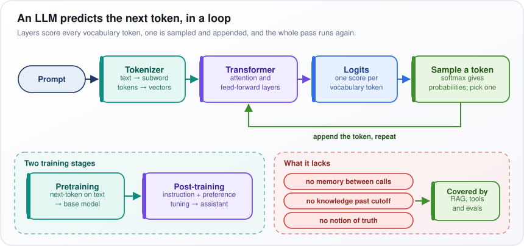
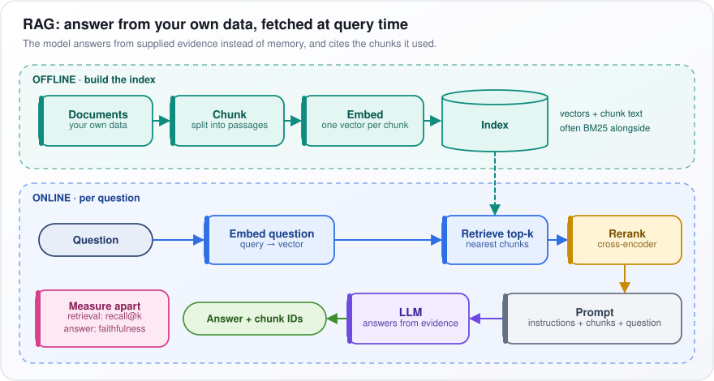
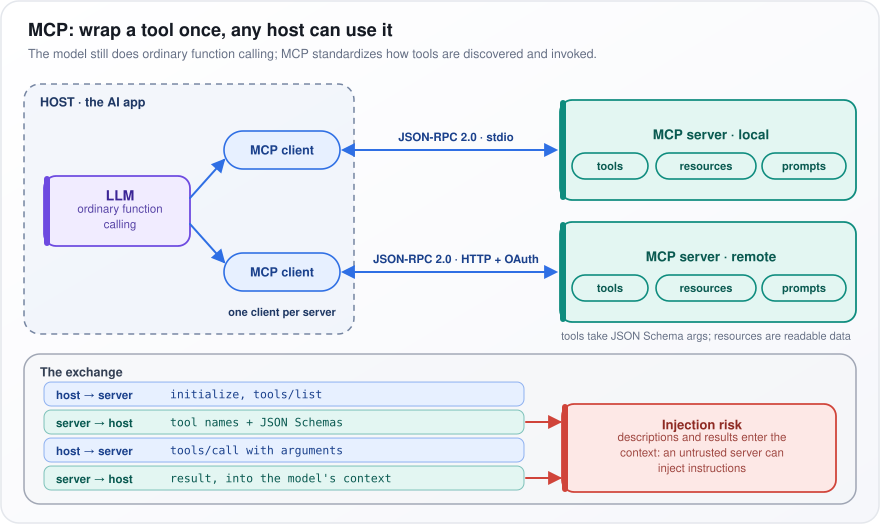
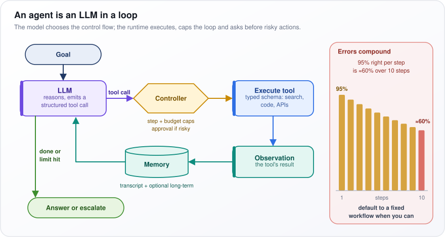

# Must Know

[← All topics](../README.md)

Six terms come up at the start of almost every AI engineering interview: LLM, RAG, MCP, agent, fine-tuning and quantization. Each answer here starts from zero: what the thing is in plain words, a small example, how it works step by step, and the case where it is the wrong tool. Interviewers use these as openers and then push on exactly those last two points.

## Questions

1. [What is an LLM?](#1-what-is-an-llm)
2. [What is RAG?](#2-what-is-rag)
3. [What is MCP?](#3-what-is-mcp)
4. [What is an Agent?](#4-what-is-an-agent)
5. [What is Fine-tuning?](#5-what-is-fine-tuning)
6. [What is Quantization?](#6-what-is-quantization)

---

## 1. What is an LLM?

**A large language model (LLM) is a program trained on huge amounts of text to guess the next piece of text. It writes an answer by guessing, appending the guess, and guessing again.**

**The idea.** Phone autocomplete, hugely scaled up. Given *the cat sat on the*, it gives each possible next word a probability, say *mat* 40%, *floor* 15%, *sofa* 8%, picks one and repeats. Guessing well across the internet, books and code forces it to absorb grammar, facts and reasoning patterns.

**How it works.**

1. **Tokenize.** The prompt (the text you send) is split into tokens (words or word pieces); each becomes a vector (a list of numbers).
2. **Transformer layers.** The vectors pass through dozens of layers (processing stages) of a Transformer, the design all modern LLMs use. Attention lets each token draw on earlier tokens; feed-forward layers process each alone.
3. **Score.** The last layer gives a raw score, a logit, for every token in the vocabulary (all the tokens it knows: tens to hundreds of thousands).
4. **Sample.** Softmax turns the scores into probabilities that add up to 1. One is drawn by those odds (so answers vary), appended, and the pass reruns until an end token appears.

"Large" means billions of parameters, numbers set by training: guess the next token of real text, nudge every number toward the true one, repeat over trillions of tokens. This **pretraining** gives a base model that only continues text; **post-training** on example chats and ranked answers makes it an assistant.

<p align="center"></p>

*Figure: the next-token loop, the two training stages, and the three things an LLM lacks.*

**Reading the figure.** The top row runs Prompt to "Sample a token"; the green "append the token, repeat" arrow is the loop. Below: the training stages and, in red, what it lacks.

**Watch out:** an LLM has no memory between calls (each request starts fresh), knows nothing past its training cutoff (where its training text ends), and says what sounds likely, not what is true. Retrieval-augmented generation (RAG, fetching documents into the prompt), tools and evaluations (systematic tests) cover those gaps.

---

## 2. What is RAG?

**Retrieval-augmented generation (RAG) finds passages in your own documents that match a question and pastes them into the prompt (the text sent to the language model), so the model answers from evidence you supplied instead of from memory.**

**The idea.** An open-book exam. A model has never seen your company's HR policy, so asked "How many days of parental leave do I get?" it guesses. With RAG the system first finds the two parental-leave paragraphs, puts them in the prompt with "answer only from these passages", and the model answers from the page, citing it.

**How it works.** Ahead of time (offline), redone when documents change:

1. **Chunk:** split documents into passages of a few hundred tokens (words or word pieces).
2. **Embed:** an embedding model turns each chunk into a vector (a list of numbers) so similar meanings get similar numbers.
3. **Index:** store vectors and chunk text in an index (a structure for fast search), often beside a keyword index (BM25, a classic word-matching score), since vectors are weak on exact codes and names.

Then, per question:

4. **Retrieve:** embed the question with the same model and fetch the top-k chunks, the k with the closest vectors (say k = 20). Fast but rough.
5. **Rerank:** a cross-encoder (a slower, more accurate model reading question and chunk together) rescores those and keeps the best few.
6. **Generate:** give the LLM instructions, kept chunks and question; it answers and cites each chunk it used by ID.

<p align="center"></p>

*Figure: the offline lane builds the index; the online lane uses it to answer each question with cited chunks.*

**Reading the figure.** The green OFFLINE lane builds the Index; the dashed arrow feeds it into the blue ONLINE lane, running from Question via the yellow Rerank to "Answer + chunk IDs". Pink "Measure apart" is the warning below.

**Watch out:** most bad RAG answers are retrieval failures: the right chunk never reached the prompt. Measure retrieval (recall@k: how often the right chunk is in the top k) apart from the answer (faithfulness: does it claim only what the chunks say).

---

## 3. What is MCP?

**The Model Context Protocol (MCP) is an open standard, published by Anthropic in November 2024, for plugging tools and data into AI apps. Wrap a tool once as an MCP server and any MCP-speaking app can use it.**

**The idea.** It is USB for AI tools. A tool is an action the model can request, such as searching files or opening a ticket. Without MCP, 5 AI apps and 10 tools can need 50 custom integrations. With MCP each app and each tool implements the protocol once: 15 pieces of work, not 50.

**How it works.**

- **Host:** the AI app the user works in (chat app, code editor, agent), running one MCP client, a small connector, per server.
- **Server:** a small program wrapping one tool or data source. It offers *tools* (functions the model can call, arguments described in JSON Schema, a standard for describing JSON, the common text format for data), *resources* (readable data such as files) and *prompts* (reusable templates).
- **Transport:** JSON-RPC 2.0 messages (a simple request-and-response format) travel over stdio (a local program's standard input and output) or, for remote servers, HTTP, usually with OAuth (a standard for granting access without sharing a password).
- **A session:** the host sends `initialize` and `tools/list`; the server returns tool names and schemas, which the model is shown. When the model picks one, the host sends `tools/call` and adds the result to the model's context (the text it reads for this request).

The model still just emits a request naming a tool and arguments (function calling); MCP standardizes only how tools are found and invoked.

<p align="center"></p>

*Figure: one host, one client per server, and the four messages of a tool call.*

**Reading the figure.** In the dashed HOST box, two MCP clients each link to one server. "The exchange" lists the four messages; red arrows from its "server → host" rows point at "Injection risk".

**Watch out:** tool descriptions and results go straight into the model's context, so a malicious server can plant instructions the model may obey (prompt injection). Vet third-party servers like third-party code.

---

## 4. What is an Agent?

**An agent is a large language model (LLM) running in a loop. It picks the next action, usually a call to a tool (a function the program runs for it); the program runs it and returns the result; the model picks again, until done or a limit is hit. The model, not the programmer, chooses the steps.**

**The idea.** Ask "Why did our cloud bill jump last week?" A fixed script cannot know where to look. An agent might call a billing tool, see storage costs doubled, list the biggest storage buckets (file containers), spot a new backup job and report it. Each step depends on the previous result.

**How it works.**

1. The model gets the goal and a list of tools (search, run code, query a database), each with a typed schema: name, description, argument types.
2. The model emits a structured tool call, for example `get_costs(service="storage", days=7)`.
3. A controller (ordinary code, not the model) checks it: step and spending caps, and human approval for risky actions like deleting data.
4. The runtime (the program around the model) runs the tool. Its output, the observation, goes into memory: the transcript, plus optional long-term storage.
5. Repeat from step 2 until a final answer or a cap.

**Why reliability drops.** Every step must go right, so the chances multiply. At 95% per step, all ten succeed $`0.95^{10} \approx 0.60`$ of the time (0.95 multiplied by itself ten times), about 60%, if failures are independent.

<p align="center"></p>

*Figure: the agent loop, with a controller guarding each tool call, and how per-step errors compound.*

**Reading the figure.** From LLM, follow the purple "tool call" arrow through the yellow Controller, "Execute tool", Observation and Memory back to LLM. The green "done or limit hit" arrow exits to "Answer or escalate" (hand to a human). On the right, bars fall from 95% to about 60%.

**Watch out:** when steps are known in advance, use a fixed workflow (code decides the steps, the model fills each one in). Use an agent only when the next step depends on what was found.

---

## 5. What is Fine-tuning?

**Fine-tuning takes an already-trained model and trains it a little more on your own examples, so it adopts your format, style or task. It is good at changing behavior and a poor way to teach new facts.**

**The idea.** Like giving an experienced writer your style guide with examples: they know the language; you teach your house way. Say every support reply must use one JSON (structured text) format and tone: a few hundred to a few thousand good examples is a typical start.

**How it works.**

1. Collect pairs: a prompt and its ideal output.
2. Train: nudge the model's weights (the billions of numbers inside it) so it predicts each token (word piece) of the ideal output better. The penalty, cross-entropy, grows when the correct token gets low probability; it is scored only on the output, so the model learns to answer, not to echo questions.
3. Choose how many weights to change:
   - **Full fine-tuning** updates every weight: biggest change, most memory on the GPUs (graphics chips) it trains on.
   - **LoRA** (low-rank adaptation) freezes the original weights and learns a small add-on for chosen weight matrices (grids of weights).
   - **QLoRA** does LoRA on a base model compressed to 4 bits per weight, so it fits on smaller GPUs.
   - **DPO** (direct preference optimization) learns from preferred-versus-rejected answer pairs instead.

**LoRA as a formula.**

```math
W' = W + BA, \quad B \in \mathbb{R}^{d \times r},\ A \in \mathbb{R}^{r \times k},\ r \ll \min(d, k)
```

$`W`$ is the frozen weight matrix ($`d`$ rows, $`k`$ columns); $`W'`$ is the one used. $`B \in \mathbb{R}^{d \times r}`$ reads "B is a table of real numbers, $`d`$ rows by $`r`$ columns"; $`A`$ is $`r`$ by $`k`$. The rank $`r`$, say 8 or 16, is much smaller ($`\ll`$) than $`d`$ and $`k`$. Multiplying $`B`$ by $`A`$ gives a full $`d`$-by-$`k`$ update from few numbers. Example: a 4096-by-4096 matrix has about 16.8 million weights. At $`r = 16`$, $`B`$ and $`A`$ hold $`2 \times 4096 \times 16 = 131{,}072`$ numbers, under 1%.

**Watch out:** facts baked in by fine-tuning go stale and cannot be cited. Use retrieval-augmented generation (RAG, looking facts up per question) for changing knowledge, fine-tuning for behavior.

---

## 6. What is Quantization?

**Quantization stores a model's weights (the numbers learned in training) in fewer bits, say 4 or 8 instead of 16. The model then needs far less memory and usually runs faster, at a small quality cost.**

**The idea.** Like saving a photo as a smaller JPEG. A bit is one 0 or 1; 8 bits make a byte. An FP16 weight (16-bit floating point, a standard decimal format) takes 2 bytes; 4 bits allow only $`2^4 = 16`$ values, so it is rounded to one, taking half a byte. A 70-billion-weight model is about 140 GB at FP16 (two 80 GB GPUs, the chips models run on) and about 35 GB at 4-bit (one GPU), plus the KV cache (working memory for the conversation).

**How it works.**

1. Take a small group of weights: a row of a weight matrix (grid), or a block of about 128.
2. Pick a scale $`s`$ (what one integer step is worth) and often a zero point $`z`$ (the integer standing for 0) so the group's range fits 0 to 15 at 4 bits.
3. Store each weight as a small integer, plus one $`s`$ and $`z`$ per group. Small groups stop one outsized weight from stretching the scale and wasting levels.
4. At run time, convert back to approximate values. Activations (intermediate results) and the KV cache can be quantized too.

**Why it is faster.** Each new token (word piece) means reading every weight from GPU memory; with few requests at once, that reading, not the arithmetic, is the bottleneck. Fewer bytes, more tokens per second.

**As a formula.**

```math
q = \text{round}\left(\frac{x}{s}\right) + z, \qquad \hat{x} = s\,(q - z)
```

$`x`$ is the original weight, $`q`$ the stored integer, $`\hat{x}`$ the value recovered at run time; round means nearest whole number. Example: $`s = 0.01`$, $`z = 8`$, $`x = 0.03127`$. Then $`x/s = 3.127`$ rounds to 3, so $`q = 11`$; recovering gives $`0.01 \times (11 - 8) = 0.03`$, off by about 0.001.

**Watch out:** 4-bit damage often shows first on math, code and very long inputs, while average benchmark scores barely move. Test on your own examples before shipping.

---
