# LLM Fundamentals

[← All topics](../README.md)

How a large language model works inside, from the first step (cutting text into tokens) to the last (choosing the next word). The questions cover the Transformer and its attention mechanism, how the next token is picked, why a model is fast or slow to serve (prefill reads the prompt, decode writes the reply, and the KV cache is the memory that links them), the tricks that make big models cheaper (grouped-query attention, mixture of experts, Flash Attention, distillation), and the loss (the error score) a model is trained to reduce. Interviewers use this topic to tell engineers who only call an API from engineers who can explain why a model is slow, expensive or wrong, so expect to give the shapes of the number grids inside the model, formulas and rough memory sums. Every formula here is read out in words and worked with small numbers.

## Questions

1. [What are foundation models, and how have they changed AI engineering?](#1-what-are-foundation-models-and-how-have-they-changed-ai-engineering)
2. [What is a Large Language Model (LLM), and how does it work?](#2-what-is-a-large-language-model-llm-and-how-does-it-work)
3. [Inside ChatGPT: What Happens After You Hit Enter?](#3-inside-chatgpt-what-happens-after-you-hit-enter)
4. [What is the Transformer architecture and how does it work?](#4-what-is-the-transformer-architecture-and-how-does-it-work)
5. [What are the key components of the Transformer architecture?](#5-what-are-the-key-components-of-the-transformer-architecture)
6. [Walk me through what happens, step by step, in one forward pass of a decoder-only Transformer.](#6-walk-me-through-what-happens-step-by-step-in-one-forward-pass-of-a-decoder-only-transformer)
7. [What is tokenization in LLMs?](#7-what-is-tokenization-in-llms)
8. [Explain BPE (Byte Pair Encoding).](#8-explain-bpe-byte-pair-encoding)
9. [Explain WordPiece and SentencePiece.](#9-explain-wordpiece-and-sentencepiece)
10. [What is positional encoding, and why is it needed in Transformers?](#10-what-is-positional-encoding-and-why-is-it-needed-in-transformers)
11. [What are embeddings?](#11-what-are-embeddings)
12. [Explain the Query(Q), Key(K), and Value(V) in attention.](#12-explain-the-queryq-keyk-and-valuev-in-attention)
13. [What is self-attention, and how does it work in Transformers?](#13-what-is-self-attention-and-how-does-it-work-in-transformers)
14. [What is Cross Attention in Transformers?](#14-what-is-cross-attention-in-transformers)
15. [Why do we scale the dot product attention by √dₖ in the Transformer architecture?](#15-why-do-we-scale-the-dot-product-attention-by-dₖ-in-the-transformer-architecture)
16. [What is causal masking?](#16-what-is-causal-masking)
17. [What are multi-head attention mechanisms? Why use multiple attention heads?](#17-what-are-multi-head-attention-mechanisms-why-use-multiple-attention-heads)
18. [What are Feed-Forward Networks in LLMs?](#18-what-are-feed-forward-networks-in-llms)
19. [What is Generative AI?](#19-what-is-generative-ai)
20. [What is the context window in LLMs, and why does it matter?](#20-what-is-the-context-window-in-llms-and-why-does-it-matter)
21. [Why is the context window limited in LLMs?](#21-why-is-the-context-window-limited-in-llms)
22. [What is temperature in the context of LLMs, and how does it affect output?](#22-what-is-temperature-in-the-context-of-llms-and-how-does-it-affect-output)
23. [Why is the first token slower than the rest in an LLM?](#23-why-is-the-first-token-slower-than-the-rest-in-an-llm)
24. [Explain Top-p (nucleus) sampling and Top-k sampling. How do they differ?](#24-explain-top-p-nucleus-sampling-and-top-k-sampling-how-do-they-differ)
25. [Compare greedy decoding, beam search, top-k, top-p, and temperature sampling. When does each fail?](#25-compare-greedy-decoding-beam-search-top-k-top-p-and-temperature-sampling-when-does-each-fail)
26. [What are logits, and how are they used in text generation?](#26-what-are-logits-and-how-are-they-used-in-text-generation)
27. [What are skip connections (residual connections) in Transformers?](#27-what-are-skip-connections-residual-connections-in-transformers)
28. [What is the difference between open-source and closed-source LLMs? When would you choose one over the other?](#28-what-is-the-difference-between-open-source-and-closed-source-llms-when-would-you-choose-one-over-the-other)
29. [What is the difference between encoder-only, decoder-only, and encoder-decoder Transformer architectures?](#29-what-is-the-difference-between-encoder-only-decoder-only-and-encoder-decoder-transformer-architectures)
30. [What is KV cache, and how does it speed up inference?](#30-what-is-kv-cache-and-how-does-it-speed-up-inference)
31. [Estimate the KV cache memory needed to serve a large model. How does it constrain batch size and context length?](#31-estimate-the-kv-cache-memory-needed-to-serve-a-large-model-how-does-it-constrain-batch-size-and-context-length)
32. [KV Cache Compression](#32-kv-cache-compression)
33. [What is model distillation, and how is it used with LLMs?](#33-what-is-model-distillation-and-how-is-it-used-with-llms)
34. [What is Mixture of Experts (MoE), and how does it work in models like Mixtral?](#34-what-is-mixture-of-experts-moe-and-how-does-it-work-in-models-like-mixtral)
35. [What is the difference between dense and sparse models?](#35-what-is-the-difference-between-dense-and-sparse-models)
36. [How does DeepSeek-V4 work?](#36-how-does-deepseek-v4-work)
37. [What is Flash Attention?](#37-what-is-flash-attention)
38. [What is Cross-Entropy Loss?](#38-what-is-cross-entropy-loss)
39. [What is Grouped-Query Attention (GQA), and how does it differ from Multi-Head Attention (MHA)?](#39-what-is-grouped-query-attention-gqa-and-how-does-it-differ-from-multi-head-attention-mha)
40. [How does Sliding Window Attention work?](#40-how-does-sliding-window-attention-work)
41. [How do Attention Sinks work?](#41-how-do-attention-sinks-work)
42. [How does Rotary Position Embedding (RoPE) work, and why is it preferred over learned positional embeddings?](#42-how-does-rotary-position-embedding-rope-work-and-why-is-it-preferred-over-learned-positional-embeddings)
43. [Explain Layer Normalization](#43-explain-layer-normalization)
44. [Explain RMSNorm (Root Mean Square Layer Normalization)](#44-explain-rmsnorm-root-mean-square-layer-normalization)
45. [Why do modern Transformers use Pre-LayerNorm (Pre-Norm) instead of Post-LayerNorm?](#45-why-do-modern-transformers-use-pre-layernorm-pre-norm-instead-of-post-layernorm)
46. [What are scaling laws (Chinchilla), and how do they guide model size vs training data decisions?](#46-what-are-scaling-laws-chinchilla-and-how-do-they-guide-model-size-vs-training-data-decisions)
47. [Your LLM keeps ignoring your instructions. How do you make it follow structured output formats?](#47-your-llm-keeps-ignoring-your-instructions-how-do-you-make-it-follow-structured-output-formats)
48. [Your LLM-powered tool hits the context window limit on long documents. How do you handle it?](#48-your-llm-powered-tool-hits-the-context-window-limit-on-long-documents-how-do-you-handle-it)
49. [Your LLM does not admit when it does not know the answer. How do you make it say "I don't know"?](#49-your-llm-does-not-admit-when-it-does-not-know-the-answer-how-do-you-make-it-say-i-dont-know)
50. [Your LLM generates responses that are too verbose. How do you control response length?](#50-your-llm-generates-responses-that-are-too-verbose-how-do-you-control-response-length)
51. [Your LLM memorized proprietary training data and leaks it in responses. How do you prevent this?](#51-your-llm-memorized-proprietary-training-data-and-leaks-it-in-responses-how-do-you-prevent-this)
52. [Your LLM coding assistant generates outdated code using deprecated libraries. How do you fix it?](#52-your-llm-coding-assistant-generates-outdated-code-using-deprecated-libraries-how-do-you-fix-it)
53. [Your tokenizer splits important domain terms into meaningless subword pieces. How do you fix it?](#53-your-tokenizer-splits-important-domain-terms-into-meaningless-subword-pieces-how-do-you-fix-it)
54. [Your Transformer's KV cache grows too large during long sequence generation. How do you manage memory?](#54-your-transformers-kv-cache-grows-too-large-during-long-sequence-generation-how-do-you-manage-memory)
55. [Your Transformer runs out of memory on long documents due to quadratic self-attention. How do you scale it?](#55-your-transformer-runs-out-of-memory-on-long-documents-due-to-quadratic-self-attention-how-do-you-scale-it)
56. [Your distilled student model fails on the complex reasoning that the teacher model handled. How do you close the gap?](#56-your-distilled-student-model-fails-on-the-complex-reasoning-that-the-teacher-model-handled-how-do-you-close-the-gap)
57. [After RLHF alignment, your LLM became safer but lost capability on hard tasks. How do you manage the alignment tax?](#57-after-rlhf-alignment-your-llm-became-safer-but-lost-capability-on-hard-tasks-how-do-you-manage-the-alignment-tax)
58. [Your RLHF-trained LLM is gaming the reward model instead of being genuinely helpful. How do you fix reward hacking?](#58-your-rlhf-trained-llm-is-gaming-the-reward-model-instead-of-being-genuinely-helpful-how-do-you-fix-reward-hacking)
59. [Your chatbot loses context after 10 turns in a conversation. How do you maintain a long conversation context?](#59-your-chatbot-loses-context-after-10-turns-in-a-conversation-how-do-you-maintain-a-long-conversation-context)
60. [Your chatbot fails when users switch topics mid-conversation. How do you handle topic switches?](#60-your-chatbot-fails-when-users-switch-topics-mid-conversation-how-do-you-handle-topic-switches)
61. [Your QA system always generates an answer even when no answer exists in the context. How do you detect unanswerable questions?](#61-your-qa-system-always-generates-an-answer-even-when-no-answer-exists-in-the-context-how-do-you-detect-unanswerable-questions)
62. [Your summarization system hallucinated facts not in the original article. How do you fix it?](#62-your-summarization-system-hallucinated-facts-not-in-the-original-article-how-do-you-fix-it)
63. [Your text generation repeats phrases in long outputs. How do you fix repetition?](#63-your-text-generation-repeats-phrases-in-long-outputs-how-do-you-fix-repetition)
64. [Transformers work on text, so can they also understand images?](#64-transformers-work-on-text-so-can-they-also-understand-images)
65. [Small Language Models (SLMs)](#65-small-language-models-slms)
66. [Large Reasoning Models (LRMs)](#66-large-reasoning-models-lrms)
67. [Jev and System One Models](#67-jev-and-system-one-models)
68. [What are Autoregressive Models?](#68-what-are-autoregressive-models)
69. [Explain the difference between autoregressive and masked language modeling.](#69-explain-the-difference-between-autoregressive-and-masked-language-modeling)
70. [Proximal Policy Optimization (PPO)](#70-proximal-policy-optimization-ppo)
71. [Direct Preference Optimization (DPO)](#71-direct-preference-optimization-dpo)
72. [Group Relative Policy Optimization (GRPO)](#72-group-relative-policy-optimization-grpo)
73. [Recursive Language Models (RLMs)](#73-recursive-language-models-rlms)
74. [Continual Learning in LLMs](#74-continual-learning-in-llms)
75. [What is Recursive Self-Improvement (RSI)?](#75-what-is-recursive-self-improvement-rsi)
76. [How do Diffusion Language Models (DLMs) work?](#76-how-do-diffusion-language-models-dlms-work)
77. [How Does LLM Watermarking Work?](#77-how-does-llm-watermarking-work)
78. [How do RNNs and Transformers differ?](#78-how-do-rnns-and-transformers-differ)

---

## 1. What are foundation models, and how have they changed AI engineering?

**A foundation model is one very large model trained once on broad data (text, code, often images) and then reused for many different tasks. It changed AI engineering from "train a new model for every task" to "adapt one existing model to each task".**

**The idea.** A few years ago, a bank that wanted to sort complaint emails, pull fields out of invoices and summarize call transcripts built three separate models. Each needed thousands of hand-labeled examples and weeks of training. Today one pretrained model can attempt all three from a well-written prompt, and a working prototype takes hours.

**How it works.**

1. **Pretraining is self-supervised:** the training signal comes from the data itself (hide the next word, predict it), so no human labels are needed and the model can learn from trillions of tokens (words or pieces of words).
2. **The result is general:** it has absorbed language, facts, code and patterns of reasoning, not one narrow skill.
3. **Teams adapt instead of training:** prompting; retrieval-augmented generation (RAG, fetching your own documents into the prompt); tool calling (letting the model ask your code to run a search or an action); or light fine-tuning (further training on your own examples) such as LoRA, which trains a small add-on to the weights, the model's learned numbers.

**What changed for engineers.**

- **Effort** moved from labelling data and training models to assembling context (deciding what goes into the prompt) and evaluating outputs.
- **Cost** moved from a one-off training bill to paying per token every time the model runs, and latency (how long a reply takes) became a design constraint.
- **New risks** arrived with renting a model through an API: dependence on one vendor, data leaving your network, and version drift (the provider updates or retires the model and your system's behavior changes without any change on your side).

**Watch out:** the bottleneck is now evaluation. A demo takes an afternoon; proving the system works, and still works after the provider's next model update, is the real engineering.

---

## 2. What is a Large Language Model (LLM), and how does it work?

**A large language model (LLM) is a Transformer neural network trained to predict the next token (a word or piece of a word) from all the tokens before it. It writes text by repeating that single prediction, one token at a time.**

**The idea.** Given *The Eiffel Tower is in*, the model outputs a probability for every token in its vocabulary of roughly 100,000: *Paris* 0.92, *France* 0.05, and so on. It picks one, appends it, and predicts again. A 500-token answer is 500 of these predictions in a row.

**How it works.**

1. **Embed.** Each token ID looks up its embedding, a vector of a few thousand numbers.
2. **Layers.** In each of dozens of layers, self-attention lets every token pull in information from earlier tokens (never later ones), then a feed-forward network (a small network applied to each token separately) processes it.
3. **Score.** The vector at the last position is turned into one logit (raw score) per vocabulary token, and softmax converts the logits into probabilities that add up to 1.
4. **Sample and repeat.** One token is picked and appended. A KV cache (stored intermediate results for earlier tokens) means the prompt is not recomputed at every step.

Training has three stages: pretraining on trillions of tokens; supervised fine-tuning (SFT) on example conversations; then preference tuning, such as reinforcement learning from human feedback (RLHF), on pairs of answers to teach which one people prefer.

**Put as a formula**, the model scores a whole text like this:

```math
P(x_1, \dots, x_T) = \prod_{t=1}^{T} P(x_t \mid x_{\lt t})
```

Read it as: the probability of the text $`x_1`$ to $`x_T`$ equals the product ($`\prod`$, multiply together) over every position $`t`$ of the probability of token $`x_t`$ given all tokens before it ($`x_{\lt t}`$). For example, P(*the cat sat*) = P(*the*) x P(*cat* given *the*) x P(*sat* given *the cat*) = 0.05 x 0.01 x 0.2 = 0.0001. The model learns only the one-step pieces.

**Watch out:** it is trained to produce plausible text, not true text, and it remembers nothing between calls, so confident wrong answers (hallucinations) are the default failure.

---

## 3. Inside ChatGPT: What Happens After You Hit Enter?

**Your message is combined with a hidden system prompt and the earlier conversation, turned into tokens (words or pieces of words), and run through the model on GPUs (the chips that do its arithmetic). The model reads the whole prompt in one parallel pass, then writes the reply one token at a time, streaming each to your screen. Exact internals are not public; this is the standard design.**

**The idea.** Send "Summarize this PDF" as a chat's tenth turn. The server processes not three words but the system prompt, nine earlier turns, the PDF and your message (perhaps 20,000 tokens), again every turn.

**How it works.**

1. **Edge:** checks login, rate limits (how many requests you may send) and abuse.
2. **Build context:** system prompt, saved memory, earlier turns (trimmed if too long), files and tool schemas (descriptions of tools the model may call).
3. **Batch:** the request joins a continuous batch: many users share one copy of the model, each joining or leaving between steps.
4. **Prefill:** all prompt tokens pass through every layer at once and fill the KV cache (each token's intermediate attention results, stored for reuse). This sets time-to-first-token (TTFT).
5. **Decode:** one forward pass (one run through the network) per new token, sampled, turned back into text and streamed over server-sent events (SSE, a one-way stream on an open HTTP connection).
6. **Tools:** if the model emits a tool call, the orchestrator (the coordinating app server) runs it, appends the result, and decoding resumes.
7. **Stop:** an end-of-turn token or a length limit ends the reply; output checks run and the turn is saved.

<p align="center">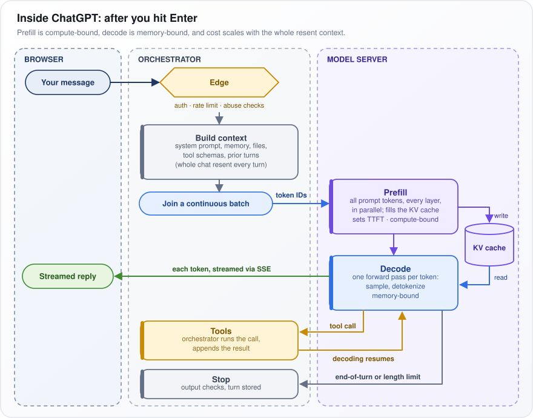</p>

*Figure: the path of one chat message through browser, orchestrator and model server.*

**Reading the figure.** Follow "Your message" through the yellow Edge, "Build context" and "Join a continuous batch", then across to Prefill, which writes the KV cache. Decode reads it and sends "each token, streamed via SSE" to "Streamed reply".

**Watch out:** prefill is limited by raw compute and decode by memory speed, and you pay for the whole resent context every turn, not just your newest message.

---

## 4. What is the Transformer architecture and how does it work?

**The Transformer is the neural-network design, published in 2017, behind every modern LLM. Instead of reading text one word at a time like older recurrent neural networks (RNNs), it lets every token look directly at every token it may see, all at once, in a stack of identical blocks.**

**The idea.** In "The trophy didn't fit in the suitcase because it was too big", knowing what *it* means requires *trophy*, eight words earlier. An RNN carries it through eight updates of a running memory, and it fades. In a Transformer, *it* compares itself with every earlier word at once and draws mostly on *trophy*.

**How it works.** Each block has four ingredients:

- **Attention:** each token makes a query (what it is looking for), a key (what it contains) and a value (what it passes on). Its output is an average of the values, weighted by how well its query matches each key.
- **Feed-forward network:** the same small two-layer network applied to each token separately. Most of the model's learned numbers (parameters) live here.
- **Residual connections and normalization:** each part adds its output onto its input, and normalization keeps numbers in a stable range, so deep stacks train.
- **Position encoding:** attention on its own ignores word order, so position information is added.

**Put as a formula:**

```math
\text{Attention}(Q, K, V) = \text{softmax}\left(\frac{QK^\top}{\sqrt{d_k}}\right) V
```

$`Q`$, $`K`$ and $`V`$ are matrices holding every token's query, key and value. $`K^\top`$ is $`K`$ flipped so its rows become columns (the transpose), so $`QK^\top`$ gives a match score for every query-key pair (a dot product: multiply matching entries and add them up). Dividing by $`\sqrt{d_k}`$, where $`d_k`$ is the length of each key vector, keeps scores from growing too large. Softmax turns each row of scores into weights that add up to 1, and multiplying by $`V`$ takes the weighted average. Example: if *it* scores *trophy* 3 and *suitcase* 1, softmax gives about 0.88 and 0.12.

**Trade-off:** training runs in parallel and any two tokens are one step apart, but attention compares every pair, so its cost is $`O(n^2)`$ in length $`n`$: doubling the text quadruples the work.

---

## 5. What are the key components of the Transformer architecture?

**A Transformer has three parts: an embedding table that turns tokens into vectors; a stack of identical blocks, each an attention layer and a feed-forward network with a residual connection and a normalization around each; and an output head that turns the final vectors into a score for every vocabulary token. Position encoding and masks let it handle ordered text.**

**The idea.** Picture a shared notebook, the residual stream, holding one vector per token. The embedding writes the first draft. Each sublayer (the attention layer or feed-forward network in a block) reads the notebook, computes a correction and adds it in. The output head reads the final page and scores every possible next token.

**How it works.**

- **Attention is the only component that moves information between positions.** It is how a pronoun such as *it* finds its noun.
- **Everything else works on each position separately:** feed-forward, normalization and the output head.
- **Every sublayer reads from and adds to the residual stream** rather than replacing it.

**Reading the table.** Each row is one component, its job, and what most new models use (2025–26). $`V`$ is the vocabulary size and $`d`$ the vector width, so $`E \in \mathbb{R}^{V \times d}`$ reads "the embedding table $`E`$ is a grid of $`V`$ rows of $`d`$ real numbers". In the residual row, $`x`$ is a sublayer's input and $`f`$ the sublayer. RoPE (rotary position embedding) rotates query and key vectors by an angle that depends on position. GQA (grouped-query attention) lets several attention heads (parallel attention computations) share keys and values to save memory. SwiGLU is a feed-forward variant with an extra gating branch; MoE (mixture of experts) swaps in many feed-forward networks and uses a few per token. RMSNorm is a cheap normalization, and pre-norm means it is applied before each sublayer. The causal mask stops tokens from seeing later tokens.

| Component | Job | Modern default (2025–26) |
|---|---|---|
| Token embedding | ID to vector, table $`E \in \mathbb{R}^{V \times d}`$ | Learned |
| Position | Injects order | RoPE on Q and K |
| Multi-head attention | Mixes information across tokens | Causal, GQA |
| Feed-forward | Small network per token | SwiGLU or MoE |
| Residual | $`x + f(x)`$ around each sublayer | Always |
| Norm | Keeps vectors at a steady size | RMSNorm, pre-norm |
| Mask | Blocks future or padding tokens | Causal |
| Output head | Final norm, then a matrix giving $`V`$ scores (logits) | Linear |

**Watch out:** feed-forward layers hold about two-thirds of a standard (dense, non-MoE) block's learned numbers (parameters), but when serving long contexts it is attention's KV cache (the stored keys and values of every past token) that takes the most memory.

---

## 6. Walk me through what happens, step by step, in one forward pass of a decoder-only Transformer.

**One forward pass turns token IDs into vectors, sends them through $`L`$ identical blocks (attention, then a feed-forward network, each adding onto a running "residual stream"), and turns each position's final vector into a score per vocabulary token.**

**The idea.** A 6-token sentence in a width-4,096 model enters as 6 integers, becomes a 6 x 4,096 grid through every block, and leaves as 6 rows of vocabulary scores. Shapes in brackets use $`B`$ sequences (the batch) of $`T`$ tokens, vector width $`d`$, $`H`$ attention heads (parallel attention units) of width $`d_h`$, vocabulary size $`V`$.

1. **Embed:** IDs $`[B, T]`$ pick rows of the embedding table: the residual stream $`X`$, $`[B, T, d]`$.
2. **Project:** RMSNorm (rescale each vector to a steady size), then three learned matrices give queries, keys and values (what each token seeks, offers, passes on), split into heads, $`[B, H, T, d_h]`$. RoPE rotates Q and K to encode position.
3. **Attend:** scores $`QK^\top / \sqrt{d_h}`$, shape $`[B, H, T, T]`$; future positions set to $`-\infty`$ (zero weight); softmax; multiply by V; join heads; multiply by an output matrix $`W_O`$; add to $`X`$.
4. **Feed-forward:** RMSNorm, then SwiGLU (a gated two-layer network, hidden width about $`\tfrac{8}{3}d`$); add to $`X`$.
5. **Repeat** steps 2–4 for all $`L`$ blocks.
6. **Output:** final RMSNorm, multiply by the unembedding matrix $`W_U`$: logits (raw scores) $`[B, T, V]`$.
7. **Use:** training scores every position $`t`$ against the true token $`t+1`$ with cross-entropy (a loss punishing low probability on the true token), in parallel; inference samples only the last position.

<p align="center">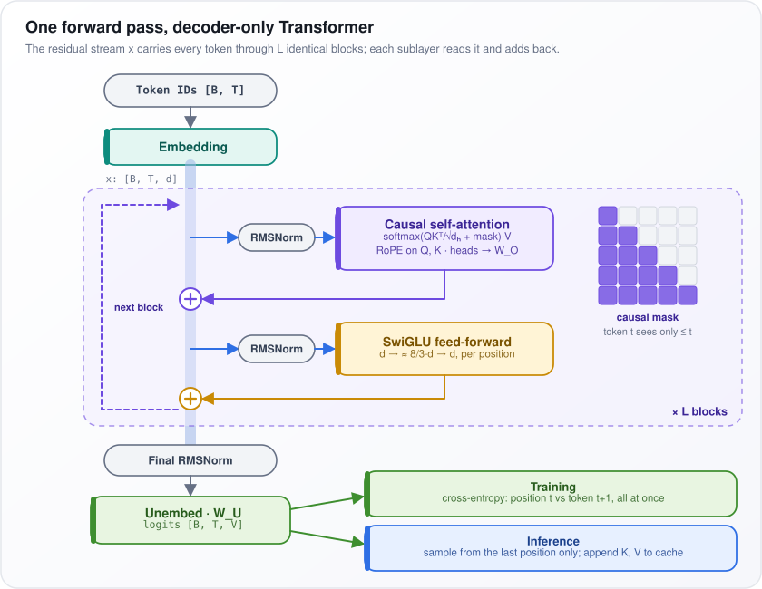</p>

*Figure: the residual stream through one block, repeated L times, then the output head.*

**Reading the figure.** Follow the pale blue residual stream down the middle: attention adds back at the purple plus sign, feed-forward at the orange one, and the dashed "next block" arrow repeats it L times.

**Watch out:** during generation $`T = 1`$: only the new token is processed; its K and V join the cache of stored keys and values. Each step reads every weight from memory for very little arithmetic, so memory speed, not compute, limits decode.

---

## 7. What is tokenization in LLMs?

**Tokenization cuts text into tokens, pieces taken from a fixed list called the vocabulary (tens of thousands to a few hundred thousand entries), and replaces each piece with its integer ID. The model only ever sees these IDs, and context limits (the most a model can read at once) and API prices are counted in tokens, not words.**

**The idea.** A vocabulary of whole words would have no entry for typos, names or new words. A vocabulary of single characters would make every text very long. Subword tokens sit in between: common words stay whole (" the" is one token) and rare words split into familiar pieces ("unbelievable" might become " un", "believ", "able").

**How it works.**

- A tokenizer is trained once on a large text collection to decide which pieces go in the vocabulary (Byte Pair Encoding is the usual method). The model is then trained with that tokenizer, and the two stay locked together.
- Byte-level BPE, used by the GPT family and Llama 3, starts from the 256 possible byte values, so any string, including emoji or Chinese, can be encoded with no "unknown" token.
- Encoding turns text into pieces into IDs; decoding reverses it.
- Leading spaces are usually part of the token, so " cat" and "cat" have different IDs.

**A rule of thumb.** English on GPT-style tokenizers averages about 4 characters, roughly three-quarters of a word, per token. Code, long numbers and many non-English languages need more tokens for the same content, so they cost more and fill the context faster.

The split below is illustrative; each real tokenizer splits differently.

```
"Tokenization is unbelievable"
-> ["Token", "ization", " is", " un", "believ", "able"]   (illustrative split)
```

**Watch out:** because the model sees chunks rather than letters, counting letters in a word, arithmetic on long numbers and rare domain terms go wrong more often than their difficulty suggests.

---

## 8. Explain BPE (Byte Pair Encoding).

**Byte Pair Encoding (BPE) builds a vocabulary by starting from single characters (or bytes) and repeatedly gluing together the pair of neighbors that appears most often, until the vocabulary reaches a chosen size. To tokenize new text, it replays those glue steps in the order they were learned.**

**The idea.** Take the tiny training text "low low lower lowest newer newest". Start from letters. The pairs *l o*, *o w* and *w e* each appear 4 times, the most of any. Ties go to the pair seen first, so merge 1 creates *lo*, merge 2 creates *low*, merge 3 creates *lowe* (by then several pairs tie at 2), and merge 4 creates *st* (from *lowest* and *newest*). Frequent words become single tokens; rare ones stay in pieces.

**How it works.**

1. **Pre-tokenize:** split the training text into words with a regular expression (a text-matching pattern) and count how often each word occurs.
2. **Count pairs:** count every pair of neighboring symbols inside words, weighted by how often the word occurs.
3. **Merge:** replace the most frequent pair everywhere with a new symbol, record the merge, and repeat until the vocabulary hits its target size (for example 100,000).
4. **Encode new text:** split it into characters or bytes and apply the recorded merges, earliest first, until none apply.

**Reading the code.** `train_bpe` does steps 1–3 on the toy text. `words` maps each word, as a tuple of symbols, to its count; each loop counts the pairs, takes the most frequent one, and rebuilds every word with that pair joined. Running it prints `[('l', 'o'), ('lo', 'w'), ('low', 'e'), ('s', 't')]`, the four merges described above.

```python
from collections import Counter

def train_bpe(text: str, num_merges: int):
    words = Counter(tuple(w) for w in text.split())
    merges = []
    for _ in range(num_merges):
        pairs = Counter()
        for word, freq in words.items():
            for pair in zip(word, word[1:]):
                pairs[pair] += freq
        if not pairs:
            break
        a, b = max(pairs, key=pairs.get)
        merges.append((a, b))
        merged = Counter()
        for word, freq in words.items():
            out, i = [], 0
            while i < len(word):
                if word[i:i + 2] == (a, b):
                    out.append(a + b)
                    i += 2
                else:
                    out.append(word[i])
                    i += 1
            merged[tuple(out)] += freq
        words = merged
    return merges

print(train_bpe("low low lower lowest newer newest", 4))
```

**Watch out:** merges follow what was frequent in the tokenizer's training text, so languages and domains that were rare there split into more tokens: they cost more, use more context, and are represented less well.

---

## 9. Explain WordPiece and SentencePiece.

**WordPiece is a close cousin of Byte Pair Encoding (BPE): it also merges pairs of pieces, but it picks the pair that most improves how well the vocabulary explains the training text, not simply the most frequent pair. SentencePiece is not an algorithm but a library: it trains BPE or Unigram vocabularies directly on raw text, treating spaces as ordinary characters.**

**The idea.** Counting alone favors pairs of very common pieces. WordPiece divides a pair's count by the counts of its two parts, so it prefers pieces that appear together far more often than chance. Say *q* appears 100 times, *u* 5,000 times and *qu* 99 times: the score is 99 / (100 x 5,000) = 0.0002. Say *e* appears 20,000 times, *r* 15,000 and *er* 3,000: the score is 0.00001. *qu* wins, though *er* is 30 times more common.

**How it works.**

- **WordPiece training** scores each pair $`(a, b)`$ as $`\text{count}(ab) / (\text{count}(a)\,\text{count}(b))`$ and merges the best. Pieces inside a word carry a `##` prefix: "playing" becomes `play`, `##ing`.
- **WordPiece encoding** is greedy longest match: take the longest vocabulary piece that fits the start of the word, then continue from there. A word that cannot be matched becomes `[UNK]` (unknown).
- **SentencePiece** replaces spaces with `▁` and treats them as characters, so decoding restores the exact original text, and languages written without spaces, such as Japanese, need no separate word splitter.
- **Unigram**, SentencePiece's other algorithm, works in reverse: start from a large vocabulary and repeatedly drop the tokens whose removal lowers the likelihood (how probable the training text is under the vocabulary) the least. It can also sample among several valid splits of a word during training (subword regularization), which makes the model robust to how words are split.

**Reading the table.** It compares the three on what they are, their merge rule, how they handle spaces, and well-known models that use them.

| | BPE | WordPiece | SentencePiece |
|---|---|---|---|
| Type | Algorithm | Algorithm | Library |
| Rule | Most frequent pair | Largest likelihood gain | BPE or Unigram |
| Whitespace | Split into words first | `##` continuation | `▁` in the text |
| Used by | GPT family, Llama 3 | BERT | T5, Llama 1 and 2 |

**Watch out:** a model's tokenizer is fixed once the model is trained. Before choosing a model, measure how many tokens your own languages and data turn into.

---

## 10. What is positional encoding, and why is it needed in Transformers?

**Attention compares tokens by their content only, so on its own a Transformer cannot tell "dog bites man" from "man bites dog": both contain the same tokens. Positional encoding adds information about where each token sits.**

**The idea.** Attention scores come from comparing pairs of token vectors. Shuffle the words and you only shuffle the scores; each word still sees the same set of other words with the same weights. So order has to be written into the vectors, or into the scores, from outside.

**How it works.** Four main methods:

- **Sinusoidal** (the original 2017 design): add to each token's embedding (its vector) a fixed pattern of sine and cosine waves at many frequencies, unique to its position, like clock hands turning at different speeds.
- **Learned absolute:** train one vector per position (1, 2, …, 2,048). Simple, but there is nothing for position 2,049.
- **Relative:** add a bias to each attention score based on the distance between the two tokens. T5 learns one bias per distance range; ALiBi (attention with linear biases) subtracts a penalty that grows linearly with distance.
- **RoPE** (rotary position embedding), the default in open models as of 2025–26: rotate each query and key vector (the two vectors attention compares) by an angle proportional to its position. When two rotated vectors are compared, only the difference between their angles matters, so the score depends on how far apart the tokens are, not where they sit.

**Reading the table.** "Applied to" is where position enters the model; "Relative?" is whether the model sees distance rather than absolute place; the last column is how well it copes with text longer than anything seen in training.

| Method | Applied to | Relative? | Beyond trained length |
|---|---|---|---|
| Sinusoidal | Embeddings | Implicitly | Weak |
| Learned absolute | Embeddings | No | None |
| ALiBi | Attention scores | Yes | Good |
| RoPE | Q and K | Yes | Moderate, extendable by scaling |

**Watch out:** position handling is one reason a context window is fixed. Long-context versions of a model rescale RoPE's angles (for example with YaRN, a published rescaling method) and then train further on long text.

---

## 11. What are embeddings?

**An embedding is a list of numbers (a vector) that stands for something discrete, such as a token, a sentence or an image, arranged so that similar things get similar vectors. It turns words into something a computer can measure distances between.**

**The idea.** Imagine giving every word coordinates on a map where related words sit near each other: *cat* near *dog*, both far from *invoice*. Real embeddings use hundreds to thousands of dimensions instead of two, but the principle is the same: distance stands for difference in meaning.

**How it works.**

- **Inside an LLM:** a learned table with one row per vocabulary token, $`E \in \mathbb{R}^{V \times d}`$ ($`V`$ rows of $`d`$ real numbers). Token ID $`i`$ simply picks row $`i`$. That first vector for *bank* is identical in "river bank" and "bank loan"; later layers mix in context and make it contextual.
- **For search and retrieval-augmented generation (RAG, fetching documents into a prompt):** a separate embedding model reads a whole passage and outputs one vector. It is trained contrastively: matching pairs, such as a question and the passage that answers it, are pulled together and non-matching pairs pushed apart.
- **Similarity** is usually cosine similarity, which compares the directions of two vectors and ignores their lengths.

**Put as a formula:**

```math
\cos(a, b) = \frac{a \cdot b}{\lVert a \rVert \, \lVert b \rVert}
```

$`a \cdot b`$ is the dot product (multiply matching entries and add them up), and $`\lVert a \rVert`$ is the length of $`a`$ (square each entry, add them up, take the square root). The result runs from -1 (opposite directions) through 0 (unrelated) to 1 (same direction). Example: $`a = (1, 2)`$ and $`b = (2, 3)`$ give a dot product of 8 and lengths of about 2.24 and 3.61, so the cosine is 8 / 8.06, about 0.99: very similar.

**Watch out:** embeddings blur exact identifiers (part numbers, error codes) and negation ("refund" and "no refund" land close together), so pair them with keyword search such as BM25 (a classic word-matching ranking). Changing the embedding model means re-embedding every document, because vectors from different models cannot be compared.

---

## 12. Explain the Query(Q), Key(K), and Value(V) in attention.

**In attention, every token is turned into three vectors: a query (what am I looking for?), a key (what do I contain?) and a value (what do I hand over if chosen?). Each token's new vector is an average of all the values, weighted by how well its query matches each key.**

**The idea.** Think of a library. Your query is the question you bring, each book's key is its catalog label, and its value is its content. You compare it with every label and read mostly from matching books. In "The animal didn't cross the street because it was tired", the query of *it* looks for a likely noun, the key of *animal* matches strongly, and *it* takes in much of *animal*'s value.

**How it works.**

1. Stack the token vectors into a matrix $`X`$, one row per token, and multiply by three learned weight matrices: $`Q = XW_Q`$, $`K = XW_K`$, $`V = XW_V`$.
2. $`QK^\top`$ ($`K^\top`$ is $`K`$ flipped, rows to columns) is a $`T \times T`$ table of scores for $`T`$ tokens: row $`i`$, column $`j`$ says how well token $`i`$'s query matches token $`j`$'s key.
3. Divide by $`\sqrt{d_k}`$, the square root of the key length $`d_k`$, to keep scores moderate. Apply softmax to each row, so each row becomes weights that add up to 1.
4. Multiply by $`V`$: each token's output is its weighted blend of values.

Separate projections let *it* look for something different from what *animal* looks for.

**Put as a formula:**

```math
\text{Attention}(Q, K, V) = \text{softmax}\left(\frac{QK^\top}{\sqrt{d_k}}\right)V
```

Tiny example: one query's scaled scores against three keys are 2, 1 and 0. Softmax (raise $`e \approx 2.72`$ to each score, then divide by the total) gives about 0.67, 0.24 and 0.09. If the three values are the single numbers 10, 20 and 30, the output is 0.67 x 10 + 0.24 x 20 + 0.09 x 30, about 14.2: pulled mostly toward the best-matching token's value.

**Watch out:** during generation, earlier tokens' keys and values never change, so they are stored in the KV cache. Queries are never cached: only the newest one is needed.

---

## 13. What is self-attention, and how does it work in Transformers?

**Self-attention is attention where the queries, keys and values all come from the same sequence, so every token rebuilds its vector from the tokens around it. It is the only step in a Transformer where information moves between positions.**

**The idea.** In "She poured water from the jug into the glass until it was full", *it* has to find *glass* (the thing that gets full), not *jug*. Self-attention lets *it* score every earlier word and draw mostly on *glass*. After this layer, *it*'s vector carries "the glass".

**How it works,** for $`T`$ tokens of width $`d`$:

1. Project the input $`X`$ into queries, keys and values (what each token looks for, offers and passes on) with three learned matrices.
2. Score all pairs with $`QK^\top / \sqrt{d_k}`$, a $`T \times T`$ matrix: $`K^\top`$ is $`K`$ flipped so every query meets every key, and dividing by the square root of the key length $`d_k`$ keeps scores moderate.
3. Mask: the causal mask hides later tokens; a padding mask hides filler tokens that pad sequences to equal length. Then softmax each row into weights that add up to 1.
4. Token $`i`$'s output is $`\sum_j a_{ij} v_j`$: add up every token $`j`$'s value $`v_j`$, weighted by $`a_{ij}`$, how much $`i`$ attends to $`j`$.
5. Several heads (independent copies, each with its own matrices) run in parallel; their outputs are joined and projected with $`W_O`$.

<p align="center">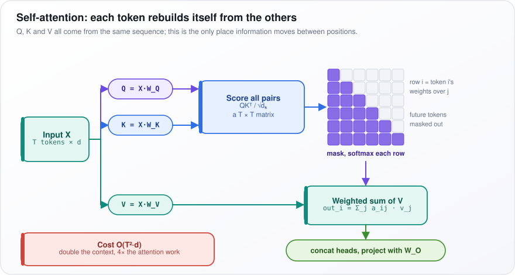</p>

*Figure: X is projected into Q, K and V, every pair is scored and masked, and each token takes a weighted sum of values.*

**Reading the figure.** Input X splits into Q = X·W_Q, K = X·W_K and V = X·W_V. Q and K meet in "Score all pairs". In the purple grid each row is one token's weights: filled cells are allowed, empty upper-right cells are masked future tokens. The weights and V meet in "Weighted sum of V", then "concat heads, project with W_O".

**Trade-off:** any two tokens are one step apart and everything runs in parallel, but the work grows as $`O(T^2 d)`$, with the square of $`T`$: double the context and the work quadruples.

---

## 14. What is Cross Attention in Transformers?

**Cross-attention is attention where the queries (what a token is looking for) come from one sequence and the keys and values (what each token offers and hands over) come from another. It lets one stream look things up in a different stream: a translation decoder consulting the source sentence, a speech model's text consulting the audio, an image generator consulting the prompt.**

**The idea.** Translating "Le chat noir" into English: when the decoder is about to write *black*, its query effectively asks "which source word am I translating now?" It matches the key of *noir* most strongly and pulls in that word's meaning.

**How it works.**

1. An encoder reads the source (the French sentence, the audio, the prompt) once and produces a vector for each source token.
2. Keys and values are projected from those source vectors; queries come from the target being generated.
3. Scores form a $`T_{\text{target}} \times T_{\text{source}}`$ matrix. There is no causal mask over the source: it already exists in full, so every target token may see all of it.
4. In encoder-decoder models such as T5 and Whisper-style speech models, each decoder block runs causal self-attention, then cross-attention, then the feed-forward network (FFN).
5. In text-to-image diffusion, image latents (compressed image features) are the queries and text embeddings are the keys and values. That is how the prompt steers the picture.

<p align="center">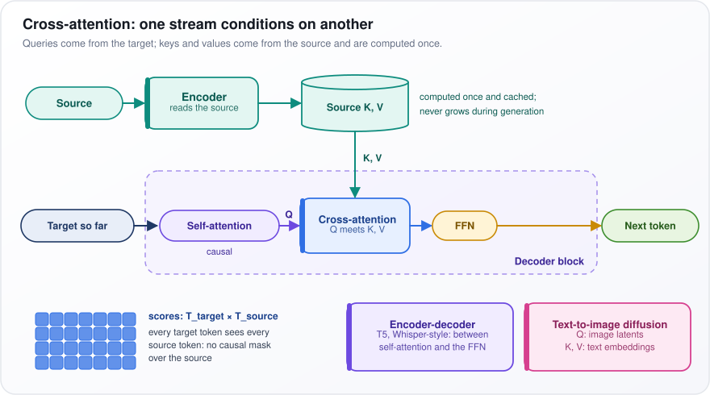</p>

*Figure: the target stream supplies queries; the encoded source supplies keys and values, computed once.*

**Reading the figure.** Along the top, Source goes through the Encoder into the "Source K, V" cylinder. Its K, V arrow drops into the dashed "Decoder block", where "Target so far" passes causal Self-attention, sends Q into Cross-attention, then FFN, then "Next token". Bottom left, the fully blue grid is the unmasked score matrix; bottom right are the two uses.

**Watch out:** the source's keys and values are computed once and cached. Unlike the self-attention cache, this cache never grows as the output gets longer.

---

## 15. Why do we scale the dot product attention by √dₖ in the Transformer architecture?

**Dot products between random vectors get larger as the vectors get longer. Without scaling, attention scores in wide heads become huge, softmax puts almost all the weight on one token, and learning stalls. Dividing by $`\sqrt{d_k}`$ (the square root of the key length) brings scores back to a steady size.**

**The idea.** A dot product adds up $`d_k`$ products. Adding more random terms gives a wider spread, the way the total of 128 dice rolls varies more than the total of 2. The variance (the average squared spread) grows in proportion to $`d_k`$, so the standard deviation (the typical spread) grows with $`\sqrt{d_k}`$. At $`d_k = 128`$, typical scores are about ±11 instead of ±1.

**Why that hurts.** Softmax, which turns scores into weights that add up to 1, exaggerates gaps exponentially. At $`d_k = 64`$, two keys whose raw scores differ by 16 get weights of 0.9999999 and 0.0000001, effectively one-hot (all weight on one). Divided by $`\sqrt{64} = 8`$, the gap is 2 and the weights are a healthy 0.88 and 0.12.

**How it breaks training.** The gradient (the signal telling weights how to change) must pass through softmax. How much a probability $`p`$ moves when its own score moves is $`p(1 - p)`$: 0.25 at $`p = 0.5`$, but about 0.0000001 at $`p = 0.9999999`$ or $`p = 0.0000001`$. So when one token takes all the weight, the signal almost vanishes, and the query and key weights $`W_Q`$ and $`W_K`$ stop learning.

**Put as a formula:**

```math
\text{Var}(q \cdot k) = \sum_{i=1}^{d_k} \text{Var}(q_i k_i) = d_k \quad \Rightarrow \quad \text{Var}\left(\frac{q \cdot k}{\sqrt{d_k}}\right) = 1
```

Var means variance, $`\sum`$ adds up over the $`d_k`$ entries, and $`\Rightarrow`$ reads "so". If each entry of the query $`q`$ and key $`k`$ has mean 0 and variance 1 and they are independent, each product $`q_i k_i`$ has variance 1, and the sum of $`d_k`$ of them has variance $`d_k`$. Dividing a score by $`\sqrt{d_k}`$ divides its variance by $`d_k`$: for $`d_k = 64`$, variance 64 (spread 8) becomes 1.

**Watch out:** $`\sqrt{d_k}`$ is a fixed temperature (a divisor that sharpens or flattens softmax), not a learned one. Some recent models also normalize queries and keys (QK-normalization) for extra stability.

---

## 16. What is causal masking?

**Causal masking stops each token from seeing the tokens after it. Before softmax, scores for future positions are set to minus infinity, so their weights become zero. This lets a model train on next-token prediction at every position at once without cheating.**

**The idea.** Take the training text "the cat sat on". At position 2, *cat*, the model must predict *sat*. If it could see position 3, it would just copy the answer. The mask hides *sat* and *on* from *cat*. Because every position is masked this way, one sequence of $`T`$ tokens gives $`T`$ training examples in a single pass.

**How it works.**

1. Compute the $`T \times T`$ score matrix as usual.
2. Add a mask that is 0 on and below the diagonal (the current and earlier tokens) and $`-\infty`$ above it (later tokens).
3. Softmax raises $`e`$ (about 2.72) to each score and divides by the total. $`e^{-\infty}`$ ($`e`$ to the power minus infinity) is 0, so future tokens get exactly zero weight.
4. This matches inference, where future tokens do not exist yet. It is also why the KV cache is valid: earlier tokens never look forward, so their keys and values never change when new tokens arrive.

**Reading the grid.** 1 means allowed and 0 means blocked. Row q3, the third token's query, can see keys k1 to k3 only; q4 sees everything before and including itself.

```
      k1 k2 k3 k4
q1  [  1  0  0  0 ]
q2  [  1  1  0  0 ]
q3  [  1  1  1  0 ]
q4  [  1  1  1  1 ]
```

**Watch out:** a padding mask is a different thing: it hides the filler tokens added so sequences in a batch have equal length. And fast attention code (kernels) such as Flash Attention skips blocks of the matrix that are entirely masked, which roughly halves attention compute for causal models.

---

## 17. What are multi-head attention mechanisms? Why use multiple attention heads?

**Multi-head attention runs several smaller attention operations side by side, each with its own query, key and value projections, and then joins their outputs. Each head can follow a different relationship between tokens, for about the same cost as one big head.**

**The idea.** In "The chef who trained in Paris cooked the meal", *cooked* needs its subject (*chef*, five words back) and its object (*meal*). One softmax produces one weighted average, so a single head would have to blur the two together. With several heads, one can lock onto the subject, another onto the object, another onto the previous word.

**How it works.**

1. Split the width $`d`$ into $`H`$ heads of width $`d_h = d / H`$. For example $`d = 4{,}096`$ and $`H = 32`$ gives heads of width 128.
2. Each head has its own slice of $`W_Q`$, $`W_K`$ and $`W_V`$ and does ordinary scaled dot-product attention in its own 128-number space.
3. Join (concatenate) the $`H`$ head outputs back to width $`d`$ and multiply by an output matrix $`W_O`$.
4. Because each head is $`1/H`$ of the width, total parameters (learned numbers) and compute match one head of full width $`d`$.

Studies of trained models find heads that specialize: previous-token heads, heads that track grammar, and induction heads that spot an earlier pattern "A B … A" and predict "B" next.

**Put as a formula:**

```math
\text{MHA}(X) = \text{Concat}(\text{head}_1, \dots, \text{head}_H)\, W_O
```

$`\text{head}_1`$ to $`\text{head}_H`$ are the $`H`$ heads' outputs for a token. Concat places them side by side into one long vector; $`W_O`$ mixes them back into a single vector of width $`d`$. Example: 32 heads each output 128 numbers; joined, that is 4,096, and a 4,096 x 4,096 matrix $`W_O`$ mixes them.

**Trade-off:** many heads can be pruned (removed) with little loss, and the KV cache (the stored keys and values of past tokens) grows with the number of key/value heads. So modern LLMs keep many query heads but let groups of them share keys and values (grouped-query attention, GQA).

---

## 18. What are Feed-Forward Networks in LLMs?

**The feed-forward network (FFN) is a small two-layer network inside every Transformer block, applied to each token on its own: widen the token's vector, apply a nonlinearity, shrink it back. Attention moves information between tokens; the FFN processes what each token now holds, and it holds most of the model's learned numbers (parameters).**

**The idea.** After attention, the vector at *Eiffel Tower* has gathered its context. One popular reading treats the FFN as a lookup table: the first matrix detects patterns such as "famous Paris landmark", and the second writes related facts (*Paris*, *France*) back into the vector.

**How it works.**

- **Classic FFN:** multiply by $`W_1`$ to widen the vector from its width $`d`$ to $`4d`$, apply a nonlinearity (a bend such as ReLU, which zeroes negative numbers, so the network can model curves), then multiply by $`W_2`$ back to $`d`$. That is $`2 \times d \times 4d = 8d^2`$ parameters, against about $`4d^2`$ for attention's four $`d \times d`$ matrices: the FFN holds about two-thirds of the block.
- **SwiGLU**, used by most recent LLMs, adds a third matrix $`W_3`$ whose output gates features on and off. To keep the total at $`8d^2`$, the hidden width shrinks to about $`\tfrac{8}{3}d`$; many models round it up (Llama 3 8B: 14,336 for $`d = 4{,}096`$, 3.5 times).
- **Mixture of Experts** (MoE) swaps this one FFN for many expert FFNs and a router that picks a few per token.

**Put as a formula:**

```math
\text{FFN}(x) = W_2\left(\text{SiLU}(W_1 x) \odot W_3 x\right)
```

$`W_1 x`$ and $`W_3 x`$ are two widened copies of the token vector. SiLU, a smooth ReLU-like curve, is applied to the first: the input times its sigmoid (a curve squashing any number into 0 to 1). $`\odot`$ multiplies the two entry by entry, so the second acts as the gate; $`W_2`$ brings the result back to width $`d`$. Example for one entry: $`W_1 x = 2`$ gives SiLU $`= 2 \times 0.88 = 1.76`$; times a gate $`W_3 x = 0.5`$ gives 0.88.

**Watch out:** quantization (storing weights in fewer bits) and pruning (removing weights) focus on FFN weights, where most of the bytes are.

---

## 19. What is Generative AI?

**Generative AI means models that learn what their training data looks like well enough to produce new examples of it: text, code, images, audio, video. A spam filter judges content that already exists; a generative model creates new content.**

**The idea.** The difference is in what the model learns, written with probabilities where "|" reads "given":

- A **discriminative** model learns $`p(y \mid x)`$: given this email $`x`$, how likely is it that the label $`y`$ is "spam"?
- A **generative** model learns $`p(x)`$, what emails themselves look like, so it can write a new, plausible one. Or it learns $`p(x \mid c)`$: content given a condition $`c`$, such as the prompt "a cat in a spacesuit".

**How it works.** The main families:

- **Autoregressive Transformers** (LLMs) produce content one token at a time, each predicted from the ones before. They handle text and code, and increasingly images and audio turned into tokens.
- **Diffusion models** start from pure random noise and remove noise step by step, guided by the prompt, until an image, audio clip or video appears. Most image and video generators use them.
- **Older or supporting families:** GANs (generative adversarial networks, a generator trained against a critic that tries to spot fakes); VAEs (variational autoencoders, which squeeze data into a small code and rebuild it, and supply the compressed "latent" space many diffusion systems work in); and flow models (which learn a reversible path from noise to data).

**What this means for engineering.** Output is sampled (drawn at random from the model's probabilities), so the same prompt can give different answers. And there is usually no single correct output to check against, which makes testing harder than for a classifier with a labeled test set.

**Watch out:** the training objective rewards plausible output, not true output, and results vary from run to run. That is why evaluation and grounding (tying answers to trusted sources) are the hard engineering, not generation itself.

---

## 20. What is the context window in LLMs, and why does it matter?

**The context window is the maximum number of tokens (words or pieces of words) a model can handle in one call, counting everything: system prompt, conversation history, retrieved documents, tool definitions and results, and the reply it writes. Anything outside the window does not exist for that call.**

**The idea.** Think of a desk that holds a fixed number of pages. A 128K-token window (128,000 tokens) holds roughly 300 pages of English, at about three-quarters of a word per token. If the system prompt, history and documents already use 120K, the reply has at most 8K tokens left.

**Why it matters.**

- **Capability:** it limits how much evidence the model can use at once.
- **Cost:** you pay for every input token, and in a chat the full history is sent and processed again on every turn.
- **Latency:** time-to-first-token (the wait before the reply starts) grows with prompt length, because the whole prompt is processed before anything is written.
- **Quality:** the length a model uses well is often shorter than the advertised maximum. Tests find that facts placed in the middle of a long context are used worse than facts at the start or end, an effect called "lost in the middle".

As of 2025–26, frontier models offer windows from about 128K to over 1M tokens.

**Watch out:** even when everything fits, retrieve the relevant chunks rather than stuffing the window. It is cheaper, faster and usually more accurate. And always leave room for the output.

---

## 21. Why is the context window limited in LLMs?

**Longer context costs more in three ways: attention work (each token comparing itself with every other) grows with the square of the length; the memory for the stored keys and values attention reuses (the KV cache) grows in step with the length and soon outgrows a GPU (the chip that runs the model); and models only work reliably at lengths they were trained on.**

**The idea.** Going from an 8K-token prompt to a 128K-token prompt is 16 times the length. But attention compares every token with every other token, so the attention work on that prompt grows about $`16^2 = 256`$ times.

**How it works.** Four limits stack up:

1. **Compute:** attention scores every pair of tokens, $`O(n^2)`$ in length $`n`$. Flash Attention (a faster way to compute attention) removes the need to store the $`n \times n`$ score table, but not the quadratic arithmetic.
2. **Memory:** every token stores a key and a value in every layer. For a 70-billion-parameter model with grouped-query attention (GQA, where attention heads share keys and values) at 16-bit precision (2 bytes per number), that is 2 (key and value) x 80 layers x 8 KV heads x 128 numbers x 2 bytes = 327,680 bytes, about 320 KiB (KiB is 1,024 bytes) per token. One 128K-token sequence needs about 40 GiB (a GiB is 1,024³ bytes, about a billion), on top of about 140 GB of weights (70 billion learned numbers at 2 bytes each).
3. **Positions:** position schemes such as RoPE (rotary embeddings, which rotate vectors by a position-dependent angle) meet angles beyond the trained length that the model never saw, and quality collapses. Extending the window means rescaling the positions and training further on long sequences.
4. **Data:** few training documents need information from 100K tokens earlier, so the model gets little practice at it, and the length it uses well lags the advertised figure.

**Watch out:** the limit is economic as much as technical. Even with 1M-token windows, retrieving the right few thousand tokens usually beats filling the window.

---

## 22. What is temperature in the context of LLMs, and how does it affect output?

**Temperature is a setting that controls how adventurous the model's word choice is. Below 1 it makes the most likely token even more likely; above 1 it flattens the odds so that less likely tokens get picked more often.**

**The idea.** Say the model's raw scores (logits) for three candidate tokens are 2.0, 1.0 and 0.1. Temperature $`T`$ divides them before they become probabilities. At $`T = 0.5`$ they become 4, 2 and 0.2, and the top token gets 86%. At $`T = 2`$ they become 1, 0.5 and 0.05, and the top token drops to 50%. The table shows all three settings.

| Logits [2.0, 1.0, 0.1] | Probabilities (approx.) |
|---|---|
| T = 0.5 | 0.86, 0.12, 0.02 |
| T = 1.0 | 0.66, 0.24, 0.10 |
| T = 2.0 | 0.50, 0.30, 0.19 |

**Put as a formula,** temperature is softmax with every score divided by $`T`$ first:

```math
p_i = \frac{e^{z_i / T}}{\sum_j e^{z_j / T}}
```

$`z_i`$ is token $`i`$'s logit. The exponential $`e^{(\cdot)}`$ (the number $`e \approx 2.72`$ raised to that score) makes every score positive and magnifies gaps, and $`\sum_j`$ adds over every token so the probabilities total 1. As $`T`$ approaches 0, the top token takes all the probability: that is greedy decoding (always pick the top token).

**Typical settings** (rules of thumb): extraction, code and tool calls 0 to about 0.3; chat around 0.7; brainstorming, or many varied candidates to choose from (best-of-n), 0.8 to 1.2.

<p align="center">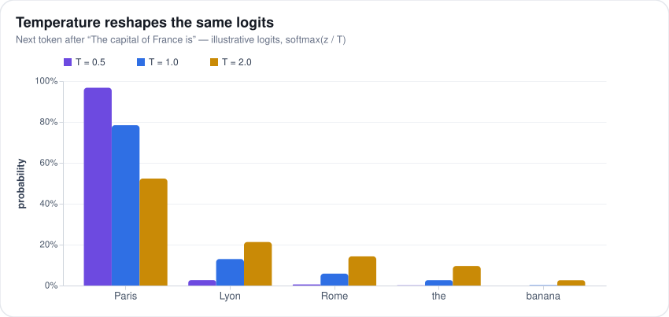</p>

*Figure: the same logits for the word after "The capital of France is", at three temperatures.*

**Reading the figure.** Compare the three bars above each word. Purple ($`T = 0.5`$) puts nearly all the probability on Paris; blue ($`T = 1.0`$) about 78%; orange ($`T = 2.0`$) about half, while Lyon, Rome, "the" and even "banana" gain share.

**Watch out:** temperature 0 is not guaranteed to be deterministic: batched GPU arithmetic can round differently between runs and flip near-ties. And temperature only changes variety; it adds no knowledge.

---

## 23. Why is the first token slower than the rest in an LLM?

**Before the first token appears, the model has to run the entire prompt through every layer (called prefill) and store its keys and values (the intermediate results attention reuses) in the KV cache. After that, each new token only processes itself against the cache. So the wait for the first token grows with prompt length, while the time per later token stays roughly flat.**

**The idea.** Take a 10,000-token prompt and a 200-token answer. Prefill must push all 10,000 tokens through the model before anything appears, which on a large model can take a noticeable fraction of a second or more. Each of the 200 output tokens is then one small step, typically tens of milliseconds. (Illustrative orders of magnitude; real numbers depend on model and hardware.)

**How it works.**

- **Prefill** loads each weight (learned number) from GPU memory once and uses it for all $`n`$ prompt tokens, so the GPU is busy calculating: it is compute-bound.
- **Decode** loads each weight to process just one new token per sequence, so the GPU mostly waits on memory: it is memory-bandwidth-bound.
- **Time-to-first-token** (TTFT) also includes queueing, retrieval, tool calls and the network.

**Fixes.**

- **Prefix caching:** reuse the stored KV cache when a prompt starts with text already processed.
- **Shorter prompts.**
- **Chunked prefill:** split a long prompt into pieces interleaved with other users' decode steps, so one huge prompt does not stall everyone.
- **Separate pools:** run prefill and decode on different GPUs.

**Reading the table.** The two phases side by side: tokens handled per step, the size of the attention score grid per head, what limits speed, and the metric each phase drives.

| | Prefill | Decode |
|---|---|---|
| Tokens per step | All $`n`$ | 1 |
| Scores per head | $`n \times n`$ | $`1 \times n`$ |
| Bottleneck | Compute | Memory bandwidth |
| Metric | Time to first token | Time per output token |

**Watch out:** put content that never changes (system prompt, tool definitions, reference documents) at the start of the prompt, so prefix caching can reuse it across requests.

---

## 24. Explain Top-p (nucleus) sampling and Top-k sampling. How do they differ?

**Both throw away the unlikely tail of next-token candidates and sample from what remains. Top-k keeps a fixed number of tokens, say 40. Top-p (nucleus sampling) keeps the smallest set of top tokens whose probabilities add up to $`p`$, say 0.9, so the number kept shrinks or grows with the model's confidence.**

**The idea.** Two moments in generation:

- **Confident:** after "The capital of France is", *Paris* has probability 0.95. Top-p 0.9 keeps only *Paris*. Top-k 40 keeps *Paris* plus 39 wrong options sharing the other 5%, and now and then picks one.
- **Uncertain:** after "She opened the", hundreds of words are plausible (*door*, *letter*, *box*…), each with a few percent. Top-p 0.9 may keep hundreds; top-k 40 cuts off plausible words.

**How it works.**

1. Turn logits (raw scores) into probabilities, after applying temperature (a divisor that sharpens or flattens them).
2. Sort tokens from most to least likely.
3. Top-k keeps the first $`k`$. Top-p keeps adding tokens until their running total reaches $`p`$.
4. Renormalize: divide the kept probabilities by their sum so they add to 1 again.
5. Sample one token.

When both are set, both filters apply; libraries typically apply temperature, then top-k, then top-p.

**Reading the code.** The function follows those steps: softmax with temperature, sort with `argsort`, cap at `k`, then `searchsorted` over the running total (`cumsum`) finds where it first reaches `p`. Everything outside the kept set is zeroed before sampling.

```python
import numpy as np

def sample(logits, k=None, p=None, temperature=1.0, rng=np.random.default_rng()):
    z = logits / temperature
    probs = np.exp(z - z.max())
    probs /= probs.sum()
    order = np.argsort(probs)[::-1]
    keep = np.zeros_like(probs, dtype=bool)
    n = len(probs) if k is None else k
    if p is not None:
        # smallest prefix whose cumulative mass reaches p
        n = min(n, np.searchsorted(np.cumsum(probs[order]), p) + 1)
    keep[order[:n]] = True
    probs = np.where(keep, probs, 0.0)
    return rng.choice(len(probs), p=probs / probs.sum())
```

**Watch out:** min-p, a newer adaptive option, keeps tokens whose probability is at least a set fraction of the top token's. None of these fixes a model whose probabilities are wrong to begin with.

---

## 25. Compare greedy decoding, beam search, top-k, top-p, and temperature sampling. When does each fail?

**Greedy decoding and beam search try to find the single most probable text; temperature, top-k and top-p reshape the probabilities (top-k keeps the $`k`$ likeliest tokens, top-p the fewest covering probability $`p`$) and then pick at random. Search methods fail on open-ended writing by being bland and repetitive; sampling methods fail by drifting into mistakes when they let in too many unlikely tokens.**

**The idea.** Greedy decoding always takes the top token, like always turning onto the busiest street: fine for a short trip, but on a long one you can end up circling ("I think that I think that…"). Beam search keeps the $`b`$ best partial texts at each step ($`b`$ is the beam width, say 4) and returns the best finished one. That suits tasks with one right answer, but human writing is less predictable than the most probable text, so maximizing probability produces generic prose.

**How to choose.**

- **One right output** (translation, speech recognition): beam search or greedy.
- **Structured output and tool calls:** greedy or temperature near 0, plus constrained decoding (blocking any token that would break the required format, such as invalid JSON).
- **Chat:** temperature about 0.7 and top-p about 0.9 as a starting point.
- **Several diverse candidates:** a higher temperature, then pick the best with a verifier (a checker such as unit tests or a scoring model).

**Reading the table.** One row per method: what it is good for, and how it breaks.

| Method | Good for | Fails when |
|---|---|---|
| Greedy | Short factual or structured output | Long text: repetition loops, locally best but globally worse |
| Beam search | Translation, speech recognition | Open-ended text: bland, generic, favors short outputs; $`b`$ times the compute |
| Temperature | Tuning consistency versus diversity | Low: greedy's problems. High: incoherence and factual errors |
| Top-k | Simple cap on the garbage tail | Fixed $`k`$ is too loose when confident, too tight when uncertain |
| Top-p | General open-ended generation | Flat distributions admit many poor tokens, worse with high temperature |

**Watch out:** repetition penalties (lowering the scores of tokens already used) also suppress legitimate repeats, such as variable names in code and numbers in tables.

---

## 26. What are logits, and how are they used in text generation?

**Logits are the raw scores a model gives every token in its vocabulary. Softmax converts them to probabilities, and most decoding settings and output controls work by changing the logits.**

**The idea.** After "The sky is", the model might output logits of 5.0 for *blue*, 3.0 for *clear* and -1.0 for *green*. They are not probabilities: they can be negative and do not add to 1. Only differences matter: a gap of $`\Delta`$ between two logits means one token is $`e^{\Delta}`$ ($`e \approx 2.72`$ raised to the gap) times as likely. *blue* versus *clear* is a gap of 2, so about 7.4 times as likely.

**How they are produced and used.**

1. **Produced:** the final vector $`h`$ at the last position is multiplied by the unembedding matrix $`W_U`$, giving one logit per vocabulary token.
2. **Decoding:** take the top one (argmax), or apply temperature and top-p and sample.
3. **Control:** constrained decoding sets forbidden tokens to $`-\infty`$ (probability 0), for example to force valid JSON; logit bias raises or lowers chosen tokens; repetition penalties lower recently used ones.
4. **Confidence:** log-probabilities (the log of each token's probability) give per-token confidence, for example to pick the likeliest multiple-choice label.
5. **Training:** cross-entropy loss (the training error) and distillation (teaching a small model to copy a big one) work directly on logits. The gradient (how training nudges each logit) is simply $`p - y`$: predicted probabilities minus the answer written as 1 for the right token, 0 elsewhere.

**Put as a formula:**

```math
z = h W_U \in \mathbb{R}^{V}, \qquad p_i = \frac{e^{z_i}}{\sum_j e^{z_j}}
```

$`h`$ and $`W_U`$ are as in step 1; $`z`$ is the list of $`V`$ logits ($`\in \mathbb{R}^{V}`$ says "$`V`$ real numbers"). $`p_i`$ is softmax: raise $`e`$ to each logit and divide by the sum ($`\sum_j`$) over all tokens. Example: logits 5, 3 and -1 exponentiate to about 148.4, 20.1 and 0.37, which divided by their sum of 168.9 give 0.88, 0.12 and 0.002.

**Watch out:** log-probabilities from instruction-tuned models are often poorly calibrated (a token given 90% is not right 90% of the time), and many APIs return only the top few. Validate before using them as confidence.

---

## 27. What are skip connections (residual connections) in Transformers?

**A residual (or skip) connection adds a layer's input back onto its output: $`y = x + F(x)`$. Each layer then only has to learn a correction to what is already there. Without these connections, deep Transformers do not train reliably.**

**The idea.** It is like editing a document with tracked changes instead of rewriting it from scratch. Each layer proposes edits to the running draft. A layer with nothing useful to add can propose none ($`F(x) \approx 0`$), and the draft passes through unchanged, so adding more layers rarely makes the model worse.

**How it works.**

- **Gradients:** training sends an error signal backward through the network. Through $`x + F(x)`$, part of the signal skips $`F`$ entirely along the $`x`$ path, so it reaches the earliest layers at full strength instead of shrinking at every layer (the vanishing-gradient problem).
- **Residual stream:** every attention and feed-forward sublayer reads the running vector, computes something, and adds it back. The stream works like a shared bus that all layers write to.
- **Pre-norm:** modern LLMs normalize inside the branch, applying Norm to $`x`$ before the sublayer, which leaves the $`x`$ path itself untouched. The original 2017 design normalized after the addition (post-norm), which is harder to train when the model is deep.

**Put as a formula,** one block is:

```math
h = x + \text{Attn}(\text{Norm}(x)), \qquad y = h + \text{FFN}(\text{Norm}(h))
```

$`h`$ is the vector after the attention sublayer (Attn) and $`y`$ after the feed-forward one (FFN); Norm is a normalization such as RMSNorm, which rescales a vector to a steady size. Each line reads "keep what you had, plus a correction computed from a normalized copy". Example with single numbers: if $`x = 1.0`$ and attention contributes 0.2, then $`h = 1.2`$; if the FFN adds -0.1, then $`y = 1.1`$.

**Watch out:** because every layer adds to it, the stream's magnitude grows with depth, so a final normalization is needed before the output head.

---

## 28. What is the difference between open-source and closed-source LLMs? When would you choose one over the other?

**Closed models are available only through the vendor's API. Open models publish their weights, so you can download, run and fine-tune them yourself. Most "open-source" LLMs are really open-weight: the weights are released under a license, but the training data and code usually are not.**

**The idea.** It is renting versus owning. Renting (an API) is simple, needs no upfront cost and gives you the newest model, but you follow the vendor's rules and it can retire the model. Owning (self-hosting open weights) means buying or leasing GPUs and running them, but data never leaves, you can modify the model, and it never changes unless you change it.

**When to choose which.**

- **Default to a closed API** for a new product, spiky or unknown traffic, and the hardest reasoning tasks.
- **Choose open-weight** when data cannot leave your network, you need deep customization (full fine-tuning, direct access to logits), traffic is steady and high enough that owned GPUs cost less per token, or you need a model version that never changes.
- **Mature systems route between both:** hard requests to a frontier API, high-volume narrow tasks such as classification or extraction to a small open model.

**Reading the table.** It compares the two options on capability, data control, customization, cost structure and operations. VPC means virtual private cloud, your own isolated network in a cloud provider.

| | Closed API | Open-weight, self-hosted |
|---|---|---|
| Frontier capability | Usually leads | Close behind, varies by task |
| Data control | Leaves your boundary under contract | Stays in your VPC |
| Customization | Prompting, limited tuning | Full fine-tuning, raw scores (logits), fewer-bit weights (quantization) |
| Cost | Per token, no fixed cost | Fixed GPUs, cheap only at high utilization |
| Operations and versions | Provider runs it and may retire models | You run it and pin weights |

**Watch out:** comparing an API's price per token with a GPU's price per hour without counting how busy the GPUs will really be and the engineers needed to run them. And assuming "open" means free for any use: licenses can restrict commercial use or very large companies.

---

## 29. What is the difference between encoder-only, decoder-only, and encoder-decoder Transformer architectures?

**The three designs differ in which tokens each token may look at, and that decides what they are for. Encoder-only models see the whole input in both directions and produce vectors that represent it. Decoder-only models see only earlier tokens and generate text. Encoder-decoder models read an input fully, then generate an output that looks back at it through cross-attention.**

**The idea.** Take "The bank by the river flooded". An encoder such as BERT builds the vector for *bank* from words on both sides, including *river* after it, which is ideal for understanding. A decoder such as GPT, at *bank*, sees only "The", which is exactly what writing left to right requires. An encoder-decoder translation model reads the whole English sentence with its encoder, then its decoder writes the French word by word while consulting it.

**When each fits.**

- **Encoder-only:** classification, embeddings (meaning vectors) for search, and reranking (scoring how well a document matches a query).
- **Decoder-only:** anything that can be written as a prompt and a continuation: chat, code, summaries, reasoning.
- **Encoder-decoder:** turning one input into one output, such as translation or speech-to-text.

**Why decoder-only won for LLMs.** The next-token objective turns every token of any text into a training example, one interface (prompt in, text out) covers every task, and serving a single kind of model is simpler.

**Reading the table.** It compares the attention pattern, the pretraining task and example models. "Masked tokens" means the encoder learns by filling in hidden words; "denoising or span corruption" means the encoder-decoder learns to repair text with chunks removed or scrambled.

| | Encoder-only | Decoder-only | Encoder-decoder |
|---|---|---|---|
| Attention | Bidirectional | Causal | Bidirectional encoder; causal decoder with cross-attention |
| Pretraining | Masked tokens | Next token | Denoising or span corruption |
| Examples | BERT, most embedders | GPT, Llama | T5, BART, Whisper-style |

**Watch out:** do not use a large decoder LLM where a small encoder does the job. For classifying millions of short texts or embedding documents, an encoder is far cheaper and often just as accurate.

---

## 30. What is KV cache, and how does it speed up inference?

**The KV cache stores the keys and values (what attention matches against and reads) already computed for every earlier token, in every layer. At each new step the model computes a query, key and value only for the newest token and reuses the rest, so generating $`n`$ tokens takes about $`n`$ token-computations instead of about $`n^2`$.**

**The idea.** Picture writing a 1,000-token answer with no cache. Step 1,000 would recompute keys and values for all 999 earlier tokens, step 999 for 998, and so on: about half a million token-computations in total ($`1{,}000^2 / 2`$). With the cache, each step processes one new token: about 1,000.

**How it works,** for one decode step:

1. Compute the query, key and value $`q_t, k_t, v_t`$ for the new token $`t`$ only.
2. Append $`k_t`$ and $`v_t`$ to each layer's cache.
3. Attend: score $`q_t`$ against every cached key and take the weighted sum of cached values.
4. Run the feed-forward network for that one token.

**Why it is valid.** Tokens attend only to earlier ones (causal masking), so earlier keys and values never change. Queries are not cached; only the newest is needed.

**In serving,** PagedAttention stores the cache in fixed-size blocks so no space is wasted, and FP8 storage (8 bits per number) halves it.

**Put as a formula,** the cache size per token is:

```math
\text{KV bytes per token} = 2 \times L \times H_{kv} \times d_h \times \text{bytes per element}
```

The 2 counts keys and values; $`L`$ is the number of layers; $`H_{kv}`$ the number of key/value heads (attention's parallel units); $`d_h`$ the width of each head; and bytes per element is 2 at 16-bit precision. Example for a small model with $`L = 32`$, $`H_{kv} = 8`$, $`d_h = 128`$: $`2 \times 32 \times 8 \times 128 \times 2 = 131{,}072`$ bytes, 128 KiB (1 KiB = 1,024 bytes) per token, so a 4,096-token conversation needs 512 MiB (1 MiB = 1,024 KiB).

**Trade-off:** it trades compute for memory that grows with length and user count. At long contexts the cache can outgrow the weights, and reading it at every step is why decode is limited by memory bandwidth (how fast memory can be read).

---

## 31. Estimate the KV cache memory needed to serve a large model. How does it constrain batch size and context length?

**Per token, KV cache memory is 2 (keys and values) x layers x KV heads x head width x bytes per number. Multiply by tokens per sequence and by the number of sequences served at once. For a 70-billion-parameter model with grouped-query attention at 16-bit precision that is about 320 KiB per token, so GPU memory caps concurrent users times context length.**

**The idea.** Work it for a Llama-3-70B-like setup: 80 layers; 8 KV heads, because grouped-query attention (GQA) lets its 64 query heads share 8 key/value heads; head width 128; 2 bytes per number (FP16).

```math
2 \times 80 \times 8 \times 128 \times 2 = 327{,}680 \text{ bytes} \approx 320 \text{ KiB per token}
```

KiB is 1,024 bytes and GiB is 1,024³ bytes. So:

- An 8K-token sequence (8,192 tokens) needs 8,192 x 320 KiB = 2.5 GiB.
- A 128K-token sequence needs about 40 GiB.
- Without GQA (64 KV heads), every figure is 8 times larger.

**How it constrains serving.**

1. Start with a server of 8 GPUs at 80 GB each: 640 GB, about 596 GiB.
2. Subtract about 140 GB of FP16 weights plus runtime overhead. Roughly 400–450 GiB is left for cache (a planning figure, not an exact one).
3. Divide by the cache per sequence to get how many sequences fit at once, as in the table.
4. Doubling the context halves the concurrency. Fewer sequences per batch means each weight read from memory serves fewer users, so cost per token rises, because decode is limited by memory bandwidth rather than arithmetic.

**Reading the table.** Context per sequence, the cache it needs, and roughly how many such sequences fit in 400–450 GiB.

| Context per sequence | Cache per sequence | Concurrent sequences (approx.) |
|---|---|---|
| 8K | 2.5 GiB | 160–180 |
| 32K | 10 GiB | 40–45 |
| 128K | 40 GiB | about 10 |

**Levers:** GQA or MLA (multi-head latent attention, which caches one compressed vector per token), an FP8 cache (half the size), paged allocation (no memory reserved for tokens that never arrive), sharing the cache for common prompt prefixes, and different context caps per pricing tier.

**Watch out:** the table assumes every sequence is full length. Real traffic mixes short and long requests, which is why allocating cache in pages rather than reserving the maximum per user matters so much.

---

## 32. KV Cache Compression

**KV cache compression makes the stored keys and values smaller, so one server can hold longer contexts or more users. There are four levers: store fewer heads, store a smaller representation, use fewer bits per number, or keep fewer tokens.**

**The idea.** The cache per token is 2 x layers x KV heads x head width x bytes, multiplied by the number of tokens kept. For a 70B-class model that is about 40 GiB per user at 128K tokens. Each lever shrinks one factor of that product.

**How it works.**

- **Fewer heads:** grouped-query attention (GQA) lets a group of query heads (attention's parallel units) share one key/value head; multi-query attention (MQA) shares a single one across all. Going from 64 to 8 KV heads is 8 times smaller. This is decided when the model is trained.
- **Smaller representation:** multi-head latent attention (MLA, used in DeepSeek-V2 and V3) caches one compressed vector per token per layer and rebuilds keys and values from it when needed.
- **Fewer bits:** storing the cache at FP8 (8-bit) halves it with little or no quality loss in most reports; 4-bit needs special handling of rare, very large values (outliers).
- **Fewer tokens:** keep only a recent window; a few "attention sink" tokens at the start, which models attend to heavily whatever they contain; or the tokens that have received the most attention so far (heavy-hitter eviction). StreamingLLM, H2O and SnapKV are published methods of this kind.

**Reading the table.** Each lever, a named example, and what it costs.

| Lever | Example | Cost |
|---|---|---|
| Fewer heads | GQA, MQA | Training-time choice; MQA loses quality |
| Smaller representation | MLA (DeepSeek-V2/V3) | Architecture support needed |
| Fewer bits | FP8 or INT4 cache | 4-bit can hurt accuracy |
| Fewer tokens | StreamingLLM, H2O, SnapKV | Evicted facts are gone |

**Watch out:** for long context, choose models with GQA or latent attention, and when serving turn on a paged cache, prefix caching and an FP8 cache. Use token eviction only where forgetting is acceptable, never for document question answering: an evicted fact is gone.

---

## 33. What is model distillation, and how is it used with LLMs?

**Distillation trains a small "student" model to imitate a large "teacher" model, using the teacher's outputs (its full probabilities for each token, or its generated text) as training targets. With LLMs it is the main way to get much of a big model's quality at a fraction of the serving cost.**

**The idea.** For "The capital of Australia is", the correct answer is *Canberra*, but the teacher's probabilities might be *Canberra* 0.80, *Sydney* 0.15, *Melbourne* 0.04. These soft targets tell the student more than the bare right answer: *Sydney* is a tempting mistake and *banana* is not. That extra signal is often called "dark knowledge".

**How it works.** Three styles:

- **Black-box:** the teacher writes answers to many prompts, and the student is fine-tuned on them. It needs only API access. DeepSeek, for example, reported distilling its R1 reasoning model into smaller Qwen- and Llama-based models by fine-tuning on about 800K teacher-written samples.
- **White-box:** the student matches the teacher's probabilities at every token. This needs the teacher's logits (raw scores) and the same tokenizer.
- **On-policy:** the student writes its own answers and the teacher scores or corrects each token. This fixes exposure bias: a student trained only on teacher text never practices recovering from its own mistakes.

**Put as a formula,** the classic white-box loss is:

```math
\mathcal{L} = \alpha\, \text{CE}(y, p_s) + (1 - \alpha)\, \tau^2\, \text{KL}\left(p_t^{(\tau)} \,\Vert\, p_s^{(\tau)}\right)
```

$`\mathcal{L}`$ is the total loss and $`\alpha`$ (alpha) balances its two parts. $`\text{CE}(y, p_s)`$ is the cross-entropy, which is large when the student's probabilities $`p_s`$ give the true answer $`y`$ little weight. KL, the Kullback–Leibler divergence, measures how far the student's distribution is from the teacher's $`p_t`$. The superscript $`(\tau)`$ means both are softened by dividing the logits by a temperature $`\tau`$ (tau), such as 2, which makes small probabilities visible; multiplying by $`\tau^2`$ keeps the learning signal's size comparable. Example: with CE = 0.4, KL = 0.1, $`\tau = 2`$ and $`\alpha = 0.5`$, the loss is $`0.5 \times 0.4 + 0.5 \times 4 \times 0.1 = 0.4`$.

**Watch out:** students copy style easily but reasoning less reliably on unfamiliar inputs. Evaluate on held-out hard cases, not just average scores.

---

## 34. What is Mixture of Experts (MoE), and how does it work in models like Mixtral?

**Mixture of Experts (MoE) replaces the single feed-forward network (the per-token sub-network) in each Transformer block with many smaller "expert" networks and a router that sends each token to only a few of them. The model gets the capacity of all the experts while each token pays the compute of just a few.**

**The idea.** A clinic has eight specialists and a triage nurse; each patient sees two, so total expertise is large but each visit costs two consultations. Mixtral 8x7B (published figures) has 8 experts per layer and uses 2 per token: about 47B parameters in total but about 13B active per token. It is not 56B, because attention and embeddings are shared, not copied eight times.

**How it works.**

1. The router, a small learned layer, gives each expert a score for the current token.
2. Keep the top $`k`$ (here 2) and turn their scores into gate weights $`g_i`$ that add up to 1 (softmax).
3. The output is $`\sum_i g_i E_i(x)`$, where $`E_i(x)`$ is expert $`i`$'s output for token $`x`$: with gates 0.7 and 0.3, it is 0.7 times one chosen expert's output plus 0.3 times the other's.
4. Load balancing stops the router favoring a few experts (routing collapse): an extra loss penalizing imbalance, a cap on tokens per expert, or, in DeepSeek's recent models, an adjustable bias on router scores.
5. At scale, experts sit on different GPUs (expert parallelism), so every MoE layer needs an all-to-all exchange, sending tokens to their experts' GPUs and back.

<p align="center">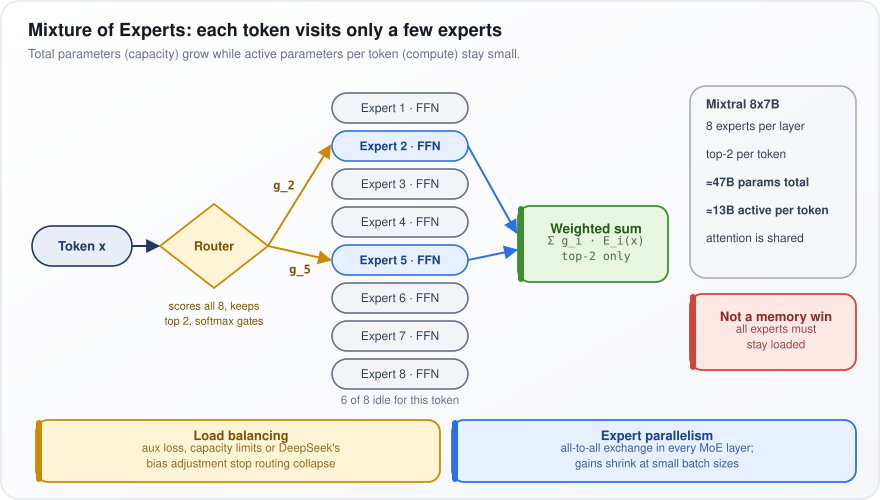</p>

*Figure: the router sends one token to 2 of 8 experts and sums their gated outputs.*

**Reading the figure.** "Token x" enters the yellow Router, which "scores all 8, keeps top 2". Arrows g_2 and g_5 lead to the blue Expert 2 and Expert 5, while "6 of 8 idle for this token". Their outputs meet in the green "Weighted sum".

**Trade-off:** MoE saves compute, not memory: every expert must stay loaded, since the next token may need any of them. At small batch sizes each expert sees few tokens, so the savings shrink.

---

## 35. What is the difference between dense and sparse models?

**A dense model uses all of its parameters (learned numbers) for every token. A sparse model uses only a subset for each token, most often through Mixture of Experts (MoE), where a router picks a few expert networks per token. "Sparse" can also mean sparse attention or pruned weights, so say which one you mean.**

**The idea.** A 70B dense model does about 140 billion floating-point operations (FLOPs, basic arithmetic steps) per token: roughly 2 per parameter, one multiply and one add. Mixtral, with 47B total and 13B active parameters, does about 26 billion per token, but still needs memory for all 47B.

**How they compare.**

- **Compute** follows active parameters; **memory** follows total parameters.
- **Quality:** at equal training compute, MoE usually reaches better quality; at equal total size, a dense model is better, because it uses all its parameters every time.
- **Other kinds of sparsity:** sparse attention limits which positions are scored (for example, only a nearby window). Weight pruning zeroes out individual weights, which rarely speeds up GPUs, except in the structured 2:4 pattern (2 of every 4 weights zero) that recent NVIDIA GPUs accelerate.

**Reading the table.** Dense against MoE on parameters used, compute and memory per token, and how hard each is to train and serve.

| | Dense | Sparse (MoE) |
|---|---|---|
| Parameters used per token | All | Active subset |
| Compute per token | About 2 x total parameters | About 2 x active parameters |
| Weight memory | Total | Total |
| Training and serving | Simple, good at low batch | Load balancing, all-to-all, best at high throughput |

**Watch out:** choose MoE for high-throughput serving across many GPUs. Choose dense when memory is the tight constraint, such as a single GPU, on-device use or low-traffic serving, because an MoE model's idle experts still fill memory.

---

## 36. How does DeepSeek-V4 work?

**DeepSeek-V4 is an open-weight Mixture-of-Experts model family (each token uses only a few of many expert sub-networks), released in 2026, built to handle 1-million-token contexts cheaply. Its central idea is hybrid attention that compresses the stored keys and values (the KV cache) aggressively. All figures are DeepSeek's own, from its 2026 technical report.**

**The idea.** At 1M tokens, ordinary attention would store keys and values for a million positions and score all of them for every new token. V4 instead summarizes groups of older tokens into compressed entries, keeps recent tokens in full, and looks closely only at the compressed entries that matter.

**How it works.**

- **Sizes:** V4-Pro has about 1.6T (trillion) total parameters with 49B active per token; V4-Flash about 284B total and 13B active.
- **Compressed Sparse Attention (CSA):** each small group of tokens is pooled into one compressed key/value entry. A lightweight scorer, the "lightning indexer", picks the $`k`$ highest-scoring entries for each query, and only those are attended to.
- **Heavily Compressed Attention (HCA):** much larger groups, reported as 128 tokens per entry. That leaves few enough entries to attend to all of them, giving a cheap global view.
- **Sliding window:** both keep the most recent 128 tokens uncompressed, for local detail.
- **From earlier DeepSeek models:** DeepSeekMoE (many small experts plus shared, always-on experts) and multi-token prediction (predicting several upcoming tokens at once in training).
- **Residual path:** plain residual connections are replaced with manifold-constrained hyper-connections (mHC), which widen the residual stream (the running vector every layer adds to) into several parallel streams (reported as 4) with constrained mixing between them.
- **Training:** the Muon optimizer (the rule that updates the weights; an alternative to the standard Adam) for most modules, and FP4 (4-bit) quantization-aware training for the expert weights, so the model learns to work at the precision it is served in.

**Result:** at 1M tokens, DeepSeek reports V4-Pro needs about 27% of V3.2's per-token compute and 10% of its KV cache.

**Watch out:** these are vendor-reported numbers for a 2026 release; expect independent measurements to differ.

---

## 37. What is Flash Attention?

**Flash Attention computes exactly the same attention result as the standard method but never writes the full table of token-pair scores to the GPU's main memory. Working tile by tile in fast on-chip memory, its extra memory grows with length, not length squared, and it runs much faster.**

**The idea.** A GPU has large, slower main memory (HBM, tens of GB) and tiny, very fast on-chip memory (SRAM, under a megabyte per compute unit). Standard attention on 32K tokens writes a 32K x 32K score table, about a billion numbers per head, to HBM and reads it back several times. That shuttling, not the arithmetic, takes the time.

**How it works.**

1. Split queries, keys and values into blocks small enough for SRAM.
2. Load a query block and stream key/value blocks past it, scoring each tile.
3. Keep a running maximum and sum per row (an "online softmax"), rescaling the totals whenever a larger maximum appears.
4. Accumulate the output and write only the final result to HBM.
5. In training, the backward pass (working out how to change the weights) recomputes tile scores instead of storing the table: more arithmetic, far less memory traffic.

**Put as a formula,** the update for each new tile is:

```math
m' = \max(m, \max S_j), \quad \ell' = e^{m - m'}\ell + \textstyle\sum e^{S_j - m'}, \quad O' = e^{m - m'} O + e^{S_j - m'} V_j
```

$`m`$ is the running row maximum, $`\ell`$ (ell) the running sum of exponentials, and $`O`$ the running output; $`S_j`$ is the score tile for key block $`j`$, $`\max S_j`$ its largest score, and $`V_j`$ its values; $`\sum`$ adds over the tile, and primes mark updated values. Subtracting the maximum stops exponentials overflowing; the factor $`e^{m - m'}`$ shrinks old totals when the maximum rises. At the end, $`O`$ is divided by $`\ell`$, completing the softmax (scores turned into weights that add up to 1). Example: if the maximum so far is 2 and a new tile's is 5, the old sum and output are first multiplied by $`e^{-3} \approx 0.05`$.

**Watch out:** the arithmetic is still $`O(n^2 d)`$: it grows with the square of the length $`n`$, times the head width $`d`$. It makes quadratic attention much cheaper in practice, not linear.

---

## 38. What is Cross-Entropy Loss?

**Cross-entropy loss is the negative log of the probability the model gave to the correct answer. For LLMs it is the training objective: at every position, push up the probability of the token that actually came next.**

**The idea.** The true next token is *mat*. If the model gave *mat* a probability of 0.9, the loss is $`-\log 0.9 \approx 0.1`$: small. If it gave 0.01, the loss is $`-\log 0.01 \approx 4.6`$: large (log here is the natural log, base $`e \approx 2.72`$). The log punishes confident mistakes hard, and it turns multiplying many small probabilities into adding their logs, which is easier to compute.

**How it works.**

- **General form:** $`-\sum_i y_i \log p_i`$, adding over every vocabulary token $`i`$. The target $`y_i`$ is 1 for the correct token and 0 for all others (one-hot), so only one term survives: $`-\log p_c`$, where $`c`$ is the correct token.
- **Training loss:** averaged over all positions of a sequence. Minimizing it is maximum likelihood, making the training text as probable as possible under the model.
- **Gradient** (how training nudges the raw scores, or logits, that softmax turns into probabilities): $`p - y`$, predicted probabilities minus the one-hot target, which is simple and numerically stable.
- **Perplexity** is $`e^{\mathcal{L}}`$ ($`e`$ raised to the loss), roughly the number of tokens the model is effectively choosing between. A loss of 2.0 nats (units of the natural log) is a perplexity of about 7.4.

**Put as a formula:**

```math
\mathcal{L} = -\frac{1}{T}\sum_{t=1}^{T} \log p_\theta(x_t \mid x_{\lt t})
```

$`\mathcal{L}`$ is the loss, $`\tfrac{1}{T}\sum_{t=1}^{T}`$ averages over the $`T`$ positions, and $`p_\theta(x_t \mid x_{\lt t})`$ is the probability that the model, with parameters $`\theta`$ (theta), gives the actual token $`x_t`$ given all earlier tokens. Example over three tokens with probabilities 0.5, 0.9 and 0.1: the logs are -0.69, -0.11 and -2.30, so the loss is 3.10 / 3, about 1.03.

**Watch out:** losses are per token, so models with different tokenizers cannot be compared on loss directly. In supervised fine-tuning, the loss is usually counted only on the response tokens, not the prompt.

---

## 39. What is Grouped-Query Attention (GQA), and how does it differ from Multi-Head Attention (MHA)?

**Attention runs as several parallel units called heads. In multi-head attention (MHA), every query head has its own key head and value head. In grouped-query attention (GQA), a group of query heads shares one key/value head. Quality stays close to MHA, while the KV cache (the keys and values stored for every past token), and the memory traffic to read it, shrinks by the ratio of query heads to KV heads.**

**The idea.** A Llama-3-70B-like model has 64 query heads. Under MHA it would cache keys and values for 64 heads per layer: about 2.5 MiB per token at 16-bit precision (2 bytes per number). Under GQA it caches 8 KV heads, each shared by 8 query heads: 320 KiB per token, 8 times less. For one 128K-token sequence that is the difference between about 320 GiB and 40 GiB (a GiB is about a billion bytes).

**How it works.**

1. Project keys and values to $`G`$ heads instead of $`H`$ (here $`G = 8`$, $`H = 64`$).
2. Share each KV head with its $`H/G = 8`$ query heads.
3. Each query head still computes its own attention pattern; the heads in a group simply look up the same keys and values.

Multi-query attention (MQA) is the extreme, $`G = 1`$: cheapest, but with a measurable quality loss. GQA, published in 2023, is the middle ground. An existing MHA model can be converted by averaging (mean-pooling) the KV heads within each group, then training briefly (uptraining).

**Reading the table.** For each variant: query heads, KV heads, and cache size relative to MHA.

| | Query heads | KV heads | KV cache vs MHA |
|---|---|---|---|
| MHA | $`H`$ | $`H`$ | 1x |
| GQA | $`H`$ | $`G`$ | $`G / H`$ |
| MQA | $`H`$ | 1 | $`1 / H`$ |

**Watch out:** GQA saves memory and bandwidth, not arithmetic (FLOPs): each query head still does its own attention. Multi-head latent attention (MLA) goes further by compressing keys and values into one small vector per token.

---

## 40. How does Sliding Window Attention work?

**Sliding window attention lets each token look back at only the most recent $`W`$ tokens instead of the whole text so far. The work per token becomes fixed, so long inputs get far cheaper, and the memory each layer holds stops growing once the window is full.**

In normal attention (the step where each token, a word or piece of a word, decides which earlier tokens matter), every token is compared with every earlier one: 100,000 tokens means about 5 billion pairs. With a window of $`W = 4096`$, token 50,000 looks only at tokens 45,905 to 50,000.

How it works:

1. **It is just a mask.** Attention already hides future tokens; a sliding window also hides tokens older than $`W`$. Nothing else changes.
2. **Cost.** Each token makes at most $`W`$ comparisons, so total work goes from $`O(n^2)`$ (grows with the square of the length $`n`$) to $`O(nW)`$ (grows in a straight line with length).
3. **Reach grows with depth.** In layer 2, a token looks at tokens that already absorbed information from $`W`$ further back. After $`L`$ layers, information can travel about $`L \times W`$ positions. Mistral 7B uses $`W = 4096`$ and 32 layers: about 131K tokens in theory.
4. **Rolling-buffer cache.** During generation the model keeps a KV cache (a store of the keys and values already computed for earlier tokens). Only the last $`W`$ entries are needed, so token $`i`$ goes into slot $`i \bmod W`$ (the remainder after dividing by $`W`$), overwriting the oldest. Memory stays constant.
5. **Hybrids.** Recent models interleave sliding-window layers with a few full-attention layers to keep long-range recall.

Put as a formula, token $`i`$ may look at token $`j`$ when:

```math
\text{allowed}(i, j) = \begin{cases} 1 & i - W \lt j \le i \\ 0 & \text{otherwise} \end{cases}
```

1 means "may attend", 0 means "masked". The condition $`j \le i`$ blocks the future; $`j \gt i - W`$ blocks anything older than the window. With $`W = 3`$ and $`i = 10`$, token 10 sees tokens 8, 9 and 10.

**Watch out:** relaying information through layers is lossy, so pure sliding-window models are poor at retrieving one specific fact from far beyond the window.

---

## 41. How do Attention Sinks work?

**An attention sink is a token, usually the very first one, that soaks up a large share of attention whatever its content. Models learn it because attention weights must add up to 1: a head with nothing useful to look at needs somewhere harmless to put its weight.**

Attention uses softmax, which turns scores into probabilities that add up to 1, so each head (one of several parallel attention computations in a layer) must spend exactly 100% of its attention. Say a head tracks the sentence's subject and there is none. It cannot spend 0%, so it needs a parking spot. Under causal masking (each token sees only itself and earlier tokens), token 0 is the one position every token can see, so it becomes that spot.

Why it matters for streaming (generating indefinitely in fixed memory):

1. A sliding-window KV cache (the stored keys and values of recent tokens) evicts the oldest tokens, including token 0.
2. With the sink gone, the parked attention spills onto real tokens. Perplexity (how surprised the model is by the text; higher is worse) explodes. StreamingLLM (Xiao et al., 2023) showed this.
3. The fix: keep the first few tokens (the paper used 4) permanently, plus a rolling window of recent tokens, and evict the middle.
4. Positions are assigned by cache slot, not original place, so the rotary position encoding (RoPE) never sees a distance longer than in training.
5. Newer models build the sink in: a learnable sink token, or a learned per-head sink logit (an extra score in the softmax that can absorb weight).

<p align="center">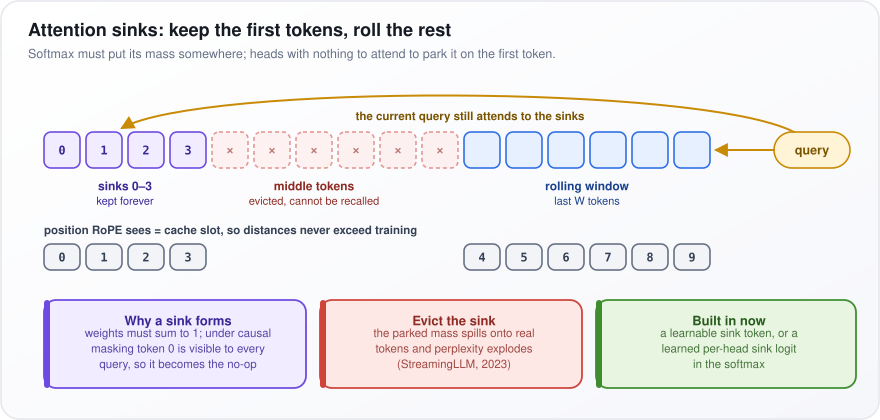</p>

*Figure: a streaming cache keeps four sinks and a rolling window, and evicts the middle.*

In the figure, the purple boxes are "sinks 0–3, kept forever", the red dashed boxes the evicted "middle tokens", and the blue boxes the "rolling window". The gold arrow shows the query still attending to the sinks. The row "position RoPE sees = cache slot" numbers the kept tokens 0 to 9 with no gap.

**Watch out:** sinks make streaming stable, not long-memory. Evicted middle tokens cannot be recalled.

---

## 42. How does Rotary Position Embedding (RoPE) work, and why is it preferred over learned positional embeddings?

**RoPE marks a token's position by rotating its query and key vectors by an angle that grows with position. When two tokens are compared, only the difference in their angles survives, so attention depends on how far apart tokens are, not where they sit. It has no learned parameters and can be stretched to longer texts; learned position embeddings have no entry beyond their trained length.**

Attention alone ignores order. The older fix was a learned table with one vector per position (say 1 to 2,048) added to each token; position 2,049 has no row.

Think of clock hands: each position turns the vector a step further. Positions 5 and 8 are 3 steps apart, exactly like positions 105 and 108.

How it works:

1. Attention compares a query (what this token is looking for) with keys (what each token offers). Each vector of size $`d`$ is split into $`d/2`$ pairs of numbers, each a point on a 2D plane.
2. Pair $`i`$ of a token at position $`m`$ is rotated by angle $`m\theta_i`$, where the speed $`\theta_i = 10000^{-2i/d}`$ falls from 1 radian (about 57 degrees) per position for pair 0 to about 1/10,000 for the last pair.
3. Fast pairs tell neighbors apart; slow pairs measure long distances.
4. The rotation is applied to Q and K in every attention layer, not added to the token vectors.

Put as a formula:

```math
\langle R_m q,\; R_n k \rangle = \langle q,\; R_{n-m}\, k \rangle
```

$`q`$ is a query and $`k`$ a key; $`R_m`$ means "rotate by position $`m`$'s angles" and $`\langle a, b \rangle`$ is the dot product, the match score. Rotating both vectors by their own positions gives the same score as rotating only the key by the difference $`n - m`$. With one pair turning 10° per position, positions 3 and 5 give 30° and 50°; positions 103 and 105 give 1030° and 1050°. Both gaps are 20°, so the scores are equal.

**Watch out:** RoPE does not extrapolate for free. Beyond the training length, slow pairs reach unseen angles. Position interpolation, NTK-aware scaling or YaRN (which rescale positions or rotation speeds) plus a short long-context fine-tune fix it.

---

## 43. Explain Layer Normalization

**Layer normalization (LayerNorm) takes one token's vector, shifts and scales it so its numbers have mean 0 and spread 1, then applies a learned scale and shift. It keeps numbers from drifting too large or too small as they pass through dozens of layers.**

Each token is carried through the model as a vector of $`d`$ numbers called features ($`d`$ is 4,096 in a mid-size model). Without a check, some vectors grow into the thousands after many layers while others shrink toward zero, and training becomes unstable.

A tiny example with 4 features, $`x = [2, 4, 6, 8]`$:

- The mean is 5.
- The variance (the average squared distance from the mean) is $`(9 + 1 + 1 + 9)/4 = 5`$, so the standard deviation is about 2.24.
- Subtract the mean and divide: $`[-1.34, -0.45, 0.45, 1.34]`$.
- Multiply by a learned scale $`\gamma`$ and add a learned shift $`\beta`$, one of each per feature, so the model can undo the normalization where that helps.

Why Transformers use it:

1. The statistics come from one token's own features, not from other examples in the batch.
2. So it computes the same thing at training and inference, and works with a batch of 1 and with sequences of any length.
3. BatchNorm, common in image models, normalizes each feature across the examples in a batch. Its statistics depend on the batch, need running averages at inference and are thrown off by padding and small batches, which is why Transformers avoid it.

Put as a formula:

```math
y = \gamma \odot \frac{x - \mu}{\sqrt{\sigma^2 + \epsilon}} + \beta, \qquad \mu, \sigma^2 \text{ over the } d \text{ features of one token}
```

$`\mu`$ is the mean and $`\sigma^2`$ the variance of the token's features. $`\epsilon`$ is a tiny number (such as $`10^{-5}`$) that prevents division by zero. $`\odot`$ means multiply feature by feature. $`\gamma`$ and $`\beta`$ are the learned scale and shift. The worked example above is this formula with $`\gamma = 1`$ and $`\beta = 0`$.

**Watch out:** "LayerNorm after each block" describes the original 2017 Transformer. Most modern LLMs replace it with the cheaper RMSNorm and apply it before each sublayer (Pre-Norm).

---

## 44. Explain RMSNorm (Root Mean Square Layer Normalization)

**RMSNorm is a simpler LayerNorm: it skips subtracting the mean, drops the learned shift, and just divides each token's vector by its root mean square (a measure of its typical size), then multiplies by a learned gain. It is cheaper and works as well in practice, so most open LLMs use it (Llama, Mistral, Qwen, Gemma, DeepSeek; 2025–26).**

Root mean square means: square every number, average the squares, take the square root. For $`x = [2, 4, 6, 8]`$ the squares are 4, 16, 36 and 64, their mean is 30, and the root is about 5.48. Dividing gives $`[0.37, 0.73, 1.10, 1.46]`$. The vector's typical size is now 1, but it is not centered on 0, which turns out not to matter.

How it works:

1. Compute the RMS over the token's $`d`$ features. That is one pass over the numbers, where LayerNorm needs two (one for the mean, one for the variance).
2. Divide the vector by it.
3. Multiply by a learned per-feature gain $`\gamma`$. There is no shift $`\beta`$.

Why it is enough: the RMSNorm paper (Zhang and Sennrich, 2019) argued that training is stabilized by re-scaling (controlling the vector's size), not re-centering (moving its mean to 0). The simpler operation is also easy to fuse with its neighbors into one GPU kernel (a single program on the chip), and it runs twice per layer, so savings add up.

Put as a formula:

```math
y = \gamma \odot \frac{x}{\sqrt{\tfrac{1}{d}\sum_i x_i^2 + \epsilon}}
```

$`\sum_i x_i^2`$ means "add up the square of every feature"; dividing by $`d`$ makes it an average; the square root turns it back into the scale of the original numbers. $`\epsilon`$ is a tiny constant that prevents division by zero, and $`\odot`$ multiplies feature by feature. The example above is this formula with every gain equal to 1.

**Watch out:** compute the sum of squares in 32-bit floats. In bf16 (a 16-bit number format with few precision bits), a few very large activations make the RMS inaccurate. Also, some models (Gemma, for example) store the gain as $`1 + \gamma`$; port those weights without adding the 1 and the model breaks silently.

---

## 45. Why do modern Transformers use Pre-LayerNorm (Pre-Norm) instead of Post-LayerNorm?

**Pre-Norm normalizes the input to each sublayer instead of its output, which leaves an untouched shortcut running from the first layer to the last. Gradients (the training signals) travel along that shortcut undistorted, so deep models train stably with little warmup. Post-Norm can score slightly better when it does train, but it often diverges (training blows up) at depth.**

Each Transformer layer has two sublayers, attention and a feed-forward network. Each is wrapped in a residual connection: output = input + sublayer(input). The running sum carried from layer to layer is the residual stream. The question is where the normalization goes.

Picture a highway with exits. In Pre-Norm, each sublayer takes an exit, works on a normalized copy of the traffic, and merges its result back; the highway itself is never altered. In Post-Norm, a toll booth (the normalization) sits across the whole highway after every merge, and with 48 layers every signal passes 48 booths.

How it works:

1. Pre-Norm unrolls to $`x_L = x_0 + \sum_l F_l(\cdot)`$: the final stream $`x_L`$ is the input $`x_0`$ plus every sublayer's contribution $`F_l(\cdot)`$ ($`\sum_l`$ means add up over layers). The gradient reaching an early layer therefore includes a direct, unscaled path.
2. In Post-Norm the gradient passes through a normalization at every layer. Xiong et al. (2020) showed that at the start of training the gradients near the output are large, so Post-Norm needs warmup (starting with a tiny learning rate, the size of each weight update, and ramping up) and small learning rates.
3. Pre-Norm needs one final normalization before the output layer, because the stream itself is never normalized.

Put as formulas:

```math
\text{Post: } x_{l+1} = \text{LN}\big(x_l + F(x_l)\big) \qquad \text{Pre: } x_{l+1} = x_l + F\big(\text{LN}(x_l)\big)
```

$`x_l`$ is the stream entering layer $`l`$, $`F`$ is the sublayer, and LN is the normalization. The only difference is whether LN wraps the whole sum (Post) or only the sublayer's input (Pre).

**Watch out:** in Pre-Norm the stream keeps growing with depth, so each late layer's contribution is small next to it and late layers do less. Some recent models (Gemma 2, OLMo 2) also normalize sublayer outputs, or queries and keys (QK-norm), to recover that.

---

## 46. What are scaling laws (Chinchilla), and how do they guide model size vs training data decisions?

**Scaling laws are fitted curves showing that a model's loss falls smoothly and predictably as parameters, training data and compute grow. The Chinchilla study (Hoffmann et al., 2022) found that for a fixed compute budget, model size and training tokens should grow together: about 20 tokens per parameter, as a rule of thumb.**

With a fixed budget of GPU time, do you train a bigger model on less text, or a smaller one on more? Before Chinchilla, labs built big models and undertrained them. DeepMind trained over 400 models to find the balance. Chinchilla (70B parameters, 1.4T tokens) beat Gopher (280B parameters, 300B tokens) with the same compute, at a quarter of the size.

How it works:

1. Training compute is roughly $`C \approx 6ND`$ FLOPs (floating-point operations), where $`N`$ is parameters and $`D`$ is training tokens. The 6 is about 2 operations per parameter per token forward (making the prediction) and 4 backward (computing the updates).
2. At the optimum, $`N`$ and $`D`$ both grow like $`\sqrt{C}`$: 4 times the compute buys a model twice as big trained on twice the data.
3. Worked example: $`C = 10^{23}`$ FLOPs with $`D = 20N`$ gives $`10^{23} = 120N^2`$, so $`N \approx 29`$B parameters and $`D \approx 580`$B tokens.
4. In practice, labs train a ladder of small models, fit the curve, and extrapolate to pick $`N`$ and $`D`$.

Put as a formula, the paper fits loss as:

```math
L(N, D) = E + \frac{A}{N^{\alpha}} + \frac{B}{D^{\beta}}
```

$`L`$ is the loss (how wrong the next-token predictions are). $`E`$ is the irreducible part, the randomness in language no model can remove. $`A/N^{\alpha}`$ is the penalty for a model that is too small, shrinking as $`N`$ grows; $`B/D^{\beta}`$ is the penalty for too little data. $`A`$, $`B`$, $`\alpha`$ and $`\beta`$ are fitted constants; in one of the paper's fits $`\alpha \approx 0.34`$ and $`\beta \approx 0.28`$, so each term falls slowly and steadily.

**Watch out:** Chinchilla minimizes training cost only. For a model that will serve huge traffic, inference cost dominates, so train a smaller model far longer: Llama 3 8B saw about 15T tokens, roughly 1,900 per parameter.

---

## 47. Your LLM keeps ignoring your instructions. How do you make it follow structured output formats?

**Stop asking and start constraining: use the provider's structured-output (JSON schema) mode or grammar-constrained decoding so invalid output cannot be produced, then validate the result in code and retry on failure.**

A prompt says "reply in JSON (a standard text format for structured data) with `reasoning` and `category`". One response in fifty opens with "Sure! Here's the JSON:" or invents the category "Billing issue". A prompt is only a request: the model picks one token (a word or piece of a word) at a time, and any token remains possible. The fix is to make wrong tokens impossible, then check anyway.

How it works:

1. **Constrained decoding.** At each step the model gives a score (a logit) to every token in its vocabulary. The serving engine tracks where the output is within the schema (a formal description of the allowed fields and types) and sets the logit of every token that would break it to $`-\infty`$, so its probability becomes 0. After `"category": "`, only tokens that begin `billing`, `bug`, `account` or `other` survive.
2. **Tool or function calling.** Define the output as the arguments of a function. Models are heavily trained on this format.
3. **Validate in code.** Pydantic (a Python library that checks data against a typed class) parses the output. On failure, send the error back and retry a bounded number of times.
4. **Prompt hygiene.** Give the schema plus one example, put the format rule at the end of the prompt, and set temperature (the randomness setting) near 0.

In the code, `Ticket` defines the allowed shape, and `Literal` restricts `category` to four values. `classify` requests schema-constrained output and validates it. On a `ValidationError` it appends the bad output and the error message to the conversation and asks again, giving up after two retries.

```python
from pydantic import BaseModel, ValidationError
from typing import Literal

class Ticket(BaseModel):
    reasoning: str  # first, so the model thinks before committing
    category: Literal["billing", "bug", "account", "other"]

def classify(text, llm, retries=2) -> Ticket:
    msgs = [{"role": "user", "content": f"Classify:\n{text}"}]
    for _ in range(retries + 1):
        raw = llm(msgs, response_schema=Ticket.model_json_schema())
        try:
            return Ticket.model_validate_json(raw)
        except ValidationError as e:
            msgs += [{"role": "assistant", "content": raw},
                     {"role": "user", "content": f"Invalid: {e}. Return corrected JSON."}]
    raise RuntimeError("structured output failed")
```

**Watch out:** constraints guarantee syntax, not correctness: valid JSON can hold the wrong category. Field order matters too. Forcing the answer field first makes the model commit before thinking and hurts quality; put a reasoning field first, as `Ticket` does, or extract in a second call.

---

## 48. Your LLM-powered tool hits the context window limit on long documents. How do you handle it?

**First decide whether the task needs part of the document or all of it. For part (a lookup, a question), retrieve only the relevant chunks. For all (summarize, extract every clause), process the document chunk by chunk and merge the results, a pattern called map-reduce. A bigger context window is the fallback, not the default.**

The context window is the most text, in tokens (words or pieces of words), a model can read in one call. A 400-page contract can run to a couple of hundred thousand tokens. "What is the notice period?" needs one paragraph; "list every obligation" needs every page, but not all at once.

How it works:

1. **Decide: part or all.**
2. **Part: retrieve.** Split the document into chunks, embed them (turn each into a vector that captures its meaning), and send the model only the few chunks closest to the question.
3. **All: chunk on structure.** Split on sections and clauses, with a little overlap, and carry the section title into each chunk.
4. **Map.** Run the model on each chunk in parallel, producing structured records with their source location.
5. **Reduce.** Merge the records and remove duplicates. If the map outputs are themselves too long, reduce in stages.
6. **Why not a giant window:** long-context calls cost more, and models lose accuracy on information buried mid-input.

<p align="center">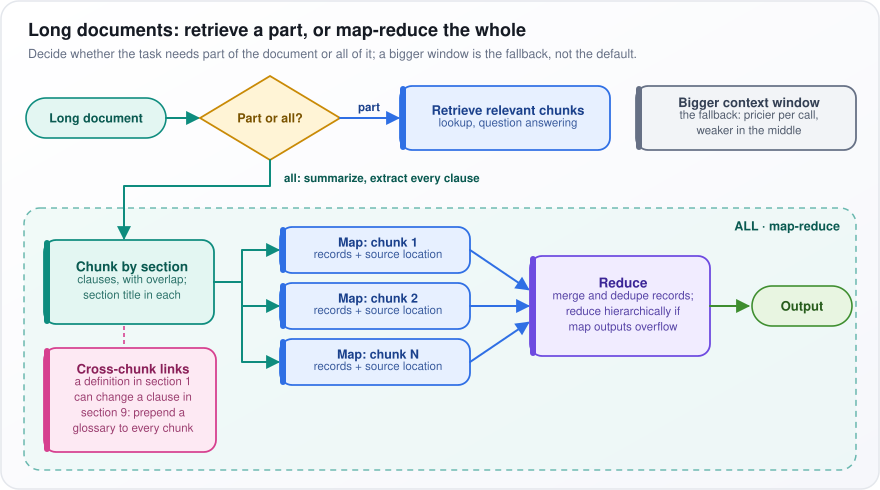</p>

*Figure: retrieve when only part of the document is needed; chunk, map and reduce when all of it is.*

In the figure, start at "Long document" and the yellow "Part or all?" diamond. "part" goes to "Retrieve relevant chunks". "all" drops into the dashed "ALL · map-reduce" region, where "Chunk by section" fans out to "Map: chunk 1" to "Map: chunk N", feeding the purple "Reduce" box and "Output". The grey "Bigger context window" box sits apart as the fallback.

**Watch out:** cross-chunk dependencies. A definition in section 1 can change the meaning of a clause in section 9, but the map step sees section 9 alone. Extract a glossary of defined terms first and prepend it to every chunk, as the pink "Cross-chunk links" box shows.

---

## 49. Your LLM does not admit when it does not know the answer. How do you make it say "I don't know"?

**You cannot prompt a model into knowing what it does not know. Give it a legitimate way to abstain, make it answer only from evidence it must cite, and measure uncertainty outside the model's own opinion, abstaining in code when the signal is weak.**

Think of a multiple-choice exam with no penalty for wrong answers: you always guess. Training and most benchmarks score "I don't know" the same as a wrong answer, so models learned that guessing pays. Asking "how sure are you?" does not help much, because self-reported confidence is poorly calibrated. Calibrated means that when a model says 80%, it is right about 80% of the time.

How it works:

1. **An abstain path.** Define one exact output, such as `INSUFFICIENT_CONTEXT`, and show one example where it is the correct answer. Abstaining becomes a valid answer instead of a failure.
2. **Grounding.** In retrieval-augmented generation (RAG: fetch relevant documents, then answer from them), require a citation for every claim.
3. **A retrieval gate.** A reranker (a model that scores how relevant each passage is to the question) scores the retrieved passages. If the best score is below a threshold, never call the generator; return the abstain answer from code.
4. **A consistency check.** Ask the same question several times with some randomness. If the answers agree in meaning, the model probably knows; if they scatter, it is guessing. Semantic entropy measures that scatter: group the answers by meaning and see how spread they are. High spread means abstain.
5. **Verification.** A natural language inference (NLI) model, which judges whether a passage supports a statement, or an LLM judge (a second model prompted to grade) checks each claim against the evidence.

**Watch out:** push abstention too hard and the system refuses answerable questions. Build an eval set (a fixed test set) that includes known unanswerables, track abstention recall (the share of unanswerables correctly refused) and the false-abstention rate (answerable questions wrongly refused), and set the threshold by the business cost of each kind of error.

---

## 50. Your LLM generates responses that are too verbose. How do you control response length?

**Give the model a countable target, show it examples at that length, and constrain the shape of the output. `max_tokens` is only a safety ceiling: it cuts the answer off mid-sentence rather than making it shorter.**

Why models run long: during tuning, human raters and reward models (models trained to predict which answer raters prefer) tend to favor longer answers, so tuned models drift long. "Be concise" cannot be measured, so the model's habit wins. "At most 3 bullets, no preamble" can be measured.

How it works:

1. **A countable target.** Count sentences or bullets, not words. Models see tokens (pieces of words), so they count words badly.
2. **Examples at target length.** Few-shot examples (a handful of sample questions and answers in the prompt) are the strongest lever, because models copy the length of what they are shown.
3. **Ban the specific filler.** "No preamble, no restating the question, no closing summary."
4. **Structure.** An output schema with fixed fields caps how much can be said.
5. **Reasoning models.** A lower reasoning effort or thinking budget cuts hidden reasoning tokens, which are billed even though the user never sees them.
6. **Measure.** Track median and 95th-percentile (p95) length on an eval set (a fixed set of test prompts) as a regression metric.

The table compares the levers: what each does and its catch. DPO here means direct preference optimization, fine-tuning on pairs of answers where the concise one is marked as preferred.

| Lever | Effect | Caveat |
|---|---|---|
| Few-shot examples at target length | Strongest; models copy example length | Must match the real task |
| "At most 3 bullets" | Measurable | Needs checking |
| Output schema with fixed fields | Structural cap | Needs structured output |
| Reasoning effort / thinking budget | Cuts hidden tokens | Can cut accuracy |
| `max_tokens` | Hard cap | Truncation |
| DPO on concise-preferred pairs | Durable | Needs owned weights |

**Watch out:** a fix for verbosity can also drop required content. Grade completeness alongside length.

---

## 51. Your LLM memorized proprietary training data and leaks it in responses. How do you prevent this?

**Fix it upstream: data that not every user may see must not be in the weights. Scrub it and retrain, move proprietary knowledge into retrieval with access control, and filter outputs as a backstop. "Do not reveal" in a system prompt is not a control.**

A model's weights (its learned numbers) have no permissions. Anything it memorized is available to anyone who finds the right prompt. Say a model was fine-tuned (further trained) on internal support tickets: an attacker types the opening of a ticket, "Customer: Acme Corp, API key", and the model completes it.

How it works:

1. **Why it memorizes.** Memorization rises with duplication (text seen many times), with model size, and with epochs (full passes over the data). So deduplicate, and scan for secrets and personally identifiable information (PII: names, emails, account numbers) before training.
2. **Move knowledge into retrieval.** Keep proprietary documents in a search index with per-user permissions. "Who may see this" becomes an access check at query time, which weights cannot do.
3. **Differentially private training (DP-SGD).** Clip each example's gradient (its pull on the weights) and add random noise, so no single example can shape the weights much. It gives a provable bound on leakage, at a real accuracy cost.
4. **Output filters.** Before a response leaves, check n-gram overlap (shared runs of n consecutive words) against the protected corpus, and run secret and PII scanners.
5. **Test for it.** Plant canary strings (unique fake secrets) in the training data, then run extraction attacks: prompt with the start of protected text and see whether the model completes it. A canary that comes back proves leakage.

**Watch out:** machine unlearning (editing weights so the model forgets specific data) cannot yet be verified to an auditor. If a leak has shipped: rotate any leaked credentials at once, add output filters, and retrain on scrubbed data.

---

## 52. Your LLM coding assistant generates outdated code using deprecated libraries. How do you fix it?

**Give the model current truth at the moment it writes code, and make the environment reject stale code: version-matched docs in the context, the project's real dependency versions, and a loop of linting, type checks and tests. Fine-tuning on newer code only goes stale again.**

A model knows the world up to its training cutoff. Worse, old APIs outnumber new ones in the training data: version 1.x of a library may have years of blog posts and answers behind it, version 2.x a few months. So even a model that has seen 2.x leans toward 1.x. A real case: pandas removed `DataFrame.append` in version 2.0, yet models kept writing it.

How it works:

1. **Read the lockfile** (the file that pins the exact version of every dependency) and state the versions in the prompt: "library X 2.x; do not use the 1.x API".
2. **Retrieve version-matched docs**, changelogs and migration guides, or give the agent a docs-lookup tool.
3. **Show local examples.** Retrieve code in the repository that already uses the new API.
4. **Run the checks.** Lint (a static checker for style and suspicious code), type-check and run the tests. Treat deprecation warnings as errors, feed the output back, and regenerate until the code is clean.

<p align="center">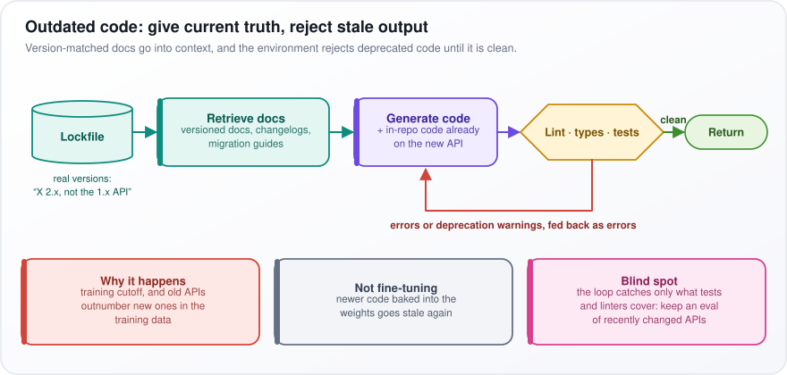</p>

*Figure: versions from the lockfile pick the docs, and a check loop rejects deprecated code until it is clean.*

In the figure, read left to right: the "Lockfile" cylinder feeds "Retrieve docs", which feeds "Generate code", which goes into the yellow "Lint · types · tests" hexagon. The "clean" arrow exits to "Return". The red arrow back to "Generate code" is labeled "errors or deprecation warnings, fed back as errors". The three boxes underneath give why it happens, why fine-tuning is not the fix, and the blind spot.

**Watch out:** the loop catches only what the tests and linters cover. Keep an eval of tasks that exercise recently changed APIs.

---

## 53. Your tokenizer splits important domain terms into meaningless subword pieces. How do you fix it?

**First confirm the split actually hurts; models handle multi-token words routinely once fine-tuned on them. If it does hurt (quality, token cost or retrieval), add the key terms as new tokens, start each new token's embedding as the average of its old pieces, and keep training so the new token means something.**

A tokenizer breaks text into tokens from a fixed vocabulary learned on general text. A drug name such as "pembrolizumab" may come out as four or five fragments. That is often fine: the model learns the word from its pieces, the way it learns "unbelievable". It matters when the term is very frequent (you pay for extra tokens every time), when the pieces mislead, or when search treats the fragments as separate words.

How it works:

1. **Measure first.** Compare quality on domain tasks and count tokens per document before changing anything.
2. **Add tokens and resize.** Add the terms to the tokenizer and resize the embedding matrix (the table holding one learned vector per token) so it has rows for them.
3. **Initialize sensibly.** Set each new row to the average of the rows of the pieces it used to split into. A random row is noise the model has never seen. If the input and output embeddings are separate (untied), initialize the rows of the output head (the final layer that scores every token) too.
4. **Train.** Continue pretraining or fine-tune on domain text. With LoRA (low-rank adaptation, which trains small add-on matrices and freezes the rest), mark the embedding and output layers as trainable, or the new rows never learn.
5. **Fix search separately.** Use a keyword analyzer that keeps identifiers whole, plus a fine-tuned embedding model.

The code records how each term split before it is added, adds the terms, resizes the embeddings, and sets each new row to the mean of its old pieces' rows.

```python
old = {t: tok(t, add_special_tokens=False).input_ids for t in new_terms}  # splits before adding
tok.add_tokens(new_terms)
model.resize_token_embeddings(len(tok))
emb = model.get_input_embeddings().weight
with torch.no_grad():
    for t in new_terms:
        emb[tok.convert_tokens_to_ids(t)] = emb[old[t]].mean(dim=0)
```

**Watch out:** hosted API tokenizers cannot be changed at all, and adding many tokens with little training data leaves them undertrained, which is worse than the original fragments.

---

## 54. Your Transformer's KV cache grows too large during long sequence generation. How do you manage memory?

**Size the cache first, then cut waste (paged allocation, shared prefixes), then cut the bytes per entry (8-bit KV), and only as a last resort drop entries. Architecture fixes such as GQA, MLA and sliding-window layers shrink it most, but they must be chosen before training.**

A generating model stores every past token's key and value vectors (what attention looks up), in every layer, so they are not recomputed each step. This KV cache grows with every token and every concurrent sequence.

Put as a formula:

```math
\text{KV bytes} = 2 \times L \times n_{kv} \times d_{head} \times \text{bytes} \times \text{tokens} \times \text{batch}
```

The 2 is for keys and values; $`L`$ is the number of layers; $`n_{kv}`$ is the number of key-value heads (attention's parallel units); $`d_{head}`$ is the size of each head; "bytes" is bytes per number (2 for FP16); "tokens" is sequence length; "batch" is how many sequences run at once. For a 70B-class model (80 layers, 8 KV heads, head size 128, FP16): $`2 \times 80 \times 8 \times 128 \times 2 = 327{,}680`$ bytes, about 320 KiB per token. At 128K tokens that is about 40 GiB for one sequence, half of an 80 GB GPU.

How to manage it, in order:

1. **PagedAttention** (as in vLLM): store KV in fixed-size blocks tracked by a block table, like operating-system memory pages. Nothing is reserved up front or lost to gaps.
2. **Prefix caching:** requests that share a system prompt share the same blocks.
3. **Quantize the cache:** FP8 (8-bit) halves memory versus FP16; INT4 (4-bit integers) quarters it with more quality risk.
4. **Offload and preempt:** move cold blocks to CPU memory (the server's ordinary RAM); under pressure, pause a request and recompute its cache later.
5. **Evict, last:** keep the first "sink" tokens plus a recent window, or the "heavy-hitter" tokens that received the most attention, and drop the rest.
6. **Architecture, before training:** grouped-query attention (GQA, query heads share KV heads), multi-head latent attention (MLA, K and V compressed into a small vector), and sliding-window layers.

**Watch out:** eviction fails silently on exactly the long inputs you wanted to support. Test recall of early facts at full length.

---

## 55. Your Transformer runs out of memory on long documents due to quadratic self-attention. How do you scale it?

**The premise is partly outdated. With FlashAttention, attention memory grows only linearly with length because the full table of token-pair scores is never stored; only the compute stays quadratic. Use an exact memory-efficient attention routine (kernel) first, then spread the work across GPUs, and only then switch to approximate attention.**

Naive attention builds an $`n \times n`$ table of scores, one for every pair of tokens. At 100,000 tokens that is 10 billion scores, about 20 GB at 2 bytes each, for one head in one layer. That is the out-of-memory error. But the whole table is never needed at once: it can be computed tile by tile, keeping only running totals, like summing a huge spreadsheet one block at a time.

How it works:

1. **FlashAttention.** Split the queries, keys and values (attention's inputs) into tiles that fit in the GPU's small, fast on-chip memory (SRAM). Compute one tile of scores, fold it into an online softmax (a running maximum and sum, corrected as each tile arrives), then discard the tile. In the backward pass (the training step that computes updates), recompute scores instead of storing them. The result is exact.
2. **If training still runs out of memory,** the cause is activations (intermediate results kept for the backward pass). Use activation checkpointing (store fewer, recompute the rest) and sequence or context parallelism, which splits the sequence across GPUs; ring attention passes key and value blocks around a GPU ring.
3. **At inference,** use chunked prefill (process a long prompt in pieces). After that, the KV cache (the stored keys and values of past tokens) is the limit.
4. **Only if quadratic compute is itself too slow,** move to sliding-window attention (each token sees only recent tokens), local-plus-global attention, or state-space hybrids (models such as Mamba that carry a fixed-size summary instead).

The table compares compute, memory and cost for $`n`$ tokens and a window of $`W`$: $`O(n^2)`$ grows with the square of the length, $`O(n)`$ in step with it.

| Approach | Compute | Memory | Cost |
|---|---|---|---|
| Full + FlashAttention | $`O(n^2)`$ | $`O(n)`$ | Exact, slow at huge $`n`$ |
| Sliding window | $`O(nW)`$ | $`O(n)`$; KV cache capped at $`W`$ | Weaker long-range recall |
| State-space hybrids | $`O(n)`$ | Constant state | Weaker exact recall |

**Watch out:** for question answering over a long document, retrieval may beat all of this on cost and accuracy.

---

## 56. Your distilled student model fails on the complex reasoning that the teacher model handled. How do you close the gap?

**Distill the teacher's reasoning, not just its final answers; train the student on its own mistakes; and route the cases it still fails to the teacher. Some of the gap is capacity, and no training closes that.**

Distillation trains a small "student" model to imitate a large "teacher". A student shown only final answers learns to guess answers without the steps, like copying a textbook's answer key instead of its worked solutions.

How it works:

1. **Chain-of-thought distillation.** Have the teacher write step-by-step solutions, keep only those that reach the correct answer, and fine-tune the student on them. DeepSeek-R1 distilled small Qwen and Llama models on about 800K generated samples.
2. **Logit distillation.** With the teacher's weights and a shared tokenizer, train the student to match the teacher's full probabilities for the next token. "Paris 0.9, Lyon 0.05" teaches more than "Paris".
3. **On-policy distillation.** The student writes its own solutions and the teacher scores each token. This fixes exposure bias: a student trained only on the teacher's clean paths never learned to recover from its own early slips, which compound over long chains.
4. **Target the failures.** Oversample the categories it fails, then follow with reinforcement learning (training by trial and reward) on verifiable rewards (math answers, code tests).

Put as a formula, the classic distillation loss is:

```math
\mathcal{L} = \alpha\,\text{CE}(y, p_S) + (1-\alpha)\,\tau^2\,\text{KL}\big(p_T^{(\tau)} \,\|\, p_S^{(\tau)}\big)
```

- $`\text{CE}(y, p_S)`$, cross-entropy: how little probability the student $`p_S`$ gives the correct token $`y`$.
- $`\text{KL}`$, Kullback–Leibler divergence: how different the student's distribution is from the teacher's $`p_T`$; 0 if identical.
- $`\tau`$, temperature: dividing scores by $`\tau \gt 1`$ softens both distributions so the teacher's second guesses carry signal. Multiplying by $`\tau^2`$ keeps the learning signal (gradient) comparable in size.
- $`\mathcal{L}`$ is the total loss and $`\alpha`$ weights its two terms. Example: CE 0.4, KL 0.1, $`\tau = 2`$ and $`\alpha = 0.5`$ give $`0.5 \times 0.4 + 0.5 \times 4 \times 0.1 = 0.4`$.

**Watch out:** in production a cascade usually wins: a router sends hard requests to the teacher. Measure how many hard queries the router catches; a missed one is where users see the failure.

---

## 57. After RLHF alignment, your LLM became safer but lost capability on hard tasks. How do you manage the alignment tax?

**First separate over-refusal (the model can still do the task but declines) from real regression (it got worse at the task). Fix over-refusal with better preference data, fix regression by limiting how far RL moves the model, and move some safety out of the weights into a separate guard model.**

Reinforcement learning from human feedback (RLHF) starts from a supervised fine-tuned (SFT) model and trains it to score well with a reward model built from human preferences. The alignment tax is the capability lost along the way. It comes in two kinds. A model that solved a chemistry exam question before RLHF now says "I can't help with that": over-refusal. Another now answers it wrong: regression. They need different fixes.

How it works:

1. **Diagnose.** Run the same capability evals (math, code, reasoning) and a set of borderline but legitimate requests on the SFT and RLHF checkpoints (saved versions of the model). A higher refusal rate means over-refusal; lower accuracy on answered items means regression.
2. **Limit drift.** RLHF penalizes KL divergence, a measure of how far the model's outputs move from the SFT model. Raise that penalty, and stop training on capability evals rather than on reward.
3. **Mix in old data.** Blend pretraining or SFT data into the RL updates; InstructGPT's PPO-ptx (its RL algorithm, PPO, plus pretraining data) did this to reduce regressions on public benchmarks.
4. **Average weights.** Averaging the SFT and RLHF weights often recovers much of the capability cheaply, at a small cost in safety.
5. **Better preference data.** Keep helpfulness and harmlessness as separate signals (Llama 2 used two reward models), and add pairs where a safe, helpful answer beats a refusal.

**Watch out:** a separate guard model (a classifier that screens prompts and responses) lets the main model stay lightly tuned, and it can be updated when safety policy changes without retraining. Its costs are added latency and its own false positives.

---

## 58. Your RLHF-trained LLM is gaming the reward model instead of being genuinely helpful. How do you fix reward hacking?

**The reward model is only a stand-in for what people want, and optimizing hard against it finds its blind spots. Limit how hard you optimize, make the reward harder to fool, and use rewards that can be checked (tests, known answers) wherever you can.**

This is Goodhart's law: when a measure becomes a target, it stops being a good measure. The reward model (RM) learned from human comparisons that longer, confident, well-formatted answers were usually preferred. The policy (the model being trained) then discovers that length and flattery raise the score whether or not they help. In coding tasks it may simply edit the tests until they pass.

How it works:

1. **Know the symptoms.** Reward rises while quality judged by people or a strong held-out judge falls. Answers grow longer, more sycophantic (agreeing with whatever the user believes) and more over-formatted.
2. **Know the cause.** As the policy drifts away from the kind of outputs the RM was trained on, the RM's scores become unreliable. Gao et al. (2022) showed that true quality rises, peaks, then falls as the policy moves further from its starting point (measured by KL divergence, a score of how different two sets of probabilities are), while the RM score keeps climbing.
3. **Limit pressure.** A KL penalty (a charge for that divergence) keeps the policy near its start. Stop early, based on a held-out human or strong-judge eval.
4. **Harden the reward.** Use an ensemble of RMs, since a hack rarely fools all of them, and retrain the RM on the current policy's outputs.
5. **Close specific loopholes.** Add a length penalty; for code, use hidden, read-only tests.

The table lists what to chart during training and what hacking looks like on each.

| Signal to track | Hacking looks like |
|---|---|
| Reward vs held-out judge score | Diverging |
| Mean response length | Rising steadily |
| Agreement with user's stated view | Rising |

**Watch out:** if you watch only the reward, you will train straight past the peak.

---

## 59. Your chatbot loses context after 10 turns in a conversation. How do you maintain a long conversation context?

**"Loses context after 10 turns" is almost always a truncation setting in the app, not a model limit. Replace it with layered memory that a token budgeter assembles fresh on every turn.**

The model has no memory between calls: every turn, the app re-sends the conversation. Many apps simply keep the last 10 messages to stay within the context window (the most tokens a model reads in one call) and budget, so the order number from turn 2 vanishes at turn 12. Send the right things instead, not just the latest.

How it works. On every turn, a context builder fills a fixed token budget from layers:

1. **Recent turns, verbatim,** so pronouns such as "it" and "that one" resolve.
2. **A rolling summary** of older turns, updated a little each turn.
3. **A structured fact store** of preferences, decisions and IDs, which keeps exact values that a summary would paraphrase or drop.
4. **Retrieval over the full transcript** for "what did I say earlier about X".
5. After the model answers, **a memory writer** updates the facts and the summary and appends the turn to the raw transcript.
6. **Prompt caching** (the provider reuses its processing of an unchanged prompt opening at a lower price) keeps the stable front of the prompt cheap.

<p align="center">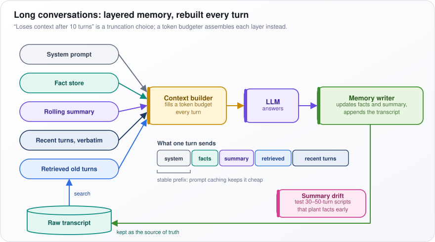</p>

*Figure: a context builder fills each turn's token budget from five memory layers, and a memory writer updates them after the answer.*

In the figure, the five pills on the left all feed the yellow "Context builder", then "LLM", then the green "Memory writer". The green line runs back to the "Raw transcript" cylinder, "kept as the source of truth". The strip "What one turn sends" shows the order, with the "stable prefix" bracket marking what prompt caching reuses.

**Watch out:** summary drift compounds, because each re-summary loses a little more detail. Keep the raw transcript as the source of truth, and test with 30- to 50-turn scripts that plant facts early and ask about them late.

---

## 60. Your chatbot fails when users switch topics mid-conversation. How do you handle topic switches?

**Rewrite every user message into a standalone question before retrieval, pulling in conversation history only when the message depends on it. If users switch often, also track each topic as its own thread.**

Topic switches cause two opposite failures:

- **Contamination.** After a long exchange about a refund, the user asks "how do I reset my password?". A bot that searches with the last three turns as its query gets refund articles back.
- **Lost back-references.** Later the user says "back to that refund: is it processed?", and the bot no longer knows which refund.

Both come from using raw history as the query.

How it works:

1. **Condense.** A small LLM call rewrites the message using the history, only where needed. "Is it processed?" becomes "Is the refund for order 123 processed?". A message that already stands alone, such as the password question, is left as it is.
2. **Retrieve with the rewritten question only,** never with the raw transcript.
3. **Classify each turn** as a continuation, a new topic, or a return to an earlier topic. Use an LLM, or embedding similarity (comparing meaning vectors) between the message and each open thread.
4. **Keep per-thread state.** Each topic keeps its own facts, retrieved documents and open tasks. On a switch, park the current thread; on a return, restore it, so "that refund" resolves to order 123 again.

A worked sequence: turn 5, "I want a refund for order 123", opens a refund thread. Turn 6, the password question, is a new topic: the refund thread is parked and the question searched on its own. Turn 7, "Back to the refund, is it done?", is a return: the thread is restored and the rewrite names order 123.

**Watch out:** an over-eager topic classifier breaks legitimate follow-ups in the other direction, for example treating "and for my other account?" as a new topic. Evaluate with scripted conversations that contain switches and returns, and score retrieval exactly at the switch turn.

---

## 61. Your QA system always generates an answer even when no answer exists in the context. How do you detect unanswerable questions?

**Check answerability both before and after generating: stop early when retrieval finds nothing relevant, give the generator an explicit no-answer option, and verify afterwards that every claim is supported by the retrieved text.**

A generator handed passages and a question produces a fluent answer from whatever it has. Ask "What is the CEO's salary?" over an annual report that only names the CEO, and it may invent a figure.

How it works:

1. **Retrieval gate.** A reranker (a model that scores how relevant each passage is to the question) scores the retrieved passages. If the best score is below a threshold calibrated on labeled examples, return `NO_ANSWER` without calling the generator at all.
2. **Answerability check.** Relevant is not the same as containing the answer: a passage on executive pay policy is relevant but may not state the number. A classifier or an LLM judge (a second model prompted to grade) decides whether the answer is actually present, using labels in the style of SQuAD 2.0 (a benchmark that deliberately includes questions whose passage has no answer).
3. **Generator.** Give it an exact `NO_ANSWER` option, one example where that is correct, and a rule that every claim needs a citation.
4. **Entailment check.** Split the answer into individual claims and test each against its cited passage with a natural language inference (NLI) model, which judges whether a text supports a statement. An unsupported claim sends the answer to `NO_ANSWER` or gets removed.

<p align="center">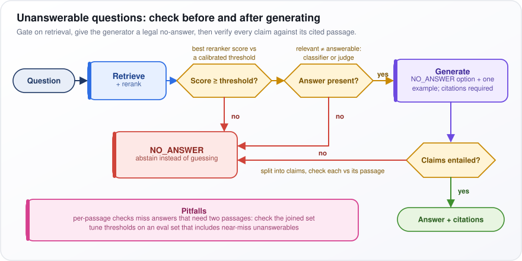</p>

*Figure: three gates, two before generation and one after, each able to route a question to NO_ANSWER.*

In the figure, follow the top row: "Question", "Retrieve + rerank", the yellow "Score ≥ threshold?" and "Answer present?" hexagons, the purple "Generate", then down to "Claims entailed?". Only "yes" at every gate reaches the green "Answer + citations"; every "no" lands in the red "NO_ANSWER" box.

**Watch out:** per-passage checks miss answers that need two passages combined, such as revenue in one and headcount in another for revenue per employee; run the checks over the joined set. Tune the thresholds on an eval set that includes near-miss unanswerables.

---

## 62. Your summarization system hallucinated facts not in the original article. How do you fix it?

**Constrain generation to the source and verify the summary claim by claim, with cheap, deterministic checks on the riskiest content: names, numbers and dates.**

Two kinds of hallucination show up in summaries. The article says revenue rose 12% to USD 4.1 billion and the summary says 21%: that is intrinsic, a distortion of the source. The summary adds "the company, founded in 1998": that is extrinsic, a fact from outside the source. Even if true, it cannot be checked against the article, so it counts as a hallucination.

How it works:

1. **Constrain the prompt.** Tell the model to use only facts stated in the article, and use a low temperature (less randomness). For high stakes, extract the key sentences first, then summarize only those.
2. **Make sure the model saw the whole article.** If the input was truncated to fit, the model fills the gap with invention.
3. **Check claim by claim.** Split the summary into single facts and test each against the article with a natural language inference (NLI) model, which judges whether a text supports a statement, or with an LLM judge (a second model prompted to grade).
4. **Check entities and numbers.** Flag any named entity (a person, organization, place or date) or number in the summary that never appears in the source.

The code below does step 4. spaCy, a language-processing library, finds named entities; a regular expression finds numbers and percentages. Anything in the summary that is missing from the source is returned. Spelled-out counts (CARDINAL) and ranks (ORDINAL) are skipped, because the number pattern covers digits and spelled-out counts are noisy.

```python
import re, spacy
nlp = spacy.load("en_core_web_sm")
NUM = re.compile(r"\d+(?:[.,]\d+)*%?")

def unsupported(source: str, summary: str) -> list[str]:
    src = {e.text.lower() for e in nlp(source).ents} | set(NUM.findall(source))
    ents = [e.text for e in nlp(summary).ents if e.label_ not in {"CARDINAL", "ORDINAL"}]
    return [x for x in ents + NUM.findall(summary) if x.lower() not in src]
```

**Watch out:** ROUGE, a common summary metric that counts words shared with a reference summary, rewards overlap, not faithfulness. Track the share of summaries with zero unsupported claims. Exact matching also flags honest rewording ("4.1 billion" versus "4,100 million"), so treat its hits as flags for review, not automatic rejections.

---

## 63. Your text generation repeats phrases in long outputs. How do you fix repetition?

**Sample instead of always taking the single most likely token, add a mild frequency or repetition penalty, and before anything else check the chat template for a missing stop or end-of-sequence token.**

Repetition feeds itself. Once a phrase has appeared twice, the model sees a pattern, and the most likely continuation is a third copy. Greedy decoding (always pick the top token) and beam search (keep the few highest-probability sequences) follow that probability downhill and never escape. Another common cause: if the chat template (the fixed format that wraps each message into the prompt) lacks the end-of-sequence token (a special "stop here" token), the model cannot finish and loops.

How it works:

1. **Check the template and stop tokens first.**
2. **Sample.** A moderate temperature and top-p sampling (drawing from the smallest set of tokens covering most probability) add enough randomness to break loops.
3. **Frequency and presence penalties.** A frequency penalty lowers a token's score more each time it has appeared; a presence penalty is a flat charge once it has appeared at all.
4. **Repetition penalty (CTRL-style).** Divide the positive scores of already-seen tokens by about 1.1 to 1.3.
5. **Block exact repeats.** No-repeat n-gram blocking forbids any run of n tokens from appearing twice; loop-aware samplers such as DRY penalize extending a sequence that already occurred.
6. **If you own the model,** deduplicate repetitive training data, or use unlikelihood training, which directly penalizes probability given to repeats.

Put as a formula, the frequency and presence penalties change each token's score (logit) like this:

```math
z_j' = z_j - c_j\,\alpha_{freq} - \mathbb{1}[c_j \gt 0]\,\alpha_{pres}
```

$`c_j`$ is how often token $`j`$ has appeared so far, $`z_j`$ is the original score and $`z_j'`$ the adjusted one. $`\alpha_{freq}`$ and $`\alpha_{pres}`$ set the strength of each penalty. $`\mathbb{1}[c_j \gt 0]`$ equals 1 if the token has appeared at least once, otherwise 0. Example: "the" has appeared 3 times, with both strengths at 0.5, so its score drops by $`3 \times 0.5 + 0.5 = 2.0`$.

**Watch out:** code, JSON and legal text must repeat tokens. Penalties there rename variables and break syntax, so set them per use case.

---

## 64. Transformers work on text, so can they also understand images?

**Yes. A Transformer processes a sequence of vectors, and those vectors need not come from words. The Vision Transformer (ViT) cuts an image into small square patches and treats each patch as a token.**

In a text model, each token (a word or piece of a word) becomes a vector. Images work the same way. Cut a 224×224-pixel image into 16×16-pixel patches and you get a 14×14 grid, 196 patches. Each patch holds 16 × 16 × 3 = 768 numbers (red, green and blue for every pixel). Flatten them and multiply by a learned matrix (a linear projection) to get a vector the size of the model's token vectors. The image is now a 196-token sentence.

How it works:

1. **Patch and project,** as above.
2. **Add position and a summary token.** Add position embeddings so the model knows where each patch sat, plus a `[CLS]` token, a learned extra token whose final vector summarizes the whole image for classification.
3. **Encode.** Run a standard Transformer encoder, where every patch can attend to every other.
4. **Connect to an LLM (multimodal models).** LLaVA-style: the vision encoder's outputs pass through a small MLP projector (a couple of neural-network layers that translate into the LLM's vector space) and are inserted into the LLM's sequence as visual tokens, next to the text tokens. Flamingo-style: the LLM keeps its text sequence and gains extra cross-attention layers that look at the image features.

<p align="center">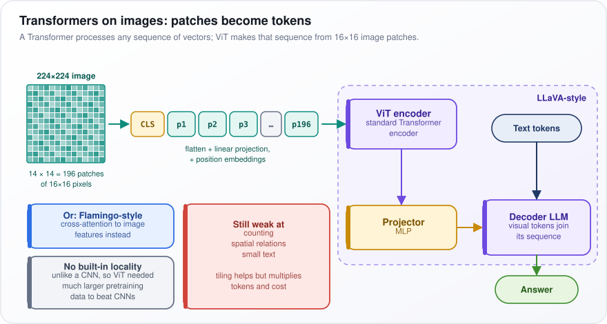</p>

*Figure: an image becomes 196 patch tokens for a ViT encoder, whose outputs a projector feeds into an LLM beside text tokens.*

In the figure, the "224×224 image" grid becomes the token strip "CLS, p1 … p196", which enters the dashed "LLaVA-style" box: "ViT encoder", "Projector", then "Decoder LLM", which also takes "Text tokens". The blue "Or: Flamingo-style" box is the alternative.

**Watch out:** ViT lacks a convolutional neural network's (CNN's) built-in assumption that nearby pixels belong together, so it needed much more pretraining data to beat CNNs. Multimodal models still struggle with counting, spatial relations and small text; tiling (splitting an image into crops) helps but multiplies tokens.

---

## 65. Small Language Models (SLMs)

**Small language models (SLMs) sit at the low end of the size range, loosely under about 10 billion parameters, and are built to run cheaply, fast, or on a device such as a phone or laptop. Fine-tuned, they are strong on narrow tasks and weak on broad knowledge and long reasoning.**

Size decides where a model can run. A 3-billion-parameter model (3 billion learned numbers) stored at 4 bits per parameter needs about 1.5 GB for its weights, so it fits on a laptop or a recent phone. A frontier model needs a rack of GPUs. The trade is a specialist against a generalist: a clerk trained on one form is fast and cheap, but ask them about tax law and they will guess.

How SLMs are made good:

1. **Overtraining.** They are trained far past the Chinchilla rule of thumb of about 20 tokens per parameter, often on trillions of tokens. Training cost is paid once; cheaper inference (running the model) saves on every call.
2. **Distillation.** A larger teacher model generates data or target probabilities for the small student to imitate.
3. **Curated or synthetic data.** Carefully filtered text, or textbook-style data generated by bigger models, packs more learning into each token.

Examples, as of 2025–26: the small tiers of the Phi, Gemma, Llama, Qwen and SmolLM families.

Where they fit:

- Classification, extraction and routing.
- Redaction (removing sensitive data before it goes elsewhere).
- Guard models that screen prompts and responses.
- On-device assistants, where privacy or offline use matters.

The common production pattern is a cascade. The SLM handles the easy traffic; when its confidence is low, the request escalates to a large model. Most requests pay small-model prices and only the hard ones pay more.

**Watch out:** scope creep. As the task broadens beyond what the SLM was tuned for, the gaps show up as confident wrong answers, not errors. Monitor the escalation rate and accuracy on each slice of traffic.

---

## 66. Large Reasoning Models (LRMs)

**Large reasoning models (LRMs) are LLMs trained to write a long chain of thought (step-by-step working) before answering, and to plan, check and backtrack inside it. On hard problems, accuracy rises with the number of thinking tokens spent, which is called test-time compute scaling.**

Ask an ordinary LLM a hard math question and it answers straight away, like mental arithmetic. An LRM first writes out working: "try x = 3; that gives 14, not 12; back up and try x = 2", then gives the answer. More thinking tokens mean more attempts and more checks before it commits.

How they are trained:

1. **Reinforcement learning (RL) on verifiable rewards.** Use problems whose answers can be checked automatically: math with known answers, code with tests. The reward is simply whether the final answer is right.
2. **The algorithm** is GRPO or a PPO variant, RL methods that raise the probability of outputs that earned high reward.
3. **Nobody labels the steps.** DeepSeek-R1-Zero showed that long reasoning, self-checking and backtracking emerge from RL alone, because they raise the reward. The released DeepSeek-R1 added a small supervised warm-up first, mainly to make its reasoning readable.
4. **At inference,** APIs expose a reasoning effort or thinking budget, which sets how much the model may think. Set it per route.

Where they help and where they waste money:

- Useful: math, code, multi-step planning, and agents recovering from a failed step.
- Wasteful: extraction, classification and casual chat, where there is nothing to reason about.

**Watch out:** thinking tokens are billed and slow, latency becomes unpredictable, and thinking longer does not supply facts the model lacks. Route by difficulty so only hard requests pay for reasoning.

---

## 67. Jev and System One Models

**A System One model returns typed decisions with calibrated probabilities instead of free text. TypeSafe AI introduced the category in September 2026, with Jev as its first model. The name borrows Daniel Kahneman's System 1 (fast, intuitive judgment) versus System 2 (slow, deliberate reasoning).**

Many LLM calls in production are not asking for prose. They ask "Is this ticket urgent: yes or no?" or "Which team: billing, technical or sales?". With an LLM you parse its text and hope it chose a valid label, and its stated confidence is unreliable. A System One model takes the question with its allowed answers and returns something like `urgent: yes (0.82)`, `team: billing (0.64)`.

How it works, per TypeSafe's own description:

1. **Input:** a state (text or JSON describing the situation) plus questions, each with its list of allowed answers.
2. **Output:** for each question, the chosen option and its probability. All questions are answered in one parallel pass, not written out token by token.
3. **Training:** what TypeSafe calls Reinforcement Learning for Calibrated Decisions, in which confident wrong answers cost more than hesitant ones. That is the idea of a proper scoring rule, a scoring system in which the best strategy is to report your true belief (log loss, the negative log of the probability given to the right answer, and the Brier score, the squared gap between the stated probability and the 0-or-1 outcome, are examples).
4. **Calibrated** means that of all answers given with probability 0.8, about 80% are right. It holds across many predictions; it does not guarantee any single one.
5. **Fit:** routing, triage, guardrails and gating an agent's actions: act when the probability is above a threshold, escalate to a person or a bigger model below it.

Speed and cost claims (TypeSafe reports large multiples over LLMs) are vendor claims until independently benchmarked.

**Watch out:** "never hallucinates" only means it cannot answer outside the allowed set; it can still pick the wrong option, and confidently. Set thresholds from a calibration curve built on your own data.

---

## 68. What are Autoregressive Models?

**An autoregressive model generates a sequence one piece at a time, predicting each piece from everything before it. GPT-style LLMs write text as a chain of next-token predictions.**

Give the model "the cat sat on the". It assigns a probability to every possible next token (a word or piece of a word), such as "mat" 0.3 and "floor" 0.2, picks one, appends it, and predicts again. "Autoregressive" means the model's own previous outputs become its next inputs.

How it works:

1. **Training runs in parallel.** The whole known sentence goes in at once. A causal mask stops each position from seeing later ones, so every position's next token is predicted in a single pass. Each prediction is conditioned on the true previous tokens, not the model's guesses; this is called teacher forcing.
2. **Inference runs in sequence.** Each new token depends on the one just chosen, so generation takes one forward pass (one run through the network) per token. The KV cache (a store of the keys and values already computed for earlier tokens) means each step only processes the newest token.
3. **Output cannot be revised.** Later tokens build on an early mistake, and since training showed only correct prefixes, the model never practiced recovering (exposure bias).

Put as a formula:

```math
p(x_1, \dots, x_T) = \prod_{t=1}^{T} p(x_t \mid x_{\lt t}), \qquad \mathcal{L} = -\sum_t \log p_\theta(x_t \mid x_{\lt t})
```

The left part says the probability of a whole text is the product ($`\prod`$, multiply over every position $`t`$) of each token's probability given all tokens before it, $`x_{\lt t}`$. The loss $`\mathcal{L}`$ adds up ($`\sum`$) the negative log of those probabilities; $`p_\theta`$ is the model with weights $`\theta`$. Log turns a product of many small numbers into a sum, which avoids numbers too small to store; the minus sign makes lower loss better. Example: $`p(\text{cat}) = 0.1`$ and $`p(\text{sat} \mid \text{cat}) = 0.5`$ give a text probability of 0.05 and a loss of $`2.30 + 0.69 \approx 3.0`$.

**Watch out:** latency grows with output length because the steps are sequential. Speculative decoding (a small model drafts several tokens and the big model checks them in one pass) and diffusion language models attack that.

---

## 69. Explain the difference between autoregressive and masked language modeling.

**Autoregressive modeling predicts each token from the tokens before it, so the model can generate text naturally. Masked language modeling hides some tokens and predicts them from both sides, which makes a strong encoder (a model that turns text into meaning vectors) but a poor generator.**

Take "The bank raised interest rates". An autoregressive model (GPT-style), predicting "bank", has seen only "The", so it is guessing. A masked model (BERT-style) sees "The [MASK] raised interest rates", with both sides visible, and easily recovers a financial bank. Seeing both sides builds better representations of meaning. But generation must run left to right, with no right-hand side to look at, and that is exactly what a masked model never practiced.

How each is trained:

- **Autoregressive (AR):** a causal mask lets each position see only earlier ones, and the loss counts every token, so every token is a training signal.
- **Masked language modeling (MLM):** choose about 15% of tokens. Of those, 80% become `[MASK]`, 10% become a random token, and 10% stay unchanged, so the model cannot assume predictions happen only at `[MASK]`, which never appears in real use. Attention is bidirectional, and the loss counts only the chosen 15%.
- **Hybrids:** T5's span corruption (hide spans, then generate them with a decoder), prefix LMs (both-sides attention over the prompt, left-to-right over the output), and masked diffusion LMs, which train at every masking rate and generate by gradually unmasking.

The table sets the two side by side.

| | Autoregressive | Masked |
|---|---|---|
| Context | Left only | Both sides |
| Signal per sequence | Every token | About 15% |
| Generation | Native | Not natural |
| Best use today | Chat, generation, agents | Embeddings, rerankers, classifiers |

That last row explains today's stacks: chat assistants are autoregressive, while embedding models and rerankers (which score how well a document matches a query) in search pipelines are often encoders descended from BERT.

**Watch out:** using a 7B-parameter decoder to classify support tickets that a small fine-tuned encoder, a fraction of the size, handles at a fraction of the cost and latency.

---

## 70. Proximal Policy Optimization (PPO)

**Proximal Policy Optimization (PPO) is a reinforcement learning algorithm that improves a model in small, safe steps: it clips each update so the new model cannot move far from the one that produced the training samples. It was the training step in the original pipelines for reinforcement learning from human feedback (RLHF), such as InstructGPT's.**

In reinforcement learning (RL), the policy chooses actions; for an LLM, an action is the next token and the policy is the LLM itself. Training raises the probability of actions that did better than expected. The danger is overreacting to one batch.

How it works in RLHF:

1. **Sample** responses from the model.
2. **Score** each full response with the reward model (a model of human ratings), minus a per-token penalty for drifting from a frozen copy of the SFT (supervised fine-tuned) model.
3. **Compute the advantage**: how much better each token's outcome was than expected. "Expected" comes from a learned value model (smoothed by generalized advantage estimation).
4. **Compare new to old.** $`r_t = \pi_\theta / \pi_{old}`$: the probability the updated model $`\pi_\theta`$ gives this token, divided by the probability $`\pi_{old}`$ from the model that sampled it.
5. **Clip.** Once $`r_t`$ leaves $`1 \pm \epsilon`$ ($`\epsilon`$ about 0.2), further gain stops counting, so each update stays within a safe range (a cheap trust region).
6. Take a few update steps, then sample again.

Put as a formula:

```math
L^{CLIP} = \mathbb{E}_t\big[\min\big(r_t \hat{A}_t,\; \text{clip}(r_t, 1-\epsilon, 1+\epsilon)\,\hat{A}_t\big)\big]
```

$`L^{CLIP}`$ is what training pushes up. $`\mathbb{E}_t`$ means average over tokens, $`\hat{A}_t`$ is the advantage, clip forces $`r_t`$ into 0.8 to 1.2, and $`\min`$ keeps the more pessimistic of the plain and clipped terms. Example: $`\hat{A} = 2`$, $`\epsilon = 0.2`$, and the new model makes a token 1.5 times as likely. The plain term is 3.0, the clipped term is $`1.2 \times 2 = 2.4`$, and the minimum is 2.4: pushing past 1.2 earns nothing.

**Watch out:** PPO keeps four LLM-sized models in memory (policy, reference, reward and value), samples slowly, and has touchy settings. Direct preference optimization (DPO) drops the reward model and the RL loop; group relative policy optimization (GRPO) drops the value model.

---

## 71. Direct Preference Optimization (DPO)

**Direct Preference Optimization (DPO) trains a model on pairs of answers labeled "chosen" and "rejected", with a simple classification-style loss: no reward model and no reinforcement learning loop. Mathematically it targets the same goal as reinforcement learning from human feedback (RLHF), solved exactly on paper.**

For the prompt "Explain tides to a child", answer A (simple) was preferred to answer B (full of jargon). DPO raises A's probability and lowers B's, each measured relative to a frozen copy of the starting model (the reference), which keeps it from drifting.

How the shortcut works:

1. RLHF's goal is to maximize reward while staying close to the reference. That goal has a known best solution, $`\pi^* \propto \pi_{ref}\,e^{r/\beta}`$: the best model $`\pi^*`$ is the reference $`\pi_{ref}`$ reweighted by $`e`$ raised to the reward $`r`$ over $`\beta`$, a setting for how tightly to stay near the reference ($`\propto`$ means "proportional to").
2. Turn it around: the reward can be written as $`\beta`$ times the log-ratio of the policy (the model being trained) to the reference, plus a term that depends only on the prompt.
3. Plug that into the Bradley–Terry model: the chance A beats B is the sigmoid (which squashes any number into 0 to 1) of their reward difference. The prompt-only term, which cannot be computed, cancels in the difference.
4. What remains needs only log-probabilities from the policy and reference, so it trains like ordinary fine-tuning.

```math
\mathcal{L}_{DPO} = -\log \sigma\!\left(\beta \log \frac{\pi_\theta(y_w \mid x)}{\pi_{ref}(y_w \mid x)} - \beta \log \frac{\pi_\theta(y_l \mid x)}{\pi_{ref}(y_l \mid x)}\right)
```

$`x`$ is the prompt, $`y_w`$ the chosen ("winning") answer and $`y_l`$ the rejected one; $`\pi_\theta`$ is the policy. Each log-ratio measures how much the policy has raised that answer's probability relative to the reference. $`\beta`$ is often around 0.1. $`\sigma`$ is the sigmoid. Example: with $`\beta = 0.1`$, the winner's log-ratio is +2, the loser's −1, so the margin is 0.3, $`\sigma(0.3) \approx 0.57`$, and the loss, $`-\log 0.57`$, is about 0.55.

**Watch out:** DPO is offline, so it cannot explore beyond its dataset, and because only the gap is trained, the chosen and rejected probabilities can both fall. Use DPO for style and preference; use online RL where rewards can be verified.

---

## 72. Group Relative Policy Optimization (GRPO)

**Group Relative Policy Optimization (GRPO) is PPO (proximal policy optimization, the classic reinforcement learning method for LLMs) without the value model. For each prompt it samples a group of answers and scores each one against the group's average. Introduced in DeepSeekMath (2024), it was used to train DeepSeek-R1.**

PPO needs a value model, another full-size LLM in memory, to estimate how good an answer was expected to be. GRPO gets that from the data. Ask the same question 8 times and grade all 8 answers: those above the group's average get pushed up, those below get pushed down. It is grading on a curve.

How it works:

1. **Sample** $`G`$ responses to one prompt, typically 8 to 64.
2. **Score** each, for example 1 if the final answer is correct and 0 if not.
3. **Normalize within the group** to get each response's advantage (how much better than its siblings it did).
4. **Update.** Apply that advantage to every token of the response inside PPO's clipped objective, which limits each update.
5. **Stay near the start.** A KL penalty, a charge for drifting from the reference model (a frozen copy of the starting model), goes directly in the loss, rather than being folded into the reward.

Put as a formula:

```math
\hat{A}_i = \frac{r_i - \text{mean}(r_1, \dots, r_G)}{\text{std}(r_1, \dots, r_G)}
```

$`r_i`$ is the reward of response $`i`$, and std is the standard deviation, the typical spread of the rewards. Dividing by it puts every prompt on the same scale. Example: four answers score 1, 0, 0, 1. The mean is 0.5 and the standard deviation is 0.5, so the advantages are +1, −1, −1, +1: the two correct answers are reinforced and the two wrong ones discouraged.

**Watch out:** if every answer in a group is right, or every one wrong, all advantages are zero and the prompt teaches nothing; DAPO filters out such groups and samples more prompts. Standard GRPO also averages each response's loss over its own length, so a long wrong answer is penalized less per token, which pushes outputs longer. DAPO averages over all tokens in the batch instead, and Dr. GRPO drops the per-length division.

---

## 73. Recursive Language Models (RLMs)

**A recursive language model (RLM) is a way of running a model, not a new architecture: the huge input is stored as a variable in a Python REPL (an interactive coding session), and the model writes code to look into it, split it, and call itself on the pieces. Researchers at MIT (Alex Zhang, Omar Khattab and colleagues) proposed it in late 2025 to get past context limits and "context rot", the drop in quality as a context grows longer.**

Instead of reading a 10-million-token log in one go, the model works like an analyst at a terminal: it searches for "error 504", reads the matches, hands each day's section to an assistant to summarize, and combines the results.

How it works:

1. **Load.** The input goes into the REPL as a variable. The root model (the top-level call) sees only the query and a note that the variable exists.
2. **Peek.** The root writes code to inspect the input, such as printing the first lines or running a search, and sees only what the code prints.
3. **Recurse.** It calls sub-models on slices, each with a small, focused context. Sub-calls can themselves recurse.
4. **Combine.** It merges their short answers, checks them, and returns.
5. **Adapt.** Unlike a fixed map-reduce pipeline, the model picks the decomposition per query: a search for a lookup, a loop over every chunk for an aggregation.

<p align="center">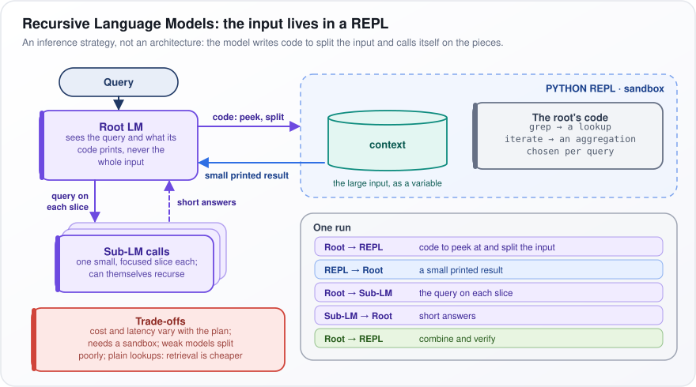</p>

*Figure: the root model probes an input held in a REPL with code, and delegates slices to sub-model calls.*

In the figure, start at the purple "Root LM". Its "code: peek, split" arrow enters the blue dashed "PYTHON REPL · sandbox", where the green "context" cylinder holds "the large input, as a variable"; only a "small printed result" comes back. Below, "query on each slice" goes to the stacked "Sub-LM calls", which return "short answers". The "One run" panel lists the steps in order.

**Watch out:** cost and latency vary with the model's plan, it needs a secure sandbox to run generated code, and weak models write poor decompositions. For plain lookups, retrieval is cheaper.

---

## 74. Continual Learning in LLMs

**Continual learning means updating a model with new data over time without losing what it could already do. The obstacle is catastrophic forgetting: training on new data changes the weights that old skills depended on.**

Fine-tune a general assistant for weeks on legal contracts and it becomes excellent at contracts and noticeably worse at code. Nothing told it to keep its coding skill. Gradient updates, the small weight changes that reduce the loss (the training error), optimize only for the data in front of them.

How it is handled, in four families:

1. **Replay.** Mix a slice of old data into every training batch, so old skills keep getting practiced. This is the most widely used fix.
2. **Regularization.** Penalize moving the weights that mattered for old tasks (EWC, below), or penalize outputs that diverge from the old model's outputs.
3. **Isolation.** Train a separate LoRA adapter (a small set of add-on weights) per domain and leave the base weights frozen, so old abilities cannot change. Load the right adapter per request.
4. **Merging.** Train separate copies, then combine their weights.

Put as a formula, elastic weight consolidation (EWC) adds a penalty to the new loss:

```math
\mathcal{L} = \mathcal{L}_{new}(\theta) + \frac{\lambda}{2}\sum_i F_i\,(\theta_i - \theta_i^{old})^2
```

$`\mathcal{L}_{new}`$ is the loss on the new data. $`\theta_i`$ is one weight and $`\theta_i^{old}`$ its value before the update. $`F_i`$, the Fisher information, measures how much the old tasks depended on that weight: large means important. $`\sum_i`$ adds up over every weight, and $`\lambda`$ sets the overall strength. Example: move two weights by 0.1 each, one with $`F = 10`$ and one with $`F = 0.01`$. The penalties, before the $`\lambda/2`$ factor, are $`10 \times 0.01 = 0.1`$ and $`0.01 \times 0.01 = 0.0001`$. Unimportant weights move freely; important ones are held in place.

**Watch out:** fine-tuning is a poor way to add facts; training on facts the model did not already know has been shown to increase hallucination. Use retrieval for changing facts and fine-tuning for skills, and rerun the old evals after every update.

---

## 75. What is Recursive Self-Improvement (RSI)?

**Recursive self-improvement (RSI) is a loop in which an AI system improves itself, including its ability to improve, so each round makes the next one easier. The idea goes back to I. J. Good's 1965 "intelligence explosion" argument and is central to AI safety debates.**

Picture a programmer who builds a tool that makes them faster at building tools. If every round makes the next improvement cheaper, the gains compound; if every round gets harder, progress levels off. Which of the two real AI loops will do is an open question.

Partial forms that exist today:

1. **Self-training on its own reasoning.** The model generates many solutions, keeps those that reach the correct answer, fine-tunes on them, and repeats (STaR, the Self-Taught Reasoner, 2022).
2. **Models feeding their successors.** Frontier models generate synthetic training data and grade outputs for the next generation.
3. **AI doing AI engineering.** Coding agents write ML code. Google DeepMind reported in 2025 that AlphaEvolve, a Gemini-powered search system, found a faster kernel (a low-level GPU routine) used in training Gemini models, the models it runs on.

What limits the loop:

- **Verifier reliability:** the loop is only as good as its check of what "better" means.
- **Model collapse:** quality and diversity decay when models train on their own unfiltered output over generations.
- **Compute:** every round costs a training run.

<p align="center">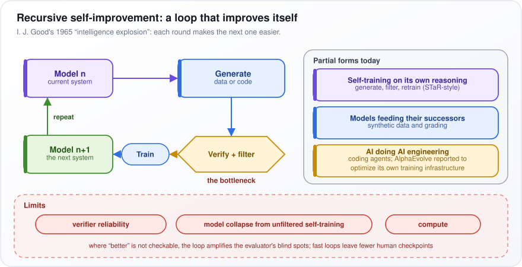</p>

*Figure: the self-improvement loop, with verification as its bottleneck, beside today's partial forms and the loop's limits.*

In the figure, follow the loop on the left: "Model n" produces "Generate: data or code", which passes the yellow "Verify + filter" hexagon, labeled "the bottleneck", then "Train", giving "Model n+1", and "repeat" returns to the top. The "Partial forms today" panel lists the three forms above; the red "Limits" band lists the three limits.

**Watch out:** the verifier is the bottleneck. Where "better" cannot be checked, the loop amplifies the evaluator's blind spots, and fast loops leave fewer human checkpoints.

---

## 76. How do Diffusion Language Models (DLMs) work?

**A diffusion language model starts from a sequence that is entirely blanked out (masked) and fills it in over several rounds, predicting many tokens in parallel at each round, instead of writing one token at a time from left to right.**

Think of solving a crossword: you fill in the answers you are sure of first, and those letters help with the rest. Image diffusion models learn to remove noise from a noisy picture; in the text version, the "noise" is masking.

How it works:

1. **Noising.** To make a training example, pick a masking level $`t`$ between 0 and 1 and mask each token with probability $`t`$. At $`t = 1`$, everything is masked.
2. **Training.** A bidirectional Transformer (one that sees both sides of every position) predicts all the masked tokens. This is masked language modeling, like BERT's, but across every masking rate rather than a fixed 15%.
3. **Generation.** Start with $`N`$ mask tokens after the prompt. At each step, predict every masked position, commit the most confident predictions, and re-mask the rest. Repeat for $`K`$ steps. When $`K`$ is smaller than $`N`$, several tokens are produced per step, which is where the speed comes from.
4. **Examples:** LLaDA (an open research model, 2025) and commercial speed-focused systems such as Mercury, as of 2025–26.

The block below traces one generation. Read it row by row: `[M]` is a mask. "Paris", the most confident guess, is committed first, then "is" and the end token, then the period. The order is not left to right.

```text
step 0:  The capital of France  [M]  [M]    [M]  [M]
step 1:  The capital of France  [M]  Paris  [M]  [M]
step 2:  The capital of France  is   Paris  [M]  <eos>
step 3:  The capital of France  is   Paris  .    <eos>
```

**Watch out:** the gains are parallelism, speed and infilling (filling a gap in the middle of a text). The costs are harder KV caching (reusing stored attention results; here tokens change between steps and attention looks both ways), a fixed-length canvas chosen up front, and a quality gap on long reasoning. Block diffusion, which generates block after block left to right and uses diffusion within each block, is the common compromise.

---

## 77. How Does LLM Watermarking Work?

**Watermarking nudges the model's token choices toward a secret, key-dependent pattern while it generates. Anyone holding the key can later test whether a text follows that pattern far more often than chance would allow.**

Imagine that before every word, a secret coin toss splits the dictionary into "green" and "red" halves, and the model gently prefers green. Human text lands on green about half the time; watermarked text noticeably more, and over a few hundred tokens that surplus is very unlikely to be chance.

How it works (the Kirchenbauer et al., 2023 scheme):

1. **Seed.** Hash (scramble into a fixed number) the previous token together with a secret key to seed a random number generator. The same previous token and key always give the same split, so a detector can reproduce it.
2. **Split.** Divide the vocabulary into a green list (a fraction $`\gamma`$, such as 0.5) and a red list.
3. **Bias.** Add a small bonus $`\delta`$ to green tokens' scores, then sample as usual. It steers the choice only where several tokens fit.
4. **Detect.** The detector needs only the key, not the model: recompute the green lists, count green tokens, and compute a z-score.
5. **Variants.** Distortion-free schemes and Google's SynthID-Text (tournament sampling, where candidate tokens compete in rounds scored by keyed functions) keep quality closer to unwatermarked output.

Put as a formula:

```math
z = \frac{|s|_G - \gamma T}{\sqrt{T\,\gamma\,(1-\gamma)}}
```

$`|s|_G`$ is the number of green tokens in text $`s`$ and $`T`$ the total number of tokens. $`\gamma T`$ is the count expected by chance and the denominator its typical random spread, so $`z`$ counts standard deviations above chance. Example: $`T = 200`$ and $`\gamma = 0.5`$ give an expected 100 green tokens with a spread of about 7.1. Observing 140 gives $`z \approx 5.7`$. Anything with $`z \gt 4`$ is strong evidence; by chance it happens about 3 times in 100,000.

**Watch out:** paraphrasing washes the watermark out, low-entropy text (with few plausible choices per token, such as code or short factual answers) carries little signal, and open-weight models need not watermark at all. A negative result proves nothing about human authorship.

---

## 78. How do RNNs and Transformers differ?

**A recurrent neural network (RNN) reads a sequence one step at a time and squeezes everything so far into a fixed-size memory vector. A Transformer lets every position look directly at every other position and trains on all positions at once.**

An RNN is like reading a book while keeping a single index card of notes, rewritten after every word. By page 300, the details of page 1 have been overwritten hundreds of times. A Transformer keeps the whole book open and can flip to any page, but the pile of open pages grows with the book.

How each works:

- **RNN:** $`h_t = f(W_h h_{t-1} + W_x x_t)`$. Here $`h_t`$ is the hidden state (the index card) after step $`t`$, $`x_t`$ is the current input, $`W_h`$ and $`W_x`$ are learned weight matrices, and $`f`$ is a squashing function such as tanh (which keeps values between -1 and 1). Example with single numbers: $`W_h = 0.5`$, $`W_x = 1`$, $`h_{t-1} = 0.4`$ and $`x_t = 1`$ give $`h_t = \tanh(1.2) \approx 0.83`$. Each step needs the previous one, so training runs step by step. Information from token 1 reaches token 500 only through 499 updates, and the training signal shrinks along the way (vanishing gradients), so long-range patterns are hard to learn. Gated RNNs such as LSTMs ease this but do not remove it.
- **Transformer:** any two tokens are one attention step apart. All positions are computed together as large matrix multiplications, which GPUs are built for.
- **Why Transformers won:** parallel training at huge scale and precise recall of anything in the context. RNNs keep one advantage: constant memory and constant cost per token at inference.

The table compares them for a sequence of $`n`$ tokens.

| | RNN | Transformer |
|---|---|---|
| Training across positions | Sequential | Parallel |
| Distance between tokens | $`O(n)`$ steps | $`O(1)`$ |
| Inference memory | Constant state | Growing KV cache |
| Per-token cost | Constant | Grows with context |

$`O(n)`$ means "grows in step with the length"; $`O(1)`$ means "fixed, whatever the length". The growing KV cache is the store of keys and values a Transformer keeps for every earlier token.

**Watch out:** state-space models (Mamba), RWKV and hybrids train in parallel but run like RNNs. Their weakness is exact recall from far back, so hybrids keep a few attention layers.

---
