# Retrieval-Augmented Generation (RAG)

<p align="center"></p>

[← All topics](../README.md)

A large language model (LLM) only knows what was in its training data, and it cannot say where a fact came from. Retrieval-augmented generation (RAG) fixes that by searching your own documents when a question arrives and handing the most relevant passages to the model along with the question. These answers walk through every stage of that pipeline: cutting documents into chunks, turning text into vectors (embeddings), searching by meaning and by keyword, reranking, rewriting the question, agent and graph variants, measuring quality, and the production problems of freshness, permissions, speed, scale and messy PDFs. Interview panels mostly probe one skill: when an answer is wrong, can you tell whether retrieval or generation failed, and can you back each design choice with a number from a test set?

## Questions

1. [What is Retrieval-Augmented Generation (RAG), and why is it important?](#1-what-is-retrieval-augmented-generation-rag-and-why-is-it-important)
2. [Explain the architecture of a basic RAG system.](#2-explain-the-architecture-of-a-basic-rag-system)
3. [What are the key components of a RAG pipeline?](#3-what-are-the-key-components-of-a-rag-pipeline)
4. [What are chunking strategies, and how do you choose the right chunk size?](#4-what-are-chunking-strategies-and-how-do-you-choose-the-right-chunk-size)
5. [Compare fixed-size chunking, semantic chunking, and recursive chunking.](#5-compare-fixed-size-chunking-semantic-chunking-and-recursive-chunking)
6. [What are embedding models, and how do they convert text to vectors?](#6-what-are-embedding-models-and-how-do-they-convert-text-to-vectors)
7. [How do you choose an embedding model for your RAG system?](#7-how-do-you-choose-an-embedding-model-for-your-rag-system)
8. [Explain Agentic RAG.](#8-explain-agentic-rag)
9. [What is hybrid search, and why is it better than pure vector search?](#9-what-is-hybrid-search-and-why-is-it-better-than-pure-vector-search)
10. [What is re-ranking, and how does it improve RAG retrieval quality?](#10-what-is-re-ranking-and-how-does-it-improve-rag-retrieval-quality)
11. [What is ColBERT, and how does late interaction retrieval work?](#11-what-is-colbert-and-how-does-late-interaction-retrieval-work)
12. [Compare reranker architectures: cross-encoder, ColBERT, and LLM-based rerankers.](#12-compare-reranker-architectures-cross-encoder-colbert-and-llm-based-rerankers)
13. [How do you handle multi-document and multi-hop questions in RAG?](#13-how-do-you-handle-multi-document-and-multi-hop-questions-in-rag)
14. [What is the "lost in the middle" problem in RAG systems?](#14-what-is-the-lost-in-the-middle-problem-in-rag-systems)
15. [How do you evaluate a RAG system? Explain faithfulness, relevance, and context precision/recall.](#15-how-do-you-evaluate-a-rag-system-explain-faithfulness-relevance-and-context-precisionrecall)
16. [Explain Self-RAG. How does the model decide when to retrieve?](#16-explain-self-rag-how-does-the-model-decide-when-to-retrieve)
17. [What is GraphRAG, and when would you use it over traditional RAG?](#17-what-is-graphrag-and-when-would-you-use-it-over-traditional-rag)
18. [Vectorless RAG](#18-vectorless-rag)
19. [How do you handle structured data (tables, SQL databases) in a RAG pipeline?](#19-how-do-you-handle-structured-data-tables-sql-databases-in-a-rag-pipeline)
20. [What are the common failure modes of RAG systems, and how do you debug them?](#20-what-are-the-common-failure-modes-of-rag-systems-and-how-do-you-debug-them)
21. [How do you handle document updates and maintain freshness in a RAG system?](#21-how-do-you-handle-document-updates-and-maintain-freshness-in-a-rag-system)
22. [How do you optimize RAG for latency in production?](#22-how-do-you-optimize-rag-for-latency-in-production)
23. [What is the role of metadata filtering in RAG systems?](#23-what-is-the-role-of-metadata-filtering-in-rag-systems)
24. [Compare RAG vs fine-tuning. When would you use each?](#24-compare-rag-vs-fine-tuning-when-would-you-use-each)
25. [Long context windows keep getting cheaper. When should you use retrieval (RAG) vs putting everything in the context window?](#25-long-context-windows-keep-getting-cheaper-when-should-you-use-retrieval-rag-vs-putting-everything-in-the-context-window)
26. [What is query transformation in RAG (HyDE, query decomposition, step-back prompting)?](#26-what-is-query-transformation-in-rag-hyde-query-decomposition-step-back-prompting)
27. [How do you implement citation and source attribution in RAG?](#27-how-do-you-implement-citation-and-source-attribution-in-rag)
28. [How do you scale a RAG system to millions of documents?](#28-how-do-you-scale-a-rag-system-to-millions-of-documents)
29. [What is parent-child chunking, and how does it improve retrieval?](#29-what-is-parent-child-chunking-and-how-does-it-improve-retrieval)
30. [Your RAG system is hallucinating despite having the right context. How do you fix it?](#30-your-rag-system-is-hallucinating-despite-having-the-right-context-how-do-you-fix-it)
31. [Your RAG chunk overlap causes redundant results. How do you reduce redundancy?](#31-your-rag-chunk-overlap-causes-redundant-results-how-do-you-reduce-redundancy)
32. [Your RAG retrieval is too slow with a large knowledge base. How do you speed it up?](#32-your-rag-retrieval-is-too-slow-with-a-large-knowledge-base-how-do-you-speed-it-up)
33. [Your RAG system returns duplicate results. How do you deduplicate?](#33-your-rag-system-returns-duplicate-results-how-do-you-deduplicate)
34. [Your RAG system needs per-user access control on internal documents. How do you implement it?](#34-your-rag-system-needs-per-user-access-control-on-internal-documents-how-do-you-implement-it)
35. [Your RAG system fails on domain-specific jargon. How do you fix it?](#35-your-rag-system-fails-on-domain-specific-jargon-how-do-you-fix-it)
36. [Your text-only RAG system now needs to handle images and tables. How do you extend it?](#36-your-text-only-rag-system-now-needs-to-handle-images-and-tables-how-do-you-extend-it)
37. [Your RAG knowledge base gets updated frequently and needs versioning. How do you manage it?](#37-your-rag-knowledge-base-gets-updated-frequently-and-needs-versioning-how-do-you-manage-it)
38. [Your RAG system fails on multi-hop questions that require combining multiple facts. How do you fix it?](#38-your-rag-system-fails-on-multi-hop-questions-that-require-combining-multiple-facts-how-do-you-fix-it)
39. [Your enterprise RAG system returns contradictory answers from different source documents. How do you resolve conflicts?](#39-your-enterprise-rag-system-returns-contradictory-answers-from-different-source-documents-how-do-you-resolve-conflicts)
40. [Your RAG system returns outdated answers from an evolving knowledge base. How do you keep it current?](#40-your-rag-system-returns-outdated-answers-from-an-evolving-knowledge-base-how-do-you-keep-it-current)
41. [Your RAG system struggles with PDF documents containing tables and layouts. How do you fix PDF parsing?](#41-your-rag-system-struggles-with-pdf-documents-containing-tables-and-layouts-how-do-you-fix-pdf-parsing)

---

## 1. What is Retrieval-Augmented Generation (RAG), and why is it important?

**Retrieval-augmented generation (RAG) means looking up relevant passages from your own documents when a question arrives and pasting them into the prompt, so a large language model (LLM) answers from that evidence instead of from memory alone. It is the cheapest way to give a model knowledge that is private, recent, citable and permission-controlled, without retraining it.**

**The idea.** Think of an open-book exam. The model is a well-read student who studied much of the public internet up to some date, but has never seen your HR policy, last week's release notes or a customer's contract. Instead of re-teaching the student (retraining), you hand over the right three pages just before they answer. Ask "How many days of parental leave do we offer?" and the system finds the policy paragraph that says "20 days", puts it in the prompt, and the model answers "20 days" with a pointer to that paragraph.

**Why it matters**
- Freshness: when the policy changes, you re-index one document (store the new version in the search system) in minutes. Retraining takes days.
- Private knowledge: your data never has to be baked into the model's weights (the numbers it learned in training).
- Citations: every answer can point to the passage it used, so a person can check it.
- Access control: you filter what each user may retrieve, so the model never sees a document the user cannot.
- Fewer made-up facts (hallucinations), not zero.

**Put as a formula**, a model normally generates an answer $`y`$ to a question $`q`$ with probability $`p_\theta(y \mid q)`$, read "the probability of $`y`$ given $`q`$, under weights $`\theta`$". RAG changes only what goes in:

```math
p_\theta(y \mid q, d_1, \dots, d_k)
```

Here $`d_1`$ to $`d_k`$ are the $`k`$ retrieved passages. The weights $`\theta`$ are untouched; only the model's reading material changes.

**Watch out:** retrieval sets the ceiling. If the right passage is not among the $`k`$ retrieved, the model falls back on memory and may answer confidently and wrongly, so most "wrong answer" incidents turn out to be ingestion or retrieval bugs, not prompt bugs.

---

## 2. Explain the architecture of a basic RAG system.

**A basic RAG system has two halves. Offline, documents are cut into chunks, turned into vectors (lists of numbers that capture meaning) and stored in a searchable index. Online, each question becomes a vector the same way, the closest chunks are fetched, and a large language model (LLM) answers from them with citations.**

**The idea.** It is a library catalog: built once, ahead of time, and consulted on every question.

**Offline (indexing)**
1. Parse: pull clean text, tables and metadata out of PDFs, wikis and tickets.
2. Chunk: cut the text into pieces of a few hundred tokens (a token is a word or part of a word), with a little overlap.
3. Embed: an embedding model turns each chunk into a vector; similar meanings get similar numbers.
4. Store vector, text and metadata (document ID, section, date, who may read it) in a vector index.

**Online (per question)**
1. Embed the question with the same model; vectors from two different models cannot be compared.
2. Retrieve the top-k: the $`k`$ nearest chunk vectors by cosine similarity (how closely two vectors point the same way). At scale this is approximate nearest-neighbor (ANN) search, trading a little accuracy for a lot of speed, plus filters such as the user's access-control list (ACL, the record of who may read what).
3. The prompt holds instructions, the numbered chunks and the question; the LLM answers and cites chunk numbers.

**Read the figure.** The green OFFLINE · indexing lane runs from Sources to the Vector index. The dashed "similarity search" arrow drops into the blue ONLINE · per query lane: User query, Embed query, Retrieve top-k, the yellow Rerank, the Prompt box, then the purple LLM and Answer + citations.

<p align="center">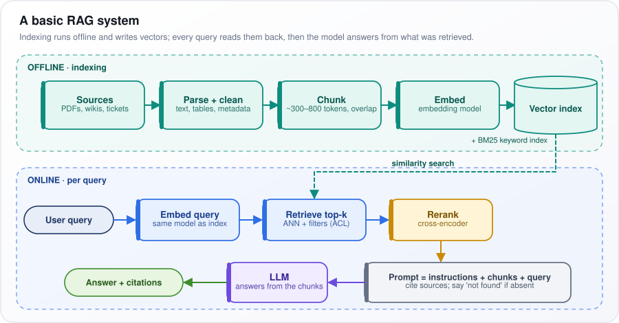</p>

*Figure: indexing writes vectors once, offline; every question reads them back and the LLM answers from what was retrieved.*

**Watch out:** vectors alone miss exact strings such as error code E-4012. A keyword index (BM25, the standard word-matching score) and a reranker (a second, more careful scorer) are the usual first upgrades, each added when an evaluation shows it helps.

---

## 3. What are the key components of a RAG pipeline?

**A RAG pipeline is a chain of about ten stages: parsing, chunking, embedding, indexing, query processing, retrieval, reranking, context assembly, generation and evaluation. Each has its own settings and its own way of failing, so each is measured on its own.**

**The idea.** Treat it like an assembly line. If the finished car is faulty, you inspect every station, not just the paint shop. A wrong answer can come from a PDF table garbled at the very first station just as easily as from the model at the last.

The table lists each stage, the main setting you tune (its "knob"), and the symptom you see when that stage is weak.

| Component | Main knob | Failure when weak |
|---|---|---|
| Parsing | Parser, OCR, table extraction | Garbled tables, missing scanned pages |
| Chunking | Size, overlap, boundaries | Answer split across chunks |
| Embedding model | Model, dimension, domain fit | Jargon and codes retrieve poorly |
| Index | HNSW/IVF parameters, quantization | Slow queries or silently low recall |
| Query processing | Rewrite, decompose, route | Follow-up questions fail |
| Retriever | Dense, BM25, hybrid | Exact-match or paraphrase misses |
| Reranker | Model, candidate count | Noise in the prompt |
| Context assembly | k, ordering, dedupe | Lost in the middle, truncation |
| Generator | Model, prompt, temperature | Unfaithful answers |
| Evaluation | Golden set, traces | No way to tell which stage broke |

Terms in the table:
- OCR (optical character recognition) reads text from scanned images.
- HNSW and IVF are two kinds of approximate search index; quantization stores each vector in fewer bits to save memory.
- Dense retrieval compares embedding vectors (lists of numbers that capture meaning); BM25 is classic keyword scoring; hybrid runs both.
- Dimension is how many numbers each vector holds; k is how many chunks go into the prompt; temperature sets how random the model's wording is; traces are per-request logs of what each stage returned.
- "Lost in the middle": models tend to overlook facts placed mid-prompt.
- A golden set is a fixed list of test questions with known correct answers and sources.

**How each stage is measured**
- Parsing: read the stored chunk text by eye. If a table is garbled here, nothing later can repair it.
- Retrieval: recall@k, the share of test questions whose correct chunk appears in the top $`k`$ results.
- Reranking: nDCG@5 (normalized discounted cumulative gain), a score between 0 and 1 that rewards putting the most relevant chunks at the very top of the first five.
- Generation: faithfulness (is every claim supported by the retrieved text?) and answer relevance (does it answer what was asked?).

**Watch out:** log, for every request, the retrieved chunk IDs and their scores at each stage. Without those traces, no stage can be debugged.

---

## 4. What are chunking strategies, and how do you choose the right chunk size?

**Chunking is how you cut documents into the pieces that get indexed and retrieved. Size is a trade-off: small chunks match a question sharply but lose surrounding detail; large chunks keep the detail but match vaguely. Start around 256–512 tokens (words or pieces of words) with 10–20% overlap (a common rule of thumb), then test sizes on your own questions.**

**The idea.** Each chunk gets one vector, a single point summarizing its meaning. Suppose one HR chunk covers sick leave, parental leave and travel expenses. Its vector blends three topics and sits close to none, so a parental-leave question matches it weakly. Now shrink the chunk to one sentence: "Parental leave is 20 days." It matches sharply, but the next sentence, "except for contractors, who get 10", has been cut off, and the answer comes out wrong.

**The strategies**
- Fixed-size: every N tokens, ignoring meaning.
- Recursive: split on paragraphs, then lines, then sentences, until pieces fit.
- Structure-aware: split on headings, keep each table whole, split code by function.
- Semantic: split where the topic shifts.
- Parent-child: search small pieces, hand the model their larger section.
- Contextual enrichment: prepend the title and section path ("HR Policy > Leave > Parental") so each chunk makes sense alone.

**How to choose**
1. Respect the hard ceiling: the embedding model (which turns each chunk into its vector) silently drops text beyond its maximum input length.
2. Build a test set of real questions with known answers.
3. Try 128, 256, 512 and 1,024 tokens. For each, measure context recall (did the retrieved chunks contain what the answer needs?) and answer correctness.
4. Keep $`k \times \text{chunk size}`$ ($`k`$ chunks retrieved) inside the prompt budget: 8 chunks of 512 tokens is about 4,000 tokens.

Overlap means neighboring chunks share a stretch of text (about 50–100 of 512 tokens), so a sentence cut at one boundary appears whole in the next chunk.

**Watch out:** boundaries matter more than the exact number. Never split a table or a code block, and carry the section title into every chunk.

---

## 5. Compare fixed-size chunking, semantic chunking, and recursive chunking.

**Fixed-size chunking cuts every N tokens (words or word pieces) regardless of meaning; recursive chunking splits on natural breaks (paragraphs, then lines, then sentences) until each piece fits; semantic chunking splits where neighboring sentences stop being about the same thing. Recursive, or a structure-aware version that follows headings, is the sensible default.**

**The idea.** Picture cutting a long article onto index cards. Fixed-size is a paper guillotine every 10 cm: fast, but it slices through sentences. Recursive is a careful editor: "Does the whole section fit? No. Split at paragraph breaks. Is this paragraph still too long? Split it at sentence ends." Semantic is a reader who starts a new card whenever the subject changes.

**How each works**
- Fixed-size: take N tokens (say 512), then start the next chunk M tokens earlier (say 64), so a sentence cut in one chunk appears whole in its neighbor. That shared stretch is the overlap.
- Recursive: try the biggest separator first (a blank line, written `\n\n`), then a single line break `\n`, then a sentence end `. `, then a space. Only pieces still over the limit are split again.
- Semantic: embed every sentence and compare each with the next. Here $`e_i`$ is the embedding of sentence $`i`$ (a vector, a list of numbers capturing its meaning), and $`\cos(e_i, e_{i+1})`$ is their cosine similarity (1 means same direction, so same meaning). So $`1 - \cos(e_i, e_{i+1})`$ is a "how different" score. Where it is unusually large, start a new chunk. "Unusually large" is often set as above the 95th percentile of all such gaps in the document, so only the biggest 5% of jumps become boundaries.

The table compares the three on the split rule, whether it respects meaning, how predictable the chunk size is, extra cost at indexing time, and where each fits best.

| | Fixed-size | Recursive | Semantic |
|---|---|---|---|
| Split rule | Every N tokens, M overlap | `\n\n`, then `\n`, then `. `, then space, until under the limit | Where $`1 - \cos(e_i, e_{i+1})`$ exceeds, say, the 95th percentile |
| Respects meaning | No | Paragraphs and sentences | Topic shifts |
| Size control | Exact | Bounded | Variable |
| Index-time cost | None | None | One embedding per sentence |
| Best for | Baseline, uniform prose | Most text | Unstructured transcripts |

**Watch out:** semantic chunking costs one embedding per sentence and behaves erratically on lists, tables and short sentences. A published 2024 comparison found its gains over simpler splitting inconsistent, so adopt it only if your own evaluation shows a win.

---

## 6. What are embedding models, and how do they convert text to vectors?

**An embedding model turns text into a fixed-length list of numbers, a vector (typically 384 to 3,072 numbers), arranged so that texts with similar meaning point in similar directions. Search then means finding the stored vectors closest to the question's.**

**The idea.** Imagine a map where every sentence is a dot. "How do I reset my password?" and "I forgot my login credentials" land side by side despite sharing almost no words. Real spaces have hundreds of dimensions, not two.

**How text becomes a vector**
1. Tokenize: split the text into tokens (words or pieces of words, such as "embed" + "ding").
2. Encode: a transformer (the network design behind modern LLMs) reads all tokens together and outputs one context-aware vector per token.
3. Pool: merge those into one vector, by averaging (mean pooling) or by keeping the vector of a special first token (`[CLS]`) or the last token.
4. Normalize: scale the vector to length 1, so the dot product (multiply matching numbers, then add) equals cosine similarity (how closely two vectors point the same way).

**How it learns.** Training is contrastive: the model sees a question, its correct passage and many wrong ones (usually the batch's other passages, called in-batch negatives), and learns to score the correct pair highest. Put as a formula:

```math
\mathcal{L} = -\log \frac{\exp(\cos(q,d^+)/\tau)}{\sum_{j}\exp(\cos(q,d_j)/\tau)}
```

$`q`$ is the question vector, $`d^+`$ the correct passage, and $`d_j`$ every passage in the batch (Σ means "add them all up"). $`\exp`$ (e ≈ 2.718 raised to that power) makes each score positive; $`\tau`$, the temperature, is a small divisor such as 0.05 that sharpens the gaps between scores. The fraction is a softmax: it turns scores into probabilities that add to 1, here the correct passage's share. The loss $`\mathcal{L}`$ is what training pushes down; $`-\log`$ turns "make that probability big" into "make the loss small": probability 0.9 gives a loss of about 0.1, probability 0.1 about 2.3.

Question and document are encoded separately (a bi-encoder), so documents are embedded once, offline.

**Watch out:** the chunk is squeezed into one vector before the question is known, so negations, numbers and part codes blur.

---

## 7. How do you choose an embedding model for your RAG system?

**Use public leaderboards such as MTEB (the Massive Text Embedding Benchmark) only to build a shortlist, then decide with a retrieval test built from your own questions and documents. A leaderboard winner can still lose on your jargon, languages or document types.**

**The idea.** A leaderboard is like a car's published fuel economy: good for narrowing the field, but you still test-drive on your own roads. Your roads are your users' real questions against your real documents.

**The process**
1. Build a test set of 100–300 real queries (from search logs or support tickets), each labeled with the chunks that answer it. Questions written by an LLM can supplement it but not replace it: they tend to reuse the document's own wording, which makes retrieval look easier than it is.
2. Pick three or four candidates: a strong commercial API model, a strong open-weights model (one whose learned numbers you can download and run yourself), and a small fast one.
3. Embed the corpus (your whole document collection) with each and measure:
   - recall@20, how often the right chunk is somewhere in the top 20, which is what the reranker (a second-stage scorer) gets to work with;
   - nDCG@10, a score that also rewards putting the right chunk near the very top of the first 10.
4. Check constraints: languages, a maximum input length at least as long as your chunks, license, where data is processed (data residency), and latency (response time).
5. Price the storage. Each number in a vector is normally 4 bytes (float32). So 10 million chunks × 1,024 dimensions × 4 bytes ≈ 41 GB; stored as int8 (1 byte per number) it is about 10 GB.

**Rule of thumb:** if a 768-dimension model is within about one percentage point of a 3,072-dimension one on recall@20, take the smaller. It is four times cheaper to store and faster to search.

**Watch out:** switching models later means re-embedding the whole corpus, because vectors from different models cannot be compared. Record the model name and version alongside the index.

---

## 8. Explain Agentic RAG.

**Agentic RAG turns retrieval into a tool that an LLM agent can call as many times as it needs. Instead of one fixed "search, then answer" step, the agent decides whether to search, where, with what wording, whether the results are good enough, and when to stop.**

**The idea.** Basic RAG is a vending machine: one query in, one set of chunks out. Agentic RAG is a research assistant. Asked "Did premium-plan refunds rise after the March price change?", it finds the change date in the documents, queries the sales database for refunds before and after, checks it has both numbers, then answers.

**How it works**
1. An agent (an LLM running in a loop, able to call tools) receives the question.
2. It reasons about the next step, calls a tool, reads the result, and decides again. This reason, act, observe cycle is called the ReAct pattern.
3. Tools take typed arguments (named fields of fixed types), for example `search_docs(query, filters)` or `run_sql(query)`. Choosing the right tool or index is called routing.
4. A grader, often a small LLM call, checks whether the results are relevant and sufficient. If not, the agent rewrites the query or tries another source. This grade-and-correct step is known as corrective RAG (CRAG).
5. For multi-hop questions, where one fact is needed to look up the next, the first answer feeds the next query.

**Read the figure.** The Question enters the purple Agent box. The yellow Which tool? diamond sends it to Vector search or SQL over tables; both feed the Relevant and sufficient? check. "yes" leads to Grounded answer + citations (an answer backed by what was retrieved); the red dashed "no" arrow loops back to the agent to "rewrite, re-route or fall back (CRAG), then retry".

<p align="center">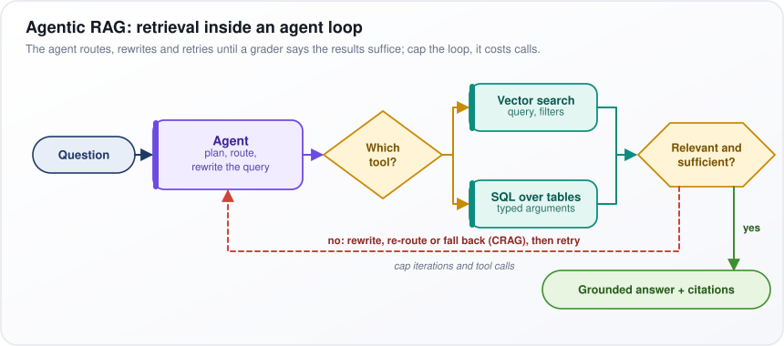</p>

*Figure: the agent routes, rewrites and retries until a grader says the retrieved results are enough to answer.*

**Watch out:** every loop is another LLM call, so latency grows to seconds, cost multiplies and the path differs run to run. Send only hard question types to the agent, and cap iterations and tool calls.

---

## 9. What is hybrid search, and why is it better than pure vector search?

**Hybrid search runs two searches on the same query, a keyword search and a meaning-based (vector) search, and merges the two ranked lists. It beats vector search alone because the two fail on different questions: vectors catch paraphrases, keywords catch exact codes and names.**

**The idea.** A user types "error E-4012 at checkout". Vector search may return the page for E-4013, because the embedding model breaks the code into fragments and one changed digit barely moves the vector. Keyword search finds "E-4012" exactly. The reverse also happens: "I can't log in" and a page titled "Resetting your credentials" share no words, and only vector search connects them.

**How it works**
1. Keyword (lexical) search, usually BM25: it scores how many of the query's words a chunk contains, giving rare words far more weight. That weighting is inverse document frequency (IDF): "E-4012", found in three documents, counts for much more than "error", found in thousands.
2. Dense search: the nearest embedding vectors (lists of numbers that capture meaning), as in basic RAG.
3. Fuse the lists. The raw scores are on different scales (BM25 might say 14.2, cosine 0.83), so combine ranks instead, with reciprocal rank fusion (RRF):

```math
\text{RRF}(d)=\sum_{r \in R}\frac{1}{k+\text{rank}_r(d)}
```

For each document $`d`$, go through each ranked list $`r`$ in the set $`R`$ (here the keyword list and the vector list), take the document's position $`\text{rank}_r(d)`$, and add $`1/(k+\text{rank})`$. The constant $`k = 60`$ is a convention that stops first place from dominating. A chunk ranked 1st by keywords and 3rd by vectors scores $`1/61 + 1/63 \approx 0.032`$; one ranked 2nd by vectors only scores $`1/62 \approx 0.016`$. Showing up in both lists wins.

4. Send the fused top 50 or so to a reranker (a slower, more careful second scorer).

A weighted sum of scores rescaled to a common range, tuned on your test set, can beat RRF, but it is brittle when the typical range of scores shifts.

**Watch out:** on conversational, paraphrase-heavy content hybrid adds little; on enterprise content full of product codes, ticket IDs and names it should be the default.

---

## 10. What is re-ranking, and how does it improve RAG retrieval quality?

**Re-ranking is a second, more careful pass over search results. A fast retriever casts a wide net of 50–200 candidates so the right passage is probably in there; a slower, more accurate model, a cross-encoder, re-scores each candidate against the question, and only the best 3–10 reach the prompt.**

**The idea.** Think of hiring. A recruiter skims 100 CVs for keywords in minutes (fast, rough); a hiring manager then reads the shortlist carefully (slow, accurate).

**How it works**
1. First stage: hybrid retrieval (keyword plus vector search) returns about 100 candidates, tuned for recall (not missing the right one).
2. The cross-encoder reads the question and one passage together as a single input, `[CLS] query [SEP] passage [SEP]` (special marker tokens for "start" and "separator"), with full attention: every question word can look at every passage word. A small final layer outputs one relevance score.
3. This beats comparing embeddings because an embedding model (a bi-encoder) compresses each side separately before they meet. Reading them together, the cross-encoder gives "the API supports batch export" and "the API does not support batch export" clearly different scores.
4. Keep the top 5 or so: a shorter prompt, lower latency (response time) and less "lost in the middle" (models overlooking facts buried mid-prompt).
5. If even the best score is below a threshold tuned on your test set, answer "not found" instead of guessing.

The cost is one model pass per candidate: about 100 candidates on a GPU (a graphics chip) typically take tens to low hundreds of milliseconds (a rule of thumb).

**Read the figure.** Left to right: Query, the blue Hybrid retrieval box with its "100 candidates" grid below, the yellow Cross-encoder ("one forward pass per candidate"), then Top 5 to prompt and the LLM. The red sentence states the key limit.

<p align="center">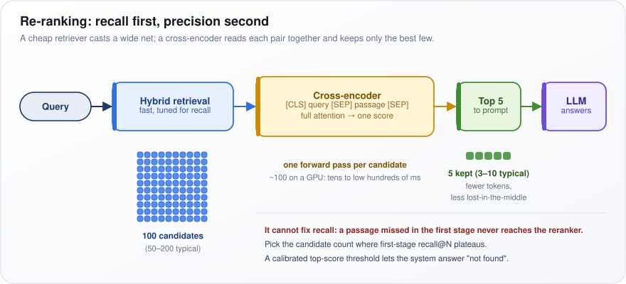</p>

*Figure: a cheap retriever casts a wide net, and a cross-encoder reads each question-passage pair together to keep only the best few.*

**Watch out:** reranking cannot fix recall; a passage the first stage missed never reaches the reranker. Choose the candidate count where first-stage recall stops improving.

---

## 11. What is ColBERT, and how does late interaction retrieval work?

**ColBERT is a retrieval model that keeps one vector (a list of numbers) per token (word or word piece) instead of one per passage, and scores a passage by matching each question token to its most similar passage token. "Late interaction" means question and passage are encoded separately, so passages are precomputed and the two meet only at scoring time.**

**The idea.** For the question "refund window for annual plans", each question token looks for its best partner in the passage: "refund" finds "refunds", "annual" finds "yearly", "window" finds "within 30 days". The passage scores well if every question token found a good partner.

**How it works**
1. Offline: run each passage through a BERT-style encoder (a transformer that reads text in both directions) and store every token's vector, 128 numbers each in the original paper.
2. Query time: encode the question into per-token vectors too. It is padded to a fixed length with special mask tokens, which learn to act as extra implied search terms (query expansion).
3. Score with MaxSim: for each question token, take its highest dot product with any passage token, then add those maxima up.

Put as a formula:

```math
S(q,d)=\sum_{i=1}^{\lvert q\rvert}\;\max_{1\le j\le \lvert d\rvert}\;\mathbf{q}_i\cdot\mathbf{d}_j
```

$`\mathbf{q}_i`$ is the vector of question token $`i`$ and $`\mathbf{d}_j`$ that of passage token $`j`$; the dot product (multiply matching numbers, then add) measures their similarity. "Max over $`j`$" picks the best-matching passage token, and Σ adds those best matches over all $`\lvert q\rvert`$ question tokens. A 3-token question whose best matches score 0.9, 0.7 and 0.8 gives the passage 2.4.

**Where it sits:** between the bi-encoder (one vector each; cheapest, coarse) and the cross-encoder (question and passage read together; most accurate, nothing precomputed). It serves as a first-stage retriever or a cheap reranker; ColPali applies the idea to images of document pages.

**Watch out:** storage. A 300-token chunk becomes 300 vectors instead of one. ColBERTv2 compresses each to tens of bytes: it stores which of a shared set of reference vectors (cluster centers) is nearest, plus a small correction kept in a few bits. The PLAID engine uses those centers to prune candidates fast.

---

## 12. Compare reranker architectures: cross-encoder, ColBERT, and LLM-based rerankers.

**Cross-encoders are the usual production default: the best quality per millisecond. ColBERT suits reranking hundreds or thousands of candidates cheaply; LLM-based rerankers suit low-volume, high-value queries, or relevance that depends on instructions a small model cannot follow.**

**The idea.** Picture three judges. The cross-encoder is a trained specialist who reads each question-passage pair together and gives a score. ColBERT is a fast clerk comparing precomputed word-level notes. The LLM is a senior expert who can follow nuanced instructions ("prefer documents written for administrators, not end users") but bills by the hour.

The table compares how each scores, what it costs per query, its typical quality, and where it fits.

| | Cross-encoder | ColBERT | LLM-based |
|---|---|---|---|
| Scoring | Joint encoding of each pair | MaxSim over precomputed token vectors | Pointwise, pairwise, or listwise (RankGPT-style) |
| Per-query cost | N forward passes of a small model | Encode the query, then dot products | Hundreds of ms to seconds, paid tokens |
| Quality | High | Good, usually below cross-encoder | High, can reason |
| Best for | Top 50–100 candidates | Large candidate sets | Instruction-dependent relevance |

Terms: MaxSim is ColBERT's best-match-per-token score. Pointwise means the LLM scores one passage at a time; pairwise, it picks the better of two; listwise, it reorders a whole list in one answer (the approach popularized by RankGPT). A forward pass is one run of the model on one input.

**How to use them**
1. Default: a cross-encoder over the top 50–100 candidates from hybrid search. As a rule of thumb it scores 100 pairs in tens to low hundreds of milliseconds on a GPU (a graphics chip).
2. Use an LLM reranker as a teacher: have it label question-passage pairs offline, then train (distill) a cross-encoder on those labels, so the cheap model runs on every query with some of the expensive one's judgment.
3. Build a cascade, for example ColBERT from 1,000 to 100, cross-encoder from 100 to 20, LLM from 20 to 5, only if each stage earns its added latency (response time) on your evaluation set.

**Watch out:** listwise LLM reranking suffers position bias (favoring passages by where they sit in the list it was shown) and output-parsing failures. Most systems need exactly one reranker, not three.

---

## 13. How do you handle multi-document and multi-hop questions in RAG?

**They are two different problems. A multi-document question needs facts gathered from many sources ("compare the leave policies of our five regions"); a multi-hop question needs a chain, where the second search depends on the first answer ("who manages the team that owns payments?"). A single "retrieve the top k" (fetch the k most similar chunks once) handles neither.**

**The idea.** For "who manages the team that owns payments?", no single page mentions both payments and the manager. One page says Team Atlas owns payments; another names Team Atlas's manager. "Team Atlas" is the bridge entity, and you cannot search for it until you have found it.

**Multi-hop, step by step**
1. Decompose: a planner LLM splits the question into sub-questions: "Which team owns payments?", then "Who manages {team}?".
2. Run dependent sub-questions in order, substituting each answer into the next query.
3. Or interleave retrieval with step-by-step reasoning, searching again after each step (the IRCoT approach), or run an agent loop that stops once it has enough.
4. If relationship questions dominate, build a graph or entity index (a lookup of named things and their links) so hops follow explicit links, not text similarity.

**Multi-document (aggregation)**
- Diversify the top-k so one document cannot fill it: cap chunks per document, or use MMR (maximal marginal relevance, which penalizes results too similar to ones already chosen).
- Map-reduce: answer per document, then combine the answers.
- Send counts and totals ("how many contracts renew next quarter?") to SQL, which sees every row.

**Read the figure.** In the Hop 1 box the Planner LLM asks "Which team owns the payments service?" and the Retriever returns "Chunk A: Team Atlas". The pink dashed "bridge entity" arrow carries Team Atlas into Hop 2, "Who manages Team Atlas?", which returns Chunk B; the answer cites chunks A and B.

<p align="center">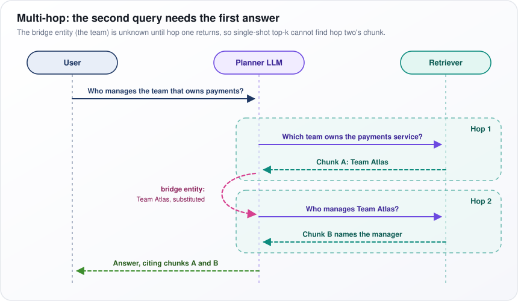</p>

*Figure: the second query cannot be written until the first hop returns the bridge entity.*

**Watch out:** errors compound across hops; a wrong team in hop one guarantees a wrong manager. Cap at 3–4 hops, cite each hop, and test on a multi-hop question set.

---

## 14. What is the "lost in the middle" problem in RAG systems?

**LLMs use information at the start and end of a long prompt more reliably than information in the middle. In RAG, this means adding more chunks can lower accuracy, because the chunk holding the answer may land mid-prompt, where the model half-ignores it.**

**The idea.** It is like a long meeting: people remember the opening and the last thing said, and the middle blurs. Give a model 20 retrieved passages and it answers well if the right one is 1st or 20th, noticeably worse if it is 10th.

**The evidence.** The 2023 study that named the effect gave models 10, 20 or 30 documents, exactly one containing the answer, and moved that document through every position. Accuracy traced a U-shape: high at both ends, lowest in the middle. For one model, accuracy with the answer mid-prompt fell below its accuracy with no documents at all, answering from memory alone.

**Why it happens (likely causes)**
- Attention, the mechanism a transformer (the network design behind LLMs) uses to decide which tokens (words or word pieces) to focus on, tends to concentrate on the first tokens and the most recent ones.
- Similar-but-wrong passages (distractors) compete with the right one for that attention, which makes it worse.

**Mitigations**
1. Rerank (rescore with a more careful model) and send 3–8 good chunks, not 20–50 mediocre ones.
2. Put the strongest chunks first and last, weaker ones in the middle.
3. Put the question after the context, so it is fresh when the model starts answering.

Newer models show less of the effect, but long-context benchmarks built with distractors (RULER, for example) still find that the context a model uses well is shorter than the context window (the maximum prompt length) it advertises.

**Watch out:** the number of chunks, k, is a setting with a cost, not "more is safer". Plot answer accuracy against k on your test set: it typically rises, peaks, then falls.

---

## 15. How do you evaluate a RAG system? Explain faithfulness, relevance, and context precision/recall.

**Grade retrieval and generation separately against a set of test questions, because they fail for different reasons and need different fixes. Context precision and context recall grade the retriever; faithfulness and answer relevance grade the generator.**

**The idea.** Take the question "What is the refund window, and does it cover sale items?" The reference answer (a correct answer written in advance) has two facts: "30 days" and "sale items excluded". The system retrieves 5 chunks; 2 are relevant and mention "30 days", but none has the sale-items rule. It answers: "30 days, and sale items can be refunded too."
- Context precision: 2 of 5 chunks relevant, about 0.4 before rank weighting.
- Context recall: 1 of 2 reference facts is in the retrieved text: 0.5.
- Faithfulness: 1 of the answer's 2 claims is supported by the retrieved text: 0.5. The second was invented.
- Answer relevance: high; it did address the question.

Each number points to a different fix.

**Definitions**
- Context precision: the share of retrieved chunks that are relevant, weighted so relevant chunks near the top count more.
- Context recall: the share of the reference answer's claims that can be found in the retrieved context.
- Faithfulness: supported claims ÷ all claims in the answer. It measures grounding (sticking to the sources), not truth: a faithful answer from an outdated document is still wrong.
- Answer relevance: whether the answer addresses the question rather than dodging it or answering part.

These are usually scored by an LLM acting as judge; check the judge against a sample of human grades before trusting it. Where the correct chunks are labeled, also compute recall@k (how often the correct chunk is in the top k) and nDCG@10 (a score that rewards ranking it near the top), which need no judge.

The table maps score patterns to where the problem lives.

| Pattern | Problem is in |
|---|---|
| Low context recall | Ingestion or retrieval |
| High recall, low precision | Too much noise: rerank, lower k |
| High recall, low faithfulness | Generator: prompt, model, ordering |
| Faithful, low answer relevance | Question understanding |

**Watch out:** include questions whose answer is not in the documents. Without them, a system that never says "I don't know" scores well offline and hallucinates in production.

---

## 16. Explain Self-RAG. How does the model decide when to retrieve?

**Self-RAG (a 2023 research method) fine-tunes (further trains) an LLM to write special "reflection tokens" into its own output, so it decides for itself, segment by segment, whether to retrieve, and then grades its own work. Retrieval fires when the model's probability of writing Retrieve = yes is above a threshold you can tune at inference time (when the model is used, not trained).**

**The idea.** Ordinary RAG always retrieves, even for "write a haiku about autumn". Self-RAG is like a writer who pauses before each sentence and asks, "Do I need a source here?" For "the population of Lagos is…" it does; for the haiku it does not. After writing, it asks, "Did the source support what I wrote?"

The reflection tokens are special vocabulary items the model learns to emit; the table lists each one, its possible values and the question it answers.

| Token | Values | Question |
|---|---|---|
| Retrieve | yes, no, continue | Retrieve before the next segment? |
| ISREL | relevant, irrelevant | Is this passage relevant? |
| ISSUP | fully, partially, no support | Does the passage support my segment? |
| ISUSE | 1 to 5 | Is the response useful? |

**How it decides and generates**
1. Before each segment (roughly a sentence), the model predicts the Retrieve token. If the probability of "yes" is above the threshold, it retrieves. Lower the threshold for fact-heavy tasks; raise it for open-ended writing.
2. After retrieving, it writes one candidate continuation per passage, in parallel.
3. It scores each candidate by its log-probability (how likely the model finds its own text) plus weighted probabilities of good critique tokens (ISREL relevant, ISSUP fully supported, high ISUSE). It keeps the best using segment-level beam search, which carries a few best partial answers forward, not just one.

**How it is trained.** A separate critic model learns the reflection labels from examples labeled by a strong LLM. The critic then annotates a large training corpus (collection of text) offline, and the generator trains on that annotated text with the normal objective of predicting each next token.

**Watch out:** it needs a specially fine-tuned model, which rules out closed models you can only call through a vendor's API. There, build the same pattern from parts: a router that decides whether to retrieve, a relevance grader for chunks, and a check that the answer is supported (the corrective and adaptive RAG patterns).

---

## 17. What is GraphRAG, and when would you use it over traditional RAG?

**GraphRAG uses an LLM to build a knowledge graph (a network of entities and the relationships between them) from your documents, then answers by searching that graph and summaries of its clusters. Use it for questions about relationships across documents, and for "global" questions about the whole collection that no single chunk can answer.**

**The idea.** Ask ordinary RAG "What are the main risk themes across 5,000 incident reports?" and it retrieves the 5 most similar chunks (document pieces), a tiny sample of the evidence. GraphRAG prepares ahead of time: it maps who and what appears in the reports, groups related things into clusters ("supplier delays", "software outages"), and writes a summary of each cluster. The question then reads the cluster summaries, not five random chunks.

**Indexing**
1. An LLM reads every chunk and extracts entities (people, systems, organizations), the relationships between them, and claims.
2. These merge into one graph: entities are nodes, relationships are edges.
3. A community-detection algorithm called Leiden finds groups of tightly connected entities, at several levels of detail.
4. An LLM writes a summary of each community.

**Querying**
- Local search, for specific questions: find the entities the question mentions, then pull their neighbors and source chunks.
- Global search, for whole-collection questions: map-reduce over the community summaries, meaning each summary contributes a partial answer (map) and the partial answers are combined (reduce).

**Read the figure.** The green INDEXING band, labeled "one or more LLM calls per chunk", runs Chunks, LLM extracts, Entity graph, Leiden communities (the purple and orange circles), Community summaries. In the blue QUERY band, the Query goes either to Local search, fed by the entity graph, or to Global search, fed by the summaries.

<p align="center">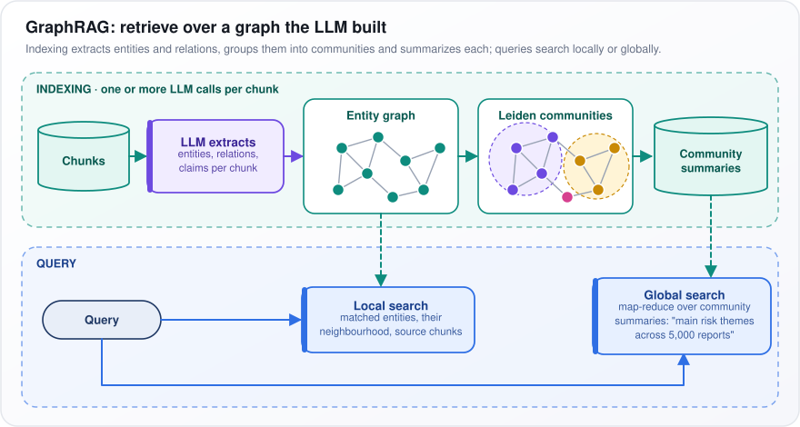</p>

*Figure: indexing builds an entity graph and community summaries; queries search the graph locally or the summaries globally.*

**Watch out:** indexing costs at least one LLM call per chunk, updates mean re-extracting, and extraction mistakes spread through the graph. Add it only where your evaluation shows plain vector RAG failing, and try a lighter entity index first.

---

## 18. Vectorless RAG

**Vectorless RAG retrieves without an embedding index (a store of meaning vectors searched by similarity). The term can cover keyword search, SQL or API calls, but as of 2025–26 it usually means letting an LLM navigate a document's own structure, such as its table of contents, to the sections that answer the question, the way a person would.**

**The idea.** Given a 300-page annual report and the question "How exposed is the company to rising interest rates?", you would not read random paragraphs that sound similar. You would open the contents, go to the financial notes, and read "Note 14: Borrowings". Vectorless RAG makes the model do the same.

**How it works**
1. At indexing, turn each long document into a tree of chapters, sections, subsections and pages. Each node gets its title and a short LLM-written summary.
2. At query time, the LLM reads the top level of the tree and picks the promising branches.
3. It opens those, reads their children's summaries, and picks again, until it reaches specific sections.
4. It reads the chosen sections in full and answers, citing them.

**Why it can beat vectors**
- Similarity is not relevance. In the annual report, generic risk boilerplate ("we are exposed to interest rate risk") looks more like the question than the note with the actual debt figures, so vector search ranks the boilerplate first.
- It can follow cross-references such as "see Note 14", which similarity search cannot.
- There are no chunking artifacts: sections are read whole, with their tables and footnotes.

**Where it fits:** long, well-structured documents such as financial filings, contracts, regulations and technical manuals, when the handful of relevant documents is already known.

**Watch out:** each query takes several sequential LLM calls, so it is slow and costly, and it does not scale to large collections (a rough limit is a few hundred long documents). Pair it with a cheap search that first picks the right documents.

---

## 19. How do you handle structured data (tables, SQL databases) in a RAG pipeline?

**Do not embed database rows (turn them into search vectors). Route data questions to a query engine instead: the LLM writes SQL against the schema (the list of tables and columns), the database computes the exact answer, and the LLM explains the result. Embed only what describes the data: schema documentation, table summaries, and small tables that sit inside documents.**

**The idea.** "What was total revenue in Germany last quarter?" needs every matching row added up. Vector search returns the 10 most similar rows, and summing 10 of 40,000 rows gives a confidently wrong number. Databases do this exactly.

**How it works (text-to-SQL)**
1. Route: a classifier or small LLM call decides whether the question is about documents or data.
2. Retrieve context for the SQL writer: relevant tables, column descriptions, business definitions ("revenue means net of refunds") and verified question-to-SQL examples. A semantic layer, a curated map from business terms to tables and formulas, beats a raw schema.
3. The LLM writes SQL, which is validated: read-only credentials, a parser that rejects any statement that changes data or tables (DML and DDL, such as UPDATE or DROP), a row LIMIT and a timeout.
4. Execute it as the user, so the database's own row-level security (rules on which rows each user may read) decides what they may see.
5. The LLM answers from the returned rows and shows the SQL.

Tables inside documents differ: convert them to Markdown (a plain-text table format), repeat the header row in every chunk, and embed a one-line summary.

**Read the figure.** At the yellow Documents or data? diamond, "documents" goes up to Vector + keyword RAG; "data" runs along the bottom through Retrieve context, LLM writes SQL, Validate and Execute as the user, and "rows" rise to LLM answers, which returns Answer + the SQL used.

<p align="center">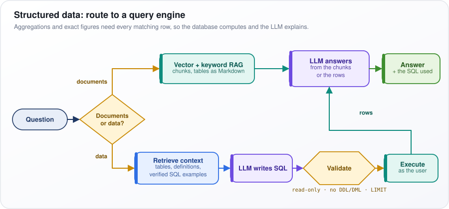</p>

*Figure: document questions go to RAG; data questions become validated SQL that the database runs as the user.*

**Watch out:** SQL that runs but means the wrong thing (a bad join, the wrong definition of "active customer") looks authoritative. Keep question-to-result regression tests; always show the SQL.

---

## 20. What are the common failure modes of RAG systems, and how do you debug them?

**Find the stage that lost the answer, using per-query traces (logs of what each stage returned) and a test set. The stages are ingestion (loading and parsing documents), retrieval, ranking, context assembly and generation. Do not start by editing the prompt.**

**The idea.** A user asks "What is the warranty on the X200?" and gets "one year"; the truth is two. Five different bugs produce that same wrong answer: the X200 manual was never ingested; the parser mangled the warranty table; the right chunk ranked 40th; it was retrieved but cut when the prompt got too long; or the model ignored it and answered from memory. Each needs a different fix, so guessing wastes weeks.

**The walk for one failed query.** Ask in order; the first "no" is the bug.
1. Is the answer in the source documents at all?
2. Is it readable in the stored chunk text?
3. Is the right chunk in the first-stage top 100?
4. Is it in the reranked top-k, the few chunks kept for the prompt?
5. Is it in the final prompt the model saw?
6. If yes to all, replay that exact prompt: the generator is the problem.

The table lists common failures, how to check for each, and the typical fix.

| Failure | Check | Typical fix |
|---|---|---|
| Missing content | Search the raw sources | Add the source; test refusal |
| Bad parsing | Read the stored chunk text | Layout-aware parser, OCR |
| Bad chunking | Is the answer split across chunks? | Structure-aware or parent-child |
| Retrieval miss | Gold chunk's rank in the top 100 | Hybrid search, query rewriting |
| Ranking miss | Rank before and after reranking | Reranker, candidate count |
| Not in context | Inspect the final prompt | Token budget, ordering, dedupe |
| Unfaithful answer | Faithfulness score | Quote-then-answer, stronger model |
| Stale or conflicting | Dates and sources of chunks | Freshness pipeline, rank official sources higher |

Terms: the gold chunk is the one known to hold the answer; OCR (optical character recognition) reads text from scanned images; parent-child chunking searches small chunks but returns their larger section; quote-then-answer makes the model copy supporting quotes before answering.

**Make it routine**
- Log per request: original and rewritten query, chunk IDs and scores at each stage, the final prompt, and model and index versions.
- Classify about 50 failures by stage and invest in the biggest bucket.

**Watch out:** teams over-invest in prompt wording, yet in practice the largest bucket is usually content, parsing and retrieval (a practitioner rule of thumb, which your own classification should confirm).

---

## 21. How do you handle document updates and maintain freshness in a RAG system?

**Update the index one document at a time as sources change: detect the change, re-embed only what changed, swap the document's chunks without a gap, carry deletions through, and measure the delay against a freshness target (a service-level agreement, or SLA).**

**The idea.** HR edits one paragraph of a 40-page handbook. Rebuilding the whole index nightly is slow, costly and leaves the answer stale until morning. Instead, the edit updates that handbook alone, re-embedding (recomputing search vectors for) only the chunks whose text changed.

**How it works**
1. Detect changes: change data capture (CDC, a stream of every database insert, update and delete), webhooks (the source calls you on a change), or polling modified timestamps.
2. Skip no-op saves: compare a content hash (a short fingerprint of the text) with the stored one; if it matches, nothing changed.
3. Use stable IDs: `doc_id` from the source, `chunk_id` from the document ID plus the chunk's hash, so unchanged chunks keep their IDs and embeddings.
4. Upsert (insert or update) without a gap: write the new chunks, flip a "current version" pointer, then delete the old ones. Delete-then-insert leaves a window where the document is missing.
5. Propagate deletions: a nightly reconciliation compares source IDs with index IDs and removes orphans (chunks whose document is gone). Many vector indexes only mark deletions (tombstones), so compact them periodically.
6. Invalidate cached answers that cite a changed document. A new embedding model instead means rebuilding the index beside the old one and switching over (a blue-green rebuild).

**Read the figure.** Source systems feed the Change queue. At the yellow Content hash changed? diamond, "no" goes to Skip (no-op save) and "yes" to Parse, chunk, embed. Upsert, no gap then writes into the Search index and triggers the red Invalidate cached answers; Nightly reconciliation sweeps orphans.

<p align="center">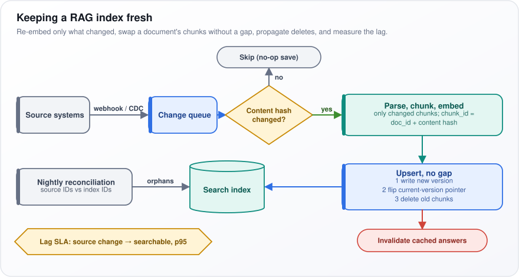</p>

*Figure: only changed content is re-embedded, swapped in without a gap, and cached answers that cite it are invalidated.*

**Watch out:** measure ingestion lag, the time from source change to searchable, at the 95th percentile (p95) for each source. Without it, users discover staleness before your dashboards do.

---

## 22. How do you optimize RAG for latency in production?

**Measure how long each stage takes before optimizing anything. The LLM call usually dominates, so the biggest wins come from fewer prompt tokens, fewer LLM calls, streaming the answer, and caching.**

**The idea.** A typical request might spend 20 ms on search, 100 ms reranking, 800 ms before the first answer token appears, and 3 seconds writing a 300-token answer at 100 tokens (words or word pieces) a second: about 3.9 seconds in all. Cutting search from 20 ms to 5 ms is invisible; halving the prompt or the answer is not.

Two LLM timings matter. Prefill is the model reading the prompt; it grows with prompt length and sets the time to first token (TTFT). Decoding is writing the answer one token at a time; it grows with output length. The table gives typical per-stage times (rules of thumb that vary with hardware and model) and the main lever for each.

| Stage | Typical latency (rule of thumb) | Lever |
|---|---|---|
| Query rewrite LLM call | 200 ms – 1 s | Skip on first turns, small model |
| Query embedding | 10–50 ms plus network | Self-host, cache |
| ANN and BM25 search | 5–50 ms | Tune `ef_search`, run legs in parallel |
| Rerank | 30–300 ms | Fewer candidates, distilled model |
| LLM time to first token | 0.2–2 s | Fewer chunks, prefix caching |
| LLM decoding | Output tokens ÷ tokens per second | Shorter answers, smaller model |

Terms: query embedding turns the question into a vector for search; BM25 is keyword search; ANN is approximate nearest-neighbor vector search, and `ef_search` sets how widely it explores (lower is faster but less accurate). A distilled model is a small model trained to imitate a bigger one. Prefix caching reuses the already-processed start of a prompt that repeats across requests.

**The levers**
1. Stream tokens as they are generated, so perceived latency becomes TTFT, not total time.
2. Rerank down to 3–5 chunks: a shorter prompt means faster prefill.
3. Keep a stable prompt prefix (identical instructions first), so the provider's prompt caching applies.
4. Route: skip retrieval for small talk, use a small model for easy questions, and keep agent loops for hard ones.
5. Run keyword and vector search, and independent sub-queries, in parallel.

**Watch out:** a semantic cache (reusing a stored answer when a new question looks similar to an old one) can answer a similar but different question, or leak answers across users. Key it by permission set and index version, and keep its similarity threshold high.

---

## 23. What is the role of metadata filtering in RAG systems?

**Metadata filtering restricts a search to chunks whose attributes match rules, such as tenant, permissions, document type, product or date, so similarity ranking happens only inside the allowed set. It enforces security and scope, which similarity alone cannot express.**

**The idea.** A customer asks "How do I configure single sign-on?" Your index holds instructions for product versions 3, 4 and 5, from several customer companies (tenants). The most similar chunk might be version-3 instructions from another tenant's private notes. Similarity cannot know that is wrong; the filter `tenant = acme AND version = 5` can.

**Uses**
- Security: mandatory tenant and access-control-list (ACL) group filters on every query.
- Scope and recency: product version, region, `is_current = true`.
- Self-querying: an LLM turns "EU parental leave policy in 2024" into a meaning-based query ("parental leave policy") plus the filters `region = EU` and `year = 2024`.

**How engines apply filters.** Vector search usually walks an approximate nearest-neighbor (ANN) index such as HNSW (hierarchical navigable small world: a layered graph linking each vector to its near neighbors). Filters can meet that graph in three ways; the table shows each and its weakness.

| How the engine filters | Problem |
|---|---|
| Post-filter: ANN top-k, then drop non-matches | A selective filter can leave few or no results |
| Pre-filter: exact search over matching IDs | Exact, but slow on large subsets |
| Filtered ANN: traverse HNSW accepting only matches | Very restrictive filters fragment the graph; engines fall back to brute force |

- Post-filter example: take the top 10 by similarity, then drop non-matches. If only 1% of chunks belong to the user's tenant, you may keep none of the 10.
- Pre-filter: list every matching chunk first, then compare the query with each one. Correct, but slow when the matching set is large.
- Filtered ANN: walk the graph but accept only matching nodes. When very few nodes match, the graph falls apart into disconnected pieces, so engines switch to brute-force comparison over the matches.

**Watch out:** filters an LLM extracts can silently exclude the answer (it guesses `year = 2024` when the policy was issued in 2023). Use them as ranking boosts unless the user explicitly scoped the question, and test recall under your most selective filters.

---

## 24. Compare RAG vs fine-tuning. When would you use each?

**RAG changes what the model can see when it answers; fine-tuning changes how it behaves. Use RAG for knowledge that changes, is private, must be cited or is permissioned. Fine-tune for format, tone, a task skill, or to make a small model cheap and good at a narrow task.**

**The idea.** Think of a new employee. RAG is access to the company wiki: they look facts up when needed, and when a policy changes you edit the wiki. Fine-tuning is training: it teaches them to write replies in house style or to sort tickets. You would not make them memorize every policy, because they would misremember, and you could not "un-teach" one after it changed.

Fine-tuning means continuing to train a pre-trained model on your own examples, adjusting its weights (the numbers it learned in training). The table compares the two on what usually decides the choice.

| | RAG | Fine-tuning |
|---|---|---|
| Updating knowledge | Re-index a document: minutes | Retrain and re-evaluate: hours to days |
| Citations and ACLs | Yes, per chunk and per user | No |
| Removing a fact | Delete the document | No reliable method |
| Runtime cost | Retrieval plus longer prompts | None added; shorter prompts |
| Good at | Facts, freshness, long tail | Style, format, classification |

Terms: ACLs (access-control lists) define who may see what; the long tail is rare facts a model is unlikely to have learned.

**What research found**
- A 2023 study found RAG beat unsupervised fine-tuning (training on raw documents) at giving models new facts.
- A 2024 study found models learn genuinely new facts slowly during fine-tuning, and hallucinate (invent facts) more as they learn them.

**They combine well**
- RAFT (retrieval-augmented fine-tuning) trains the generator (the answer-writing model) to answer from supplied documents and ignore irrelevant ones.
- Fine-tuning the embedding model (which turns text into search vectors) or the reranker (the second-stage scorer) on your domain improves retrieval itself.

**Position:** start with RAG and a good prompt; fine-tune only for a behavior gap that prompting cannot close.

**Watch out:** "fine-tune it on our documents" as a way to add knowledge is almost always the wrong call: slow to update, no citations, no permissions, and more invented facts.

---

## 25. Long context windows keep getting cheaper. When should you use retrieval (RAG) vs putting everything in the context window?

**Put everything in the context window when the content is small, the task needs all of it, and queries are rare. Use retrieval when the collection is much bigger than a comfortable share of the window, queries are frequent, or you need citations, permissions and predictable cost.**

**The idea.** The context window is how much text a model can read in one request; as of 2025–26, many models accept hundreds of thousands of tokens (words or word pieces), some a million or more. Reviewing one 200-page contract? Put it all in: the task needs the whole document. Answering 50,000 employee questions a day over 2 million documents? It will not fit, and even if it did, you would pay to reread everything for every question.

The table contrasts the situations that favor each approach.

| Long context | RAG |
|---|---|
| One contract, a few reports | Thousands to millions of documents |
| Whole-document reasoning | Lookups over a small subset |
| Low QPS, or a cached static prefix | High QPS, cost matters |
| Everyone may see everything | Per-user permissions and audit |

Terms: QPS is queries per second; a cached static prefix is prompt text repeated identically across requests, which providers can bill at a discount.

**The arithmetic**
- Input cost scales with input tokens. Stuffing 400,000 tokens instead of retrieving 5,000 is 400,000 ÷ 5,000 = 80 times the input per query, plus seconds of prefill (the model reading the prompt before the first answer word).
- Prompt caching (offered by several providers as of 2025–26) discounts a repeated prefix, but does not remove the latency or the quality loss below.
- Usable context is smaller than advertised. Benchmarks full of distractors (similar-but-wrong passages) and the "lost in the middle" effect show accuracy degrading well before the window is full.

**Position:** go hybrid. Retrieve the right 3–10 documents, then pass them whole instead of as 300-token fragments. Long context removes the need for tiny chunks, not the need for retrieval.

**Watch out:** a stuffed prompt has no permission model: anything in it can surface in the answer, so per-user access control still needs filtering at retrieval time.

---

## 26. What is query transformation in RAG (HyDE, query decomposition, step-back prompting)?

**Query transformation rewrites the user's question into one or more search queries that retrieve better, because people ask differently from how documents are written. HyDE searches with a hypothetical answer, decomposition splits compound questions, and step-back prompting also retrieves the general principle.**

**The idea.** A user types "can I bring my dog?" The policy says "Animals, other than registered assistance animals, are not permitted on the premises." Few words overlap. If an LLM first drafts a plausible answer, "Pets are generally not allowed except assistance animals", the draft uses the document's own vocabulary, and searching with it finds the policy.

The table lists the main techniques, how each works, and when it backfires.

| Technique | Mechanism | Fails when |
|---|---|---|
| HyDE | An LLM drafts a plausible answer; embed it, averaged with the query | The LLM does not know the domain, so retrieval is steered wrong |
| Decomposition | Split into sub-questions; retrieve each; merge | Simple questions: pure added latency |
| Step-back | Also ask the abstract question ("rules for X in general") | Background adds noise |
| Conversational rewrite | Resolve pronouns from chat history into a standalone query | Rarely; near mandatory |
| Multi-query | Several paraphrases fused with RRF | Retrieval cost and noise multiply |

**How the main ones work**
- HyDE (hypothetical document embeddings): embed the drafted answer (turn it into a vector, a list of numbers capturing its meaning), often averaged with the question's own embedding, and search with it. Answer-to-document similarity is usually higher than question-to-document similarity. The draft is only used for searching, never shown to the user.
- Decomposition: "Compare the refund policies of plans A and B" becomes two sub-questions. Independent ones run in parallel, dependent ones in order.
- Step-back: for "Can a contractor in Spain expense a home desk?", also search "What are the home-office expense rules?", because the specific case may not be written down while the general rule is.
- Conversational rewrite: in a chat, "what about for managers?" means nothing alone; rewrite it from the history into "What is the parental leave policy for managers?"
- Multi-query: several paraphrases, merged with reciprocal rank fusion (RRF, which combines ranked lists by position).

**Position:** conversational rewrite is essentially mandatory in chat. Every other technique adds an LLM call, so each must earn its place on your evaluation set and be routed only to the question types it helps.

**Watch out:** HyDE backfires when the model does not know the domain: a confident but wrong draft steers retrieval toward the wrong documents.

---

## 27. How do you implement citation and source attribution in RAG?

**Give every chunk a stable ID in the prompt, make the model cite an ID (ideally with an exact quote) for each claim in structured output (fixed, machine-readable fields), and verify every citation in code before showing it. A citation the model writes is a claim, not proof.**

**The idea.** The model answers: "Remote staff get a USD 500 equipment allowance [S3]." Three things could be wrong. S3 might not exist (invented). S3 might exist but not contain that text. Or S3 might contain similar text that does not say this, for example "USD 500 for managers only". Each needs its own check.

**How it works**
1. Format each chunk in the prompt with an ID and a readable location: `[S3] (Title, Section 4.2, p. 17) text`. Metadata stores the URL and anchor for the link shown to the user.
2. Ask for structured output: a list of claims, each with a `source_id` and a verbatim `quote`.
3. Check the ID was actually supplied in this prompt. This catches invented IDs.
4. Check the quote appears in the cited chunk, after normalizing whitespace and case. This catches misquotes.
5. Check the quote supports the claim, using an NLI model (natural language inference: a classifier that says whether one text entails, contradicts or is neutral toward another) or an LLM judge. Drop or flag claims that fail.
6. Track citation precision (the share of citations that support their claim) and citation recall (the share of claims backed by a supporting citation).

The code below implements checks 3 and 4 and leaves the support check (step 5) as a separate stage.

```python
import re
from dataclasses import dataclass

@dataclass
class Claim:
    text: str
    source_id: str
    quote: str

def normalize(s: str) -> str:
    return re.sub(r"\s+", " ", s).strip().lower()

def verify_citations(claims: list[Claim], chunks: dict[str, str]) -> list[tuple[Claim, str]]:
    """Label each claim ok, unknown_source or quote_not_found."""
    results = []
    for claim in claims:
        chunk = chunks.get(claim.source_id)
        if chunk is None:
            results.append((claim, "unknown_source"))
        elif normalize(claim.quote) not in normalize(chunk):
            results.append((claim, "quote_not_found"))
        else:
            # The quote exists; an entailment check must still confirm it supports the claim.
            results.append((claim, "ok"))
    return results
```

**Watch out:** the hardest failure is a real, correctly formatted citation to a chunk (or an outdated version of it) that does not support the claim. Only the support check in step 5 catches it.

---

## 28. How do you scale a RAG system to millions of documents?

**At millions of documents the hard problems are memory, ingestion speed and day-to-day operations, not the search algorithm. Scale by searching approximately, compressing vectors, splitting the index into slices and across machines, and letting a careful second stage fix a slightly lossy first stage.**

**The idea.** Start with the arithmetic. Each chunk is a vector (a list of numbers), and each number takes 4 bytes in the standard float32 format, so 50 million chunks × 768 dimensions × 4 bytes ≈ 154 GB before index overhead: too much for one machine's memory; disk search is slow.

**How it works**
1. Approximate nearest-neighbor (ANN) indexes avoid comparing every vector. HNSW (a layered graph that search hops through) is fast but memory-hungry; IVF (inverted file) groups vectors into clusters and searches only the `nprobe` nearest clusters; disk-based graph indexes reach billions of vectors.
2. Compress. int8 stores each number in 1 byte (4× smaller). Product quantization (PQ) splits a vector into pieces and stores a short code per piece (tens of bytes per vector). Binary keeps one bit per number (32× smaller). Then rescore the top few hundred at full precision to recover accuracy.
3. Partition by tenant (customer organization) or document type so each query searches one slice. Shard (split an index across machines) for size and replicate (copy it) for more queries per second; a query goes to every shard and results are merged (scatter-gather).
4. Ingestion: distributed parsing is usually the bottleneck, and re-embedding everything is a multi-day, budgeted job.

**Read the figure.** The Router scatters the Query across the shards (dashed scatter-gather box); Merge collects the top candidates for the yellow Rescore (full precision) and Rerank before the LLM. The grey Memory panel repeats the arithmetic.

<p align="center">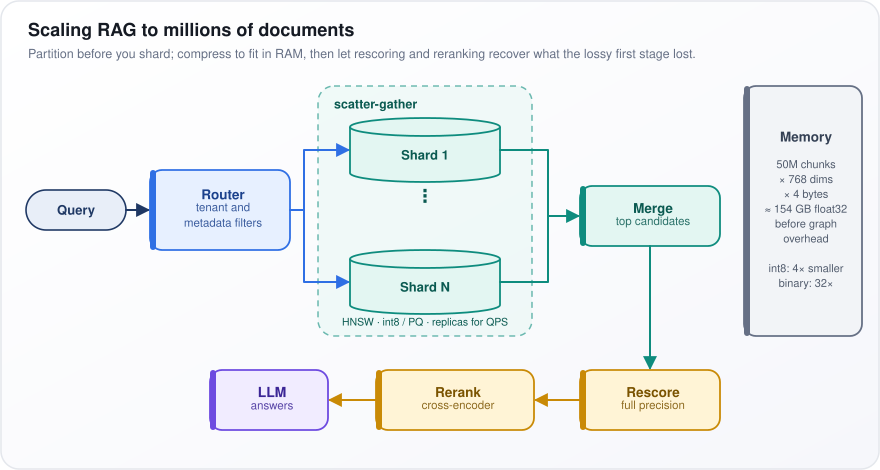</p>

*Figure: compressed shards give a fast, lossy first pass, and full-precision rescoring plus reranking recover the accuracy.*

**Position:** partition before you shard. Many "100-million-chunk" systems are really thousands of small, faster, naturally isolated per-tenant indexes.

**Watch out:** recall (the share of test questions whose right chunk is found) quietly drops as the corpus grows; re-run your test set at every tenfold growth.

---

## 29. What is parent-child chunking, and how does it improve retrieval?

**Index small child chunks for precise matching, but hand their larger parent section to the LLM. This separates the unit you search (small, so its meaning vector is sharp) from the unit the model reads (big enough to answer from).**

**The idea.** A policy section opens with a definition of "eligible employee", then a table of leave days, then "Exceptions: contractors receive…". The question "How much leave do contractors get?" best matches the one sentence about contractors, but that sentence alone lacks the table and the definition. Parent-child searches on the sentence and gives the model the whole section.

**How it works**
1. Split each document into parents: sections, or roughly 1,000–2,000 tokens (words or word pieces).
2. Split each parent into children of roughly 100–300 tokens, or single sentences. Each child stores its `parent_id`.
3. Embed and index only the children.
4. At query time, retrieve about 20 children, map them to their parents, remove duplicate parents, rank parents by their best child's score, and keep 3–5.
5. Send those parents to the LLM.

**Variants**
- Sentence-window: retrieve one sentence, return it with N neighboring sentences on each side.
- Auto-merging: return the whole parent only once enough of its children match; otherwise return just the children.

**Read the figure.** The Query arrow hits the green Child 2 · best match inside the dashed Parent · Section 4.2 box. The "return parent" arrow sends all of Section 4.2 to the purple LLM context box ("definitions, exceptions, table header"), while Section 4.3 and its Child 3 are left out. The grey At query time box lists the steps.

<p align="center">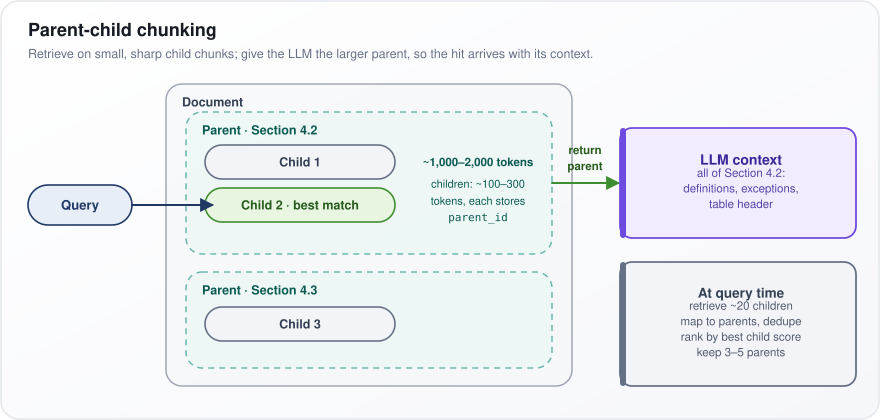</p>

*Figure: the search hits a small child chunk, and the model receives the whole parent section around it.*

**Watch out:** five 1,500-token parents is 7,500 tokens of prompt, so cap how many parents you send. It pays off on manuals and policies and adds little for short FAQs.

---

## 30. Your RAG system is hallucinating despite having the right context. How do you fix it?

**First prove the right context reached the model intact. If it did, strengthen grounding: make the model quote before it answers, give it an explicit "not in the sources" option, remove distracting chunks, and check the answer against its sources after generation.**

**The idea.** "Hallucinating (inventing facts) despite the right context" is often not quite true. Replay the exact prompt of a failing case and you may find the key chunk was cut off by a token limit, buried at position 12 of 20, or a table flattened into an unreadable run of numbers. Only when the model had clean evidence and still contradicted it is it a real grounding failure.

**How to fix it**
1. Replay the final prompt for failing cases, and fix truncation, ordering or parsing first.
2. Quote-then-answer: have the model first copy the exact sentences that support the answer, then answer only from those quotes. It must find evidence before it writes.
3. Give it an exit: "If the sources do not contain the answer, say so." Without one, the model fills gaps from memory.
4. Send fewer, better chunks after reranking, and use a low temperature (less randomness in word choice) for factual questions.
5. If the model's prior knowledge wins, for example it "knows" last year's policy and prefers it, state that the sources override its own knowledge, try a stronger model, or fine-tune (further train) for grounding (RAFT trains a model to answer from supplied documents and ignore distractors).
6. Post-check: split the answer into individual claims and verify each against its cited chunk with an NLI model (a classifier that tests whether one text supports another) or an LLM judge. Then regenerate, or return only the supported part.

Track faithfulness (supported claims ÷ all claims) on your test set so you can see whether each change helped.

**Watch out:** the post-check adds a few hundred milliseconds to about a second per answer, so apply it to high-stakes answers, or to a sample for monitoring.

---

## 31. Your RAG chunk overlap causes redundant results. How do you reduce redundancy?

**Overlap makes neighboring chunks share text, so they get nearly identical vectors (lists of numbers) and fill the top results with near-copies. Reduce overlap at indexing, merge adjacent hits at query time, and pick diverse results with maximal marginal relevance (MMR).**

**The idea.** With 512-token chunks and 25% overlap, chunks 7 and 8 of a manual share 128 tokens. A question about that shared paragraph retrieves chunk 7, chunk 8, and perhaps a duplicate file's copy: three of your top 5 slots hold one paragraph.

**Fixes, from indexing to query time**
1. Split on structure (headings, paragraphs), so chunks rarely cut mid-thought and heavy overlap becomes unnecessary. Parent-child chunking needs no overlap at all.
2. Store each chunk's character offsets (its start and end in the document), and merge overlapping or touching hits from one document into a single passage.
3. Cap chunks per document (say 2) unless the question targets one document.
4. Re-select with MMR, which picks results one at a time, each time taking the candidate most relevant to the query and least similar to what is already chosen. Put as a formula:

```math
\text{MMR}=\arg\max_{d_i\in R\setminus S}\Big[\lambda\,\text{sim}(d_i,q)-(1-\lambda)\max_{d_j\in S}\text{sim}(d_i,d_j)\Big]
```

$`R`$ is the candidate list and $`S`$ the results picked so far, so $`d_i \in R \setminus S`$ means "any candidate not yet picked". $`\text{sim}(d_i, q)`$ is its similarity to the query; the max term is its similarity to the closest already-picked result. $`\lambda`$ (lambda, between 0 and 1) sets the balance: 1 is pure relevance, 0 pure diversity. "arg max" means "choose the candidate with the highest value".

Worked example with $`\lambda = 0.7`$: candidate A has relevance 0.90 but is 0.95 similar to a chosen result, scoring $`0.7 \times 0.90 - 0.3 \times 0.95 = 0.345`$. Candidate B has relevance 0.80 and similarity 0.30, scoring $`0.56 - 0.09 = 0.47`$. B wins, although A was more relevant.

**Watch out:** too much diversity (a low $`\lambda`$) drops neighboring passages the answer genuinely needs. Start $`\lambda`$ around 0.5–0.7 (a common starting range) and watch context recall (whether the retrieved chunks still hold everything the answer needs) on your test set.

---

## 32. Your RAG retrieval is too slow with a large knowledge base. How do you speed it up?

**Profile first: time the embedding call, vector search, filtering, reranking and network separately, then fix the slowest stage. For the vector search itself: approximate search instead of exact, tuned search settings, compressed vectors held in memory, partitions, and only then more machines (shards).**

**The idea.** With 20 million chunks, exact search compares the query with every vector: 20 million comparisons per query. Approximate nearest-neighbor (ANN) indexes visit a small fraction, the way you find a word in a dictionary without reading every page. But the time often hides elsewhere: an index too big for memory that reads from disk, or a reranker scoring 200 candidates on an ordinary processor (CPU) instead of a graphics chip (GPU).

The table lists the main levers, what each speeds up, and what it costs.

| Lever | Effect | Cost |
|---|---|---|
| Flat to HNSW or IVF | Visit a fraction of vectors instead of all $`N`$ | Recall below 100%, memory |
| Lower `ef_search` or `nprobe` | Fewer hops or clusters | Lower recall |
| int8, PQ or binary quantization | Index fits in RAM, faster distances | Recall loss, mostly recovered by rescoring |
| Matryoshka truncation | Distance cost grows in step with vector length | Small quality loss |
| Partition by tenant or product | Each query searches less | Needs reliable metadata |
| Fewer rerank candidates | Rerank cost grows in step with candidates | Lower recall ceiling |

Terms: recall is the share of queries whose right chunk is found; flat means exact search over all $`N`$ vectors. HNSW is a graph index, and `ef_search` sets how many graph nodes it explores; IVF groups vectors into clusters, and `nprobe` sets how many clusters it searches. Quantization stores vectors in fewer bits: int8 one byte per number, PQ (product quantization) short codes, binary one bit. Matryoshka embeddings are trained so their first, say, 256 of 1,024 numbers work on their own, so you can truncate them.

**Common culprits**
- The index outgrows memory (RAM) and spills onto slow disk.
- Post-filtering scans far past the top k to find matches.
- A very selective filter makes the engine fall back to brute force.
- An embedding API called across regions.

**Choosing settings.** Run your test set at several settings and plot recall@k (did the right chunk make the top k?) against p95 latency (the time 95% of queries beat). Pick the knee, where extra speed starts costing a lot of recall. Quantization with full-precision rescoring of the top candidates, plus `ef_search` tuning, often buys around an order of magnitude before you need to shard (a rough rule of thumb).

**Watch out:** the fastest setting silently trades away recall, and the reranker cannot recover what the first stage dropped.

---

## 33. Your RAG system returns duplicate results. How do you deduplicate?

**Remove duplicates when documents are ingested, so the index holds one official copy, and again at query time as a safety net.**

**The idea.** The same travel policy lives in two document systems; versions 3 and 4 differ by one line; and every page ends with the same 80-word legal footer. Ask about hotel limits and your top 5 can be one paragraph three times. Duplicates come from files synced from two systems, multiple versions, boilerplate headers and footers, and overlapping chunks.

**At ingestion**
1. Exact duplicates: normalize the text (lowercase, collapse whitespace), compute a SHA-256 hash (a fingerprint that matches only for identical text), and keep one copy. Record every source location and its permissions, so access control still works for users who can see only one of the copies.
2. Near-duplicates: MinHash with LSH (locality-sensitive hashing) estimates how much two documents overlap without comparing every pair. Overlap is measured as Jaccard similarity: shared pieces ÷ all distinct pieces, where the pieces are shingles (short runs of consecutive words). Treat pairs above roughly 0.8–0.9 as duplicates (tune the threshold), and keep the latest or most authoritative copy. SimHash is an alternative fingerprint for the same job.
3. Strip repeated boilerplate before chunking.

**At query time** (the code below)
- Skip a result whose normalized-text hash was already kept.
- Cap results per document.
- Drop a result whose embedding (meaning vector) is too similar (cosine 0.95 or more) to one already kept.

```python
import hashlib

import numpy as np

def dedupe_results(results, sim_threshold=0.95, max_per_doc=2):
    """results: dicts with 'text', 'doc_id' and a unit-normalized 'embedding',
    sorted by score descending."""
    kept, seen, per_doc = [], set(), {}
    for r in results:
        digest = hashlib.sha256(" ".join(r["text"].lower().split()).encode()).hexdigest()
        if digest in seen or per_doc.get(r["doc_id"], 0) >= max_per_doc:
            continue
        # Normalized embeddings: the dot product is cosine similarity.
        if any(float(np.dot(r["embedding"], k["embedding"])) >= sim_threshold for k in kept):
            continue
        kept.append(r)
        seen.add(digest)
        per_doc[r["doc_id"]] = per_doc.get(r["doc_id"], 0) + 1
    return kept
```

**Watch out:** deduplication shrinks the list, so retrieve about 3 times k candidates first (k being the number of results you want), or you end up with fewer than k results.

---

## 34. Your RAG system needs per-user access control on internal documents. How do you implement it?

**Enforce permissions inside retrieval, as a mandatory filter built from the logged-in user's identity. Never rely on the LLM to hold back content it was shown: anything in the prompt can end up in the answer.**

**The idea.** An employee asks "What were last year's bonuses?" and the board's compensation memo is in the index. If retrieval returns it and the prompt merely says "don't reveal confidential data", a follow-up like "summarize everything you were given" can leak it. The memo must never be retrieved for this user.

**How it works**
1. Ingest permissions with content: on every chunk, store the tenant ID (the customer organization it belongs to) and the users and groups allowed to read it, copied from the source system's access-control list (ACL).
2. Resolve identity per request: from the user's login token, get their user ID and expanded group memberships from the identity provider (the company's login system), cached for a few minutes.
3. Filter inside the search: push `tenant = X AND acl_groups overlaps user_groups` into both the vector and the keyword queries as a pre-filter (applied during search), not a post-filter (applied afterward, which can leave too few results).
4. Defense in depth: re-check each chunk's ACL before building the prompt, key caches by permission set, and restrict access to logs, which contain prompts.
5. Revocation: sync permission changes on a fast, metadata-only path, so removing access never waits for re-embedding.

**Read the figure.** Five lanes run left to right, from User to LLM. The RAG service resolves the user's groups with the Identity provider; the yellow box holds the key step, "Query + filter: tenant AND ACL groups", which returns "Only permitted chunks". Only then does the LLM get a prompt.

<p align="center">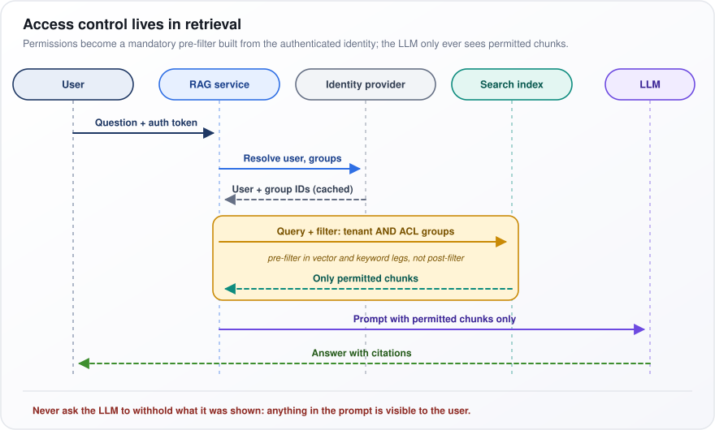</p>

*Figure: the user's groups become a mandatory pre-filter, so the LLM only ever sees chunks the user may read.*

**Watch out:** derived artifacts such as LLM-written summaries across documents, cached answers and fine-tuned models blend content across permission boundaries. Keep separate indexes per tenant, and add automated tests of the form "user X must not retrieve document Y".

---

## 35. Your RAG system fails on domain-specific jargon. How do you fix it?

**General-purpose embedding models (which turn text into meaning vectors for search) split unfamiliar terms into fragments and map them to the nearest familiar meaning. Fix it in order of cost: add keyword search, expand queries from a glossary, enrich chunks with context, and only then fine-tune the embedding model and reranker.**

**The idea.** In aviation maintenance, "AOG" means "aircraft on ground", an urgent grounded plane. An off-the-shelf embedding model has rarely seen it, splits it into pieces and places it near unrelated meanings, so "AOG procedure" returns generic procedures. Collisions are worse: "PPE" means personal protective equipment to a safety team, and property, plant and equipment to finance.

**Fixes, cheapest first**
1. Diagnose: build a jargon slice of your test set (questions full of in-house terms) and measure retrieval on it separately.
2. Add keyword search (BM25, or a learned sparse model, a keyword index whose word weights are learned) beside vector search. It matches exact terms and weights rare ones heavily, so "AOG" in the query finds "AOG" in the document. This is usually the biggest single win.
3. Expand queries from a glossary: map acronyms and synonyms ("AOG" to "aircraft on ground"), and put the definitions in the prompt so the generator (the answer-writing LLM) understands them too.
4. Enrich chunks before embedding: prepend the title, section path and expanded acronyms, so each chunk carries its own context.
5. Fine-tune: have an LLM write likely questions for each chunk, mine hard negatives (chunks that look similar but are wrong), and train with a contrastive loss (pull right pairs together, push wrong ones apart). Try the reranker (the second-stage scorer) first: it is cheaper, because nothing needs re-indexing, whereas a new embedding model means re-embedding the whole corpus (document collection).

**Watch out:** measuring a fine-tune on the same kind of LLM-written questions you trained on overstates the gain. Validate on held-out real user questions, ones never used in training.

---

## 36. Your text-only RAG system now needs to handle images and tables. How do you extend it?

**Turn every non-text element into searchable text, index that text, and give the original table or image to a multimodal LLM (one that reads images as well as text) at answer time. For visually dense documents, retrieve whole page images instead.**

**The idea.** A maintenance manual keeps its torque values only in a diagram and its prices in a table. A text-only pipeline either drops them or turns the table into a jumble of numbers. The fix is a searchable stand-in: for a chart, a written description ("bar chart of monthly returns, peak in March at 4.2%"); for a table, a clean Markdown version plus a one-line summary.

The table compares three approaches, how each works, and its main weakness.

| Approach | How | Weakness |
|---|---|---|
| Text surrogates | Tables to Markdown plus summary; images to a VLM caption plus OCR; link to the raw element | Caption quality caps recall |
| Multimodal embeddings | CLIP-style shared text-image space | Weak on charts, tables, text-heavy images |
| Page-image retrieval | ColPali-style multi-vector page embeddings, late interaction, VLM answers | Storage per page, coarser citations |

Terms: a VLM (vision-language model) reads images and writes text; OCR (optical character recognition) extracts printed text from images; CLIP-style models embed images and text in one shared space, so a text query can find an image. Recall is how much of the relevant material gets found. ColPali-style retrieval embeds each page image as many small vectors (one per image patch) and matches query tokens against them, the late-interaction idea from ColBERT.

**How it works (text surrogates, the usual starting point)**
1. Parse each document into text, tables and images, keeping the page number and bounding box (the element's position on the page) for citations.
2. Tables: convert to Markdown, repeat the header row in every chunk of rows, and add a summary. At answer time, fetch the whole table.
3. Images and charts: store a VLM-written caption, any OCR text, the figure's own caption and the paragraph around it, linked to the original image.
4. At answer time, send the retrieved text plus the original image or table to a multimodal LLM.

**Watch out:** if your test set has no table or figure questions, you will never notice that the system scores zero on them. Add those questions and track that slice separately.

---

## 37. Your RAG knowledge base gets updated frequently and needs versioning. How do you manage it?

**Version at two levels. Content versions track each document's history, so you can filter to the current version, answer "as of" questions, and audit what was cited. Index versions are frozen snapshots of corpus, chunking and embedding model, switched in through an alias (the stable name the application queries).**

**The idea.** A bank's lending policy changes every quarter. Most users want the current policy; an auditor asks what it said in March 2024; a complaints team asks which version the assistant quoted last June. Separately, engineers want to test a new embedding model without risking the live system.

**Content versions**
1. Give every chunk metadata: `doc_id`, `doc_version`, `valid_from`, `valid_to` and `is_current`.
2. Filter on `is_current = true` by default; for "the 2023 policy", filter on the validity window instead.
3. Where users work with different product versions (API v2 against v3), take the version from the user's context as a filter, and never mix them.
4. Log, for every answer, the index version, chunk IDs and document versions used.

**Index versions**
1. Name each index after what shapes it: `kb_v42_e5large_c512` (version 42, the e5-large embedding model, 512-token chunks).
2. Build it, run the golden set (your fixed test questions with known answers), and if it passes, point the alias at it.
3. Keep the previous index for instant rollback.

**Read the figure.** An index starts in blue Building, then yellow Evaluating ("run the golden set"). If it regresses, it goes to red Discarded; if it passes, it becomes green Live, where the pink alias kb_current points. When a newer one is promoted, the old index moves to Previous, with a dashed rollback arrow back to Live.

<p align="center">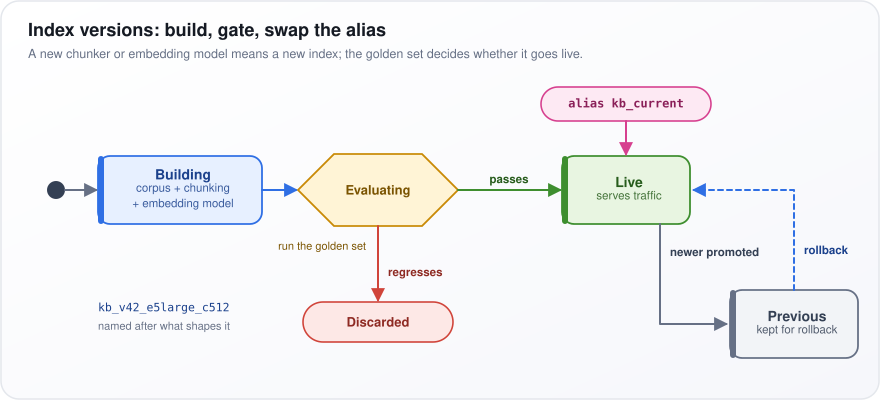</p>

*Figure: each index version is built, gated on the golden set, and promoted by moving the alias, with the previous one kept for rollback.*

**Watch out:** routine edits can flow into the live index incrementally, but a new chunker (document-splitting rules) or embedding model changed in place would mix incompatible vectors; that always means a new index.

---

## 38. Your RAG system fails on multi-hop questions that require combining multiple facts. How do you fix it?

**First confirm the diagnosis: the second fact cannot be found until the first is known. Then switch those questions to iterative retrieval: split the question, retrieve for each hop, and feed each hop's answer into the next query. [Question 13](#13-how-do-you-handle-multi-document-and-multi-hop-questions-in-rag) covers the underlying techniques.**

**The idea.** "What is the budget of the project led by the author of the security policy?" is three hops: policy to author, author to project, project to budget. A single search for the whole question matches the security policy well and nothing else, because the project's budget page shares almost no words with the question.

**Diagnose first**
1. Collect about 50 multi-hop questions and label the chunk needed for each hop.
2. Measure retrieval per hop. The typical pattern: hop one is found, later hops are not.
3. If every hop's chunk is retrieved and the answer is still wrong, the problem is reasoning, not retrieval, and the fix is the model or the prompt.

**The fix**
1. Planner: an LLM writes ordered sub-questions with placeholders: "Who wrote the security policy?", then "Which project does {person} lead?", then "What is the budget of {project}?".
2. Loop: retrieve for the first sub-question, extract the answer (the bridge entity) with a citation, substitute it into the next sub-question, and retrieve again.
3. Stop with a sufficiency check, an LLM call asking "can the question be answered now?", with a hard cap of 3–4 hops.
4. Help hops connect: at ingestion, build an entity-to-chunk index (every chunk mentioning "Project Falcon" listed under that name). Build a full knowledge graph (a network of entities and their relationships) only if relationship questions dominate your traffic.

**Watch out:** latency (response time) is roughly hops × (retrieval + one LLM call), so a 3-hop answer can take several seconds. Use a classifier to send only questions flagged as multi-hop down this path.

---

## 39. Your enterprise RAG system returns contradictory answers from different source documents. How do you resolve conflicts?

**Contradictory answers are mostly a content-governance problem (unclear ownership and upkeep of documents) that retrieval exposes. Record which source is authoritative and which is current in metadata and ranking, drop superseded content, and when a genuine conflict remains, have the model say so and cite both sides.**

**The idea.** Ask "How many days a week can I work remotely?" and one chunk says 2 (the 2022 HR policy), another 3 (a team wiki page), a third 5 (the policy for one regional office). None of this is a model error. These are three different kinds of conflict, each with its own fix.

**Classify the conflict**
- Version (old against new): mark superseded content and filter it out.
- Authority (official policy against a wiki page): rank by authority tier.
- Scope (both true, for different regions, roles or products): filter by the user's context.
- Genuine disagreement between equally authoritative, current sources: disclose it and route it to the owners.

**How it works**
1. Metadata on every document: authority tier, owner, `effective_date`, `supersedes` (which document this one replaces) and scope fields such as region.
2. Retrieval: filter out superseded content, boost authoritative sources, and apply the user's region and role as filters, so statements true in different scopes never collide.
3. Prompt: label each chunk with its source type and date, state the precedence rule ("official policy overrides wiki; newer overrides older"), and require any remaining conflict to be stated with both citations.
4. Offline clean-up: run an NLI model (natural language inference, a classifier that tells whether two texts contradict each other) over similar chunks from different documents, and send the conflicts it finds to their owners.

**Position:** do not let the LLM decide which source wins, because it will choose inconsistently. Encode precedence in data and ranking; the model applies it and discloses what remains.

**Watch out:** hiding a genuine conflict produces a confident answer that is wrong for part of your users; surfacing it with both citations is safer.

---

## 40. Your RAG system returns outdated answers from an evolving knowledge base. How do you keep it current?

**Find which layer is stale (the index, the corpus, a cache, or the model's own memory) and fix each: re-index on change events against a freshness target, mark superseded versions, favor recent documents in ranking, invalidate caches, and show chunk dates in the prompt.**

**The idea.** The hotel allowance rose from USD 150 to USD 180 a night in January, but the assistant still says USD 150. Four different causes produce that: the new policy was never indexed; it was indexed but the old one outranked it; an old answer came from a cache; or both were retrieved and the model preferred the figure it "remembered".

**Fixes**
1. Re-index on change events, and mark old versions `is_current = false` so they are filtered out by default.
2. Map "latest", "current" and "this year" to date filters, and put today's date in the system prompt (the standing instructions sent with every request).
3. Invalidate cached answers that cite a changed document, with a time-to-live (TTL, an automatic expiry) as backstop.
4. Where "current" matters, boost recent documents, with a floor so old but relevant ones survive:

```math
s' = s_{\text{rel}}\cdot\big(\alpha + (1-\alpha)\,e^{-\lambda\,\Delta t}\big)
```

$`s_{\text{rel}}`$ is the normal relevance score and $`s'`$ the adjusted one. $`\Delta t`$ is the document's age, say in days. $`e^{-\lambda\,\Delta t}`$ (e ≈ 2.718 raised to that power) is exponential decay: 1 for a brand-new document, falling toward 0 with age, faster for a larger decay rate $`\lambda`$ (lambda). The floor $`\alpha`$ (between 0 and 1) is the share of the score that never decays.

Worked example: $`\alpha = 0.3`$, with $`\lambda \approx 0.0039`$ per day, so the decay halves every 180 days. A new document keeps its full score. A 180-day-old one is multiplied by $`0.3 + 0.7 \times 0.5 = 0.65`$; a 360-day-old one by $`0.3 + 0.7 \times 0.25 = 0.475`$; none ever falls below 0.3.

**Watch out:** without a freshness canary (a script that updates a test document, queries for it, and alerts if the new text is not returned within the target time), users find staleness before you do.

---

## 41. Your RAG system struggles with PDF documents containing tables and layouts. How do you fix PDF parsing?

**Stop using plain text extraction. A PDF stores characters at positions on a page, not paragraphs or tables, so naive extraction interleaves columns, flattens tables and returns nothing for scanned pages. Use a layout-aware pipeline, send the hard pages to a vision-language model, and chunk by structure.**

**The idea.** Take a two-column annual report page with a table. A plain extractor may read straight across, so line 1 of the left column is followed by line 1 of the right, producing nonsense. The table becomes "Revenue 2023 2024 Europe 4.1 4.6 Asia 2.3 2.9", and the model cannot tell which number belongs to which year and region. A scanned contract has no text layer at all and returns an empty string.

**How a layout-aware pipeline works**
1. Triage each page: text layer or scan? How dense? Tables or figures? Send easy pages to fast extraction.
2. Layout detection: a model labels regions (title, paragraph, table, figure, header, footer) and fixes the reading order, so columns are read one at a time.
3. Table structure recognition rebuilds tables as HTML or Markdown with rows and columns intact.
4. OCR (optical character recognition) reads scanned pages, keeping confidence scores so poor pages can be flagged.
5. Hard cases, such as complex tables and charts, go to a vision-language model (VLM, which reads the page image). Validate its output with row counts and numeric totals, because it can invent cells.
6. Clean up: strip running headers and footers, keep page numbers and bounding boxes (positions on the page) for citations, and keep each table whole with its header.

**Position:** route per page, and choose tools by hand-checking 50–100 of your own pages. Options as of 2025–26 include PyMuPDF and pdfplumber for text-layer extraction, Docling and Unstructured for layout-aware parsing, cloud document-AI services, and VLMs.

**Watch out:** parsing errors are invisible downstream: the chunk looks like text, embeds and retrieves fine, but its numbers are scrambled. Read a sample of stored chunks, not just the final answers.
