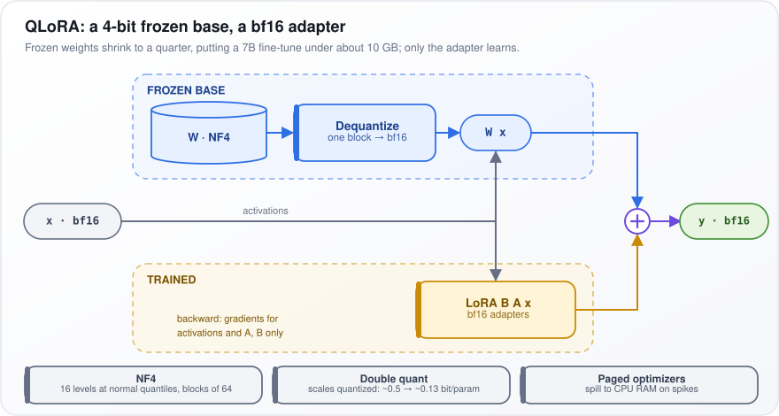
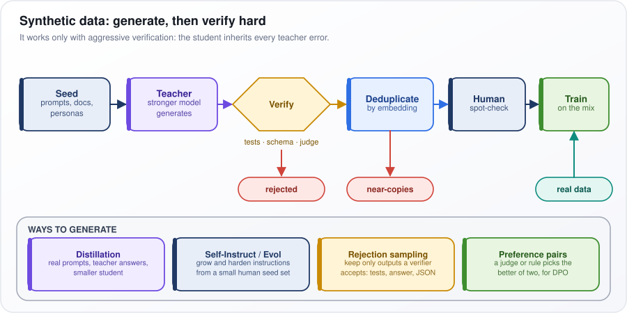
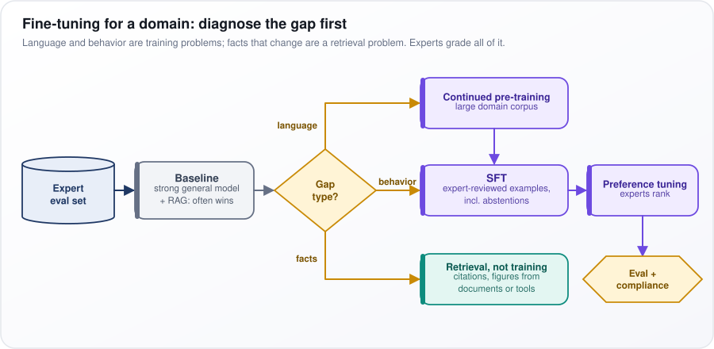
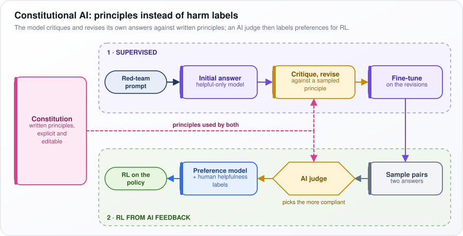

# Fine-Tuning and Model Adaptation

[← All topics](../README.md)

Fine-tuning means taking a model that has already learned from a huge amount of text and training it a little more, on your own examples, so it behaves the way you need. This topic covers when that is the right move and when it is not; the cheap ways to do it by training small add-on pieces instead of the whole model (LoRA, QLoRA, adapters, soft prompts); and the later training stages that turn a raw text predictor into a helpful assistant: supervised fine-tuning (SFT), reinforcement learning from human feedback (RLHF), direct preference optimization (DPO) and reinforcement learning with verifiable rewards (RLVR). Interviewers probe whether you know when fine-tuning is the wrong tool, can do the GPU memory arithmetic, can write down the loss functions, and can debug a fine-tune that went wrong.

## Questions

1. [What is fine-tuning, and when should you fine-tune an LLM?](#1-what-is-fine-tuning-and-when-should-you-fine-tune-an-llm)
2. [Explain the difference between full fine-tuning and parameter-efficient fine-tuning (PEFT).](#2-explain-the-difference-between-full-fine-tuning-and-parameter-efficient-fine-tuning-peft)
3. [What is LoRA (Low-Rank Adaptation), and how does it work?](#3-what-is-lora-low-rank-adaptation-and-how-does-it-work)
4. [What is QLoRA, and how does it enable fine-tuning on consumer hardware?](#4-what-is-qlora-and-how-does-it-enable-fine-tuning-on-consumer-hardware)
5. [How does fine-tuning work?](#5-how-does-fine-tuning-work)
6. [Explain Prefix Tuning and Prompt Tuning. How are they different from LoRA?](#6-explain-prefix-tuning-and-prompt-tuning-how-are-they-different-from-lora)
7. [What is adapter-based fine-tuning?](#7-what-is-adapter-based-fine-tuning)
8. [Explain the difference between pre-training, supervised fine-tuning (SFT), and preference optimization (RLHF/DPO).](#8-explain-the-difference-between-pre-training-supervised-fine-tuning-sft-and-preference-optimization-rlhfdpo)
9. [What is RLHF (Reinforcement Learning from Human Feedback), and how is it used to align LLMs?](#9-what-is-rlhf-reinforcement-learning-from-human-feedback-and-how-is-it-used-to-align-llms)
10. [What is Deep RL from Human Preferences, the paper that started RLHF?](#10-what-is-deep-rl-from-human-preferences-the-paper-that-started-rlhf)
11. [Why did DPO displace PPO-based RLHF at many labs? When is online RL still better?](#11-why-did-dpo-displace-ppo-based-rlhf-at-many-labs-when-is-online-rl-still-better)
12. [What is instruction tuning, and why is it important for chat models?](#12-what-is-instruction-tuning-and-why-is-it-important-for-chat-models)
13. [How do you prepare a dataset for fine-tuning an LLM?](#13-how-do-you-prepare-a-dataset-for-fine-tuning-an-llm)
14. [What is catastrophic forgetting, and how do you prevent it during fine-tuning?](#14-what-is-catastrophic-forgetting-and-how-do-you-prevent-it-during-fine-tuning)
15. [When should you choose fine-tuning over RAG over prompt engineering?](#15-when-should-you-choose-fine-tuning-over-rag-over-prompt-engineering)
16. [How do you evaluate a fine-tuned model's performance?](#16-how-do-you-evaluate-a-fine-tuned-models-performance)
17. [What is synthetic data generation, and how do you use it for fine-tuning?](#17-what-is-synthetic-data-generation-and-how-do-you-use-it-for-fine-tuning)
18. [What are the key hyperparameters for fine-tuning (learning rate, epochs, batch size, LoRA rank)?](#18-what-are-the-key-hyperparameters-for-fine-tuning-learning-rate-epochs-batch-size-lora-rank)
19. [Do the GPU memory math for full fine-tuning a 7B model in bf16 with Adam. Now with LoRA and QLoRA.](#19-do-the-gpu-memory-math-for-full-fine-tuning-a-7b-model-in-bf16-with-adam-now-with-lora-and-qlora)
20. [How do you fine-tune a model for a specific domain (legal, medical, finance)?](#20-how-do-you-fine-tune-a-model-for-a-specific-domain-legal-medical-finance)
21. [What is continual pre-training, and when would you use it?](#21-what-is-continual-pre-training-and-when-would-you-use-it)
22. [How do you merge multiple LoRA adapters?](#22-how-do-you-merge-multiple-lora-adapters)
23. [What is the difference between SFT (Supervised Fine-Tuning) and alignment training?](#23-what-is-the-difference-between-sft-supervised-fine-tuning-and-alignment-training)
24. [What is RLAIF (RL from AI Feedback), and how does it differ from RLHF?](#24-what-is-rlaif-rl-from-ai-feedback-and-how-does-it-differ-from-rlhf)
25. [What is Constitutional AI, and how does it differ from RLHF?](#25-what-is-constitutional-ai-and-how-does-it-differ-from-rlhf)
26. [What is RLVR (Reinforcement Learning with Verifiable Rewards), and when does it beat a learned reward model?](#26-what-is-rlvr-reinforcement-learning-with-verifiable-rewards-and-when-does-it-beat-a-learned-reward-model)
27. [What is knowledge distillation for fine-tuning, and what are the legal considerations?](#27-what-is-knowledge-distillation-for-fine-tuning-and-what-are-the-legal-considerations)
28. [Your fine-tuned LLM produces factually wrong outputs due to training data quality issues. How do you fix it?](#28-your-fine-tuned-llm-produces-factually-wrong-outputs-due-to-training-data-quality-issues-how-do-you-fix-it)
29. [You must choose between LoRA and full fine-tuning for a domain-specific assistant. How do you decide?](#29-you-must-choose-between-lora-and-full-fine-tuning-for-a-domain-specific-assistant-how-do-you-decide)
30. [Your fine-tuned model memorized training data verbatim instead of learning patterns. How do you fix overfitting?](#30-your-fine-tuned-model-memorized-training-data-verbatim-instead-of-learning-patterns-how-do-you-fix-overfitting)
31. [Your fine-tuned LLM forgot its general capabilities after domain-specific fine-tuning. How do you fix catastrophic forgetting?](#31-your-fine-tuned-llm-forgot-its-general-capabilities-after-domain-specific-fine-tuning-how-do-you-fix-catastrophic-forgetting)
32. [Your RLHF preference data has low annotator agreement. How do you ensure data quality?](#32-your-rlhf-preference-data-has-low-annotator-agreement-how-do-you-ensure-data-quality)

---

## 1. What is fine-tuning, and when should you fine-tune an LLM?

**Fine-tuning takes a model that is already trained and trains it a little more on a small set of your own examples, so its default behavior shifts toward your task. Do it when you need a behavior held consistently and cheaply, and prompting and retrieval have already fallen short on a measured test.**

A pre-trained model is like a new hire who has read the whole internet. A prompt is the instruction you give them every morning; fine-tuning is weeks of practice, so they do the job your way without being told. Practice is great for habits: always answer in this JSON format, always write in the house style. It is a poor way to learn a price list that changes weekly; that belongs in a binder they can look up, which is what retrieval gives.

How it works:

1. Collect examples of an input and the exact output you want, typically hundreds to thousands.
2. Train with the same objective as pre-training: predict the next token (a word or piece of a word) of the desired output. Each step nudges the weights (the billions of numbers the model learned). Use a much lower learning rate (the size of each nudge) so the model shifts rather than being rewritten.
3. Compare it with the best prompted version of the base model on a held-out test set (examples never trained on).

Good reasons to fine-tune:

- a strict output format or house style across thousands of calls;
- a narrow, high-volume task where a small fine-tuned model can replace a large prompted one, cheaper and faster;
- domain language the base model keeps misreading.

Bad reasons:

- storing facts that change: no citations, no access control, a retrain on every update;
- fifty examples and no evaluation.

The default order is prompting first, then retrieval-augmented generation (RAG: fetching relevant documents into the prompt), then fine-tuning, with each step justified by a measured gap.

**Watch out:** fine-tuning on facts the base model does not already know tends to teach it to answer confidently anyway. It raises made-up answers rather than adding knowledge.

---

## 2. Explain the difference between full fine-tuning and parameter-efficient fine-tuning (PEFT).

**Full fine-tuning updates every weight in the model. Parameter-efficient fine-tuning (PEFT) freezes the original weights and trains a small set of new or selected parameters, typically under 1% of the total. The big differences are memory, storage and serving, not quality on most behavior tasks.**

Take a 7B model: seven billion numbers, called weights or parameters. Full fine-tuning edits all seven billion. PEFT leaves them untouched and trains perhaps 40 million extra numbers beside them, like sticky notes on a textbook instead of a reprinted book. Each task ships as a small file of sticky notes rather than a full 14 GB copy of the model (7 billion × 2 bytes in bf16, a 16-bit number format).

How it works:

1. During training, every trainable parameter needs a gradient (the direction to nudge it) and optimizer state (the Adam optimizer keeps two running averages per parameter). With mixed precision (fast math in 16-bit, plus a 32-bit master copy of each weight), full fine-tuning costs about 16 bytes per parameter before activations: roughly 112 GB for 7B.
2. PEFT keeps gradients and optimizer state only for its small trainable set. The frozen weights still sit in memory and the backward pass (the step that computes gradients) still flows through them, so activation memory (intermediate results kept for it) stays about the same.
3. PEFT comes in four families:
   - reparameterization: LoRA learns each weight matrix's change as the product of two thin matrices;
   - inserted modules: adapters add small layers inside each block;
   - soft prompts: prompt tuning and prefix tuning learn extra input vectors;
   - selective: BitFit trains only the bias terms (one small added number per output).

In the table, "forgetting" means losing general abilities it had; "hot-swapped adapters" means one shared base model with a different small adapter loaded per request.

| | Full fine-tuning | PEFT (LoRA) |
|---|---|---|
| Trainable params | 100% | ~0.1–1% |
| Training memory, 7B | ~112 GB + activations | ~15 GB + activations (less with QLoRA) |
| Artifact per task | full copy, 14 GB in bf16 | tens to hundreds of MB |
| Forgetting | more | less |
| Serving many tasks | one model each | one base, hot-swapped adapters |

Default to LoRA. Choose full fine-tuning for large shifts, such as a new language or continued pre-training on billions of raw-text tokens.

**Watch out:** PEFT saves gradient and optimizer memory, not activation memory, so long sequences or big batches can still run out of GPU memory.

---

## 3. What is LoRA (Low-Rank Adaptation), and how does it work?

**LoRA (Low-Rank Adaptation) freezes each original weight matrix and learns the change to it as the product of two thin matrices. Fine-tuning's change is usually simple (low rank), so this captures most of it with a tiny fraction of the parameters.**

A weight matrix (a grid of learned numbers) in a 7B model might be 4096 × 4096, about 16.8 million numbers, but the change fine-tuning makes to it mostly moves along a few directions. So LoRA learns a 4096 × 16 matrix $`B`$ and a 16 × 4096 matrix $`A`$; their product is a full-size update built from 131,072 numbers, 0.8% of the original. The rank $`r`$ (here 16) is the width of that thin middle.

How it works:

1. Freeze the original matrix $`W`$. Start $`A`$ random and $`B`$ at zero, so $`BA = 0`$ and training begins exactly at the base model.
2. When computing each layer's output, add the LoRA path's output (formula below). Only $`A`$ and $`B`$ get gradients (the directions to nudge them) and optimizer state.
3. To deploy, merge $`W' = W + \frac{\alpha}{r}BA`$ into the weights (no added delay), or keep adapters separate and swap them per request.

Across every attention and feed-forward weight matrix of a 7B model, $`r = 16`$ means about 40 million trainable parameters, roughly 0.6%.

Put as a formula:

```math
h = Wx + \frac{\alpha}{r}BAx, \qquad B \in \mathbb{R}^{d \times r},\ A \in \mathbb{R}^{r \times k},\ r \ll \min(d, k)
```

$`x`$ is the layer's input, $`h`$ its output, and $`W`$ the frozen matrix with $`d`$ rows and $`k`$ columns. $`\mathbb{R}^{d \times r}`$ means "a grid of real numbers, $`d`$ rows by $`r`$ columns"; $`r \ll \min(d, k)`$ says the rank is far smaller than either side. $`\alpha`$ is a fixed scale; dividing by $`r`$ lets you change rank without much retuning. Tiny example: with $`d = k = 4`$ and $`r = 1`$, $`B`$ is a column of 4 and $`A`$ a row of 4: 8 numbers whose product is a full 4 × 4 update.

**Watch out:** on big shifts, such as continued pre-training (more training on large amounts of raw code or math), studies find LoRA learns less than full fine-tuning, though it forgets less.

---

## 4. What is QLoRA, and how does it enable fine-tuning on consumer hardware?

**QLoRA trains small LoRA adapters (pairs of thin matrices beside each frozen weight matrix) in 16-bit precision on top of a base model frozen in 4-bit. That cuts the frozen weights to a quarter of their size and puts a 7B fine-tune under about 10 GB of GPU memory.**

Quantization means storing each number with fewer bits, like rounding every catalog price to one of a few standard values. bf16 (a 16-bit number format) takes 2 bytes per weight and 4-bit takes half a byte, so 14 GB of 7B weights becomes about 3.5 GB. Rounding costs a little accuracy; the adapter learns around it.

How it works:

1. NF4 (4-bit NormalFloat): 4 bits allow 16 values. Trained weights are roughly bell-shaped (normally distributed), so NF4 puts its 16 levels at a normal distribution's quantiles (cut points into equally likely slices), dense where weights are dense. Each block of 64 weights has its own scale.
2. Double quantization: the per-block scales are quantized too, cutting their overhead from about 0.5 to 0.13 bits per parameter.
3. Paged optimizers: on memory spikes, optimizer state (Adam's running averages) spills to CPU RAM instead of crashing.
4. Forward pass: dequantize (expand back to bf16) one block at a time and compute $`Wx`$, the frozen weights $`W`$ times the input $`x`$; add the adapter's $`BAx`$, from its matrices $`B`$ and $`A`$. Gradients (directions to nudge) are computed only for the activations (intermediate results) and $`A`$, $`B`$.

In the figure's blue FROZEN BASE lane, W · NF4 is dequantized block by block to produce W x; the yellow TRAINED lane computes LoRA B A x; the two meet at the plus sign to give y · bf16. The bottom boxes are the three memory tricks.

<p align="center"></p>

*Figure: QLoRA adds a trainable bf16 adapter to a frozen base stored in 4-bit NF4 and dequantized on the fly.*

**Watch out:** the adapter learned to correct the quantized weights, so merging it into the original bf16 weights gives a model you never evaluated; re-evaluate after merging. QLoRA steps are also slower than bf16 LoRA because of dequantization.

---

## 5. How does fine-tuning work?

**Fine-tuning runs pre-training's training loop again, but from the pre-trained weights, on a small curated dataset, with much smaller steps. For chat models, only the response tokens are scored.**

Say one training example is the question "Capital of France?" and the answer "Paris." At each position in the answer, training asks the model "what comes next?". If it gives "Paris" a probability of only 0.2, the loss (how wrong it was) is high and the weights (the model's learned numbers) are nudged to raise it. The question's tokens (words or word pieces) are not scored: the goal is answering, not predicting questions.

How it works:

1. Format each example with the model's chat template (the markers separating system, user and assistant turns) and split it into tokens.
2. Mask the prompt: label its tokens `-100`, a value the loss skips.
3. Forward pass: predict every next token and compute the loss (formula below) on unmasked tokens.
4. Backward pass: compute gradients, the direction to nudge each trainable number (all weights, or only LoRA's small add-on matrices).
5. Update with AdamW (the Adam optimizer plus weight decay, a gentle pull toward zero). The learning rate (step size) warms up, then decays; gradient clipping caps outsized updates.
6. Keep the checkpoint (saved weights) that scores best on unseen held-out examples, not the lowest training loss.

Put as a formula:

```math
\mathcal{L} = -\frac{1}{|R|}\sum_{t \in R}\log p_\theta(y_t \mid y_{\lt t}, x), \quad R = \text{response token positions}
```

$`R`$ is the set of response positions and $`|R|`$ its size. $`y_t`$ is the correct token at position $`t`$, $`y_{\lt t}`$ the tokens before it, $`x`$ the prompt. $`p_\theta`$ is the model's probability with weights $`\theta`$, and Σ means "add up over every response token". The log turns a probability into a penalty: log 1 is 0, a small probability's log is large and negative, and the minus sign flips it positive. Example: two response tokens predicted with probabilities 0.5 and 0.25 give $`-\log 0.5 \approx 0.69`$ and $`-\log 0.25 \approx 1.39`$, an average loss of about 1.04.

**Watch out:** a chat template that differs between training and serving is the most common silent bug: nothing crashes, quality just drops.

---

## 6. Explain Prefix Tuning and Prompt Tuning. How are they different from LoRA?

**Both freeze the whole model and learn a few "virtual tokens": vectors that are not real words. Prompt tuning adds them only at the input; prefix tuning adds learned keys and values inside every attention layer. LoRA instead learns a small low-rank change to the weights, so it can be merged away and usually trains better.**

A normal prompt is words you type. A soft prompt is the same idea, except the "words" are vectors (lists of numbers) found by training, which no human could type. Say you prepend 20 such vectors to every input: training adjusts only those 20 × 4096 numbers until the frozen model does your task.

How each works:

- Prompt tuning (Lester et al., 2021): 20 to 100 learned embeddings (the vectors a model uses to represent tokens) are placed before the input. It matched full fine-tuning only for models of around 10 billion parameters and up; smaller models lag behind.
- Prefix tuning (Li and Liang, 2021): in attention, each token reads information from keys and values (vectors that other tokens are matched against and read from). Prefix tuning prepends learned key and value vectors at every layer, so each layer attends over $`[P_K; K]`$ and $`[P_V; V]`$, where $`P`$ is the learned prefix and $`[\,;\,]`$ means "stacked together". It is trained through a small MLP (a tiny neural network) for stability, and only the resulting prefix is kept.
- Both add positions at inference (when the model is used), costing context length and memory, and neither can be merged into the weights.

The table compares what each method learns, what it costs at inference, and typical quality on models of 1 to 13 billion parameters.

| | Prompt tuning | Prefix tuning | LoRA |
|---|---|---|---|
| Learned | input embeddings | per-layer K/V vectors | low-rank weight deltas |
| Inference cost | extra context tokens | extra KV per layer | none after merge |
| Quality on 1–13B models | weakest | moderate | usually best |

The appeal of soft prompts is size: 20 tokens × 4096 numbers × 2 bytes is about 160 KB per task. That suits extreme multi-tenancy, where thousands of customers each have their own task and a single batch can mix them.

**Watch out:** soft prompts are a storage and multi-tenancy choice, not a quality choice; on mid-sized models LoRA is the default.

---

## 7. What is adapter-based fine-tuning?

**Adapters are small bottleneck networks inserted inside each transformer block (one of the repeated layers the model is built from) while the original model stays frozen. Each task gets its own few-megabyte set, plugged in when needed.**

A transformer block has two main parts: attention, where tokens (words or word pieces) look at each other, and a feed-forward layer, which processes each token on its own. An adapter is a small detour after one of these parts. Squeeze the 4096-number vector down to, say, 64 numbers; apply a nonlinearity (a simple bend, such as setting negatives to zero); expand back to 4096; and add the result to the original vector. A detour that outputs zeros leaves the model unchanged.

How it works:

1. Houlsby et al. (2019) place one adapter after the attention sublayer and one after the feed-forward sublayer in every block.
2. The up-projection starts near zero, so each adapter begins as the identity (it passes its input through unchanged) and training starts from the base model's behavior. Only the adapter weights train.
3. Variants: one adapter per block (Pfeiffer), AdapterFusion to combine adapters trained on different tasks, and (IA)³, which learns only vectors that rescale the model's intermediate values.

Put as a formula:

```math
\text{Adapter}(h) = h + W_{\text{up}}\,\sigma(W_{\text{down}}h), \qquad W_{\text{down}} \in \mathbb{R}^{m \times d},\ m \ll d
```

$`h`$ is the vector coming out of the sublayer, of size $`d`$. $`W_{\text{down}}`$ squeezes it to size $`m`$, $`\sigma`$ is the nonlinearity, and $`W_{\text{up}}`$ expands it back to size $`d`$. The leading $`h +`$ is the residual connection: the original vector is kept and the adapter's output added to it. $`m \ll d`$ means $`m`$ is much smaller than $`d`$. Example: with $`d = 4096`$ and $`m = 64`$, one adapter has about 2 × 4096 × 64 ≈ 524,000 weights, versus 16.8 million in one 4096 × 4096 matrix.

**Watch out:** adapters are extra layers with a nonlinearity, so they cannot be merged into the existing weights and they add latency (delay per request), most noticeably when few requests run together. LoRA (a low-rank change to existing weights) is linear and merges away, which is why it displaced adapters for LLMs.

---

## 8. Explain the difference between pre-training, supervised fine-tuning (SFT), and preference optimization (RLHF/DPO).

**Pre-training teaches language and world knowledge from trillions of tokens (words or pieces of words) of raw text. Supervised fine-tuning (SFT) teaches the assistant role by copying curated example answers. Preference optimization teaches which of two answers is better.**

Picture training a new writer. Pre-training is reading an entire library: they learn language and facts, but asked "Write me a cover letter", they might carry on with "... and other common requests" as if completing a list. SFT is showing them thousands of requests paired with ideal replies, so they learn to answer. Preference optimization is an editor putting two drafts side by side and saying "this one is better". It teaches judgment that a single ideal answer cannot, and picking the better of two is easier for a person than writing the perfect one.

How it works:

1. Pre-training: predict the next token on raw text. The result continues text rather than answering it.
2. SFT: next-token loss (the penalty for giving the right next token a low probability) on the response part of (prompt, ideal response) pairs. It fixes format and instruction following, but only ever shows good answers.
3. Preference optimization: each example is a prompt with a chosen and a rejected response.
   - RLHF (reinforcement learning from human feedback) trains a reward model to score answers, then uses the PPO algorithm (proximal policy optimization, a trial-and-error method) to push the model toward higher scores.
   - DPO (direct preference optimization) optimizes the same goal directly on the pairs, with no separate reward model.

The table sets the three stages side by side; the data sizes are typical ranges.

| Stage | Data | Objective |
|---|---|---|
| Pre-training | raw text, trillions of tokens | next-token loss on every token |
| SFT | prompt and ideal response, ~10k–1M | next-token loss on response tokens |
| Preference optimization | prompt with chosen and rejected responses | reward model + PPO, or DPO loss |

How much post-training (SFT plus preference optimization) matters: in the InstructGPT paper (OpenAI, 2022), human labelers preferred answers from a 1.3-billion-parameter model trained this way over those of the 175-billion-parameter base GPT-3.

**Watch out:** post-training mostly shapes how the model uses what it already knows; it adds little new knowledge. Facts come from pre-training or from retrieval.

---

## 9. What is RLHF (Reinforcement Learning from Human Feedback), and how is it used to align LLMs?

**RLHF (reinforcement learning from human feedback) turns human comparisons of answers into a learned scoring model, the reward model, and then uses reinforcement learning (improving by trial and reward), classically PPO (proximal policy optimization), to push the chat model toward higher-scoring answers. A penalty keeps the model close to where it started, so it does not learn to game the scorer.**

People cannot score millions of answers, but they can compare thousands of pairs. Say labelers see two answers to "Explain inflation to a child" and pick A. After many such comparisons, a reward model learns to predict which answers people prefer, and can score any new answer. The chat model then practices against it.

How it works:

1. Supervised fine-tuning (SFT): train the base model on example answers, so it can follow instructions at all.
2. Sample several responses per prompt and have labelers rank them.
3. Train the reward model with the Bradley–Terry loss $`-\log\sigma\big(r(x, y_w) - r(x, y_l)\big)`$. Here $`r`$ is the score, $`y_w`$ the preferred answer and $`y_l`$ the rejected one, and $`\sigma`$ (the sigmoid) turns the score gap into the probability that $`y_w`$ wins. The loss is small when the preferred answer scores clearly higher.
4. Run PPO on the objective below. It juggles four models (the policy being trained, a frozen reference copy, the reward model, and a value model estimating expected reward) and generates inside the training loop: expensive and finicky.

Put as a formula:

```math
\max_{\pi_\theta}\ \mathbb{E}_{y \sim \pi_\theta}\big[r_\phi(x, y)\big] - \beta\,\mathrm{KL}\big(\pi_\theta(\cdot \mid x)\,\|\,\pi_{\text{ref}}(\cdot \mid x)\big)
```

$`\pi_\theta`$ is the policy, the model being trained. $`\mathbb{E}_{y \sim \pi_\theta}[r_\phi(x, y)]`$ is the average reward of the answers $`y`$ it writes for prompts $`x`$. KL (Kullback–Leibler divergence) measures how far the policy's word probabilities have drifted from the reference model $`\pi_{\text{ref}}`$, usually the SFT model, and $`\beta`$ sets how much drift costs. Example: an answer scores 2.0 but has drifted by a KL of 5; with $`\beta = 0.1`$ its effective score is 2.0 − 0.5 = 1.5.

**Watch out:** without the KL leash the policy reward-hacks: it finds what the reward model overrates, such as length, confident tone or flattery (sycophancy), and exploits it.

---

## 10. What is Deep RL from Human Preferences, the paper that started RLHF?

**"Deep Reinforcement Learning from Human Preferences" (Christiano, Leike, Brown, Martic, Legg and Amodei; OpenAI and DeepMind, 2017) showed that an agent can learn complex behavior with no hand-written reward, just from a person repeatedly picking the better of two short clips of its behavior.**

Reinforcement learning (RL), where an agent learns by trial and error to earn reward, normally needs a reward function: code that says "+1 for this". For many behaviors, like "do a graceful backflip", nobody can write that code. But anyone can watch two short clips of a simulated robot and say which looks more like a backflip. The paper turned those clicks into a reward.

How it works, with three processes running at once:

1. The policy (the agent's behavior) trains with ordinary RL against the current learned reward.
2. Pairs of trajectory segments, clips of 1–2 seconds, are shown to a human, who picks the better one.
3. A reward model is fitted so that preferred segments get a higher summed reward. It uses the Bradley–Terry model: the probability of preferring one clip over another rises with the gap between their scores.
4. New clips are chosen where an ensemble (several reward models trained separately) disagrees most, so each human answer teaches as much as possible.

Results: with human feedback on under 1% of the agent's interactions, it solved many Atari games and MuJoCo simulated-robot tasks. It learned a backflip from roughly 900 comparisons, under an hour of a person's time.

Why it matters: the ingredients carried straight into language models, namely pairwise comparisons, a Bradley–Terry reward model, RL against that learned reward, and the risk of the agent exploiting it. The line runs through fine-tuning GPT-2 from human preferences (2019), summarization from human feedback (2020) and InstructGPT (2022).

**Watch out:** the paper already met reward exploitation. When the reward model was trained once up front instead of alongside the policy, agents found behavior it scored well but humans did not want (in Pong, endless rallies instead of scoring points). The reward model must keep learning, or the policy must be leashed.

---

## 11. Why did DPO displace PPO-based RLHF at many labs? When is online RL still better?

**DPO (direct preference optimization) reaches the goal of PPO-based RLHF with a plain supervised loss on fixed answer pairs, with no reward model, value model or sampling during training. Online RL still wins when the model must learn from its own fresh attempts, above all when a program can check the answers.**

Classic RLHF (reinforcement learning from human feedback) trains a reward model on human choices, then runs PPO (proximal policy optimization) to raise that score while staying close to a frozen reference copy of the starting model. The DPO paper (2023) showed that, for this goal, the best model and the reward are tied by a formula, so the reward model can be skipped: training directly makes preferred answers more likely, relative to the reference, and rejected ones less so.

How it works: take a prompt $`x`$ with a chosen answer $`y_w`$ and a rejected one $`y_l`$, score each answer's log-probability (log of its probability) under both models, and update the weights to lower this loss:

```math
\mathcal{L}_{\text{DPO}} = -\log\sigma\left(\beta\log\frac{\pi_\theta(y_w \mid x)}{\pi_{\text{ref}}(y_w \mid x)} - \beta\log\frac{\pi_\theta(y_l \mid x)}{\pi_{\text{ref}}(y_l \mid x)}\right)
```

$`\pi_\theta(y \mid x)`$ is the trained model's probability of answer $`y`$; $`\pi_{\text{ref}}`$ is the reference's. Their log-ratio says how much training raised that answer; $`\beta`$, often 0.1, scales it. $`\sigma`$ (the sigmoid) turns the chosen-minus-rejected gap into a probability, and $`-\log`$ penalizes small gaps. Example: training raised the chosen answer's log-probability by 2, the rejected one's by 0. With $`\beta = 0.1`$ the gap is 0.2, $`\sigma(0.2) \approx 0.55`$, and the loss about 0.60, falling as the gap widens.

It keeps two models in memory, not PPO's four (PPO adds the reward model and a value model predicting expected reward), and trains stably. Weak spots:

- Off-policy: the pairs were written before training, so they never correct the model's current mistakes. Iterative DPO regenerates pairs each round.
- It can lower the probability of both answers, as long as the gap widens.

So: DPO for tone, refusals and format; online RL (PPO, or its lighter variant GRPO) where a checker exists.

**Watch out:** a falling DPO loss does not prove improvement; read the outputs, and check the chosen answers' probabilities did not collapse.

---

## 12. What is instruction tuning, and why is it important for chat models?

**Instruction tuning is supervised fine-tuning (further training on example answers) on many different tasks, each written as a natural-language instruction with a good response. It turns a base model that merely continues text into one that treats input as a request, and the skill carries over to instructions it has never seen.**

Type "Translate to French: good morning" into a base model (one only pre-trained to predict the next word) and it may continue with "Translate to French: good night", as pages of exercises do. After instruction tuning on thousands of examples such as "Translate to French: good morning" → "Bonjour" and "Summarize this email: …" → a summary, the model learns the general pattern: text in the user's slot is something to do.

How it works:

1. Build (instruction, optional input, response) triples across hundreds of task types: translation, summarization, classification, open questions.
2. Format them in the chat template (the fixed text layout the model sees), with role markers for user and assistant and an end-of-turn token (the signal to stop talking).
3. Train with next-token loss (the penalty for giving the right next token a low probability) on the responses only.

What the research showed:

- FLAN (Google, 2021): instruction tuning on many tasks improved zero-shot performance (no examples in the prompt) on types of task held out of training.
- InstructGPT (OpenAI, 2022): human-written demonstrations on real user prompts, followed by RLHF (reinforcement learning from human feedback: tuning on people's rankings of answers).
- LIMA (Meta, 2023): a strong chat model from about 1,000 carefully curated examples, suggesting that this stage mostly teaches format and style, not knowledge.

Why it matters for chat: it teaches the role markers and when to stop, and it sets the model's default length, tone and refusal style. Everything later, from preference tuning (training on which of two answers is better) to product-specific fine-tunes, builds on it.

**Watch out:** the model copies the habits of its demonstrations. Examples containing facts the base model does not know teach it to answer confidently anyway, and uniformly long demonstrations make every answer long.

---

## 13. How do you prepare a dataset for fine-tuning an LLM?

**Define the task and build the test set first. Then collect a few thousand clean, varied examples that look exactly like real production inputs, formatted in the same chat template (the markers that separate system, user and assistant turns) you will serve with.**

The model learns whatever the examples show, errors included, like a trainee copying a senior colleague's files. If 10% of your invoice examples have the date in the wrong format, expect a similar share of wrong dates afterwards. So the work is mostly curation, not volume. The JSON below is one training row in the common "messages" format: a system instruction, a user input, and the exact assistant output wanted.

How it works:

1. Hold out a test set before collecting training data, so nothing leaks between them.
2. Source: real inputs with outputs written or approved by experts come first; synthetic (model-generated) data only fills gaps.
3. Clean: remove exact and near duplicates (examples differing only in trivial details), scrub personally identifiable information (PII), and drop truncated or badly formatted rows.
4. Cover every intent, input length and edge case, including cases where the right answer is "I can't tell" or a refusal; otherwise the model never learns to give them.
5. Split by entity or time, not randomly: all invoices from one vendor go in the same split, so the test measures generalization. Then decontaminate: remove any training example that also appears in a test or benchmark set.
6. Size, as a rule of thumb: hundreds to low thousands of examples for a format or style; thousands to tens of thousands for a narrow skill.
7. Have experts audit a random sample before you scale up.

```json
{"messages": [
  {"role": "system", "content": "Extract invoice fields as JSON."},
  {"role": "user", "content": "Invoice #4471 from Acme Ltd, due 12 March 2026, total EUR 1,240.00"},
  {"role": "assistant", "content": "{\"invoice_id\": \"4471\", \"vendor\": \"Acme Ltd\", \"due_date\": \"2026-03-12\", \"total\": 1240.00, \"currency\": \"EUR\"}"}
]}
```

Notice that the assistant output normalizes the date to 2026-03-12 and splits the amount from the currency. Every example must make those choices the same way, or the model learns inconsistency.

**Watch out:** bad examples are learned as faithfully as good ones; a small clean set usually beats a large noisy one.

---

## 14. What is catastrophic forgetting, and how do you prevent it during fine-tuning?

**Catastrophic forgetting is when a model loses abilities it used to have because training on new data overwrote them. The weights (the model's learned numbers) that fit your new task are the same weights that stored the old skills.**

Fine-tune a general assistant for thousands of steps on nothing but legal contracts. Contract drafting improves, but ask it for a Python function or an answer in Spanish and it may now do worse. Nothing in training rewarded keeping those skills, so the gradient updates (the small weight changes that reduce the error, or loss, on the new data) quietly moved weights those skills depended on.

How to prevent it, in the order you would apply the steps:

1. Measure: build a regression suite, a fixed set of general-ability, safety and product-critical prompts, and run it before and after training. You cannot protect what you do not measure.
2. Constrain what can change: LoRA, which trains small add-on matrices and leaves the original weights frozen, forgets less than full fine-tuning, as reported in "LoRA Learns Less and Forgets Less" (2024).
3. Replay: mix a share of general instruction data into the training set, tuning the ratio on the regression suite.
4. Train gently: a lower learning rate (smaller weight updates), fewer epochs (passes over the data), and early stopping (halting when a score stops improving) on a combined score of task plus general ability.
5. Regularize or interpolate: add a KL penalty (a term that punishes drift from the base model's output probabilities), use EWC (elastic weight consolidation, which makes weights that mattered for old tasks harder to change), or average the fine-tuned and base weights afterwards.

A quick way to see it in numbers: if the general suite scores 80 before training and 65 after, and the task score went from 60 to 84, you have a trade-off to manage, not a success to ship.

**Watch out:** every mitigation lowers the task ceiling a little. Protect the abilities your product actually needs, not every public benchmark.

---

## 15. When should you choose fine-tuning over RAG over prompt engineering?

**Prompting tells the model what task to do. Retrieval-augmented generation (RAG), which fetches relevant documents into the prompt, supplies knowledge the model lacks or that changes. Fine-tuning changes behavior a prompt cannot hold, or makes it cheaper. They stack rather than compete.**

Think of a support agent. Prompting is the morning briefing: be polite, answer in three bullet points. RAG is the knowledge base they search during each call, so answers use today's refund policy and can cite it. Fine-tuning is training, so the house style becomes automatic and a cheaper junior agent can do the job. A good team uses all three.

How to decide:

1. Build the eval first (a test set with a score) and get the best result you can from prompting alone.
2. Read the failures and sort them:
   - "Didn't know" or "out of date": add retrieval, and measure retrieval recall (did the right document come back?) separately from answer quality.
   - "Knew but did it wrong" (wrong format, wrong tone, ignored a policy), with thousands of good examples available: fine-tune.
   - Works, but too slow or too costly: distill, meaning train a smaller model on the outputs of the working system.
3. Re-measure after each step, and keep a step only if it moved the metric.

The table maps common needs to the tool that fits them.

| Need | Tool |
|---|---|
| Fast iteration, no data | Prompting |
| Private, large or changing knowledge; citations; access control | RAG |
| Strict format, tone or policy across thousands of calls | Fine-tuning |
| Lower latency and cost at volume | Fine-tuned smaller model |

A combined system is common: a fine-tuned model that has learned the output format, fed by retrieval that supplies today's facts, driven by a short prompt.

**Watch out:** "we fine-tuned on our docs so it knows the product" yields blended, uncitable facts that go stale at the next doc change. Product facts belong in retrieval.

---

## 16. How do you evaluate a fine-tuned model's performance?

**A fine-tuned model ships only if it beats the best prompted version of the base model on a held-out test set (examples never used in training) for your task, and does not lose the general abilities your product relies on.**

Say you fine-tuned a model to extract fields from invoices, and it gets 94% of fields right on the test set. Is that good? Only relative to a baseline: if the base model with a careful prompt and three examples already gets 93%, the fine-tune bought little and added a model to maintain. And if it now fumbles the follow-up questions users ask, it is worse overall.

How it works:

1. Task eval: a held-out set with no overlap with training, scored with a task metric. Examples: field F1 (a balance of precision, the share of extracted fields that are right, and recall, the share of real fields found), per-class recall, pass@k for code (does at least one of k attempts pass the tests), or a rubric scored by an LLM judge (another model grading each answer). Break results down by input type.
2. Baselines: the base model with its best prompt, with a few worked examples in the prompt (few-shot), and with retrieval-augmented generation (RAG, fetching relevant documents into the prompt) where relevant.
3. Regression: instruction following, safety and refusals, and product-critical prompts, before and after.
4. Behavior checks: is the output format valid; does it invent answers to questions the training data did not cover; does it repeat training examples word for word.
5. Online: shadow traffic (run the new model silently beside production and compare) or an A/B test (split live users between old and new) on the business metric.

**Watch out:** validation loss (how badly the model predicts held-out reference answers, word by word) is not evaluation. Lower loss does not mean better answers, so pick checkpoints (saved versions) on the task metric.

---

## 17. What is synthetic data generation, and how do you use it for fine-tuning?

**Synthetic data means using a model, usually a stronger one, to create or rewrite training examples. It works only with aggressive checking, because the student model inherits every mistake the teacher makes.**

Say you need 5,000 examples of customer emails with ideal replies, but you have 200. Ask a large model to write variations of your real emails and draft replies, then keep only the ones that pass checks. But if the teacher always opens with "Certainly!" or gets a refund rule subtly wrong, so will the student.

Four ways to generate:

- Distillation: real prompts, answers from a large teacher model, and a smaller student trained on them.
- Self-Instruct and Evol-Instruct: start from a small human-written seed set; a model writes new instructions and makes them progressively harder.
- Rejection sampling: generate several outputs and keep only those a verifier accepts (tests pass, answer matches, JSON validates).
- Preference pairs: a judge model or a rule picks the better of two outputs, giving chosen and rejected pairs for DPO (direct preference optimization, which trains on such pairs).

The pipeline:

1. Seed with prompts, documents and personas (short descriptions of varied users) to spread the outputs out.
2. Generate with the teacher.
3. Verify with tests, schemas or a judge, and reject failures.
4. Deduplicate by embedding (a vector representing meaning, so near-copies sit close together) and drop near-copies.
5. Spot-check a sample by hand.
6. Train on a mix with real data.

In the figure, read the top row from left to right: Seed, Teacher, the yellow Verify hexagon, Deduplicate, Human spot-check, and Train on the mix. The red boxes below are what gets thrown away (rejected, near-copies); real data joins at the end. The WAYS TO GENERATE panel lists the four methods.

<p align="center"></p>

*Figure: synthetic examples are generated by a teacher, then verified, deduplicated and spot-checked before being mixed with real data.*

**Watch out:** homogeneity and model collapse, where quality and variety degrade as models train on model output again and again. Vary seeds and personas, deduplicate, and keep real data in the mix.

---

## 18. What are the key hyperparameters for fine-tuning (learning rate, epochs, batch size, LoRA rank)?

**Learning rate matters most, then the number of epochs, then the effective batch size. For LoRA, add the rank, the alpha scale, and which layers get adapters. Tune all of them against a task metric on held-out data (never trained on), not training loss.**

The learning rate is the size of each weight update, each step downhill on the loss (the model's error): too large and the model overshoots and forgets, too small and it barely changes. An epoch is one full pass over the data; on small data, more passes invite memorization. Batch size is how many examples are averaged before each update; larger batches give smoother steps.

How they interact:

- Batch size and learning rate are linked: larger batches tolerate higher rates. Effective batch size is per-device batch × number of GPUs × gradient accumulation steps (adding up the update directions, or gradients, of several small batches before one update).
- LoRA trains two thin matrices per weight matrix; its rank $`r`$ is their width, the adapter's capacity, and $`\alpha`$ scales its update by $`\alpha/r`$. Raising $`r`$ with $`\alpha`$ fixed shrinks each direction's update; rsLoRA (rank-stabilized LoRA) scales by $`\alpha/\sqrt{r}`$ instead, so high ranks still learn.
- Small datasets need a few epochs; with 100,000 examples, one is usually enough.
- Warmup raises the learning rate from near zero over the first few percent of steps; it then decays.

A procedure that works:

1. Start from the table's rule-of-thumb defaults.
2. Sweep the learning rate over 3–5 values spaced by constant factors, for example 5e-5, 1e-4, 2e-4 and 4e-4 for LoRA.
3. Set the number of epochs from the validation curves (held-out loss over training).

In the table, "1e-5" means 0.00001, and "all linear layers" means every weight matrix in attention and the feed-forward layers. For DPO (direct preference optimization, training on better-versus-worse answer pairs), $`\beta`$ sets the pull toward the starting model.

| Hyperparameter | Typical starting point (rule of thumb) |
|---|---|
| Learning rate, full fine-tuning | 1e-5 to 2e-5 |
| Learning rate, LoRA | 1e-4 to 2e-4 |
| Warmup, schedule | 3–5% warmup, cosine or linear decay |
| Epochs | 1–3 |
| Effective batch size | 16–128 sequences via gradient accumulation |
| LoRA rank, alpha | $`r`$ 8–64, $`\alpha`$ = $`r`$ to $`2r`$, all linear layers |
| DPO $`\beta`$ | ~0.1 |

**Watch out:** validation loss (error on held-out data) rising while training loss keeps falling, often after the first epoch, means memorization, not learning; stop there.

---

## 19. Do the GPU memory math for full fine-tuning a 7B model in bf16 with Adam. Now with LoRA and QLoRA.

**Full fine-tuning with mixed-precision Adam needs about 16 bytes per parameter before activations: about 112 GB for a 7B model, more than one 80 GB GPU holds. LoRA needs about 15 GB and QLoRA about 4–5 GB, plus activations in all cases.**

Each trainable parameter (one learned number) carries baggage. Mixed precision does the fast math in bf16 (2 bytes per number) but keeps a 4-byte fp32 master copy of each weight for updates. Adam adds two fp32 numbers per weight: $`m`$, a running average of the gradient (the direction to nudge the weight), and $`v`$, a running average of its square.

How the arithmetic goes:

1. Per trainable parameter: bf16 weight 2 + bf16 gradient 2 + fp32 master 4 + Adam $`m`$ and $`v`$ 8 = 16 bytes.
2. Full fine-tuning: 7 billion × 16 bytes = 112 GB.
3. LoRA (small add-on matrices, rank $`r = 16`$) on every weight matrix trains about 40 million parameters. The 14 GB frozen base stays; only those 40 million carry gradients, master copies and Adam state: 0.56 GB. Total about 15 GB.
4. QLoRA stores the frozen base in 4-bit NF4 (half a byte per weight): 3.5 GB, plus 0.1 GB of per-block scales. Embedding and output layers usually stay bf16: 4–5 GB in all.
5. Activations (intermediate results kept for computing gradients) come on top, equal for all three. Rough rule: $`34\,s\,h`$ bytes per layer per sequence, for sequence length $`s`$ in tokens and hidden size $`h`$ (each token's vector length). With $`s = 2048`$ and $`h = 4096`$: about 285 MB per layer, 9 GB over 32 layers. Gradient checkpointing (keep only each layer's input, recompute the rest) cuts this below 1 GB for about a third more compute.
6. To fit full fine-tuning: split everything across GPUs (ZeRO-3 or FSDP, fully sharded data parallel), offload optimizer state to the CPU, or use 8-bit Adam (1 byte each for $`m`$ and $`v`$).

In the table, "Fits on" ignores activations.

| Item | Full FT | LoRA, r = 16 | QLoRA |
|---|---|---|---|
| Base weights | 14 GB | 14 GB, frozen | ~3.6 GB (NF4 + scales) |
| Gradients | 14 GB | ~0.08 GB | ~0.08 GB |
| fp32 master weights | 28 GB | ~0.16 GB | ~0.16 GB |
| Adam $`m`$, $`v`$ | 56 GB | ~0.32 GB | ~0.32 GB |
| Total before activations | ~112 GB | ~15 GB | ~4–5 GB |
| Fits on | several GPUs sharded, or offload | one 24 GB GPU | one 12 GB consumer GPU |

**Watch out:** optimizer state, not the weights, dominates full fine-tuning; even QLoRA runs out on long sequences, through activations.

---

## 20. How do you fine-tune a model for a specific domain (legal, medical, finance)?

**Split the problem in three: the model must read the domain's language, behave the way experts require, and stay correct on facts that change. The first two can be training problems; the third is a retrieval problem. All three need an expert-built evaluation.**

Take a legal assistant. If it reads "consideration" as "being thoughtful" rather than what each party gives in a contract, that is a language gap. If it understands but answers without caveats, never saying "this depends on the jurisdiction", that is a behavior gap. If it cites last year's regulation, that is a facts gap, which training cannot fix for next year.

How it works:

1. Eval first: realistic tasks graded against rubrics that domain experts agree on.
2. Baseline: a strong general model plus retrieval-augmented generation (RAG: fetching relevant domain documents into the prompt). It often wins.
3. Diagnose the gap type from the failures:
   - Language: continued pre-training (more next-token training on raw domain text), only if you have a large corpus.
   - Behavior: supervised fine-tuning (SFT) on expert-reviewed example answers, including abstentions ("I can't determine this from the document"), then preference tuning (training on which of two answers experts prefer; ranking is easier than writing).
   - Facts: retrieval with citations; figures come from documents or tools.
4. Finish with the eval and a compliance review.

Domain gotchas: legal citations are retrieved and checked, never generated; medical data needs de-identification and regulatory review.

In the figure, start at the Expert eval set on the left, pass the Baseline, and at the yellow "Gap type?" diamond take the branch that matches your failures: language goes up to Continued pre-training, which then feeds SFT; behavior goes straight to SFT and Preference tuning; facts go down to "Retrieval, not training". The training path ends at Eval + compliance.

<p align="center"></p>

*Figure: diagnose whether the gap is language, behavior or facts before choosing continued pre-training, SFT or retrieval.*

**Watch out:** fine-tune only when the eval shows a consistent behavior gap, or when cost or data residency (keeping data in a set region or on your servers) demands a smaller self-hosted model.

---

## 21. What is continual pre-training, and when would you use it?

**Continual (or continued) pre-training resumes the original next-token training on a large, unlabeled corpus from a new domain or language, before any instruction tuning. It changes what the model knows and how it represents text, not just how it behaves.**

Supervised fine-tuning (SFT) on example answers is like coaching an experienced lawyer on your firm's memo format. Continual pre-training is sending a lawyer to read every Japanese statute for a year so they can practice Japanese law. It needs a lot of raw text, hundreds of millions to billions of tokens (words or pieces of words), but no labels: the text itself is the training signal.

How it works:

1. Collect and clean a large domain corpus, and decontaminate it against your eval sets.
2. For a new script, such as Tamil or Thai, consider extending the tokenizer (the component that splits text into tokens). An English-centric tokenizer may split each word into many pieces, which is slow and learns poorly.
3. Train with next-token loss (the penalty for predicting the next token badly) on every token. Re-warm the learning rate (the size of each weight update), raising it again from low to a moderate peak, then decay it.
4. Replay: mix in general text so the model does not forget what it knew.
5. Afterwards, redo SFT and preference tuning (training on which of two answers is better), because continued pre-training usually weakens assistant behavior; or average the weights with the original chat model.

When to use it:

- a new language;
- a dense, specialized domain with a big corpus, such as chemistry, one country's law, or a large proprietary codebase;
- a small self-hosted model that must match a large one on that domain.

When not to: a few thousand documents (use retrieval, fetching documents into the prompt) or a formatting habit (use SFT).

**Watch out:** the model learns the domain and forgets how to be an assistant. Budget for re-running post-training, and measure general ability throughout.

---

## 22. How do you merge multiple LoRA adapters?

**To merge LoRA adapters, add each adapter's full weight change, optionally weighted, into the base weights; or keep them separate and pick one per request. Always combine each adapter's full change (the product of its two small matrices), never the small matrices separately.**

A LoRA adapter stores a change to a weight matrix (a grid of learned numbers) as two thin matrices, $`B`$ and $`A`$. Say you have one adapter for legal tone and one for JSON output. Each adapter $`i`$ is really a full-size change, $`\Delta W_i = \frac{\alpha_i}{r_i}B_iA_i`$, where Δ ("delta") means "change", $`r_i`$ is the adapter's rank (the thin matrices' width) and $`\alpha_i`$ its fixed scale. Add the changes and you get both. The trap is averaging the $`A`$ matrices and the $`B`$ matrices separately and then multiplying: that creates cross terms such as $`B_1A_2`$, a combination nobody trained. Single numbers show it. With $`B_1 = A_1 = 1`$ and $`B_2 = A_2 = 3`$, the average of the products is (1 + 9) / 2 = 5, but the product of the averages is 2 × 2 = 4.

How it works:

1. Compute $`W' = W + \sum_i w_i \Delta W_i`$. Σ means "add up over the adapters", and $`w_i`$ is a weight you choose for each one. The code below does this.
2. Alternatively, concatenate the adapters along the rank dimension (the thin middle), placing the $`B`$s side by side and stacking the $`A`$s; the product is exactly the sum, with no cross terms.
3. Reduce interference, where adapters pull the same weight in opposite directions. TIES keeps only each adapter's largest changes and, for each weight, only values whose sign agrees with the majority. DARE randomly drops most entries and scales the survivors up to compensate.
4. Or skip merging: multi-LoRA serving (S-LoRA, vLLM) applies a different adapter to each request within one batch (requests processed together).

```python
import torch

def merge_lora(W, adapters, weights):
    """adapters: list of (A, B, alpha, r). Sums full deltas, so no B_i A_j cross terms."""
    delta = torch.zeros_like(W, dtype=torch.float32)
    for (A, B, alpha, r), w in zip(adapters, weights):
        delta += w * (alpha / r) * (B.float() @ A.float())
    return (W.float() + delta).to(W.dtype)
```

**Watch out:** a merged model loses a little on each task, so evaluate every constituent task after merging. If the losses are large, train one adapter on the mixed data instead.

---

## 23. What is the difference between SFT (Supervised Fine-Tuning) and alignment training?

**SFT teaches by imitation: "here is a good answer, copy it". Alignment training teaches by comparison or reward: "this answer beats that one". SFT sees only positive examples; alignment training adds the negative signal.**

Take the prompt "Is it safe to mix bleach and ammonia?". SFT shows the model one ideal answer and trains it to reproduce that answer token by token (word piece by word piece). But a dangerously wrong answer ("yes, in small amounts") differs from a right one by only a few tokens, and SFT has no way to say "that part is very bad". Alignment training can show both answers and mark which is better, so the model learns what to avoid, not just what to copy.

How each works:

1. SFT: cross-entropy loss (a penalty for giving each target token a low probability) on the target tokens, with every token weighted equally.
2. Alignment training, in three common forms:
   - a reward model (a model trained to score answers) plus reinforcement learning, as in RLHF (reinforcement learning from human feedback) with the PPO algorithm;
   - a pairwise loss directly on chosen and rejected answers (DPO, direct preference optimization, and its relatives);
   - policy-gradient RL (updating the model to make high-reward outputs more likely) on rewards from a program or a judge.
3. Order: SFT first. RL that starts from a model unable to follow instructions explores badly, because it rarely produces a good answer to reward.

The table contrasts the signal each gives, what it learns well, and how it tends to fail. "Reward hacking" means exploiting flaws in the reward, and "sycophancy" means telling people what they want to hear.

| | SFT | Alignment training |
|---|---|---|
| Signal | "say this" | "this beats that" |
| Learns well | format, style, task structure | helpfulness trade-offs, harmlessness, when to refuse |
| Weakness | copies demonstrator errors; capped by the demonstrator | reward hacking, sycophancy, verbosity |

**Watch out:** the terms vary. "Alignment" sometimes covers the whole post-training pipeline including SFT, as in the InstructGPT paper, so define your terms before answering.

---

## 24. What is RLAIF (RL from AI Feedback), and how does it differ from RLHF?

**RLAIF (reinforcement learning from AI feedback) is RLHF (reinforcement learning from human feedback) with a language model, instead of people, deciding which of two answers is better. The pipeline is the same; the labels are far cheaper and faster, and the judge's own biases come with them.**

In RLHF, people pick the better of two answers, a reward model learns to score answers from those picks, and the chat model is trained to raise its score. Human labelers cost money and take weeks. An LLM judge can compare 100,000 answer pairs overnight. Say the rubric is "Which summary is more faithful to the article?": the judge reads both summaries, reasons, and picks one. Those picks go exactly where human picks would have gone.

How it works:

1. Sample two responses to each prompt from the model being trained.
2. Prompt a judge model with a rubric or a set of principles, often asking it to reason before it chooses.
3. Ask again with the two answers swapped and keep the label only if it holds, because judges tend to favor whichever answer comes first or second (position bias).
4. Use the labels in one of three ways: train a reward model on them, use the judge's score directly as the reward, or feed the pairs to DPO (direct preference optimization, which trains on chosen-versus-rejected pairs without a reward model).

Evidence: a Google study (Lee et al., 2023) found that human raters preferred RLAIF-trained and RLHF-trained policies at similar rates on summarization and helpful dialogue.

The table compares the two. "Self-preference" means a judge favoring text written in its own style; "online labeling" means labeling fresh outputs during training.

| | RLHF | RLAIF |
|---|---|---|
| Labeler | trained humans | LLM with rubric or constitution |
| Cost and speed | high, slow | low, fast; enables online labeling |
| Typical bias | favors confident, longer answers | position, verbosity, self-preference |

**Watch out:** where the judge cannot tell good from bad, such as specialist facts or subtle safety calls, you optimize toward its mistakes. Validate judge–human agreement per category on a labeled subset before trusting it.

---

## 25. What is Constitutional AI, and how does it differ from RLHF?

**Constitutional AI (Anthropic, 2022) replaces human labels about harmfulness with a written list of principles, the "constitution". The model critiques and revises its own answers against those principles, and then an AI judge uses them to decide which answers are better for reinforcement learning.**

Instead of thousands of labelers each deciding privately what "harmful" means, you write it down. A principle might read: "choose the response that is least likely to help someone commit a crime, while still being helpful".

How it works:

1. Supervised phase: a helpful-only model (trained to help, not yet to be harmless) answers red-team prompts (designed to draw out harmful answers). It then critiques its own answer against a randomly sampled principle and writes a revision. The model is fine-tuned on the revisions.
2. RL phase: the fine-tuned model produces pairs of answers. An AI judge, given a principle, picks the more compliant one. A preference model (a model that learns to score answers) trains on these AI labels plus human labels for helpfulness, and reinforcement learning (RL) nudges the policy, the model being trained, toward higher scores. This phase is RL from AI feedback (RLAIF).

In the figure, the pink Constitution box on the left feeds both rows through the dashed "principles used by both" line. The purple 1 · SUPERVISED row runs Red-team prompt, Initial answer, "Critique, revise", and "Fine-tune on the revisions". The green 2 · RL FROM AI FEEDBACK row then runs right to left: Sample pairs, the AI judge "picks the more compliant", Preference model, and RL on the policy.

<p align="center"></p>

*Figure: one written constitution drives both the self-critique fine-tuning stage and the AI-judged preference labels for RL.*

Compared with RLHF (reinforcement learning from human feedback, where human labelers make every harm call), the values live in one editable document, not implicit in thousands of labels. The paper reported models that were harmless but less evasive: they explained their objections instead of refusing flatly.

**Watch out:** it is only as good as the principles' wording and the model's ability to apply them; vague or conflicting principles produce vague or inconsistent labels.

---

## 26. What is RLVR (Reinforcement Learning with Verifiable Rewards), and when does it beat a learned reward model?

**RLVR (reinforcement learning with verifiable rewards) trains a model by trial and reward, scoring its answers with a program that checks them (a math answer matcher, unit tests, a schema validator) instead of a learned reward model. It wins wherever correctness can be checked, because a checker cannot be flattered.**

A learned reward model, a network trained on people's choices to score answers, guesses what people like, and long, confident text can fool it. A checker does not guess: 17 × 23 is 391 or it is not. So the model can practice on thousands of problems with a clean right-or-wrong signal and no human in the loop.

How it works with GRPO (group relative policy optimization, from DeepSeekMath, used for DeepSeek-R1):

1. For each prompt, generate a group of $`G`$ answers, say 8.
2. Score each with the verifier: 1 if correct, 0 if not.
3. Compute each answer's advantage, how much better it did than its siblings, with the formula below.
4. Make above-average answers more likely and below-average ones less likely. As in PPO (proximal policy optimization, the classic method), each update is capped in size, usually with a KL penalty for drifting from a reference copy of the starting model.

Using the group as the baseline drops PPO's value model (a second network predicting expected reward), saving memory.

Put as a formula:

```math
A_i = \frac{r_i - \operatorname{mean}(r_1, \dots, r_G)}{\operatorname{std}(r_1, \dots, r_G)}
```

$`r_i`$ is answer $`i`$'s reward, and mean and std are the average and the standard deviation (the typical spread) across the group. Example: 8 answers, 2 correct. The mean is 0.25 and the std about 0.43. A correct answer gets (1 − 0.25) / 0.43 ≈ +1.73 and a wrong one (0 − 0.25) / 0.43 ≈ −0.58, so rare successes get a big push.

Rewarding only the final answer (plus a simple format check) was enough for long, self-checking reasoning to emerge in DeepSeek-R1-Zero.

**Watch out:** open-ended tasks have no verifier; weak tests get gamed (code that special-cases the test inputs); and if a group's answers all score 0, or all 1, every advantage is zero and that prompt teaches nothing.

---

## 27. What is knowledge distillation for fine-tuning, and what are the legal considerations?

**Knowledge distillation trains a small "student" model to reproduce a larger "teacher", either by matching the teacher's full probability outputs or, more often for LLMs, by fine-tuning on text the teacher wrote. Legally, check whether the teacher's terms allow training on its outputs, and what data you sent it.**

Asked for the next word after "The capital of Australia is", a teacher does not just say "Canberra": it gives probabilities, say Canberra 0.90, Sydney 0.08, Melbourne 0.02. Those soft numbers carry more information than the single right answer: they tell the student that Sydney was a plausible mistake.

Three ways to distill:

1. Logit distillation (Hinton et al., 2015): match the teacher's probabilities. It needs the teacher's logits (raw scores before they become probabilities) and a shared tokenizer (the same way of splitting text into tokens), so in practice a teacher whose weights you can download (open-weight).
2. Sequence-level: supervised fine-tuning (SFT) on the teacher's generated answers. It works with API-only teachers.
3. On-policy: the student writes, the teacher scores or corrects it, so the student learns from its own mistakes.

Put as a formula:

```math
\mathcal{L} = \alpha\,\mathrm{CE}(y, p_S) + (1-\alpha)\,\tau^2\,\mathrm{KL}\big(p_T^{(\tau)} \,\|\, p_S^{(\tau)}\big)
```

$`\mathrm{CE}(y, p_S)`$ is the ordinary cross-entropy loss, the penalty for the student's probabilities $`p_S`$ giving the true label $`y`$ a low probability. KL (Kullback–Leibler divergence) measures how far the student's probabilities are from the teacher's, $`p_T`$. $`\tau`$ is a temperature: scores are divided by $`\tau \gt 1`$ before the softmax (which turns scores into probabilities that add up to 1), flattening them so the small probabilities show. Multiplying by $`\tau^2`$ keeps that term's learning signal at a comparable size, and $`\alpha`$, say 0.5, balances the two parts.

Legal considerations (not legal advice; as of 2025–26):

- several commercial providers' terms have restricted using outputs to build competing models;
- some open-weight licenses attach conditions to outputs or to how derived models are named;
- prompts sent to a teacher API may contain personal or confidential data;
- the copyright status of model outputs is unsettled.

**Watch out:** record the teacher, its version and its terms before training, and prefer teachers whose terms explicitly allow it.

---

## 28. Your fine-tuned LLM produces factually wrong outputs due to training data quality issues. How do you fix it?

**Prove the training data caused the errors, fix the data, retrain from the original base model, and move facts into retrieval so the model's weights (its learned numbers) are not the source of truth.**

Say your fine-tuned support bot says the warranty is 24 months; it is 12. Ask the base model and it says 12, or that it does not know. Search the training set and you find 40 examples that say 24 months, copied from an old policy. The model learned exactly what it was shown. The fix is in the data, not in the training settings.

How it works:

1. Trace: find training examples related to the failing outputs. If the base model was right and the fine-tune is wrong, the data taught it.
2. Audit: have experts review a random sample of the training set and estimate the error rate by type (outdated, contradictory, simply wrong).
3. Fix: correct, relabel or delete bad rows; resolve contradictions; drop examples asserting facts the base model does not know (Gekhman et al., 2024, linked training on such new facts to more hallucination, meaning confident made-up answers); and add abstentions ("I don't have that information") so the model learns it may decline.
4. Retrain from the base checkpoint (the saved original weights), not from the flawed fine-tune, so the old errors are not baked in. For a handful of known errors, a DPO pass (direct preference optimization, training on pairs of better and worse answers) with corrected answers as "chosen" and the wrong ones as "rejected" can also work.
5. Guard future runs with a factuality regression set (questions with known answers) and automatic data validation before training.
6. Move changeable facts such as policies, prices and dates into retrieval (looking them up in documents at answer time), so a policy change is a document update, not a retrain.

**Watch out:** adding correct examples on top of the wrong ones gives the model contradictory targets, and it learns neither reliably. Remove the wrong ones.

---

## 29. You must choose between LoRA and full fine-tuning for a domain-specific assistant. How do you decide?

**Default to LoRA (Low-Rank Adaptation, which trains small add-on matrices beside frozen weights), and switch to full fine-tuning (updating every weight) only if an experiment shows LoRA is running out of capacity on your eval. A domain assistant mostly needs behavior and terminology on top of retrieval (documents fetched into the prompt), which LoRA handles well.**

The real question is whether the change you need is small or large. Teaching a model your terminology and answer style is a small change, which LoRA's low-rank update (a change built from a few directions) captures. Teaching it a new language or a lot of new math is large, and there full fine-tuning's extra freedom shows. Rather than argue, test.

How to decide:

1. Train LoRA at rank $`r = 16`$ (the width of its small matrices) on every weight matrix, then again at a much higher rank, such as 128 or 256.
2. Compare on your task eval. If the metric keeps rising with rank, LoRA is capacity-bound (too small for the change): try full fine-tuning on a subset of the data to confirm the gain. If it plateaus, full fine-tuning will mostly add forgetting.
3. Run the general-ability regression suite (fixed prompts checking skills the model had before) on both candidates.
4. Weigh the costs: full fine-tuning of a 7B model needs about 112 GB of GPU memory before activations (intermediate results stored during training), so several GPUs, and each task is a full 14 GB copy. LoRA fits on one GPU and each task is a small file.

Evidence: "LoRA Learns Less and Forgets Less" (2024) found full fine-tuning clearly ahead for continued pre-training (more training on raw text) on code and math, with a smaller gap for instruction tuning, and LoRA forgetting less in both.

The table lists the factors that push the decision each way.

| Factor | Favors LoRA | Favors full FT |
|---|---|---|
| Shift | format, style, terminology | new language, heavy code or math |
| Data | up to tens of thousands of examples | millions of examples or billions of tokens |
| Serving | many tasks on one base | one dedicated model |
| Compute | one GPU | multi-GPU sharded |

**Watch out:** don't reach for full fine-tuning by reflex. The budget it saves usually moves the metric more when spent on better data and retrieval.

---

## 30. Your fine-tuned model memorized training data verbatim instead of learning patterns. How do you fix overfitting?

**Memorization is overfitting: too many passes over too little, too repetitive data at too high a learning rate (the size of each weight update). Deduplicate the data, cut the epochs (passes over the data) and the learning rate, add regularization (techniques that discourage memorizing), and choose checkpoints (saved versions) on held-out metrics.**

A student who reads the same 200 practice answers ten times can recite them but fails a new question. A model does the same. Training loss (error on the training data) falls toward zero because the examples are stored, while validation loss (error on unseen data) starts to rise. Prompt it with something close to a training example and it replays that example word for word.

How to diagnose:

1. Plot training and validation loss: training near zero while validation rises is the signature.
2. Extraction test: prompt with the first 30–50 tokens (words or word pieces) of training examples and measure how often the model continues them verbatim.

How to fix:

1. Deduplicate exact and near-duplicate examples; repeated sequences are memorized far more readily.
2. Train for 1–2 epochs with early stopping (stop when validation loss stops improving) and a lower learning rate.
3. Diversify: paraphrase examples and vary templates, so there is a pattern to learn rather than a text to store.
4. Regularize: LoRA dropout (randomly zeroing parts of the adapter's input during training), weight decay (a steady pull of weights toward zero), or NEFTune (adding small random noise to the input embeddings, the vectors that represent each token, during training).
5. If personal data leaked: remove it, retrain from the base model, rerun the extraction tests, and consider DP-SGD (differentially private training, which limits how much any single example can shape the weights).

**Watch out:** some memorization is wanted, such as API names or required legal wording. Keep exact facts in retrieval and let fine-tuning learn the patterns.

---

## 31. Your fine-tuned LLM forgot its general capabilities after domain-specific fine-tuning. How do you fix catastrophic forgetting?

**Measure what was lost, try the fix that needs no retraining first (blend the weights back toward the base model), then retrain with replay and a gentler schedule, or route requests between models. Prevention is covered in [question 14](#14-what-is-catastrophic-forgetting-and-how-do-you-prevent-it-during-fine-tuning).**

Fine-tuning moved the weights (the model's learned numbers) from where the general model was to where the domain model is. Often you can walk partway back. Because both models grew from the same starting point, a model halfway between them tends to keep much of the domain gain while recovering much of the general ability.

How it works:

1. Diagnose: run the base and fine-tuned models on instruction following, reasoning, safety and product prompts. What broke tells you what to protect.
2. Interpolate the weights, as in the formula below. For LoRA (a small add-on adapter beside frozen weights), simply scale the adapter's contribution down.
3. Retrain if interpolation is not enough: replay data (general examples mixed back into training) weighted toward the skills that regressed, a lower learning rate, and early stopping on a combined domain-plus-general score.
4. Route: send in-domain traffic to the fine-tuned adapter and everything else to the base model, which is nearly free with multi-LoRA serving (one server applying a different adapter per request).

Put as a formula:

```math
W = (1-\lambda)\,W_{\text{base}} + \lambda\,W_{\text{ft}}, \qquad \text{sweep } \lambda \in [0, 1]
```

$`W_{\text{base}}`$ and $`W_{\text{ft}}`$ are the base and fine-tuned weights, and $`\lambda`$ (lambda) is the blend: 0 gives the base model, 1 the fine-tune, and $`\lambda \in [0, 1]`$ means "any value from 0 to 1". Illustrative sweep: at $`\lambda`$ = 0, 0.5 and 1, the domain score might read 60, 80 and 84 while the general score reads 80, 77 and 65. Picking 0.5 keeps most of the domain gain and most of the general ability.

The order: interpolation first (hours, no training), retraining second, and routing when the workloads separate cleanly.

**Watch out:** interpolation only works between models that share a starting point; averaging the weights of unrelated models produces garbage.

---

## 32. Your RLHF preference data has low annotator agreement. How do you ensure data quality?

**First find out whether the disagreement comes from the guidelines, the annotators or genuinely subjective items, and fix each cause; then make training robust to the noise that remains. Some disagreement is normal: InstructGPT reported roughly 73% agreement between its labelers.**

In RLHF (reinforcement learning from human feedback), annotators pick the better of two answers. Say two annotators see a pair of answers to "Summarize this article". One picks the shorter ("concise"), the other the longer ("more complete"). Neither is wrong: the guideline never said which matters more. That is a guideline bug. An annotator who disagrees with everyone on everything is a different problem, and a pair of nearly identical answers is a third.

How it works:

1. Measure agreement corrected for chance. Two annotators choosing at random between two answers agree 50% of the time, so raw agreement flatters. Cohen's kappa (two annotators), Fleiss' kappa (many) and Krippendorff's alpha score 0 for chance and 1 for perfect agreement. Compute them per category and per annotator.
2. Calibrate: run rounds where annotators label the same items and discuss differences; seed gold items (pairs with a known answer) to monitor quality; retrain or remove outliers.
3. Collect three or more labels per pair and aggregate by majority vote or by a reliability model such as Dawid–Skene, which estimates each annotator's accuracy and weights their votes.
4. Train robustly: use soft labels (a 2-to-1 vote becomes 0.67, not 1), label smoothing (never training toward full certainty) or noise-robust variants of DPO (direct preference optimization, which trains on the pairs directly), and hold out the most contested pairs.

Why it matters: a reward model (trained on these labels to score answers) cannot be much more accurate than the humans agree with each other, and past that ceiling more reinforcement learning against it just optimizes noise.

The table maps each disagreement pattern to its likely cause and fix.

| Pattern | Likely cause | Fix |
|---|---|---|
| Low agreement in some categories | ambiguous guideline | rubric with worked examples and tie-break rules |
| A few annotators disagree with everyone | low effort or misunderstanding | gold items, retraining, removal |
| Near-identical response pairs | low-margin comparisons | allow ties or strength ratings; down-weight |
| Disagreement tracks background | subjective or needs expertise | route to experts; model the disagreement |

**Watch out:** don't just delete every contested pair. Where disagreement tracks the annotators' backgrounds, the item may need an expert, or may genuinely have no single right answer.
