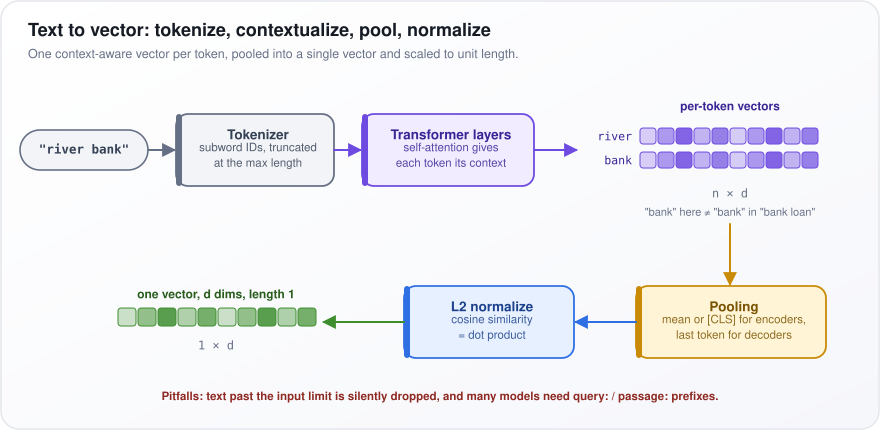
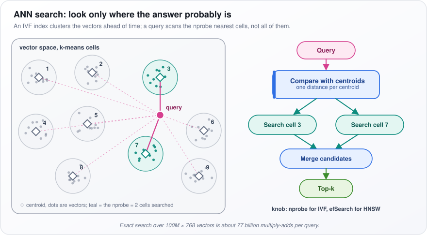
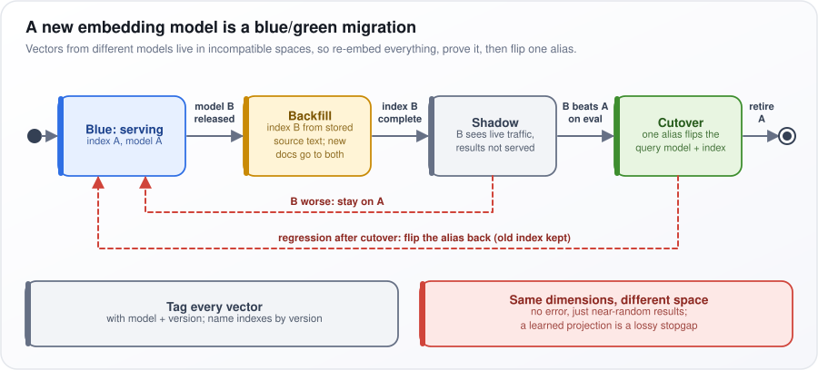
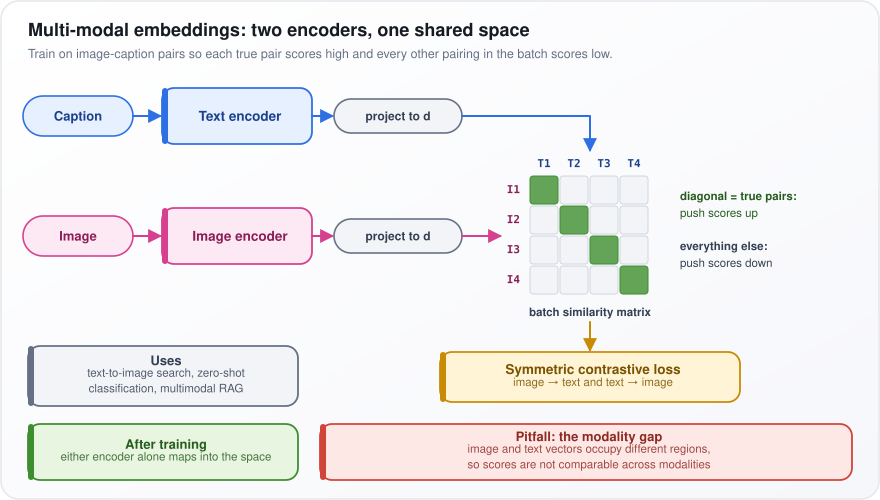
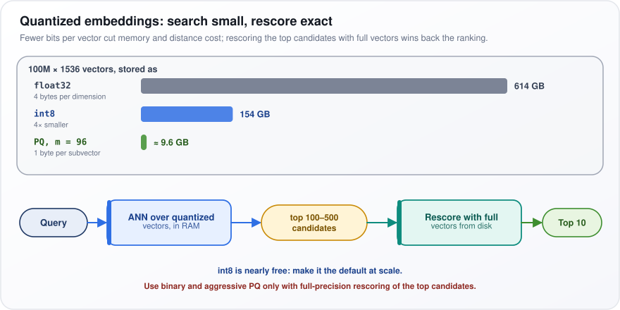
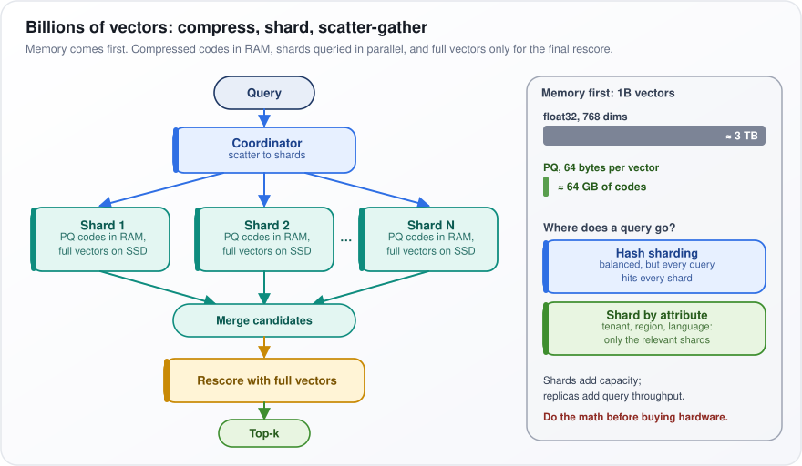
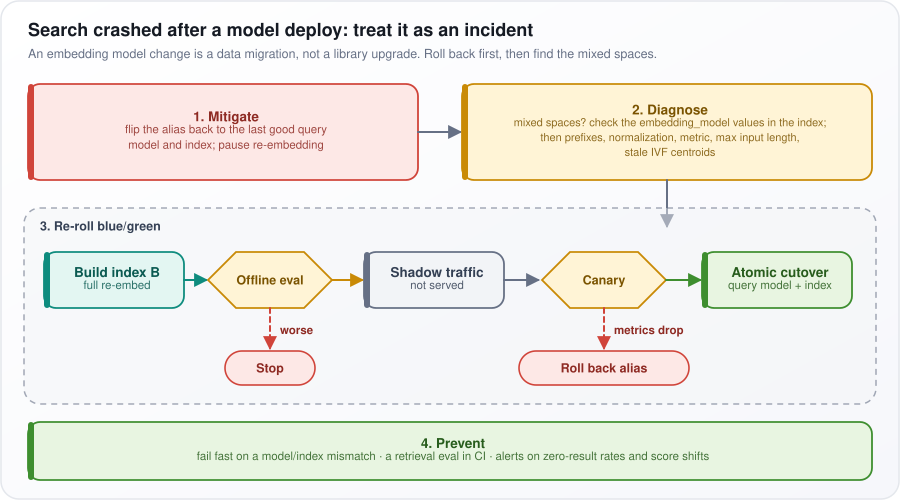

# Vector Databases and Embeddings

[← All topics](../README.md)

An embedding is a list of numbers that captures what a piece of text or an image means, so that similar meanings get similar lists. This topic covers how embedding models produce those vectors and how they are trained, how vectors are compared, compressed and stored, and how a vector database searches millions or billions of them quickly: choosing an index, fitting it in memory, keeping customers' data apart, mixing keyword and vector search, and swapping embedding models without breaking search. Interview panels check whether you can do the memory arithmetic, explain what an index trades between accuracy and speed, and migrate to a new embedding model safely.

## Questions

1. [What are embeddings in the context of AI engineering?](#1-what-are-embeddings-in-the-context-of-ai-engineering)
2. [How do embedding models convert text to vectors?](#2-how-do-embedding-models-convert-text-to-vectors)
3. [What is Contrastive Learning, and how is it used to train embedding models?](#3-what-is-contrastive-learning-and-how-is-it-used-to-train-embedding-models)
4. [What is the difference between sparse and dense embeddings?](#4-what-is-the-difference-between-sparse-and-dense-embeddings)
5. [Explain cosine similarity, dot product, and Euclidean distance for vector search.](#5-explain-cosine-similarity-dot-product-and-euclidean-distance-for-vector-search)
6. [What is a vector database, and how does it differ from a traditional database?](#6-what-is-a-vector-database-and-how-does-it-differ-from-a-traditional-database)
7. [How does Approximate Nearest Neighbor (ANN) search work?](#7-how-does-approximate-nearest-neighbor-ann-search-work)
8. [Compare HNSW, IVF, and flat indexes. How do you pick one, and what does recall@k cost in latency?](#8-compare-hnsw-ivf-and-flat-indexes-how-do-you-pick-one-and-what-does-recallk-cost-in-latency)
9. [How does an Embedding Cache work?](#9-how-does-an-embedding-cache-work)
10. [How do you choose the right embedding model for your use case?](#10-how-do-you-choose-the-right-embedding-model-for-your-use-case)
11. [What is embedding dimensionality, and how does it affect performance and cost?](#11-what-is-embedding-dimensionality-and-how-does-it-affect-performance-and-cost)
12. [How do you handle embedding drift when the embedding model is updated?](#12-how-do-you-handle-embedding-drift-when-the-embedding-model-is-updated)
13. [What are multi-modal embeddings, and how are they generated?](#13-what-are-multi-modal-embeddings-and-how-are-they-generated)
14. [How do you index and query multi-tenant data in a vector database?](#14-how-do-you-index-and-query-multi-tenant-data-in-a-vector-database)
15. [What is quantization of embeddings, and how does it reduce storage costs?](#15-what-is-quantization-of-embeddings-and-how-does-it-reduce-storage-costs)
16. [How do you benchmark and evaluate embedding model quality?](#16-how-do-you-benchmark-and-evaluate-embedding-model-quality)
17. [What is the role of metadata in vector databases?](#17-what-is-the-role-of-metadata-in-vector-databases)
18. [How do you handle large-scale vector search with billions of vectors?](#18-how-do-you-handle-large-scale-vector-search-with-billions-of-vectors)
19. [What is hybrid search (combining keyword search with vector search)?](#19-what-is-hybrid-search-combining-keyword-search-with-vector-search)
20. [How do you fine-tune an embedding model for a specific domain?](#20-how-do-you-fine-tune-an-embedding-model-for-a-specific-domain)
21. [Your vector database for RAG is consuming too much memory. How do you reduce it?](#21-your-vector-database-for-rag-is-consuming-too-much-memory-how-do-you-reduce-it)
22. [Your vector database cannot scale to millions of embeddings. How do you fix the bottleneck?](#22-your-vector-database-cannot-scale-to-millions-of-embeddings-how-do-you-fix-the-bottleneck)
23. [Your new embedding model has different dimensions from the existing vectors in production. How do you handle the mismatch?](#23-your-new-embedding-model-has-different-dimensions-from-the-existing-vectors-in-production-how-do-you-handle-the-mismatch)
24. [Your vector search returns irrelevant results despite high similarity scores. How do you fix it?](#24-your-vector-search-returns-irrelevant-results-despite-high-similarity-scores-how-do-you-fix-it)
25. [You deployed a new embedding model, and search quality crashed overnight. How do you handle embedding drift?](#25-you-deployed-a-new-embedding-model-and-search-quality-crashed-overnight-how-do-you-handle-embedding-drift)
26. [Your semantic search fails for short queries. How do you improve it?](#26-your-semantic-search-fails-for-short-queries-how-do-you-improve-it)

---

## 1. What are embeddings in the context of AI engineering?

**An embedding is a fixed-length list of numbers (a vector) that represents an item, such as a sentence, a document chunk, an image or a product, so that items with similar meaning end up close together. It turns "find things that mean the same as this" into a geometry problem: find the nearest vectors.**

Think of map coordinates: towns near each other have similar coordinates. An embedding does the same for meaning, with hundreds of coordinates instead of two. "How do I reset my password?" and "I forgot my login details" share almost no words but land close together; "password" and "passport" share most of their letters but land far apart.

How they are used:

1. An embedding model (a neural network trained for this job) converts each item into a vector of, say, 768 numbers.
2. You store the vectors, each with a pointer back to its original item.
3. At query time you embed the query with the *same* model and find the stored vectors nearest to it.

Common uses:

- Retrieval for retrieval-augmented generation (RAG), which fetches relevant passages to put in the prompt of a large language model (LLM).
- Semantic search (search by meaning rather than exact words), clustering (grouping similar items) and classification (sorting items into labels).
- Deduplication: near-identical vectors flag near-duplicate documents.
- Semantic caching: reusing an earlier answer when a new question is close enough to an old one.

Two things a newcomer must know:

- "Close" reflects what the model was trained to treat as similar, not what is true. "The drug is safe" and "the drug is not safe" are about the same topic and can sit very close.
- Vectors are only comparable within one model. Each model builds its own space, so a similarity score from model A means nothing next to one from model B.

**Watch out:** the embedding model is a versioned dependency of your data. Changing it means re-embedding every stored item.

---

## 2. How do embedding models convert text to vectors?

**The text is split into tokens (words or pieces of words), run through a transformer (the network design behind modern language models) that produces one context-aware vector (list of numbers) per token, combined (pooled) into a single vector, and usually scaled to length 1. Training on pairs of related texts is what places related texts close together.**

Take "bank" in "river bank" and in "bank loan". A simple lookup table gives both the same vector. A transformer adjusts each token's vector using its neighbors, so the two "bank"s differ.

The steps:

1. **Tokenize:** split the text into tokens and map each to an ID number. Text beyond the model's maximum input length, often 512 to 8,192 tokens (as of 2025–26), is cut off.
2. **Contextualize:** transformer layers apply self-attention: each token looks at every other token and mixes in what is relevant. The output is an $`n \times d`$ matrix: $`n`$ tokens, each described by $`d`$ numbers.
3. **Pool:** reduce the matrix to one vector of $`d`$ numbers. Encoder models (which read the whole text at once) usually average the token vectors (mean pooling) or use a special summary token, [CLS]. Decoder-based embedders (built from large language models, which read left to right) usually take the last token, the only one that has seen all the text.
4. **Normalize:** divide the vector by its length (the L2 norm: the square root of the sum of squares), so every vector has length 1: (3, 4) has length 5 and becomes (0.6, 0.8). Cosine similarity (the usual closeness score, comparing directions) then equals the cheaper dot product (multiply matching numbers and add).

In the figure, follow the arrows: "river bank" passes the Tokenizer and Transformer layers to the per-token vectors ($`n \times d`$), then Pooling, then L2 normalize, ending in the green $`1 \times d`$ vector of length 1.

<p align="center"></p>

*Figure: text becomes tokens, then context-aware token vectors, then one pooled, unit-length vector.*

**Watch out:** text past the input limit is silently dropped, and many models expect prefixes such as `query:` and `passage:` on their inputs. Either mistake quietly lowers retrieval quality.

---

## 3. What is Contrastive Learning, and how is it used to train embedding models?

**Contrastive learning trains an embedding model (a network that turns text into a vector, a list of numbers) by pulling the vectors of pairs that belong together closer and pushing other pairs apart. For text embeddings the pairs are (query, relevant passage), so "relevant" comes to mean "geometrically close".**

Take a training batch of three pairs: "reset password" with the password-help article, "refund policy" with the refunds page, "shipping to Canada" with the shipping page. For the first query, the other two passages serve as wrong answers for free (in-batch negatives). Training nudges each right pair to outscore every wrong one.

How it works:

1. Encode every query and passage in the batch, and score each query against every passage.
2. Treat it as a multiple-choice test: for query $`i`$ the correct choice is passage $`i`$, and the loss (what training minimizes) penalizes probability given to the others.
3. Add hard negatives: passages that look relevant but are not, found with BM25 (a classic keyword-ranking method) or an earlier model. They teach fine distinctions.
4. Larger batches give each query more negatives, which usually helps.

As a formula (the InfoNCE loss):

```math
\mathcal{L}_i = -\log \frac{\exp(\text{sim}(q_i, d_i)/\tau)}{\sum_{j=1}^{B} \exp(\text{sim}(q_i, d_j)/\tau)}
```

$`\mathcal{L}_i`$ is the loss for query $`i`$; $`\text{sim}(q_i, d_j)`$ is the similarity of query $`i`$ and passage $`j`$; $`B`$ is the batch size. $`\exp`$ makes every score positive, and dividing by the sum over all $`B`$ passages turns scores into probabilities that add up to 1 (a softmax). $`-\log`$ turns the correct passage's probability into a loss: near 0 when it is near 1, large when it is small. The temperature $`\tau`$ (typically 0.01–0.05) magnifies score gaps, penalizing near-misses hard.

Example, with $`\tau = 0.1`$: similarities 0.8 (correct), 0.6 and 0.5 become 8, 6 and 5; $`e^8 \approx 2981`$, $`e^6 \approx 403`$, $`e^5 \approx 148`$; the correct share is $`2981 / 3532 \approx 0.84`$, a loss of $`-\log 0.84 \approx 0.17`$ (natural log).

**Watch out:** some mined hard negatives are actually relevant, teaching the model to separate things that belong together. Filter them with a cross-encoder (a slower, more accurate model that reads query and passage together).

---

## 4. What is the difference between sparse and dense embeddings?

**Sparse vectors have one dimension per word in the vocabulary and are almost all zeros; they match exact words (classic keyword methods such as BM25 and TF-IDF, and the learned SPLADE). Dense vectors are short (typically hundreds to a few thousand numbers), every number is non-zero, and meaning is spread across all of them; they match meaning.**

A sparse vector is like a book's index: each word points to where it appears. With a vocabulary of 30,000 words, a sentence touches perhaps 10, so its vector is 30,000 long with 10 non-zero entries. A dense vector is more like describing a face with hundreds of subtle measurements: no single number means anything on its own.

The difference in practice:

- Query "error E-4012 at checkout": sparse finds the document containing the exact code; dense may return generic checkout-error pages, because the code carries little meaning for the model.
- Query "can't pay for my order" against a document titled "payment failure": dense matches the meaning; sparse sees almost no shared words and misses it.

How each works:

1. **TF-IDF and BM25** weight each word by how often it appears in the document and how rare it is across the collection. They are searched with an inverted index (a map from each word to the documents containing it).
2. **SPLADE** is learned sparse: a neural model assigns the weights and adds related terms that are not in the text ("car" also activates "vehicle"). It still uses an inverted index.
3. **Dense** vectors come from an embedding model and are searched with an approximate nearest-neighbor (ANN) index, which checks only a promising fraction of the vectors: a graph of neighbors (HNSW) or a set of clusters (IVF), covered later in this topic.

The table compares the two on size, what they match, how they are indexed, and whether a human can read them.

| | Sparse | Dense |
|---|---|---|
| Dimensions | Vocabulary size, few non-zero | Typically 384–3072, all non-zero |
| Matches | Exact terms, IDs, names | Paraphrases, synonyms, other languages |
| Index | Inverted index | HNSW, IVF |
| Interpretable | Yes | No |

**Watch out:** pure dense search underperforms on identifier-heavy enterprise queries (part numbers, error codes, names), and pure sparse misses paraphrases. Default to using both, which is called hybrid search.

---

## 5. Explain cosine similarity, dot product, and Euclidean distance for vector search.

**Cosine similarity measures the angle between two vectors (lists of numbers, such as embeddings) and ignores their length; the dot product measures angle and length together; Euclidean distance measures the straight-line gap between their tips. When every vector has length 1, all three rank results in exactly the same order, so use the metric the embedding model was trained with.**

Picture two arrows starting from the same point. Cosine asks "do they point the same way?" The dot product also rewards longer arrows. Euclidean distance asks "how far apart are the tips?"

As formulas:

```math
\cos(a,b) = \frac{a \cdot b}{\lVert a \rVert\,\lVert b \rVert} \qquad a \cdot b = \sum_i a_i b_i \qquad \lVert a-b \rVert_2 = \sqrt{\sum_i (a_i - b_i)^2}
```

- $`a \cdot b`$ (dot product): multiply matching coordinates and add them; $`\sum_i`$ means "add over every dimension $`i`$".
- $`\lVert a \rVert`$ is the length of $`a`$: the square root of the sum of its squared coordinates.
- Cosine divides the dot product by both lengths, giving a value from −1 to 1: 1 means the same direction, 0 means unrelated (at right angles).
- Euclidean distance squares the coordinate differences, adds them, and takes the square root.

Example: $`a = (1, 0)`$ and $`b = (0.6, 0.8)`$, both of length 1: the dot product is $`0.6`$, the cosine is $`0.6 / (1 \times 1) = 0.6`$, and the distance is $`\sqrt{0.4^2 + 0.8^2} = \sqrt{0.8} \approx 0.89`$.

Why they agree: for unit-length vectors, $`\lVert a-b \rVert^2 = 2 - 2\cos(a,b)`$. Check it: $`0.8 = 2 - 1.2`$. Smaller distance always means larger cosine, so the ranking is identical.

In practice:

1. Normalize every vector at ingestion and use the dot product, the cheapest of the three (no division).
2. Use an unnormalized dot product only when the model deliberately stores something, such as popularity or confidence, in vector length.
3. Euclidean distance is the native metric of k-means clustering (grouping vectors around center points), which some index types are built on.

**Watch out:** an index metric that differs from the training metric fails silently: results just worsen. Similarity scores are not probabilities either, so set any "good enough" threshold from labelled data (queries with known correct results), separately for each model.

---

## 6. What is a vector database, and how does it differ from a traditional database?

**A vector database stores embeddings (lists of numbers, or vectors, that represent meaning) with their metadata and answers one question fast: "which $`k`$ (say 10) stored vectors are most similar to this one?" It does this with approximate nearest-neighbor (ANN) indexes. A traditional database answers exact conditions ("price below 50", "id = 42") with indexes such as B-trees.**

A B-tree works like a sorted phone book: sort on one key, then jump straight to the right place. "Near this 768-number vector" has no single sort order, because two vectors can be close on some coordinates and far apart on others. So vector search needs different structures, such as graphs of neighbors (HNSW), clusters (IVF) or compressed codes (PQ, product quantization).

What a vector database does:

1. **Stores** each vector with an ID and metadata: tenant, date, source, permissions.
2. **Indexes** for ANN search. Exact search compares the query with every vector; ANN gives up a little recall (occasionally missing a true nearest neighbor) for orders-of-magnitude more speed.
3. **Filters** during search, for example "nearest vectors where tenant is Acme and year is 2025 or later". Combining a filter with ANN is harder than it sounds.
4. **Maintains** the index as items are inserted, updated and deleted, shards (splits) data across machines, and often adds keyword search for hybrid (keyword plus vector) queries.

The table compares a relational database and a vector database on the core query, the index, exactness and what drives cost.

| | Relational database | Vector database |
|---|---|---|
| Core query | Exact match, range, join | Top-k by similarity + filters |
| Index | B-tree, hash | HNSW, IVF, PQ |
| Results | Exact | Approximate by design |
| Cost driver | Disk I/O | RAM, distance computations |

Choosing one: if you already run Postgres (a popular relational database) and have up to a few million vectors (rule of thumb), its pgvector extension saves and updates vectors together with the rest of your data: one system, no sync job. Move to a dedicated engine when measured scale or filtered-search latency demands it.

**Watch out:** "approximate by design" means results can differ from exact search. Measure recall on your own queries rather than assuming the engine returns the true top $`k`$.

---

## 7. How does Approximate Nearest Neighbor (ANN) search work?

**Approximate nearest-neighbor (ANN) search builds an index ahead of time so a query is compared with only a small, promising fraction of the stored vectors (embeddings: lists of numbers that represent meaning). It gives up a little recall (occasionally missing a true nearest neighbor) for orders of magnitude less computation.**

Exact search over 100 million vectors of 768 dimensions takes one multiply-add per dimension per vector: $`10^8 \times 768 \approx 77`$ billion per query. Like searching every street in the country for a café, not just nearby neighborhoods.

Three families of index:

1. **Graphs (HNSW, hierarchical navigable small world):** each vector is linked to a few near neighbors, with sparser upper layers for long jumps. A query starts at the top and steps toward ever-closer vectors, a layer at a time: highways first, local streets last.
2. **Partitions (IVF, inverted file index):** k-means clustering splits the vectors into `nlist` groups ahead of time, each summarized by its center (centroid). A query is compared with every centroid and searches only the `nprobe` nearest groups.
3. **Quantization:** store each number in fewer bits (int8: 1 byte instead of 4; binary: 1 bit; product quantization, PQ: a short code per chunk of the vector), making distances cheaper and memory smaller. Usually combined with one of the above.

The speed/recall knobs are `nprobe` and, for HNSW, `efSearch` (candidates the walk keeps): higher means better recall, slower queries.

In the figure, the left panel shows nine k-means cells, each with a diamond centroid. The query (pink dot) is compared with every centroid (dashed lines), and only the two nearest, cells 3 and 7 in teal, are searched ($`\text{nprobe} = 2`$). The right side shows the same flow, ending in the top-k (the $`k`$ nearest results).

<p align="center"></p>

*Figure: an IVF index searches only the nprobe cells whose centroids are nearest the query.*

**Watch out:** report recall@k (the share of the true top $`k`$, from exact search, that the index returned) on real queries, next to p50 and p99 latency (the median response time, and the time 99% of queries beat). Recall@10 of 0.95–0.99 is a common target.

---

## 8. Compare HNSW, IVF, and flat indexes. How do you pick one, and what does recall@k cost in latency?

**Flat (brute-force) search compares the query with every vector: exact, but cost grows in step with the data. HNSW, a graph linking each vector to its near neighbors, gives the best recall for a given latency in memory, at the cost of extra RAM. IVF searches only the clusters nearest the query: less memory, lower recall at equal speed, and with product quantization (IVF-PQ, each vector compressed to a short code) it handles huge collections. Default to HNSW.**

Finding the nearest café: check every café in town (flat), follow "nearby" signposts between cafés (HNSW), or search only the nearest few districts (IVF).

Recall@k is the share of the true $`k`$ nearest neighbors (found by exact search) that the index returns; latency is how long a query takes.

Rules of thumb:

- **Flat:** up to about 100,000 vectors, small filtered subsets (one tenant's 5,000 documents), and exact answers for evaluating other indexes.
- **HNSW:** up to tens of millions of vectors in RAM.
- **IVF-PQ or disk-based graph indexes:** hundreds of millions of vectors and up, when memory is the limit.

Recall costs latency non-linearly. Raising recall@10 from 0.90 to 0.95 is usually cheap; going from 0.98 to 0.99 can multiply latency, because the last few true neighbors lie off the search's usual path.

To choose the setting:

1. Sweep `efSearch` (HNSW: candidates the search keeps) or `nprobe` (IVF) over a range of values.
2. For each, measure recall@k and p99 latency (the time 99% of queries beat) on real queries.
3. Plot recall against latency and pick the knee, where extra latency stops buying much recall.

In the table, $`O(N)`$ means cost grows in proportion to the number of vectors $`N`$, and $`O(\log N)`$ that doubling the data adds only a little work. IVF scans about $`\text{nprobe}/\text{nlist}`$ of the data (`nlist` clusters built, `nprobe` searched): with $`N`$ = 10 million, `nlist` = 10,000 and `nprobe` = 20, about 20,000 vectors plus 10,000 centroids.

| | Flat | HNSW | IVF / IVF-PQ |
|---|---|---|---|
| Recall | 100% | Very high when tuned | Depends on `nprobe`; lower with PQ |
| Query cost | $`O(N)`$ | Roughly $`O(\log N)`$ | About $`N \cdot \text{nprobe}/\text{nlist}`$ |
| Memory | Vectors | Vectors + graph links | Smallest with PQ |
| Build | None | Slow | k-means training, fast adds |

**Watch out:** a reranker (a more accurate model that re-scores the top candidates) on top of slightly lower index recall often beats chasing 0.99.

---

## 9. How does an Embedding Cache work?

**An embedding cache stores each computed embedding (the vector, or list of numbers, the model produces) under a key built from the exact input text plus the model's identity, so the same text is never sent to the embedding model twice. The biggest saving is on re-ingestion, when most document chunks (the short passages documents are split into) have not changed.**

Say you re-index a knowledge base of 1 million chunks every night and 2% of them changed. Without a cache you pay to embed 1 million chunks; with one, 20,000. Popular queries such as "reset password" repeat constantly too.

How it works:

1. **Normalize the input deterministically:** collapse whitespace and use one standard Unicode form (so identical-looking characters are stored identically). Never lowercase or strip anything in a way that could change meaning.
2. **Build the key** as a hash (a short fingerprint computed from the input, such as SHA-256) of model name, version, dimensions, any prefix like `query:`, and the text. If any of these changes, the vector changes, so the key must change too.
3. **Store:** an in-process LRU cache (least recently used: it evicts whatever has gone unused longest) for hot queries, and Redis (a fast in-memory key-value store) or a database table keyed by content hash for documents.
4. **On a model upgrade** every key changes, and old entries expire by TTL (time to live).

In the code below, `_key` builds the key from the model ID and the normalized text, and `embed` looks up all texts at once and sends only the misses to the model, in one batched call.

```python
import hashlib, json
import numpy as np

class EmbeddingCache:
    def __init__(self, store, embed_fn, model_id: str):
        self.store, self.embed_fn, self.model_id = store, embed_fn, model_id

    def _key(self, text: str) -> str:
        norm = " ".join(text.split())  # model_id must encode name, version, dims and prefix
        return hashlib.sha256(f"{self.model_id}\x00{norm}".encode()).hexdigest()

    def embed(self, texts: list[str]) -> list[np.ndarray]:
        keys = [self._key(t) for t in texts]
        out = {k: self.store.get(k) for k in keys}
        missing = [(k, t) for k, t in zip(keys, texts) if out[k] is None]
        if missing:  # one batched call for all misses
            for (k, _), v in zip(missing, self.embed_fn([t for _, t in missing])):
                # np.asarray(...).tolist() accepts a list or a NumPy array from embed_fn
                out[k] = self.store[k] = json.dumps(np.asarray(v, dtype=float).tolist())
        return [np.array(json.loads(out[k]), dtype=np.float32) for k in keys]
```

**Watch out:** leaving the model out of the key serves old-model vectors after an upgrade, silently mixing two vector spaces. And do not confuse this with a semantic cache, which reuses a language model's *answers* for queries that are merely similar, a riskier kind of cache.

---

## 10. How do you choose the right embedding model for your use case?

**Use public leaderboards only to build a shortlist. Choose with an evaluation on your own queries and documents, weighed against cost, latency, maximum input length, vector size and hosting constraints.**

The model at the top of a public benchmark was scored on things like Wikipedia, news and scientific papers. If your data is maintenance manuals full of part numbers, the ranking often reshuffles.

The steps:

1. **Constraints first,** to rule models out: the languages you need, maximum input tokens (words or word pieces) against your chunk size (the length of the passages you embed), self-hosting versus API and the license, price at your volume, and dimensions (the vector's length, which drives storage cost).
2. **Shortlist 3–5 models** from MTEB (the Massive Text Embedding Benchmark), using the *retrieval* task scores, not the overall average, which mixes in clustering, classification and other tasks.
3. **Evaluate on your data:** 100–500 real queries, each labelled with its relevant documents. Measure recall@k (the share of relevant documents found in the top $`k`$) and nDCG@10 (normalized discounted cumulative gain, which rewards relevant documents more the higher they rank; 1.0 is a perfect ordering). Report overall and by slice: short queries, identifiers, languages.
4. **Test in the full pipeline,** with your reranker (a slower, more accurate model that re-scores the top results) and hybrid search (keyword plus vector) in place. The gaps between embedders often shrink there.

A smaller model plus a reranker often beats the largest embedder alone, at lower cost and latency (response time).

**Watch out:** plan for replacement from day one. Store the model version with every vector and keep the original text, so you can re-embed when a better model arrives.

---

## 11. What is embedding dimensionality, and how does it affect performance and cost?

**Dimensionality is the length of the vector: how many numbers each embedding has, typically 384 to 3,072. Storage, RAM and the cost of every distance computation grow in proportion to it, while quality gains flatten out. Past roughly 768–1,024 dimensions, cost usually rises faster than quality (rule of thumb).**

More numbers give a finer description, like a higher-resolution photo. But going from 1,024 to 3,072 dimensions triples memory and compute, and may raise recall (the share of relevant results found) by only a percentage point.

How it drives cost:

- **Raw size** is $`N \times d \times`$ bytes per value, where $`N`$ is the number of vectors and $`d`$ the dimensions. A float32 value (a standard 32-bit decimal number) takes 4 bytes, so 1 million vectors of 1,536 dimensions take $`10^6 \times 1536 \times 4 \approx 6.1`$ GB. An HNSW index (a graph linking each vector to its neighbors) adds those links on top.
- **Each distance computation** grows in proportion to $`d`$ (written $`O(d)`$): doubling $`d`$ doubles the arithmetic and the memory read per comparison.

The table shows raw storage for different collection sizes, dimensions and precisions: int8 stores each number in 1 byte, binary in 1 bit.

| Vectors | Dims | float32 | int8 | Binary |
|---|---|---|---|---|
| 1M | 384 | 1.5 GB | 0.38 GB | 48 MB |
| 1M | 1536 | 6.1 GB | 1.5 GB | 192 MB |
| 100M | 1536 | 614 GB | 154 GB | 19 GB |
| 100M | 3072 | 1.2 TB | 307 GB | 38 GB |

Ways to cut dimensions:

1. **Matryoshka-trained models** (named after nesting dolls) are trained so the first $`k`$ numbers form a good embedding on their own. Keep the first 256 or 512, then re-normalize to length 1.
2. **PCA** (principal component analysis, which rotates the data so the first few directions capture most of the variation, and keeps those) works for any model, as long as queries get the same transform.
3. **Pick by measurement:** check recall at a few sizes (256, 512, 1,024, full) and take the smallest within about a point of the best.

**Watch out:** truncating a model that was *not* Matryoshka-trained badly hurts quality, because its information is spread across all dimensions. Use PCA instead.

---

## 12. How do you handle embedding drift when the embedding model is updated?

**Embedding vectors (the lists of numbers a model produces for each text) from different models, or even from different versions of one model, live in incompatible spaces, so new query vectors cannot be compared with old document vectors. A model update therefore means re-embedding the whole corpus (document collection), run as a blue/green migration: build the new index next to the old one, prove it, then switch.**

It is like changing map projections: coordinates from the old map mean nothing on the new one, even though both are pairs of numbers. Having the same number of dimensions does not make two spaces the same.

The migration:

1. **Tag everything:** store the model and version with every vector, and name indexes by version (`docs_v3`).
2. **Backfill:** build index B from the stored source text (which is why you keep it). Meanwhile, write new documents to both A and B.
3. **Evaluate offline** on labelled queries, then **shadow**: send live queries to B as well, without serving its results, and compare.
4. **Cut over:** switch the query model and the index together with one atomic alias change. (An alias is a stable name, such as `docs_live`, that points at one index; flipping it is instant.) Keep index A for rollback.

In the figure, follow the states left to right: Blue: serving (index A, model A), Backfill, Shadow, Cutover, with the trigger on each arrow (model B released, index B complete, B beats A on eval). The red dashed arrows are the escape routes: "B worse: stay on A" from Shadow, and "regression after cutover: flip the alias back (old index kept)".

<p align="center"></p>

*Figure: an embedding-model update run as a blue/green migration with two rollback paths.*

**Watch out:** when the dimensions match, a mix-up raises no error; results are just near-random. A learned projection that maps old vectors into the new space is a lossy stopgap during a long backfill, not a fix.

---

## 13. What are multi-modal embeddings, and how are they generated?

**Multi-modal embeddings put different kinds of data, such as text and images, into one shared vector space, so a text query like "red running shoes" can retrieve a photo. They are usually trained CLIP-style: one encoder (a network that turns an input into a vector) per modality (kind of data), trained on matching pairs such as images and their captions to pull true pairs together and push other pairings apart.**

A photo of a dog on a beach and the caption "a dog running on the beach" should land together, though one is pixels and the other words.

How it works:

1. Collect (image, caption) pairs; the original CLIP used about 400 million web pairs.
2. An image encoder embeds each image and a text encoder each caption; a small learned projection maps both to the same dimension $`d`$.
3. For a batch of $`B`$ pairs, compute every image-caption similarity: a $`B \times B`$ matrix whose diagonal holds the true pairs.
4. A symmetric contrastive loss asks each image to pick its caption from the $`B`$ captions, and each caption its image, and averages the two directions.
5. Afterward, either encoder alone maps into the shared space: embed a million product photos once, then search them with text.

Uses: text-to-image search; zero-shot classification (embed "a photo of a cat" and "a photo of a dog", then label an image by whichever is closer, with no training); and multimodal RAG (retrieving figures and slides for a language model to answer from).

In the figure, the Caption (blue) and Image (pink) pass through separate encoders and "project to d" into the batch similarity matrix. The green diagonal cells, I1–T1 through I4–T4, are true pairs pushed up; every other cell is pushed down.

<p align="center"></p>

*Figure: two encoders trained so that true image-caption pairs score high in one shared space.*

**Watch out:** the modality gap. Image and text vectors occupy different regions of the shared space, so text-to-text scores run systematically higher than text-to-image ones. In a mixed index a text query ranks text above images regardless of relevance, so rank each modality separately.

---

## 14. How do you index and query multi-tenant data in a vector database?

**Pick the isolation pattern by how many tenants (customer organizations) you have and how big they are. Whatever the pattern, apply the tenant filter on the server, from the authenticated identity, never from a value the caller or the language model (LLM) supplies.**

Say a software-as-a-service assistant serves 5,000 customer companies. One shared index is cheap, but one missing filter shows company A's contracts to company B. One index per company is the safest option, but 5,000 indexes are heavy to run.

The table compares the three patterns on how strongly they isolate tenants, where each fits, and its weak spot.

| Pattern | Isolation | Fits | Weak spot |
|---|---|---|---|
| Collection per tenant | Strongest | Few large or regulated tenants | Overhead with thousands |
| Partition / namespace | Physical, shared cluster | Many varied tenants | Engine partition limits |
| Shared index + tenant_id filter | Logical only | Many tiny tenants | Filtered recall; one missing filter leaks data |

How filtering interacts with approximate search (which checks only a promising fraction of the vectors):

1. **Post-filtering** searches the shared index for the top 10, then drops other tenants' results. A small tenant that owns 0.01% of the vectors will often get zero results.
2. **Naive pre-filtering** restricts the search to the tenant's vectors first. On an HNSW graph (an index where each vector links to its nearest neighbors and a query walks those links) this breaks the walk, because the links between that tenant's vectors run through other tenants' vectors.
3. **Good engines** check the filter during the walk, or switch to exact search when the filtered set is small. A tenant with 5,000 vectors is instant to scan exactly.

A sensible default: a partition (namespace) per tenant for most tenants, and dedicated collections for large or regulated ones.

Within a tenant, store document permissions as metadata and apply them as query-time filters. Revoking access then takes effect immediately, with no re-indexing.

**Watch out:** testing recall (the share of true matches returned) only on average-sized tenants. Test the smallest ones too, and put a cross-tenant leakage test in CI (the automated tests run on every code change): query as tenant A and assert that no tenant B document ever comes back.

---

## 15. What is quantization of embeddings, and how does it reduce storage costs?

**Quantization stores each embedding vector (list of numbers) with fewer bits: int8 (1 byte per number instead of 4, so 4× smaller), binary (1 bit per number, 32× smaller), or product-quantization (PQ) codes (often 16–64× smaller or more). Memory and distance cost drop sharply, and most of the lost ranking accuracy comes back by rescoring the top candidates with the full-precision vectors.**

It is like saving a photo with 256 colors instead of millions: you still recognize everyone.

How each kind works:

1. **Scalar int8:** map each dimension's observed range (say −0.12 to 0.15) onto 256 evenly spaced levels, and store the level number in 1 byte.
2. **Binary:** keep only each number's sign (positive 1, negative 0), and compare vectors with Hamming distance, the count of differing bits, which CPUs compute extremely fast.
3. **Product quantization (PQ):** split each vector into $`m`$ subvectors; with 1,536 dimensions and $`m = 96`$, that is 96 chunks of 16 numbers. For each chunk position, k-means clustering learns 256 typical chunks (centroids, the centers of groups of similar chunks), and each stored chunk becomes the 1-byte ID of its nearest centroid, so the vector becomes 96 bytes. A query's distances to all centroids are computed once, so the distance to any stored vector is $`m`$ table lookups added together.

Worked example: 100 million vectors × 1,536 dimensions × 4 bytes is 614 GB in float32. int8 brings it to 154 GB. PQ with $`m = 96`$ stores 96 bytes per vector, about 9.6 GB, 64× smaller than float32.

In the figure, the three bars (float32, int8, PQ, m = 96) show that shrinkage. The flow below shows how accuracy is won back: approximate nearest-neighbor (ANN) search over the quantized vectors in RAM, keep the top 100–500 candidates, rescore them with full vectors from disk, return the top 10.

<p align="center"></p>

*Figure: quantized vectors shrink memory, and rescoring with full vectors recovers the ranking.*

**Watch out:** int8 costs almost nothing in quality and is a good default at scale; binary and aggressive PQ lose noticeable accuracy, so use them only with full-precision rescoring.

---

## 16. How do you benchmark and evaluate embedding model quality?

**Evaluate on your own task and data: real queries, each labelled with the documents that are actually relevant, scored with recall@k, nDCG@10 and MRR. Public benchmarks such as MTEB and BEIR (standard sets of test queries across many subjects) are for building a shortlist, not for choosing.**

Take 200 real queries from logs, each labelled with the one to three chunks (passages) that answer it. Run every candidate model and count how often those chunks appear near the top.

As formulas:

```math
\text{Recall@}k = \frac{|\text{relevant} \cap \text{top-}k|}{|\text{relevant}|} \qquad \text{MRR} = \frac{1}{|Q|}\sum_{q} \frac{1}{\text{rank}_q}
```

- **Recall@k:** of all the relevant documents for a query, the fraction that appear in the top $`k`$. The bars $`|\cdot|`$ mean "number of items in", and $`\cap`$ means "in both".
- **MRR (mean reciprocal rank):** for each query, take 1 divided by the rank of the first relevant result, then average over the set of queries $`Q`$ ($`|Q|`$ is how many there are); $`\sum_q`$ means "add up over every query".
- **nDCG@10:** rewards relevant documents more the higher they rank, scaled so a perfect ordering scores 1.

Small examples: a query with 2 relevant documents, one of them in the top 5, has Recall@5 = 1/2 = 0.5. Three queries whose first relevant results sit at ranks 1, 2 and 4 give MRR = (1 + 0.5 + 0.25) / 3 ≈ 0.58.

How to build the evaluation:

1. **Queries** come from logs. With none, generate them from your documents with a large language model (LLM), have humans filter them, and add short and paraphrased ones, because LLMs write long, tidy questions.
2. **Labels:** pool the top results from several systems and have judges label them all. Otherwise a model that finds an unlabelled relevant document is penalized.
3. **Report by slice:** short queries, identifiers, languages.
4. **Measure the rest too:** end-to-end answer quality, latency (response time) and index size.

**Watch out:** declaring a winner on a one- or two-point difference. Compare on the same queries, with a bootstrap confidence interval: the range the true score plausibly lies in, estimated by redrawing the query set at random, with repeats, many times and seeing how much the score moves.

---

## 17. What is the role of metadata in vector databases?

**Metadata is the structured information stored next to each vector: tenant, permissions, source document, page, timestamps, language, model version. It restricts results to what the user is allowed to see and wants to see, and it makes citations, updates and deletions possible.**

A vector alone is 1,536 anonymous numbers. You cannot tell which customer it belongs to, which page it came from, or whether it comes from the 2019 policy or the 2025 one. Metadata answers all of that.

Its four jobs:

1. **Filtering:** tenant, date range, language, document type ("only 2025 HR policies").
2. **Access control:** permission fields, such as the groups allowed to read a document, applied on every query.
3. **Attribution:** document ID, page and section, so an answer can cite its sources.
4. **Lifecycle:** embedding model version and content hash (a fingerprint of the text), for re-embedding, deduplication and deletion ("remove every chunk of document 881").

Combining filters with approximate nearest-neighbor (ANN) search, which checks only a promising fraction of the vectors, is the tricky part. The table compares the three strategies by how each works and what can go wrong.

| Strategy | How | Risk |
|---|---|---|
| Post-filter | ANN top-k, then drop non-matches | Few or zero results |
| Pre-filter | Restrict to matching IDs, then search | Graph walk degrades if naive |
| Filter-aware | Filter checked during the walk | Engine-specific |

For example, if a filter matches 1% of the data, the unfiltered top 10 will usually contain no match at all, so post-filtering returns nothing. Pre-filtering a graph index (such as HNSW, where each vector links to its neighbors and a query walks those links) cuts links the walk depends on. Filter-aware engines check the filter as they walk and fall back to an exact scan when the matching set is small.

**Watch out:** selective filters, which match only a small share of the data, are where naive approximate search breaks. Index only the fields you actually filter on, and test recall (the share of true matches returned) with your most selective filter.

---

## 18. How do you handle large-scale vector search with billions of vectors?

**At a billion vectors, memory is the first problem: raw vectors of 768 numbers each, stored as 4-byte float32 values, take about 3 TB. The answer combines compression (product quantization, PQ), indexes built for compressed or on-disk data, sharding (splitting the data across machines), replicas and a final rescoring step.**

$`10^9 \times 768 \times 4`$ bytes is about 3.07 TB, more RAM than any ordinary server has. PQ at 64 bytes per vector gives 64 GB of codes, 48 times smaller, which fits on one large machine.

How the pieces fit:

1. **Compress:** keep PQ codes (a few bytes standing in for each vector) in RAM for fast approximate distances, often in an IVF-PQ index, which searches only the clusters nearest the query.
2. **Use the disk:** DiskANN-style graph indexes navigate with compressed vectors in RAM and keep the full vectors and graph on fast solid-state drives (NVMe SSDs), read only for final candidates.
3. **Shard:** a coordinator scatters each query to the shards (scatter), each returns its local top candidates, and the coordinator merges them (gather). Hash sharding (spreading vectors by a hash of their ID) balances load, but every query hits every shard. Sharding by attribute (tenant, region, language) sends each query only to the shards that matter.
4. **Rescore:** recompute exact distances for the merged candidates using the full vectors.
5. **Scale throughput and freshness:** shards add capacity and replicas (copies of each shard) add queries per second. New data goes into a small fresh index, merged in periodically; rebuilding a billion-vector index per insert is impractical.

In the figure, the Coordinator scatters the Query to Shard 1 to Shard N; candidates are merged, rescored with full vectors (amber) and returned as the top-k. The right panel shows the memory math and both sharding choices.

<p align="center"></p>

*Figure: billion-scale search compresses vectors, scatters the query across shards and rescores the merged candidates.*

**Watch out:** do the compression arithmetic before buying hardware: compressing tens of times changes the hardware tier you need. And measure recall (the share of true nearest neighbors found) at that compression with rescoring switched on.

---

## 19. What is hybrid search (combining keyword search with vector search)?

**Hybrid search runs keyword search (usually BM25) and vector search (matching by meaning, using embeddings) on the same query and merges the two ranked lists. Keyword matching catches exact identifiers and jargon; vector search catches paraphrases and synonyms.**

Take the query "E-4012 payment declined". BM25, a classic ranking method that scores documents by how often they contain the query's words, weighted by how rare those words are, finds the document containing "E-4012". Vector search finds the page titled "card rejected at checkout". Hybrid search puts both near the top.

How it works:

1. Run BM25 and vector search in parallel, taking the top 50 or so from each.
2. Fuse the two lists. Reciprocal Rank Fusion (RRF) uses only rank positions, so the raw scores need no normalization. That matters because BM25 scores have no upper limit while cosine similarity scores (the vector-closeness measure) run from −1 to 1, so they cannot simply be added.
3. Take the top 50–100 fused results and let a cross-encoder (a slower model that reads query and document together) rerank them down to 5–10.

Put as a formula:

```math
\text{RRF}(d) = \sum_{r \in \text{rankers}} \frac{1}{k + \text{rank}_r(d)}
```

For a document $`d`$, every ranker $`r`$ that returned it adds $`1 / (k + \text{its rank})`$. The constant $`k`$, usually 60, damps the gap between the very top ranks. Example: a document ranked 1st by BM25 and 3rd by vector search scores $`1/61 + 1/63 \approx 0.0164 + 0.0159 = 0.0323`$. A document ranked 2nd by vector search alone scores $`1/62 \approx 0.0161`$. The document both rankers agree on wins.

Alternatives:

- **Weighted score fusion** (adding the two scores with tuned weights) can beat RRF when tuned, but it needs the BM25 scores normalized, which is hard to do reliably.
- **Learned sparse vectors** (SPLADE, a neural model that outputs keyword-style word weights) can replace BM25 as the keyword side.

**Watch out:** one fusion setting rarely suits every query. Default to RRF, weight keyword results higher for short or identifier-like queries, and evaluate each query type separately.

---

## 20. How do you fine-tune an embedding model for a specific domain?

**Collect (query, relevant passage) pairs from your domain, add hard negatives (passages that look relevant but are not), and continue training a strong existing embedding model (one that turns text into a vector of numbers) with a contrastive loss, which pulls each query toward its passage and away from the others. Then prove the gain on held-out queries (kept out of training). A few thousand good pairs is often enough (rule of thumb).**

A general embedder does not know that the M8 and M10 bolt sections are different answers; it sees two very similar passages. Your engineers need the exact one. Fine-tuning on examples teaches the model your domain's distinctions.

The steps:

1. **Pairs:** search logs and clicks, resolved support tickets (the question and the article that solved it), or LLM-generated questions for each chunk, filtered for quality.
2. **Hard negatives:** top BM25 (keyword search) or base-model results that are *not* the right passage (the M10 section for an M8 query). Remove false negatives, results that are actually relevant, with a cross-encoder (a slower, more accurate model that reads query and passage together).
3. **Train** with in-batch plus hard negatives (the contrastive InfoNCE loss; in the code below, `MultipleNegativesRankingLoss`). Use a low learning rate (small update steps) and few epochs (passes over the data) so the model does not forget its general knowledge.
4. **Evaluate:** split training and test data by document, not by pair, so no test question shares a source document with training. Compare recall@k (the share of relevant passages found in the top $`k`$) and nDCG@10 (a score that also rewards ranking them higher) between the base and the tuned model.

In the code, each training example is a triple of query, positive passage and hard negative. With a batch size of 64, every query also treats the other examples' passages in the batch as negatives.

```python
from sentence_transformers import SentenceTransformer, InputExample, losses
from torch.utils.data import DataLoader

model = SentenceTransformer("BAAI/bge-base-en-v1.5")
triples = [  # (query, positive, hard negative), thousands in practice
    ("torque spec for M8 bolt", "Section 4.2: M8 fasteners are torqued to ...", "Section 4.3: M10 fasteners ..."),
]
loader = DataLoader([InputExample(texts=list(t)) for t in triples], shuffle=True, batch_size=64)
loss = losses.MultipleNegativesRankingLoss(model)  # InfoNCE: in-batch + hard negatives
model.fit(train_objectives=[(loader, loss)], epochs=1, warmup_steps=100)
model.save("domain-embedder-v1")
```

**Watch out:** a new embedder means re-embedding the whole corpus. Fine-tuning a reranker (the model that re-scores the top results) often gains more, with no re-indexing at all.

---

## 21. Your vector database for RAG is consuming too much memory. How do you reduce it?

**First measure where the memory actually goes (raw vectors, meaning the embeddings themselves; index links; stored payloads such as text and metadata; duplicates), then apply the cheapest fix to the biggest item. Quantization (fewer bits per number) with rescoring (re-checking the top candidates against full vectors) is usually the largest win for the smallest quality loss.**

A worked example: 20 million chunks × 1,536 dimensions × 4 bytes is about 123 GB in float32. int8 quantization (1 byte per number instead of 4) brings that to about 31 GB. Keeping only the first 768 dimensions, which works for Matryoshka-trained models, halves it again, to about 15 GB. Check recall@k (the share of relevant results in the top $`k`$) after each step.

Fixes, roughly in order:

1. **Quantize:** int8 cuts vector memory 4×. Binary or product quantization go further, with full vectors kept on disk to rescore the top candidates.
2. **Move payloads out:** keep the chunk text in a document store or object storage, and only IDs and filterable metadata in the vector engine.
3. **Reduce dimensions:** truncate a Matryoshka model (one trained so its first dimensions work alone), or apply PCA (a rotation that keeps the most informative directions) for other models.
4. **Reduce the count:** remove duplicate chunks, boilerplate (footers, disclaimers) and superseded document versions, and reconsider very small chunks, since halving the number of chunks halves the memory.
5. **Tune the index:** lower the HNSW graph index's `M` (the number of links per vector: fewer links mean less memory and somewhat lower recall), or switch to IVF-PQ (clusters of compressed codes) for large, memory-bound collections.

Measuring first matters because the answer varies. In some deployments the stored text and metadata outweigh the vectors; in others the HNSW links add a large share on top of small quantized vectors.

**Watch out:** every step trades some quality. Measure recall@k on real queries after each one, rather than stacking them all at once and discovering later that search got worse.

---

## 22. Your vector database cannot scale to millions of embeddings. How do you fix the bottleneck?

**Millions of vectors is a modest load for modern engines, so first find which resource is saturated. It is usually a missing or unused approximate-search index, then memory, ingestion speed or filtered queries. Fix that bottleneck before adding machines.**

A flat scan (comparing the query with every vector) of 10 million vectors of 1,536 dimensions is about 15 billion multiply-adds per query, and it grows in step with the data: ten times the vectors, ten times the latency. A working index turns that into thousands of comparisons.

The table maps each symptom to its likely cause and the fix.

| Symptom | Likely cause | Fix |
|---|---|---|
| Latency grows linearly with data | No ANN index, or not used | Build HNSW/IVF, check the query plan |
| Out of memory | Full-precision vectors + graph | Quantize, move payloads to disk |
| Slow ingestion | One-by-one inserts | Batch upserts, bulk build |
| Slow filtered queries | Filter scans or post-filtering | Index filter fields, partition |
| Slow only at peak | Single node CPU-bound | Replicas |

The fixes in more detail:

1. **Confirm the index is used:** build an HNSW (graph) or IVF (cluster) index, then check the query plan (the engine's report of how it will run a query). Some engines quietly fall back to an exact scan for certain filtered queries.
2. **Retune for the new size:** for HNSW, `M` (links per vector) and `efSearch` (candidates kept during a search). For IVF, `nlist` (the number of clusters; a common rule of thumb is a small multiple of $`\sqrt{N}`$, such as $`4\sqrt{N}`$, about 12,600 for 10 million vectors) and `nprobe` (clusters searched per query).
3. **Fix ingestion:** bulk-load the data and build the index once rather than inserting one vector at a time, send later changes as batched upserts (insert-or-update calls), and compute embeddings asynchronously in batches.
4. **Scale out:** shards (slices of the data on separate machines) for capacity, replicas (copies) for query throughput (queries per second).

**Watch out:** "fixes" that restore latency by quietly cutting recall. Load-test with a realistic query mix and report recall@k (the share of true top-$`k`$ neighbors found) alongside p99 latency (the slowest 1% of queries).

---

## 23. Your new embedding model has different dimensions from the existing vectors in production. How do you handle the mismatch?

**You cannot mix old and new vectors, and the dimension difference is the smaller problem: two different models live in unrelated spaces even when their dimensions match. Re-embed the corpus (all stored documents) into a new index with the new model, and switch queries and documents over together.**

Say the old model produces 768 dimensions and the new one 1,024. It is tempting to pad the old vectors with 256 zeros. The arithmetic then runs, but position 17 in model A means something unrelated to position 17 in model B, like comparing latitude with house numbers.

Why the shortcuts fail:

- **Zero-padding** makes the comparison compute; the results are meaningless.
- **Truncation** (keeping only the first dimensions) works only within one Matryoshka model (one trained so its first dimensions work on their own), such as cutting its 1,024 dimensions to 768. It never works across two models.
- **A learned projection** (a mapping trained on texts embedded by both models) is lossy: at most a temporary bridge during a long migration.

The migration:

1. Create a new index sized for the new dimension.
2. Backfill it by re-embedding the stored source text.
3. Dual-write: send new documents to both indexes while the backfill runs.
4. Evaluate the new index on labelled queries.
5. Swap an alias atomically (a stable name that points at one index), so queries and documents change together. Keep the old index for rollback.

Prevention: run one embedding service used by both ingestion and queries, and have it check at startup that the query model matches the model recorded on the index.

**Watch out:** a dimension mismatch is the lucky case, because it fails loudly. A swap to a model with the *same* dimensions fails silently, with near-random results.

---

## 24. Your vector search returns irrelevant results despite high similarity scores. How do you fix it?

**Similarity scores are not probabilities of relevance: they are specific to each model and often bunched in a narrow, high band, so 0.85 can still be a poor match. Check configuration, chunking and model limits first, then raise precision (the share of returned results that are actually relevant) with reranking, hybrid search or fine-tuning (further training the embedding model on your own examples).**

With some models almost every pair of texts scores between 0.7 and 0.9, related or not. A score of 0.85 then means "slightly above average for this model", not "85% relevant".

Check and fix, in order:

1. **Configuration:** vectors from mixed models, missing `query:` or `passage:` prefixes (labels some models expect at the start of each input), a search metric (cosine, dot product or distance) different from the one the model was trained with, or chunks cut off at the input limit.
2. **Chunking:** a chunk (the passage stored as one vector) covering several topics averages into a vague vector that is somewhat similar to everything. Split chunks by topic, and prepend the document title and section heading so each chunk carries its context.
3. **Model limits:** embedders are weak on negation ("not safe"), numbers, identifiers and specialist jargon. Add keyword search (hybrid search) for these.
4. **Rerank:** re-score the top 50–100 results with a cross-encoder, a slower model that reads query and chunk together. This is usually the biggest single gain in precision.
5. **Thresholds:** set "no good result" cutoffs from labelled data or from reranker scores, not from raw similarity.

Then look at real failures. Label 50 bad results by cause; they usually cluster into two or three causes, each with an obvious fix from the list above.

**Watch out:** reusing a similarity threshold from another model or from a tutorial. A threshold is only meaningful for the model and the data it was set on.

---

## 25. You deployed a new embedding model, and search quality crashed overnight. How do you handle embedding drift?

**Treat it as an incident: roll back first, diagnose second. The most likely cause is mixed vector spaces: queries embedded with the new model are being searched against vectors from the old model, or against an index that was only partly re-embedded.**

Say the deploy switched the query encoder to model B at 9 pm, but re-embedding the 10 million documents was only 30% done. Queries in model B's space are compared against documents that are 70% in model A's space, so most comparisons are near-random and search looks broken.

The response, in order:

1. **Mitigate:** flip the alias (the stable name queries use to reach an index) or configuration back to the last known-good query model and index, and pause the re-embedding job.
2. **Diagnose:** count the `embedding_model` values stored in the index; two different values mean mixed spaces. Then check configuration: prefixes, normalization, metric, maximum input length, and stale IVF centroids (cluster centers trained on the old vectors, which no longer fit the new ones).
3. **Re-roll blue/green** (build the new version beside the old one, then switch): build the full new index, evaluate it offline, shadow live traffic (send it real queries without serving its results), run a canary (serve a small share of real users), then switch atomically (everything at once).
4. **Prevent:** fail fast at startup if the query model does not match the index; keep a retrieval evaluation in CI (the automated tests run on every change); alert on zero-result rates and shifts in the score distribution.

In the figure, follow the numbered boxes: 1. Mitigate (red), 2. Diagnose (amber), then 3. Re-roll blue/green in the dashed box: Build index B, Offline eval (worse leads to Stop), Shadow traffic, Canary (metrics drop leads to Roll back alias), Atomic cutover. Box 4. Prevent (green) closes it out.

<p align="center"></p>

*Figure: the incident response: mitigate, diagnose, re-roll with gates, then prevent.*

**Watch out:** an embedding model change is a data migration, not a library upgrade. It needs the same planning, gates and rollback path as any schema change.

---

## 26. Your semantic search fails for short queries. How do you improve it?

**Short queries ("VPN", "refund", "E-4012") carry little context and are often keywords or identifiers. Dense embedding models, which turn text into a list of numbers capturing its meaning, handle these poorly. Fix it with hybrid search (keyword plus vector search), query rewriting or expansion, reranking, and fine-tuning if needed.**

Given just "VPN", the embedding model has to guess: setup, an error, or the policy? The vector lands in a vague middle ground between all of them. Keyword search, meanwhile, simply finds every document that mentions VPN.

Fixes:

1. **Hybrid search:** BM25, the classic keyword-ranking method, excels at short and identifier queries. Merge it with vector search using Reciprocal Rank Fusion (RRF, which merges the two lists by rank position), and give keyword results more weight when a query is short (say, three words or fewer; tune the threshold on your own data).
2. **The query prefix:** use the model's query instruction or prefix, such as `query:`. Leaving it out hurts short queries most, because the prefix is a large share of their context.
3. **Rewrite or expand:** have a large language model (LLM) expand the query ("VPN" becomes "how to set up and troubleshoot the company VPN"), or use HyDE (hypothetical document embeddings): the LLM writes a plausible answer and you embed that instead, because it looks like the documents you are searching.
4. **Use context:** session history and the user's profile (department, product) as filters or boosts, plus autocomplete or a clarifying question.
5. **Rerank** the merged candidates with a cross-encoder (a slower, more accurate model that reads query and document together).

Each fix adds a little latency or cost, so apply the heavier ones (LLM rewriting, HyDE) only when the query is short or ambiguous.

**Watch out:** LLM-generated evaluation sets are full of long, well-formed questions, so they hide this problem. Build a slice of short queries from real logs and report it separately.
