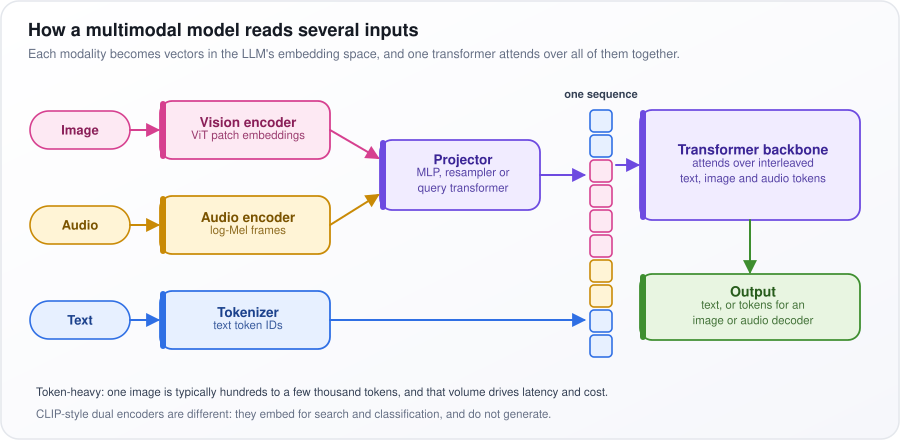
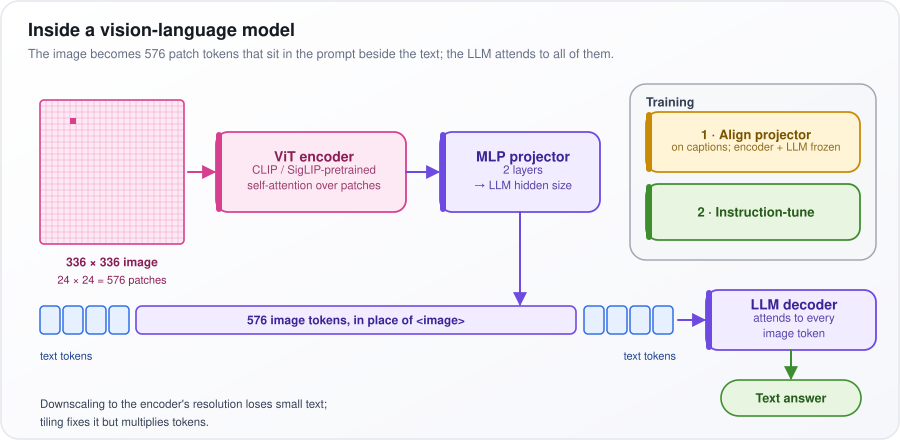
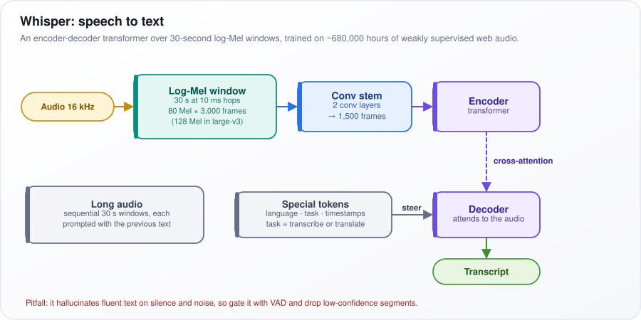
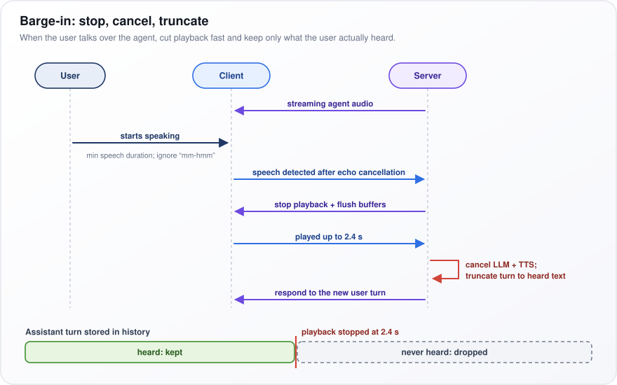
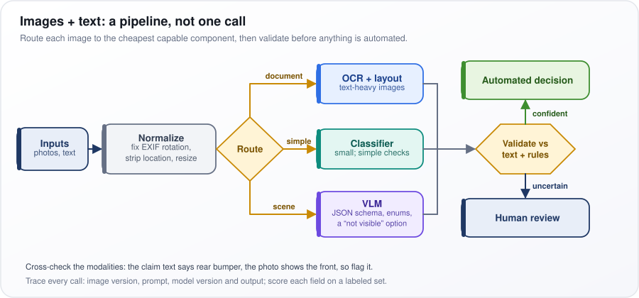
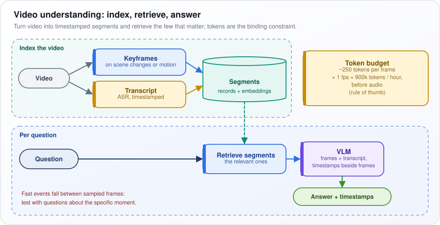
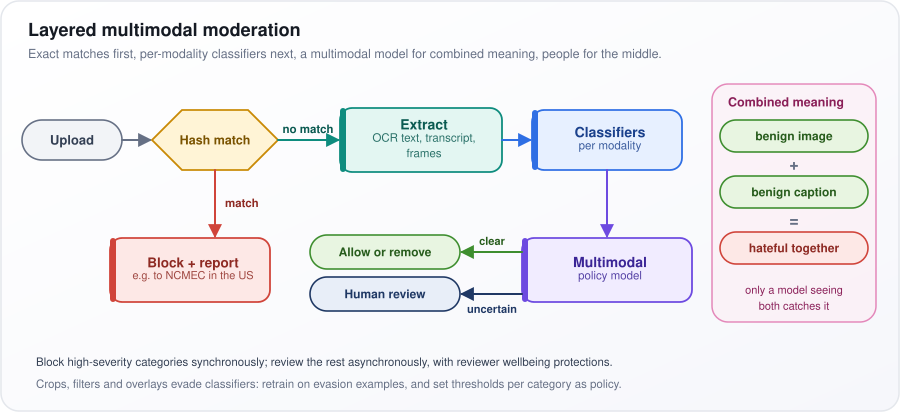
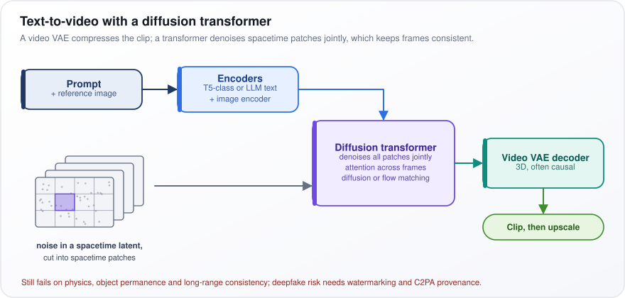
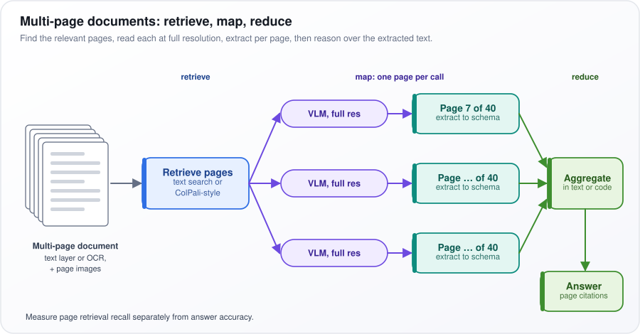

# Multimodal AI

[← All topics](../README.md)

Multimodal AI covers models that take in, or produce, more than text: images, audio, video and documents. This topic explains how a picture or a sound clip is turned into the same kind of numeric tokens a language model reads; how vision-language models (VLMs) and image-text embedding models such as CLIP are built; how diffusion models generate images and video; and how the speech stack of speech recognition (ASR), speech synthesis (TTS) and voice agents fits together. Interviewers probe what these inputs do to latency and cost, how to evaluate visual mistakes, and how to debug models that invent content, ignore the image, fail on long documents, or generate images slowly or without control.

## Questions

1. [What are Multimodal AI models, and how do they process different types of data?](#1-what-are-multimodal-ai-models-and-how-do-they-process-different-types-of-data)
2. [How do vision-language models process images?](#2-how-do-vision-language-models-process-images)
3. [How do Image Embeddings work?](#3-how-do-image-embeddings-work)
4. [How does CLIP work, and why is it important for multi-modal AI?](#4-how-does-clip-work-and-why-is-it-important-for-multi-modal-ai)
5. [What are the key architectures for multi-modal models?](#5-what-are-the-key-architectures-for-multi-modal-models)
6. [How does image generation work with diffusion models (Stable Diffusion, DALL-E, Flux)?](#6-how-does-image-generation-work-with-diffusion-models-stable-diffusion-dall-e-flux)
7. [What is text-to-speech (TTS), and what models are used for it?](#7-what-is-text-to-speech-tts-and-what-models-are-used-for-it)
8. [How does speech-to-text (Whisper) work?](#8-how-does-speech-to-text-whisper-work)
9. [Budget the end-to-end latency for a real-time voice agent (VAD, ASR, LLM, TTS, network). Where does the time go?](#9-budget-the-end-to-end-latency-for-a-real-time-voice-agent-vad-asr-llm-tts-network-where-does-the-time-go)
10. [How do you handle barge-in (user interruptions) in a voice agent?](#10-how-do-you-handle-barge-in-user-interruptions-in-a-voice-agent)
11. [Cascaded ASR + LLM + TTS vs native speech-to-speech models: what are the trade-offs?](#11-cascaded-asr--llm--tts-vs-native-speech-to-speech-models-what-are-the-trade-offs)
12. [What is multi-modal RAG, and how does it differ from text-only RAG?](#12-what-is-multi-modal-rag-and-how-does-it-differ-from-text-only-rag)
13. [How do you build a system that processes both images and text?](#13-how-do-you-build-a-system-that-processes-both-images-and-text)
14. [What are multi-modal embeddings, and how are they used for cross-modal search?](#14-what-are-multi-modal-embeddings-and-how-are-they-used-for-cross-modal-search)
15. [How do you evaluate multi-modal AI systems?](#15-how-do-you-evaluate-multi-modal-ai-systems)
16. [What are the challenges of real-time multi-modal AI processing?](#16-what-are-the-challenges-of-real-time-multi-modal-ai-processing)
17. [How do you handle video understanding with AI?](#17-how-do-you-handle-video-understanding-with-ai)
18. [What is visual question answering (VQA)?](#18-what-is-visual-question-answering-vqa)
19. [What is document understanding, and how do models parse documents with layouts?](#19-what-is-document-understanding-and-how-do-models-parse-documents-with-layouts)
20. [How do you fine-tune a vision-language model?](#20-how-do-you-fine-tune-a-vision-language-model)
21. [What are the latency and cost considerations for multi-modal AI in production?](#21-what-are-the-latency-and-cost-considerations-for-multi-modal-ai-in-production)
22. [How do you handle multi-modal content moderation?](#22-how-do-you-handle-multi-modal-content-moderation)
23. [What is text-to-video generation, and what are the current state-of-the-art approaches?](#23-what-is-text-to-video-generation-and-what-are-the-current-state-of-the-art-approaches)
24. [Explain Multimodal Fusion Techniques: Early Fusion vs Late Fusion.](#24-explain-multimodal-fusion-techniques-early-fusion-vs-late-fusion)
25. [Your vision-language model generates factually incorrect image descriptions. How do you fix it?](#25-your-vision-language-model-generates-factually-incorrect-image-descriptions-how-do-you-fix-it)
26. [Your VLM answers single-image questions but fails on multi-page documents. How do you fix it?](#26-your-vlm-answers-single-image-questions-but-fails-on-multi-page-documents-how-do-you-fix-it)
27. [Your multimodal LLM ignores the image and generates descriptions from text alone. How do you fix it?](#27-your-multimodal-llm-ignores-the-image-and-generates-descriptions-from-text-alone-how-do-you-fix-it)
28. [Your diffusion model ignores precise control requirements in text prompts. How do you improve controllability?](#28-your-diffusion-model-ignores-precise-control-requirements-in-text-prompts-how-do-you-improve-controllability)
29. [Your diffusion model generates sharp but repetitive images. How do you balance quality vs diversity?](#29-your-diffusion-model-generates-sharp-but-repetitive-images-how-do-you-balance-quality-vs-diversity)
30. [Your diffusion model takes too long per image. How do you speed up sampling?](#30-your-diffusion-model-takes-too-long-per-image-how-do-you-speed-up-sampling)

---

## 1. What are Multimodal AI models, and how do they process different types of data?

**A multimodal model handles more than one kind of data, such as text, images and audio. It turns each kind into vectors (lists of numbers) of the same shape and lets a single transformer (the network design behind today's language models) read them together as one sequence.**

A language model already turns each token (a word or piece of a word) into a vector, its embedding. Multimodal models treat images and sounds alike: a photo is cut into small squares, a sound clip into short time slices, and each piece becomes a vector. "What breed is this dog? [photo]" is then just one long sequence.

How it works:

1. One encoder per modality turns raw input into vectors. A vision transformer (ViT) turns image patches into patch embeddings; an audio encoder turns log-Mel frames (snapshots of the energy in each pitch band over a short time slice) into vectors; text goes through the ordinary tokenizer.
2. A projector, also called a connector, maps the encoder outputs into the embedding space of the large language model (LLM). It is a small MLP (a few fully connected layers), or a resampler that squeezes the image into a few vectors.
3. The transformer backbone attends over the interleaved text, image and audio tokens: attention lets every token draw on every other, so words can "look at" image patches.
4. The output is text, or tokens that a separate decoder turns into an image or audio.

In the figure, follow each colored input from the left: pink Image and yellow Audio pass through their encoders to the Projector, while blue Text goes through the Tokenizer. All land as colored squares in "one sequence", which feeds the Transformer backbone and then the Output.

<p align="center"></p>

*Figure: each modality is encoded, projected into the LLM's embedding space, and read by one transformer as a single sequence.*

Not every multimodal model generates: dual encoders such as CLIP only embed, for search and classification.

**Watch out:** non-text inputs are token-heavy. One image is typically hundreds to a few thousand tokens, and that volume drives latency (waiting time) and cost.

---

## 2. How do vision-language models process images?

**A vision-language model (VLM) cuts the image into small patches, encodes them with a vision transformer, converts each patch vector into the language model's input format, and splices them into the prompt as extra tokens that it reads much as it reads words.**

Take the open model LLaVA-1.5 as a concrete case. The image is resized to 336 × 336 pixels and cut into patches of 14 × 14 pixels: 24 across and 24 down, so 576 patches. Each patch becomes one token (the unit a language model reads, normally a word or word piece), so "Describe this image" plus a picture is about 576 image tokens and a few text tokens.

How it works:

1. The vision transformer (ViT), usually pretrained with CLIP or SigLIP (models trained to match images with their captions), runs self-attention, so each patch vector also draws in context from all the other patches.
2. A 2-layer MLP projector (a small network of two fully connected layers) maps each patch vector to the hidden size of the large language model (LLM), the length of the vectors it uses internally.
3. The 576 projected vectors replace an `<image>` placeholder in the prompt.
4. The LLM generates text, and every generated token can attend to (look back at) every image token.
5. Training has two stages: first align the projector on image-caption pairs with the encoder and LLM frozen (weights not updated), then instruction-tune on questions and answers about images.

In the figure, follow the pink 336 × 336 image through the ViT encoder and MLP projector into the bar `576 image tokens, in place of <image>`, then on to the LLM decoder, which writes the Text answer. The Training box shows the two stages.

<p align="center"></p>

*Figure: a 336 × 336 image becomes 576 patch tokens that sit in the prompt beside the text tokens.*

**Watch out:** shrinking a large image to the encoder's resolution loses small text and small objects. Tiling (cutting the image into several 336 × 336 crops and encoding each) fixes this but multiplies the token count.

---

## 3. How do Image Embeddings work?

**An image embedding is a fixed-length list of numbers that a neural network produces for an image, arranged so that images with similar content get similar vectors. What counts as "similar" depends on how the network was trained.**

Picture every image as a point in a space with 512 dimensions. Two photos of golden retrievers land close together; a photo of a car lands far away. Closeness is measured by cosine similarity, which compares the directions of two vectors: 1 means the same direction, 0 means unrelated. Search, deduplication and clustering all become "find nearby points".

How it works:

1. An encoder, either a convolutional neural network (CNN) or a vision transformer (ViT), turns the image into feature maps (grids of detected patterns such as edges and textures) or patch vectors (one per small square of the image).
2. Pooling squeezes these into one vector: either a special `[CLS]` token that learns to summarize the image, or the average of all patch vectors. A projection layer sets the final size, often 512–768 dimensions.
3. L2 normalization rescales every vector to length 1, so cosine similarity becomes a simple dot product (multiply matching entries and add them up).
4. Uses: similarity search, near-duplicate detection, clustering, zero-shot classification (sorting images into labels never trained on, by comparing with text embeddings), and multimodal retrieval-augmented generation (RAG, fetching relevant items to hand to a model).

The training objective decides what the space captures. The table compares three common choices. Supervised models learn from labeled categories; self-supervised models learn from the images alone, for example by matching two crops of the same photo; contrastive image-text models learn from image-caption pairs.

| Training | Examples | "Similar" means |
|---|---|---|
| Supervised classification | ResNet on ImageNet | same class label |
| Self-supervised | DINO, DINOv2 | visually and structurally alike; good for near-duplicates |
| Contrastive image-text | CLIP, SigLIP | semantically alike and aligned with text |

So DINOv2 is the better pick for finding near-duplicate product photos, and CLIP for searching photos with a typed query.

**Watch out:** embeddings from different models, or different versions of one model, are not comparable. Switching models means re-embedding the whole index.

---

## 4. How does CLIP work, and why is it important for multi-modal AI?

**CLIP trains an image encoder and a text encoder together so that each image and its caption land as nearby vectors in one shared space. That lets you classify images with no task-specific training and search images with text.**

Embed 4 images and their 4 captions and build a 4 × 4 table of similarities, images as rows and captions as columns. The diagonal cells are the true pairs (the dog photo with "a dog on a beach"); the other 12 cells are mismatches. Training pushes diagonal scores up and the rest down; since every other caption in the batch is a wrong answer, bigger batches give harder practice.

How it works:

1. Take $`N`$ image-caption pairs (about 400 million web pairs, batches of 32,768).
2. Encode image $`i`$ into a vector $`I_i`$ and caption $`j`$ into $`T_j`$, both normalized to length 1.
3. Build the $`N \times N`$ table $`S`$ of similarities, divided by a learned temperature $`\tau`$ (a small number that spreads scores apart).
4. Along each row (which caption matches this image?) and each column (which image?), apply cross-entropy (the standard loss for picking the right item from a list), and average.
5. For zero-shot classification, embed "a photo of a {label}" for each class and pick the one closest to the image.

Put as a formula:

```math
\mathcal{L} = \frac{1}{2N}\sum_{i=1}^{N}\left[-\log\frac{e^{S_{ii}}}{\sum_j e^{S_{ij}}} - \log\frac{e^{S_{ii}}}{\sum_j e^{S_{ji}}}\right], \qquad S_{ij} = \frac{I_i \cdot T_j}{\tau}
```

Here $`I_i \cdot T_j`$ is the dot product (multiply matching entries, then add) and $`\sum`$ means "add up". Each fraction is a softmax: $`e^{S}`$ (e ≈ 2.718 to the power of the score) makes each score positive, and dividing by the total gives probabilities that add up to 1. $`-\log`$ makes a low probability on the true pair costly, and $`\frac{1}{2N}`$ averages over both directions and all $`N`$ pairs. Example: probability 0.9 on the right caption costs $`-\log 0.9 \approx 0.11`$; 0.1 costs about 2.3.

CLIP-style encoders became the vision encoders of many vision-language models and the text input of the image generator Stable Diffusion 1.x.

**Watch out:** CLIP is weak at counting, spatial relations ("left of"), negation and word order, and its text encoder truncates input at 77 tokens.

---

## 5. What are the key architectures for multi-modal models?

**Four patterns cover most multimodal models: a dual encoder (separate image and text encoders compared at the end), an image encoder plus projector feeding a large language model (LLM), cross-attention layers inside the LLM, and early fusion, where all modalities share one token sequence from the start.**

The patterns differ in where image and text first meet. Meeting late is cheap and fast, but the model cannot relate a specific word to a specific part of the image. Meeting early allows deep interaction but costs far more training. Think of two consultants who either write separate reports and compare conclusions (late), or work in the same room from the start (early).

How each works:

1. Dual encoder (CLIP, SigLIP): image and text are embedded separately and compared with a dot product (one similarity score). Very fast retrieval, but no text generation.
2. Encoder plus projector plus LLM (LLaVA-style vision-language models, VLMs): image patch vectors are projected into image tokens at the LLM's input. Cheap to train and reuses a strong LLM: today's workhorse.
   - A variant is the query bottleneck. BLIP-2 uses a small transformer with 32 learned query vectors to pull a fixed summary out of the image, so the LLM sees only 32 visual tokens; Flamingo's resampler does something similar. Fewer tokens, less detail.
3. Cross-attention (Flamingo): new gated cross-attention layers are inserted between the frozen (unchanged) LLM's layers, so text tokens can look up information in the image features; a learned gate starts closed so training begins from the original LLM. No LLM weights change, but its architecture needs surgery.
4. Early fusion (Chameleon-style): images become discrete tokens (codes from a fixed vocabulary, like words) mixed with text tokens in one sequence, trained together from the start. It can read and write both images and text, at the cost of training a large model from scratch.

The table summarizes where the modalities meet, examples of each, and the main trade-off.

| Architecture | Where modalities meet | Examples | Main trade-off |
|---|---|---|---|
| Dual encoder | dot product at the end | CLIP, SigLIP | fast retrieval, no generation |
| Encoder + projector + LLM | image tokens at the LLM input | LLaVA-style VLMs | simple, but many image tokens |
| Query bottleneck | learned queries extract features | BLIP-2 | few tokens, loses detail |
| Cross-attention | gated cross-attn inside LLM layers | Flamingo | frozen LLM, more surgery |
| Early fusion | one sequence of mixed tokens from the start | Chameleon-style | deepest interaction, costly pre-training |

**Watch out:** products rarely need a new architecture. Use a hosted multimodal model or an open projector-style vision-language model for understanding, and a dual encoder for retrieval.

---

## 6. How does image generation work with diffusion models (Stable Diffusion, DALL-E, Flux)?

**A diffusion model learns to remove noise from an image. To generate, it starts from pure random noise and removes a little at a time over many steps, steered by an embedding (a vector of numbers) of the text prompt.**

Picture TV static: the network learns to spot the static added to a photo at any noise level, and generation runs this backward until "a red fox in snow" emerges.

How it works:

1. Training: add noise to a clean image and train the network to predict that noise.
2. Sampling: from pure noise, run a solver (a rule for each step's size, such as DDIM or DPM-Solver), typically for 20–50 steps.
3. Latent diffusion: a VAE (variational autoencoder, an image compressor) shrinks a 512 × 512 × 3 image to a 64 × 64 × 4 latent (compressed version), 48 times fewer numbers. Stable Diffusion and Flux denoise there; the decoder restores pixels.
4. Denoiser: Stable Diffusion 1.x and SDXL use a U-Net (a convolutional network) reading CLIP text embeddings; SD3 and Flux use transformers trained with rectified flow, whose straighter paths need fewer steps.
5. DALL-E 3's prompt adherence comes largely from training on detailed synthetic captions.

Put as a formula:

```math
x_t = \sqrt{\bar\alpha_t}\,x_0 + \sqrt{1-\bar\alpha_t}\,\epsilon, \qquad \mathcal{L} = \|\epsilon - \epsilon_\theta(x_t, t, c)\|^2
```

$`x_0`$ is the clean image, $`\epsilon`$ is Gaussian noise (random numbers from a bell curve), and $`\bar\alpha_t`$ sets the mix at noise level $`t`$, from 1 (clean) toward 0 (all noise): at $`\bar\alpha_t = 0.64`$, $`x_t`$ is 0.8 × image + 0.6 × noise. The network $`\epsilon_\theta`$ (weights $`\theta`$) sees $`x_t`$, $`t`$ and the prompt $`c`$; the loss $`\mathcal{L}`$ is the squared gap between true and predicted noise.

Classifier-free guidance (CFG) strengthens adherence:

```math
\hat\epsilon = \epsilon_\theta(x_t, \varnothing) + w\,\big(\epsilon_\theta(x_t, c) - \epsilon_\theta(x_t, \varnothing)\big)
```

The network predicts the noise without the prompt ($`\varnothing`$, empty) and with it ($`c`$); the guidance scale $`w`$ exaggerates their difference (what the prompt adds) into $`\hat\epsilon`$, the estimate used. $`w = 1`$ is the plain prompted prediction; Stable Diffusion defaults to 7.5. So at $`w = 7.5`$, a 0.10 gap between the two predictions becomes a 0.75 push.

**Watch out:** higher guidance improves adherence but cuts diversity, and CFG doubles compute per step.

---

## 7. What is text-to-speech (TTS), and what models are used for it?

**Text-to-speech (TTS) turns written text into spoken audio. Classic neural TTS predicts a mel spectrogram (a picture of sound energy per pitch band over time), and a vocoder turns that picture into the actual sound wave. Newer systems generate compressed audio tokens with a language model, or use flow matching (learning a smooth path from noise to audio); both can clone a voice from a few seconds of audio.**

Reading "Dr. Smith paid €3.50 on 5/6" aloud takes several decisions: "Doctor" or "Drive"? "three euros fifty"? which date format? Then how each sound is pronounced, which word is stressed, and where to pause. TTS systems split this into stages: work out what to say, how it should sound, and then produce the actual sound wave.

How it works:

1. Front end: text normalization (expanding numbers, abbreviations and symbols into words), grapheme-to-phoneme conversion (spelling to pronunciation symbols), and prosody cues (stress, pauses, question intonation).
2. Acoustic model: predicts the mel spectrogram. Tacotron 2 does it autoregressively, frame by frame; FastSpeech 2 does it in parallel, predicting each sound's duration and pitch explicitly, which is faster and easier to control.
3. Vocoder: turns the spectrogram into a waveform. WaveNet was high quality but slow; GAN vocoders (trained against a discriminator that tells real audio from fake) such as HiFi-GAN are fast.
4. Newer families: VITS does everything in one end-to-end model. VALL-E and its successors treat speech as tokens from a neural audio codec (a network that compresses audio into a short sequence of discrete codes) and generate them with a language model prompted by a short voice sample. Flow-matching models such as Voicebox generate audio features from noise.

Evaluation: MOS (mean opinion score, listeners rating naturalness from 1 to 5), word error rate (the share of words a speech recognizer gets wrong when transcribing the output), speaker similarity for cloning, and time to first audio for live use.

The table lists the families with examples; the commercial row changes fast.

| Family | Examples |
|---|---|
| Spectrogram + vocoder | Tacotron 2 + WaveNet, FastSpeech 2 + HiFi-GAN |
| End-to-end | VITS |
| Codec language model | VALL-E and successors |
| Flow matching | Voicebox, F5-TTS-style models |
| Commercial streaming APIs (as of 2025–26) | ElevenLabs, OpenAI, Google, Azure, Cartesia |

**Watch out:** voice cloning is an impersonation and fraud risk. Require the voice owner's consent and watermark generated audio.

---

## 8. How does speech-to-text (Whisper) work?

**Whisper is OpenAI's speech recognition model: an encoder-decoder transformer that turns 30-second windows of audio into text tokens (words or pieces of words). It copes well with accents and noise because it was trained on about 680,000 hours of multilingual web audio with imperfect ("weakly supervised") transcripts.**

Whisper first turns sound into a picture. A log-Mel spectrogram shows, for each 10-millisecond slice of time, how much energy there is in each of 80 pitch bands (spaced the way human hearing separates pitch, the Mel scale), on a log scale that matches how we hear loudness. Then it treats transcription like translation: an encoder reads the whole 30-second picture, and a decoder writes the text one token at a time, looking back at the audio as it goes.

How it works:

1. Resample the audio to 16 kHz (16,000 samples a second).
2. Compute the log-Mel window: 80 Mel channels (128 in the large-v3 version), one frame every 10 ms, so 30 seconds gives 3,000 frames.
3. A conv stem (two convolution layers, small filters that slide along time; the second halves the length) reduces this to 1,500 frames, and a transformer encoder processes them.
4. The decoder writes text using cross-attention: at every step it looks at the encoder's output. Special tokens at the start set the language, the task (transcribe, or translate into English) and whether to emit timestamps.
5. Long audio runs as consecutive 30-second windows, each prompted with the previous window's text.

In the figure, follow the top row from Audio 16 kHz through the Log-Mel window, Conv stem and Encoder, then the dashed cross-attention arrow down to the Decoder, steered by the Special tokens box, which outputs the Transcript. The Long audio box describes the windowing.

<p align="center"></p>

*Figure: Whisper encodes a 30-second log-Mel window and decodes text through cross-attention, steered by special tokens.*

**Watch out:** Whisper can invent fluent text on silence or noise, and it is not built for streaming (transcribing while audio is still arriving). Gate it with voice activity detection (VAD, a model that detects when someone is speaking) and drop low-confidence segments.

---

## 9. Budget the end-to-end latency for a real-time voice agent (VAD, ASR, LLM, TTS, network). Where does the time go?

**Aim for roughly 500–800 ms from the moment the user stops talking to the first sound of the reply. People take turns with gaps of around 200 ms, and more than about a second feels broken. Most of the time goes to endpointing (deciding the user has finished) and to the time the language model (LLM) takes to produce its first token (word piece).**

A voice agent is a relay race. The microphone audio travels to the server; voice activity detection (VAD) decides the user has stopped; speech recognition (ASR) finalizes the transcript; the LLM starts answering; text-to-speech (TTS) starts speaking; and the audio travels back. Every leg adds delay, so shorten the longest legs and overlap the rest.

Where the time goes and how to cut it:

1. Endpointing: a fixed silence timeout, such as waiting for 500 ms of quiet, is the largest single cost. Semantic turn detection, which reads the transcript and intonation to judge whether a sentence is complete, cuts it.
2. LLM time to first token: use smaller models and short prompts, use prompt caching (reusing the already-computed start of a fixed prompt), and keep tool calls off the critical path.
3. Speculative start: begin the LLM on a stable partial transcript, and discard the work if the user keeps talking.
4. Stream every stage: ASR partial transcripts, LLM tokens, and TTS phrase by phrase, so each stage starts before the previous one finishes.
5. Network: WebRTC (a real-time audio protocol built for low latency), with all services in one cloud region (data-center location) near the users.

The table gives typical ranges; bold rows are the big ones. The total is less than the sum of the maxima, because streamed stages overlap and worst cases rarely coincide. The jitter buffer is a short queue on the client that smooths out unevenly arriving audio.

| Stage | Typical range (well-built streaming stack) |
|---|---|
| Capture and uplink | 20–80 ms |
| **VAD endpointing** | **200–600 ms** |
| ASR finalization | 50–300 ms |
| **LLM time to first token** | **150–700 ms** |
| Buffer first phrase for TTS | 50–200 ms |
| TTS time to first audio | 75–300 ms |
| Downlink and jitter buffer | 30–100 ms |
| **Voice-to-voice total** | **~600–1,500 ms** |

**Watch out:** the 95th-percentile latency (p95, the slowest 1 turn in 20), not the median, decides the experience, and it usually comes from requests waiting in the LLM server's queue and from tool calls. Timestamp every stage on every turn.

---

## 10. How do you handle barge-in (user interruptions) in a voice agent?

**Keep listening while the agent speaks. When the user really starts talking, stop playback within a couple of hundred milliseconds, cancel the language model (LLM) and text-to-speech (TTS) work in progress, and cut the conversation history down to what the user actually heard.**

Barge-in is the user interrupting, as people do. The agent is reading out three flight options and the user says "the second one". A good agent stops at once. The subtle part is memory: the agent generated all three options, but the user heard only the first and a half. If the history still says the agent read out all three, the model will later refer to things the user never heard.

How it works:

1. Acoustic echo cancellation (AEC) removes the agent's own voice from the microphone signal. Without it, the agent hears itself and interrupts itself.
2. Detect real speech: voice activity detection (VAD) with a minimum speech duration or a recognized word, so coughs and backchannels ("mm-hmm", "right") do not trigger a stop.
3. Stop playback on the client and flush audio buffers; on the server, cancel LLM generation, TTS and any pending tool calls.
4. Truncate: map the playback position (say, stopped at 2.4 s) back to the text spoken so far, and store only that as the assistant's turn.
5. Handle the new user turn against the corrected history.

In the figure, read the sequence top to bottom across the User, Client and Server lanes: the user starts speaking, speech is detected after echo cancellation, the server sends stop playback + flush buffers, the client reports "played up to 2.4 s", and the server cancels LLM + TTS and truncates. The bar at the bottom is the stored turn: green "heard: kept" up to the red line at 2.4 s, grey "never heard: dropped" after it.

<p align="center"></p>

*Figure: on barge-in, playback stops, generation is cancelled, and only the part of the reply the user heard is kept in history.*

**Watch out:** without truncation, the model believes it said things the user never heard, and later turns go subtly wrong.

---

## 11. Cascaded ASR + LLM + TTS vs native speech-to-speech models: what are the trade-offs?

**A cascade (speech recognition, then a text large language model or LLM, then text-to-speech) gives you control, logs and your choice of LLM. A native speech-to-speech model gives lower latency and keeps the tone, emotion and hesitation that a transcript throws away. Default to the cascade for agents that do real work.**

A cascade is like working through an interpreter who writes everything down. It is slower, and the transcript loses how things were said ("fine." said angrily reads as "fine"), but you get a written record and can check every step. A speech-to-speech model is like talking to someone directly: quicker and more natural, but with nothing in the middle to inspect.

How each works:

1. Cascade: ASR converts speech to text; the LLM reasons in text, calls tools (external functions such as a booking system) and writes a reply; TTS speaks it. Every boundary is text, so it can be logged, checked by guardrails (automatic safety and policy checks), redacted (sensitive details removed), and swapped for a better component.
2. Native speech-to-speech: one model takes audio tokens (short chunks of sound encoded as discrete codes) in and produces audio tokens out. Some are full-duplex, meaning they can listen and speak at the same time, like a phone call.
3. Hybrids: a speech-to-speech front end that calls text tools, or a cascade that passes tone features (detected emotion, emphasis) to the LLM as extra information.

The table compares them on latency, tone, tool use, audit and lock-in (dependence on a single provider).

| | Cascade | Native speech-to-speech |
|---|---|---|
| Latency | sum of stages, ~0.6–1.5 s | lower |
| Tone and emotion | lost at ASR | preserved in and out |
| LLM choice and tool use | any model, mature tooling | the speech model's own, less mature |
| Audit and guardrails | text at every step | needs separate transcription |
| Lock-in | components swappable | one provider |

Choose the cascade for bookings, account changes and regulated conversations, which need transcripts for audit and redaction anyway. Choose speech-to-speech when conversational feel is the product, such as language practice or companionship.

**Watch out:** a speech-to-speech model still needs a separate transcription path for logging and guardrails. Budget for it rather than assuming the audit trail comes free.

---

## 12. What is multi-modal RAG, and how does it differ from text-only RAG?

**Multimodal RAG (retrieval-augmented generation) retrieves images, tables, charts, slides or audio, not only text passages, and hands them to a model that can read them. Most of the difference from text-only RAG lies in how the content is ingested and indexed.**

Ask "What was third-quarter revenue in Europe?" of a pile of quarterly reports. With text-only RAG, the answer may sit in a bar chart that text extraction turned into nothing, so retrieval cannot find it and the model cannot read it. Multimodal RAG keeps the chart as an image, or describes it in text, so it can be found and shown to a vision-language model (VLM).

How it works:

1. Chunk by page, figure, table or slide, rather than by a fixed number of characters, and keep each figure's caption attached.
2. Index with one of the three approaches in the table below. The newest, ColPali-style visual document retrieval, turns each page screenshot into many embedding vectors, one per image patch, and matches each query word to the best-matching region of the page.
3. Retrieve fewer, better items than you would for text, because image tokens are expensive, and pass the images to a VLM to answer.
4. Cite a page and a bounding box (the rectangle on the page), not a character offset.
5. Measure retrieval recall (how often the right item is among those retrieved) on visual questions separately from answer quality.

The table compares how each indexing approach works and where it breaks.

| Approach | How | Weakness |
|---|---|---|
| Convert to text | OCR (reading text off images), captions, transcripts, then text RAG | detail lost before retrieval |
| Shared embeddings | CLIP-style image and text vectors | weak on text-heavy images and charts |
| Visual document retrieval | embed page screenshots, ColPali-style multi-vector | bigger index, newer tooling |

A practical starting point: extract the text and also store page images. Retrieve on the text, then show the top pages to a VLM. Add visual document retrieval when evals show charts and tables being missed.

**Watch out:** text-only ingestion silently drops charts and figures. Put chart and table questions in the eval so you notice.

---

## 13. How do you build a system that processes both images and text?

**Build a pipeline, not a single model call: clean up the inputs, send each image to the cheapest component that can handle it, ask for structured output, check it against the text and business rules, and send low-confidence cases to people.**

Take a car-insurance claim: a written description ("someone hit my rear bumper in a car park") plus three photos. You want the damaged part, the severity, and whether the photos match the story. One call to a large vision-language model (VLM) might be right most of the time, but you cannot tell when it is wrong. A pipeline makes each step checkable.

How it works:

1. Normalize: fix EXIF rotation (phones store orientation as metadata, and ignoring it hands the model a sideways image, a common cause of errors), strip location metadata for privacy, and resize deliberately.
2. Route: OCR (optical character recognition, reading text off the image) plus layout analysis for text-heavy images such as documents, a small classifier for simple checks ("is this a car?"), and a VLM for scene reasoning.
3. Constrain: a JSON schema (a fixed output format the model must fill in) with fixed options (enums) and a "not visible" choice, instead of free description, so the model need not invent an answer it cannot see.
4. Validate against the text and rules: the text says rear bumper, the photo shows the front, so flag it.
5. Decide: confident, consistent cases are automated; uncertain ones go to human review.
6. Trace: store the image version, prompt, model version and output, and score each field on a labeled set.

In the figure, go left to right: Inputs, Normalize, then the yellow Route diamond, which splits into document (OCR + layout), simple (Classifier) and scene (VLM). All three join at "Validate vs text + rules", which sends confident cases up to Automated decision and uncertain ones down to Human review.

<p align="center"></p>

*Figure: inputs are normalized, routed to the cheapest capable component, validated, then automated or reviewed.*

**Watch out:** reliability comes from the validation and review stages around the VLM, not from the VLM alone.

---

## 14. What are multi-modal embeddings, and how are they used for cross-modal search?

**Multimodal embeddings place images and text in one vector space where matching content sits close together. Cross-modal search then becomes nearest-neighbor search: embed the text query and find the closest image vectors.**

With a CLIP-style model, a photo of a red running shoe and the phrase "red running shoe on a white background" map to nearby vectors, because the model was trained to put images near their captions. So a shopper's typed query can find product photos that carry no useful text at all. The code below does this for three images: it embeds them, embeds the query, and ranks the images by cosine similarity.

How it works:

1. Offline: embed every image with the image tower (the image half of the model), normalize the vectors to length 1, and store them in an approximate nearest-neighbor (ANN) index such as HNSW or IVF, which finds close vectors without comparing against every one.
2. At query time: embed the text with the text tower and search by cosine similarity (how closely two vectors point the same way; 1 means identical).
3. Rerank the top 50–100 results with a vision-language model (VLM) or a cross-encoder (a model that reads the query and one item together and scores the match more precisely). This matters for attribute-heavy queries such as "sleeveless, knee-length, navy".
4. Combine with keyword search on titles and on text read off the images (OCR), because exact product codes and model numbers are nearly invisible to CLIP-style models.

```python
from PIL import Image
import numpy as np
from sentence_transformers import SentenceTransformer

model = SentenceTransformer("clip-ViT-B-32")  # image and text towers, one space
paths = ["shoe1.jpg", "shoe2.jpg", "bag1.jpg"]
image_vecs = model.encode([Image.open(p) for p in paths], normalize_embeddings=True)
query = model.encode(["red running shoe on a white background"], normalize_embeddings=True)[0]
scores = image_vecs @ query  # cosine similarity on unit vectors
for i in np.argsort(-scores)[:3]:
    print(paths[i], round(float(scores[i]), 3))
```

In the code, `image_vecs @ query` computes one dot product per image, which equals cosine similarity because every vector has length 1; `np.argsort(-scores)` sorts from highest score to lowest.

**Watch out:** the modality gap (image vectors and text vectors cluster in different regions of the shared space) makes image-to-image and text-to-image scores incomparable. Never share one similarity threshold between them.

---

## 15. How do you evaluate multi-modal AI systems?

**Evaluate each capability with task metrics on your own labeled data, treat public benchmarks as a first filter only, and add two multimodal checks: does the model invent visual content, and does it use the image at all.**

A vision-language model (VLM) can score well while barely looking at the images. Say you ask "Is there a stop sign?" about street photos, and most test photos happen to contain one: answering "yes" every time looks accurate. So also test whether the answer changes when the image does.

How it works:

1. Blind ablation: remove or swap the image and rerun. If accuracy barely drops, the model is answering from language priors (what usually goes with such questions), not from the image.
2. Counterfactual images: change one attribute, such as a color, a count or a word of printed text, and check that the answer changes accordingly.
3. Test at production resolution, and slice results by condition: lighting, orientation, scans, handwriting.
4. Score per field or per claim rather than per whole answer, and if a VLM grades the answers, check its grades against human labels.
5. Build a domain eval: a few hundred labeled items from your own data usually tell you more than any leaderboard.

The table maps capabilities to metrics and public benchmarks. ANLS (average normalized Levenshtein similarity, based on how many character edits separate two strings) gives partial credit for nearly right text; field F1 combines how many extracted fields are correct with how many of the true fields were found; POPE asks yes/no questions about objects that are and are not present; CHAIR counts objects a caption mentions that are not in the image; recall@k asks whether the right item is in the top k results; FID compares the statistics of generated and real images; CLIP score measures how well an image matches its prompt; WER (word error rate) and MOS (mean opinion score) cover speech recognition (ASR) and text-to-speech (TTS).

| Capability | Metric | Example benchmarks |
|---|---|---|
| Visual reasoning | accuracy | MMMU, MMBench |
| Text in images, documents | ANLS, field F1 | TextVQA, DocVQA, ChartQA |
| Object hallucination | yes/no probe accuracy, hallucinated-object rate | POPE, CHAIR |
| Cross-modal retrieval | recall@k | COCO, Flickr30k |
| Image generation | FID, CLIP score, human preference | GenEval-style tests |
| Speech | WER (ASR), MOS (TTS) | LibriSpeech, Common Voice |

**Watch out:** public benchmark data can leak into training sets and rarely looks like your images. Never ship on a leaderboard number alone.

---

## 16. What are the challenges of real-time multi-modal AI processing?

**Real-time multimodal systems are squeezed from five sides: huge token volume, tight latency (delay) budgets, keeping streams in sync, context that grows without limit, and the cost of running all the time.**

Picture a warehouse safety camera at 30 frames per second. At a rule-of-thumb 250 tokens (the units a model reads) per frame, one camera produces about 27 million tokens an hour; no large model keeps up with that, and no budget does either. Yet most frames show nothing of interest. The design that works is a cheap filter that watches everything and a capable model that looks only when something happens.

How it works:

1. A cheap, always-on perception layer (motion detection, voice activity detection for audio, a small object detector) watches the stream and emits events, such as "person entered zone 3".
2. A large multimodal model runs only on those events, given a short slice of the stream around the event plus a running text summary of the session.
3. Every frame and audio chunk carries a capture timestamp on a shared clock, and jitter buffers (short queues that smooth out uneven arrival) keep audio and video aligned.
4. Context stays bounded through sliding windows and periodic text summaries.
5. Where continuous capture raises privacy concerns, process on the device, redact, and limit how long anything is kept.

The table pairs each challenge with its standard mitigation. "Regions of interest" means cropping to the part of the frame that matters; "edge models" run on or near the device.

| Challenge | Mitigation |
|---|---|
| Token volume: hundreds of tokens per frame | adaptive frame sampling, downscaling, regions of interest |
| Sub-second latency | streaming inputs, small edge models, heavy models on triggers only |
| Synchronizing audio, video, events | capture timestamps, common clock, jitter buffers |
| Context grows without limit | sliding windows, periodic text summaries |
| Always-on cost | cheap detectors gate expensive models |
| Privacy of continuous capture | on-device processing, redaction, retention limits |

**Watch out:** streaming raw video into the largest, most expensive model and hoping is the anti-pattern. Design around events.

---

## 17. How do you handle video understanding with AI?

**Turn the video into sampled frames, a timestamped transcript and short segment records. For long videos, index the segments and retrieve only the relevant ones instead of sending everything. The number of tokens is the binding constraint.**

Do the arithmetic. As a rule of thumb, one frame costs about 250 tokens (the units a model reads). At one frame per second, an hour is 3,600 frames, about 900,000 tokens, before any audio. That is too much to send for every question, and most of it is irrelevant to "when did the speaker mention the budget?". So treat a video like a document collection: index it once, then retrieve.

How it works:

1. Sample frames on scene changes or motion rather than at a fixed rate, and raise the rate for fast action such as sport or machinery.
2. Always include a transcript from speech recognition (ASR), with timestamps; for meetings and lectures it carries most of the content.
3. Store segment records (a time range with its keyframes, transcript and embeddings, the vectors used for search) in an index.
4. Per question, retrieve the relevant segments and give a vision-language model (VLM) their frames and transcript, with timestamps written beside the frames, because models are weak at ordering events, judging duration and counting.
5. For whole-video questions ("summarize the lecture"), build hierarchical summaries: summarize segments, then summarize the summaries.
6. Answers cite timestamps so a user can check them.

In the figure, the green "Index the video" box splits the Video into Keyframes and a timestamped Transcript, both stored as Segments (records + embeddings). In the blue "Per question" box, a Question retrieves segments, and the VLM reads frames plus transcript and returns Answer + timestamps. The yellow Token budget box holds the 900k-tokens-per-hour arithmetic.

<p align="center"></p>

*Figure: video is indexed once into timestamped segments, and each question retrieves only the segments it needs.*

**Watch out:** fast events fall between sampled frames. Evaluate with questions that need the specific moment, not just the gist.

---

## 18. What is visual question answering (VQA)?

**Visual question answering (VQA) means answering a natural-language question about an image, such as "How many people are wearing helmets?". It began as a research task of its own and is now a core capability of general vision-language models.**

The question decides what to look at. The same street photo can answer "What color is the bus?", "Is it raining?" and "What does the shop sign say?", and each needs a different skill: recognizing color, reading the scene, reading text. That makes VQA a flexible test of whether a model really sees.

How it works:

1. Early systems (around 2015): a convolutional network encoded the image, an LSTM (a recurrent network that reads words in order) encoded the question, and a classifier picked from the most frequent answers, typically the top 1,000.
2. Today: image tokens go into a large language model's (LLM's) input and the answer is free text.
3. Benchmarks test different skills: VQAv2 (general questions), GQA (compositional, multi-step questions), TextVQA (reading text in images), OK-VQA (outside knowledge), and DocVQA and ChartQA (documents and charts).

VQAv2 scores each answer against 10 human answers to the same question. Put as a formula:

```math
\text{Acc}(a) = \min\left(\frac{\#\text{annotators who gave } a}{3},\ 1\right)
```

Read it as: count how many annotators gave your answer $`a`$, divide by 3, and cap the result at 1. Example: if 2 of the 10 people said "red" and you said "red", you score 2/3 ≈ 0.67; if 3 or more said it, you get full credit. This forgives reasonable disagreement between people. (The official scorer also averages this over subsets of 9 of the 10 annotators.)

**Watch out:** language priors score well without looking: "yes" to yes/no questions, "tennis" to "What sport is this?". VQAv2 counters this by pairing each question with a similar image that has a different answer, and blind ablations (rerun without the image) belong in every eval.

---

## 19. What is document understanding, and how do models parse documents with layouts?

**Document understanding extracts structure from documents whose layout carries meaning: forms, invoices, tables, contracts. Models either run OCR (optical character recognition, reading text off the image) followed by a layout-aware model, read the pixels directly, or use a general vision-language model (VLM) on the page image.**

On an invoice, "1,240.00" means nothing alone; it means "total due" because it sits to the right of "Total:" on the same line. Plain text extraction loses that position. Document models keep it: they know where every word sits on the page.

How it works:

1. Sub-tasks: OCR; layout detection (finding headings, paragraphs, tables and figures); reading order (which column comes first); table structure; key-value extraction ("Invoice date" → "12 March 2026"); and question answering over the document.
2. LayoutLM-style models add each word's bounding box $`(x_0, y_0, x_1, y_1)`$, the coordinates of its top-left and bottom-right corners, to its text embedding (the vector the model uses for the word) as a 2D position, so attention (the mechanism that lets each word weigh every other word) can learn that the number right of "Total:" belongs to it.
3. OCR-free models such as Donut and Pix2Struct generate structured output straight from the pixels.
4. General VLMs turn page images into Markdown or JSON (structured text formats) and cope with charts and messy layouts.

The table compares the three approaches. "OCR errors propagate" means a misread character upstream becomes a wrong value downstream.

| Approach | Strength | Weakness |
|---|---|---|
| OCR + layout model | precise, cheap on fixed forms | OCR errors propagate |
| OCR-free encoder-decoder | no OCR dependency | struggles on dense pages |
| General VLM | flexible, no training | can skip or invent content; costlier |

In practice, mix them per page. Use the PDF's own text layer when it exists (digital PDFs already contain exact text, so no OCR is needed), OCR and layout tools for scans, and a VLM for the hard pages such as charts or handwriting.

**Watch out:** link every extracted value to its page and bounding box, so a reviewer can check it and a VLM that skipped or invented content gets caught.

---

## 20. How do you fine-tune a vision-language model?

**Keep the vision encoder frozen (unchanged), train the projector that connects it to the language model, and adjust the language model (LLM) lightly with small add-on weights (LoRA), using a few thousand to tens of thousands of examples of an image, an instruction and an answer, in the model's own chat format.**

Say you want a vision-language model (VLM) to grade weld defects from factory photos. The vision encoder already sees edges, textures and shapes well, so leave it frozen. The language model already writes fluently, so adjust it lightly with LoRA (small trainable add-on matrices). The projector, the small bridge between the two, is cheap to train and is where much of the adaptation happens.

How it works:

1. Split first: build a held-out test set by source (customer, camera, template), so the test uses sources the model never trained on.
2. Use the model's own processor (the code that resizes and tiles images) and chat template (the exact text format it expects for messages and images), matching the resolution and tiling you will use in production.
3. Mask the loss (the error score training minimizes) on image and prompt tokens, so the model learns only to produce answers. Use small batches and gradient checkpointing (recomputing intermediate results to save memory), because image tokens make sequences long.
4. Augment carefully: flipping an image that contains text, or cropping away the defect, changes the right answer.
5. Evaluate with task metrics, a blind ablation (does accuracy drop without the image?) and a regression set of general tasks (to check the model has not lost skills it had).

The table gives the default for each component and when to change it. Imagery "far from photos" means inputs unlike the web photos the encoder learned from. QLoRA is LoRA on a copy of the model compressed to 4-bit numbers; full fine-tuning updates every weight.

| Component | Default | Change when |
|---|---|---|
| Vision encoder | frozen | imagery is far from photos (medical, satellite, defects) |
| Projector | trained | always |
| LLM | LoRA or QLoRA | large behavior shift with lots of data: full fine-tuning |

**Watch out:** if the answers can be predicted from the question text, the model learns to ignore the image. Include similar questions whose answers depend on what the image shows.

---

## 21. What are the latency and cost considerations for multi-modal AI in production?

**Images, audio and video are expensive because they become many tokens the model must process before it writes anything. Latency (waiting time) and cost are set mainly by how many images you send, at what resolution, to which model.**

Do the arithmetic. A fixed-resolution encoder might turn each image into 576 tokens (the units the model reads), and high-resolution tiling multiplies that. Say a document page costs 1,500 tokens. A 20-page document is then 30,000 tokens of prefill (the phase where the model reads the whole input before producing its first output token), which adds seconds of latency. At volume, an illustrative 100,000 pages a day at 1,500 tokens each is 150 million input tokens a day.

How it works:

1. Image tokens grow with resolution: more pixels, more patches, more tokens. For models that tile by resolution, halving the width and height cuts image tokens by about four times.
2. Hosted APIs often bill audio and video per second or per frame.
3. Self-hosting adds the vision encoder's compute and KV-cache memory (the store of attention keys and values for every token in context), which grows with the number of image tokens.
4. Each lever in the table below trades some accuracy or complexity for fewer tokens or cheaper models. OCR means reading text off the image; the text layer is the exact text a digital PDF already contains; a VLM is a vision-language model.

| Lever | Effect |
|---|---|
| Downscale to the smallest passing resolution | fewer tokens; small text breaks first |
| Crop to the region of interest | fewer tokens, often better accuracy |
| OCR or text layer first, VLM only when needed | cheapest path for text-heavy inputs |
| Small model first, escalate on low confidence | cost scales with difficulty |
| Cache by image hash (a fingerprint of the file); batch offline work | repeats and bulk jobs get cheap |

Treat resolution as an explicit parameter tuned against an eval: find the smallest resolution that still passes. It is usually the biggest and least-measured lever.

**Watch out:** small text breaks first when you downscale. If the task needs fine print, crop to the region instead of shrinking the whole image.

---

## 22. How do you handle multi-modal content moderation?

**Layer it: hash matching for known illegal content, fast classifiers (small models that score content by category) for each modality, text pulled out of images, audio and video, a multimodal model for meaning that only appears in combination, and human review for the uncertain middle.**

Each layer catches what the previous one cannot, at rising cost. A known illegal image is caught instantly by its fingerprint. A slur written inside a meme is invisible to an image classifier but obvious once OCR (optical character recognition) extracts the text. And a photo of an empty desert with the caption "look how many people love you" is harmless in each part but mocking together; only a model that sees both catches that.

How it works:

1. Perceptual hash matching (PhotoDNA-style: a fingerprint that survives resizing and small edits) compares uploads against databases of known child sexual abuse material (CSAM) and terrorist content. Many jurisdictions require preserving and reporting matches; in the US, to NCMEC (the National Center for Missing and Exploited Children).
2. Extraction: OCR for text in images, speech recognition (ASR) for speech, and sampled frames for video.
3. Classifiers score each modality per category (nudity, violence, hate).
4. A multimodal policy model judges combined meaning, the case the Hateful Memes benchmark was built to test.
5. Decisions: block high-severity categories synchronously, before content goes live, and review the rest asynchronously, with wellbeing protections for reviewers.

In the figure, follow Upload to the yellow Hash match: a match goes down to Block + report, and no match continues to Extract, then Classifiers per modality, then the Multimodal policy model. That model sends clear cases to "Allow or remove" and uncertain ones to Human review. The pink Combined meaning panel shows benign image + benign caption = hateful together.

<p align="center"></p>

*Figure: moderation layers run from exact hash matches through per-modality classifiers to a multimodal model and human review.*

**Watch out:** crops, filters and overlays evade classifiers. Retrain on evasion examples, and set thresholds per category as policy decisions, not engineering defaults.

---

## 23. What is text-to-video generation, and what are the current state-of-the-art approaches?

**Text-to-video models generate short clips from a prompt, often with a reference image. As of 2025–26 the leading design pairs a video VAE (variational autoencoder, a clip compressor) with a diffusion transformer that removes noise step by step, attending across all frames at once.**

Generate frames independently and things flicker: the dog changes color between frames. Instead, treat the clip as one 3D volume (height, width and time), cut it into small cubes called spacetime patches, each covering a few pixels over a few frames, and denoise all of them together. The dog stays the same dog because every patch can attend to (draw information from) every other.

How it works:

1. A 3D video VAE compresses the clip in space and time into a latent (a smaller compressed representation); it is often causal (each frame's latent depends only on earlier frames).
2. The latent is cut into spacetime patches, a design popularized by OpenAI's Sora report (2024).
3. Encoders turn the prompt into vectors (a text encoder such as Google's T5, or a large language model) and the reference image, if any, into image features.
4. The diffusion transformer denoises all patches jointly, trained with diffusion or flow matching (learning a direct path from noise to data).
5. The VAE decoder turns the result into frames, and the clip is usually upscaled.

In the figure, the noisy stack on the left ("noise in a spacetime latent") feeds the purple Diffusion transformer, conditioned by the blue Encoders (Prompt + reference image); its output goes through the Video VAE decoder to "Clip, then upscale".

<p align="center"></p>

*Figure: a diffusion transformer denoises a spacetime latent under text and image conditioning, and a video VAE decodes it into a clip.*

The landscape changes monthly. As of 2025–26, notable systems include Sora 2, Veo 3 (which also generates synchronized audio), Kling and Runway Gen-4, with open-weight Wan, HunyuanVideo, LTX-Video and CogVideoX.

**Watch out:** physics, object permanence and long-range consistency still fail, and deepfake misuse calls for watermarking, C2PA provenance (a standard for signed records of how media was made) and consent policies.

---

## 24. Explain Multimodal Fusion Techniques: Early Fusion vs Late Fusion.

**Early fusion combines modalities at the input or feature level so one model learns them together. Late fusion runs a separate model per modality and combines only their outputs. Intermediate fusion encodes each modality separately and joins them inside the network, which is what most vision-language models do.**

Say you are detecting hateful memes. With late fusion, an image classifier says 5% likely hateful, a text classifier says 10%, and you average them to 7.5%: harmless. But the meme is hateful only because of how the picture and caption combine, and neither model saw both. Early fusion feeds pixels and words to one model from the start, so it can catch that interaction, provided it has enough paired training data.

How each works:

1. Early fusion: inputs are combined first, as in Chameleon-style models that mix image and text tokens in one sequence trained from scratch. It captures fine-grained interactions, needs lots of paired data, and breaks when a modality is missing.
2. Late fusion: each modality has its own model, and outputs are combined by a rule or a small model (averaging scores, CLIP's dot product, several classifiers voting). It is modular, robust to missing inputs, and each part trains alone, but nothing interacts beyond the combination rule.
3. Intermediate fusion: separate encoders first, joined at chosen depths, either by projecting image features into the large language model's (LLM's) token sequence (LLaVA) or through cross-attention layers inside the LLM, where text tokens look up image features (Flamingo).

The table compares where the modalities meet and what follows from that. "Missing modality" asks what happens when, say, a post has no caption.

| | Early | Late | Intermediate |
|---|---|---|---|
| Meet at | input or features | outputs or scores | inside the network |
| Interactions | full | none | at chosen depths |
| Missing modality | brittle | robust | moderate |
| Modularity | low | high | medium |

**Watch out:** don't start with a joint model. Late fusion is the debuggable baseline; move to a joint model only when error analysis shows cross-modal failures, such as memes whose meaning needs image and caption together.

---

## 25. Your vision-language model generates factually incorrect image descriptions. How do you fix it?

**Classify the errors first, because each kind has a different cause. Then fix the inputs, narrow the task, verify claims with other tools, and only then change or fine-tune the model.**

A vision-language model (VLM) describes a kitchen photo and mentions "a toaster on the counter" that is not there. Kitchens usually have toasters, so the model filled in what tends to appear with kitchens: a language prior. A different error, reading a price tag as 19 instead of 18, usually means the image was shrunk until the digits blurred. Same symptom, "wrong description", but opposite fixes.

How it works:

1. Inputs: fix EXIF rotation (phones store orientation as metadata), raise the resolution or tile the image (encode it as several full-resolution crops), and crop to the region of interest. Many "hallucinations" (invented details) are guesses about details the model could not see.
2. Task: ask specific questions with a JSON schema (a fixed output format) that includes "not visible", and lower the temperature (less random sampling). Long free descriptions hallucinate more toward the end.
3. Verify: cross-check claims with an object detector, OCR (reading text off the image) or metadata, and ask the model for bounding boxes (rectangles around each object it mentions) so its claims can be checked.
4. Model: a stronger VLM; visual contrastive decoding, which compares predictions made with the real image and with a distorted copy and favors words that depend on the real one; or preference tuning on faithful versus hallucinated captions.
5. Measure on your own images, with POPE-style probes (yes/no questions about objects that are and are not present) and a CHAIR-style rate (the share of mentioned objects that are not in the image).

The table maps each error type to its likely cause and the first fix to try. "Grounding" means tying words to specific image regions.

| Error type | Likely cause | First fix |
|---|---|---|
| Invented objects | co-occurrence priors | constrained questions, detector check |
| Wrong text or numbers | resolution too low | tiling, cropping, OCR |
| Wrong counts | known VLM weakness | detect boxes, then count |
| Wrong positions | weak grounding | grounding-capable model, boxes |

**Watch out:** most gains come from better inputs, tighter questions and verification, not from a new model. Measure before and after each change.

---

## 26. Your VLM answers single-image questions but fails on multi-page documents. How do you fix it?

**On a long document, the model is trying to find the right pages, read them and reason across them in one pass over thousands of image tokens, often at reduced resolution. Split the job: find the relevant pages, read each at full resolution, extract per page, then reason over the extracted text.**

Ask "What is the total penalty across all late deliveries?" of a 40-page contract, where the relevant clauses sit on pages 7, 19 and 33. Sending all 40 pages at 1,500 tokens (the units the model reads) each means 60,000 image tokens; many models shrink each image to fit, so small print blurs, evidence in the middle of long inputs is found less reliably, and many models were trained mostly on single images. A person would turn to the right pages, note the numbers and add them; do the same.

How it works:

1. Retrieve: find the relevant pages with text search on the text layer (text a digital PDF already contains) or OCR (text read off scanned pages), or with visual document retrieval (ColPali-style embeddings of page images), and pass only the top few.
2. Map: one vision-language model (VLM) call per page at full resolution, extracting into a schema (a fixed set of fields) with the page number.
3. Reduce: aggregate the extractions in text or code; do sums in code, not in the model's head.
4. Stitch tables that continue across pages, carry column headers forward, and label pages "Page 7 of 40".
5. Measure page retrieval recall (how often the right pages are retrieved) separately from answer accuracy.

In the figure, read the three column headings left to right: retrieve (Retrieve pages), "map: one page per call" (VLM, full res, then "Page 7 of 40, extract to schema"), and reduce (Aggregate, then Answer with page citations).

<p align="center"></p>

*Figure: retrieve the relevant pages, extract each one at full resolution, then aggregate the extractions into a cited answer.*

**Watch out:** don't wait for longer context windows (the most input a model reads at once) to fix this. Retrieval plus per-page extraction is cheaper, more accurate, auditable.

---

## 27. Your multimodal LLM ignores the image and generates descriptions from text alone. How do you fix it?

**Rule out plumbing first, because often the image never reached the model intact. If it did, the model is leaning on language priors, guessing from the text alone: restructure the prompt so only the image can answer, and train with examples where the text alone misleads.**

Your prompt says "Describe this photo of a golden retriever at the beach", and the model writes about a golden retriever at the beach whatever the image shows. The prompt gave the answer away. Or the chat template put the image placeholder in the wrong place, and the model received no image at all. Both look the same from outside: "the model ignores the image".

How it works:

1. Blind ablation: remove, blank or swap the image. Identical outputs mean the image is not being used.
2. Check the plumbing: the number and position of image placeholders in the chat template (the exact text format the model expects, including where the image goes); image tokens cut off by a context limit; image decoding and normalization (color channel order, value range); and a processor (the code that prepares images) that no longer matches the model after fine-tuning. Count the image tokens actually sent.
3. Fix the prompt: remove descriptive text that gives the answer away, put the image before the question, and ask for visible evidence before the answer ("list what you see, then answer").
4. Fix the training data: add counterfactual, balanced examples (the same question on different images with different answers), and consider a stronger projector (the layer that turns image features into tokens) or more image tokens.
5. At inference, try visual contrastive decoding, which favors words whose probability depends on the real image.

A quick rule: if outputs do not change when the image is swapped, suspect plumbing or the prompt; if they change but are wrong, suspect resolution or the model.

**Watch out:** jumping to fine-tuning when the template or the prompt is the cause. Keep an image-swap test in your regression suite so the bug cannot quietly return.

---

## 28. Your diffusion model ignores precise control requirements in text prompts. How do you improve controllability?

**Text is a weak channel for counts, positions, poses and exact wording, especially through CLIP-style text encoders. Improve the text path, then move precise requirements into spatial or reference conditioning: extra images that tell the model exactly where things go and what they look like.**

The prompt "three bottles, left-aligned, the label reading 'Alpine Spring'" often returns two or four bottles, centered, with garbled label text. The text encoder compresses the prompt into a blend of concepts (bottles, left, label) that loses the exact count and layout.

Why prompts get ignored:

- CLIP's text encoder truncates at 77 tokens;
- it encodes a bag of concepts, so attributes swap ("red cube, blue ball" yields a blue cube);
- training captions were short web alt text;
- the guidance scale (how hard each step is pushed toward the prompt) is too low.

How to improve:

1. Stronger text path: a text encoder built on T5 or a large language model, models trained on detailed machine-written captions, a higher guidance scale, and negative prompts (text describing what to avoid).
2. ControlNet: a trainable copy of the encoder half of the denoiser (the noise-removing network) reads a control image (pose skeleton, depth map, edge map) and adds its features into the frozen model through zero-initialized layers, so training starts without disturbing the original.
3. Layout conditioning (boxes saying where each object goes, GLIGEN-style) or regional prompts for positions and counts.
4. Reference adapters for identity: IP-Adapter (conditions on a reference image), DreamBooth (fine-tunes on a few photos of the subject) or a LoRA (small add-on weights) for a specific product or style.
5. Inpainting (regenerating only a masked region) and verify-then-regenerate for hard constraints.

Worked example, the bottles: layout or depth control for placement, a reference adapter or LoRA for the product, the real label composited afterwards, and an object detector to verify the count.

The table maps each technique to what it controls.

| Technique | Controls |
|---|---|
| T5- or LLM-based text encoder, recaptioned training data | overall prompt adherence |
| Guidance scale, negative prompts | adherence vs naturalness, exclusions |
| ControlNet | pose, edges, depth, segmentation |
| Layout conditioning (GLIGEN-style), regional prompts | positions and counts |
| IP-Adapter, DreamBooth or LoRA | identity, product, style |
| Inpainting and verify-then-regenerate | local fixes, hard constraints |

**Watch out:** use text for meaning and style, and structured conditioning for anything measurable. Never trust a generated image to contain exact text or counts without checking.

---

## 29. Your diffusion model generates sharp but repetitive images. How do you balance quality vs diversity?

**Sharp but repetitive images mean sampling is too mode-seeking: it keeps landing on the single most typical image for the prompt. The usual causes are high guidance, or a distilled model (a fast student trained to copy a bigger one) or preference-tuned model (tuned toward outputs people rated higher) that collapsed toward favored outputs. Lower or schedule the guidance, restore randomness, vary the conditioning, and measure diversity.**

Classifier-free guidance (CFG) pushes each denoising step toward "what the prompt adds", by comparing the model's prediction with and without the prompt and exaggerating the difference. Push hard, say a guidance scale of 12, and every "a cozy cafe" comes out with the same warm light, the same angle and oversaturated colors: sharp, prompt-typical, and all alike. Push gently, say 4, and you get variety with looser prompt adherence.

How it works:

1. Lower the guidance scale, or apply guidance only in the middle of the denoising process. Published limited-interval guidance reports better diversity at similar quality, since strong guidance in the early, high-noise steps is what collapses the composition.
2. Restore randomness: stochastic samplers (ancestral or SDE samplers, which add fresh noise at each step), sweeps over random seeds, and programmatic prompt variation (vary the setting, lighting and camera angle).
3. Lower the strength of a LoRA (a small add-on style adapter) if it is dominating.
4. For models you train: broaden the training data, and keep a KL penalty (a term that keeps outputs close to the original model's) or a diversity term in preference tuning so the model does not collapse onto one favored look.
5. Measure both sides. Quality: human preference or prompt alignment. Diversity: pairwise LPIPS (a learned perceptual distance between images, higher meaning more different), the Vendi score (roughly, the effective number of distinct images in a set), or generative precision and recall (precision is realism, recall is coverage of real variety).

**Watch out:** guidance scale is the primary knob, and there is no single right value. Sweep it and choose per use case: diverse for ideation, consistent for product catalogs.

---

## 30. Your diffusion model takes too long per image. How do you speed up sampling?

**Sampling time is the number of denoising steps times the cost of each step. Cut the number of network calls first (better solvers, then distilled few-step models), then make each call cheaper, then fix the serving setup.**

Do the count. A 50-step sampler with classifier-free guidance runs the denoising network twice per step, with and without the prompt, so about 100 network evaluations, plus a VAE decode at the end (the variational autoencoder turning the compressed result back into pixels). If each evaluation takes, say, 50 ms, that is 5 seconds per image. A 4-step distilled model without guidance needs 4 evaluations, about 0.2 seconds. Step count dwarfs everything else.

How it works:

1. Profile first: time the text encoder, the steps, the VAE decode (costly at high resolution), and model loading per request, a common hidden cost.
2. Better solvers such as DPM-Solver++ or UniPC take larger, more accurate steps.
3. Distillation trains a student that needs far fewer steps: LCM (latent consistency models) or LCM-LoRA, and adversarial or distribution-matching distillation (turbo-style models).
4. Remove guidance cost: guidance distillation, or skipping CFG in late steps.
5. Make each step cheaper: bf16 (16-bit numbers instead of 32-bit), fused attention kernels (GPU code that computes attention in one pass), torch.compile or TensorRT (compilers that optimize the model for the GPU); feature caching (DeepCache-style, reusing features that change little between steps); and token merging (combining similar image tokens so each step processes fewer).
6. Generate small, then upscale, since cost grows with pixel count.
7. For interactive use, show a fast low-step preview and refine only the image the user picks.

The table gives the typical effect of each technique, as rules of thumb.

| Technique | Typical effect (rule of thumb) |
|---|---|
| DPM-Solver++, UniPC | 50+ steps down to ~20–25 |
| LCM or LCM-LoRA | 4–8 steps, some quality loss |
| Adversarial or distribution-matching distillation (turbo-style) | 1–4 steps, less diversity |
| Guidance distillation or no CFG in late steps | up to half the per-step compute |
| bf16, fused attention, torch.compile or TensorRT | meaningful per-step speedup |
| Feature caching (DeepCache-style), token merging | skip or shrink repeated work |
| Generate small, then upscale | cost scales with pixels |

**Watch out:** cut steps on a fixed prompt set until quality drops, and check diversity after adopting a distilled model; few-step models often trade away variety.
