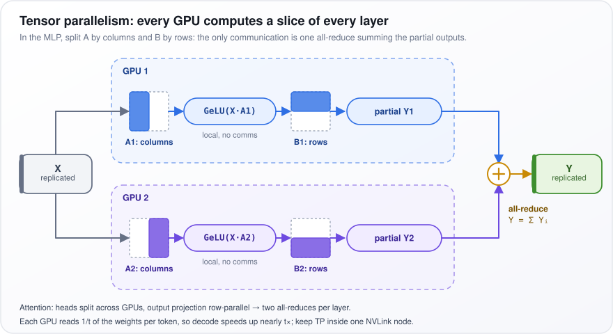
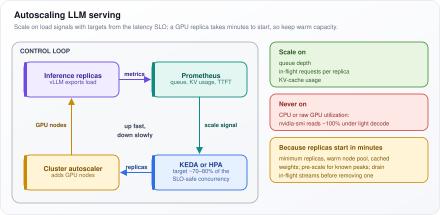
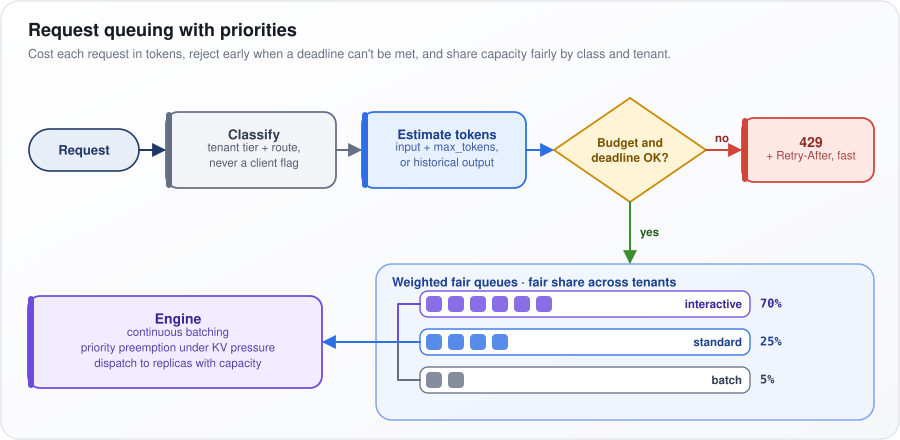
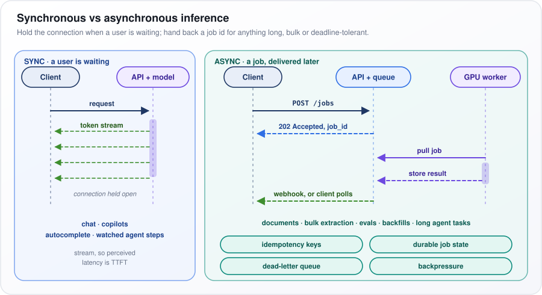

# AI Infrastructure and Scalability

[← All topics](../README.md)

This topic is about the machinery underneath a large language model (LLM): the chips it runs on, how much memory it needs, how one model is split across several chips, the tricks that make it answer faster, and the plumbing that scales, queues, caches, routes and monitors requests. Interviewers check three things. Can you do the memory and speed arithmetic on a whiteboard? Do you know that writing text one token at a time is usually limited by how fast the chip can *read its memory*, not by how fast it can calculate? And do you tune for what users feel (time to first token, time per output token, cost per token) rather than a vanity number such as "GPU utilization"? Every answer defines its hardware terms from scratch, so they can be read in any order.

## Questions

1. [How do you improve inference speed in production LLM deployments?](#1-how-do-you-improve-inference-speed-in-production-llm-deployments)
2. [LLM optimization techniques](#2-llm-optimization-techniques)
3. [How do you select GPUs for LLM inference?](#3-how-do-you-select-gpus-for-llm-inference)
4. [How does a GPU work for Deep Learning?](#4-how-does-a-gpu-work-for-deep-learning)
5. [How does a Google TPU work?](#5-how-does-a-google-tpu-work)
6. [How does an LPU work?](#6-how-does-an-lpu-work)
7. [Estimate the GPU memory needed to serve a 70B model (weights, KV cache, activations). Does it fit on a single 80 GB GPU?](#7-estimate-the-gpu-memory-needed-to-serve-a-70b-model-weights-kv-cache-activations-does-it-fit-on-a-single-80-gb-gpu)
8. [Do the roofline math: how many tokens/sec can one H100 produce for a 70B model at batch size 1?](#8-do-the-roofline-math-how-many-tokenssec-can-one-h100-produce-for-a-70b-model-at-batch-size-1)
9. [What is model parallelism vs data parallelism in distributed training?](#9-what-is-model-parallelism-vs-data-parallelism-in-distributed-training)
10. [What is tensor parallelism, and how does it help serve large models?](#10-what-is-tensor-parallelism-and-how-does-it-help-serve-large-models)
11. [What is pipeline parallelism?](#11-what-is-pipeline-parallelism)
12. [How does continuous batching improve LLM inference throughput?](#12-how-does-continuous-batching-improve-llm-inference-throughput)
13. [What is speculative decoding, and how does it speed up inference?](#13-what-is-speculative-decoding-and-how-does-it-speed-up-inference)
14. [How does Medusa (multi-head speculative decoding) work?](#14-how-does-medusa-multi-head-speculative-decoding-work)
15. [How does EAGLE (feature-level speculative decoding) work?](#15-how-does-eagle-feature-level-speculative-decoding-work)
16. [What is N-gram Speculation in LLMs, and how does it speed up generation?](#16-what-is-n-gram-speculation-in-llms-and-how-does-it-speed-up-generation)
17. [What is KV cache, and how do you manage memory for it?](#17-what-is-kv-cache-and-how-do-you-manage-memory-for-it)
18. [What is Paged Attention?](#18-what-is-paged-attention)
19. [How does GGUF work?](#19-how-does-gguf-work)
20. [How do you optimize inference for edge and mobile deployment?](#20-how-do-you-optimize-inference-for-edge-and-mobile-deployment)
21. [What is model quantization (INT8, INT4, FP16, BF16), and how does it affect quality?](#21-what-is-model-quantization-int8-int4-fp16-bf16-and-how-does-it-affect-quality)
22. [How do you implement auto-scaling for AI workloads?](#22-how-do-you-implement-auto-scaling-for-ai-workloads)
23. [What is the role of load balancing in AI serving infrastructure?](#23-what-is-the-role-of-load-balancing-in-ai-serving-infrastructure)
24. [How do you manage GPU memory for serving multiple models?](#24-how-do-you-manage-gpu-memory-for-serving-multiple-models)
25. [What is model sharding, and when would you use it?](#25-what-is-model-sharding-and-when-would-you-use-it)
26. [How do you implement request queuing and priority scheduling for AI services?](#26-how-do-you-implement-request-queuing-and-priority-scheduling-for-ai-services)
27. [What are the cost trade-offs between self-hosted and API-based AI inference?](#27-what-are-the-cost-trade-offs-between-self-hosted-and-api-based-ai-inference)
28. [How do you handle cold start latency for serverless AI deployments?](#28-how-do-you-handle-cold-start-latency-for-serverless-ai-deployments)
29. [How do you implement model caching to reduce redundant computations?](#29-how-do-you-implement-model-caching-to-reduce-redundant-computations)
30. [What is the difference between synchronous and asynchronous inference, and when do you use each?](#30-what-is-the-difference-between-synchronous-and-asynchronous-inference-and-when-do-you-use-each)
31. [What is FSDP (Fully Sharded Data Parallel), and how does it differ from DeepSpeed ZeRO?](#31-what-is-fsdp-fully-sharded-data-parallel-and-how-does-it-differ-from-deepspeed-zero)
32. [What are TTFT, TPOT, and throughput, and how do they trade against each other?](#32-what-are-ttft-tpot-and-throughput-and-how-do-they-trade-against-each-other)
33. [How do you monitor and profile LLM inference in production (TTFT, inter-token latency, GPU utilization)?](#33-how-do-you-monitor-and-profile-llm-inference-in-production-ttft-inter-token-latency-gpu-utilization)
34. [What is model routing at the infrastructure level, and how do you route requests based on complexity and cost?](#34-what-is-model-routing-at-the-infrastructure-level-and-how-do-you-route-requests-based-on-complexity-and-cost)

---

## 1. How do you improve inference speed in production LLM deployments?

**Measure where the time goes, then fix the biggest part: waiting in a queue, reading the prompt, or writing the answer one token at a time.**

Say a user waits 6.5 seconds, and 6 of them go on 300 output tokens at 20 ms each. A faster prompt read barely helps; fewer or faster output tokens do.

A **token** is a word or a piece of one. **Prefill** is the model reading the whole prompt in one pass, heavy on arithmetic. **Decode** writes one token per step, and each step reads all the model's weights (its learned numbers) from GPU memory, so memory speed limits it. **Time to first token (TTFT)** is queue wait plus prefill; **time per output token (TPOT)** is the gap between later tokens.

1. **Break the time down** into p50, p95 and p99 (the times 50%, 95% and 99% of requests beat), by prompt and output length. End-to-end (E2E) time for $`n_{out}`$ output tokens is:

```math
\text{E2E} = \text{TTFT} + \text{TPOT} \times (n_{out} - 1): \quad 0.5\text{ s} + 0.02\text{ s} \times 299 \approx 6.5\text{ s}
```

2. **Cut the output first:** a length cap (`max_tokens`), stop sequences (text that ends the answer), a fixed format such as JSON. Going from 500 output tokens to 150 removes 70% of decode time.
3. **Speed up prefill.** Prefix caching reuses work done for a shared prompt start, such as a long system prompt. Shorten prompts; chunked prefill splits a long prompt so it does not stall others.
4. **Speed up decode.** Store weights in fewer bytes (quantization: 8-bit FP8 or 4-bit INT4), use speculative decoding (guess several tokens cheaply, check them in one pass), or split each layer across GPUs (tensor parallelism) so several memories are read at once.
5. **Remove queueing and overhead.** Use a serving engine (vLLM, SGLang, TensorRT-LLM) with continuous batching (requests join and leave the batch every step) and CUDA graphs (recorded GPU jobs replayed in one launch). Add servers as the queue grows; send easy requests to a smaller model.

**Watch out:** bigger batches raise throughput (tokens per second across all users) but lengthen TTFT. Quantization or a smaller model can change answers, so gate them on an eval (a fixed, scored test set).

---

## 2. LLM optimization techniques

**Optimizations work at four layers: make the model smaller (model), make each GPU operation move less data (kernels), keep the GPU full of useful work (serving engine), and send less work to the GPU at all (system).**

Start with where the time goes. When a model writes text for a handful of users, each new token requires reading every weight (the model's learned numbers) from the GPU's main memory. A 70-billion-parameter model (parameters are those weights) at 2 bytes per parameter is 140 GB to read *per token*. The arithmetic is fast; the reading is slow. Picture a fast chef fed by a slow conveyor belt: the biggest wins come from putting less on the belt.

A few terms used in the table:

- **HBM (high-bandwidth memory):** the GPU's main memory, tens of GB, read at a few TB/s.
- **SRAM:** a tiny, much faster memory built into the processor itself.
- **FLOPs:** floating-point operations, meaning single multiplies or adds on decimal numbers.
- **Kernel:** one small program the GPU runs, such as "multiply these two matrices".
- **Attention:** the step where each token scores how relevant every other token is; for $`n`$ tokens that is an $`n \times n`$ grid of scores. It runs as several parallel *heads*.
- **KV cache:** the stored keys and values (attention's working data) for tokens already processed, one set per conversation.

The table goes layer by layer; the right-hand column says what each technique saves.

| Layer | Technique | What it changes |
|---|---|---|
| Model | Quantization (store each weight in fewer bits: FP8, INT4) | Bytes per weight fall from 2 to 1 or 0.5 |
| Model | Distillation (train a small model to copy a big one), pruning (delete weak weights) | Fewer parameters per token |
| Model | GQA/MQA (query heads share keys and values), MoE (only a few "expert" sub-networks run per token) | Smaller KV cache; fewer active parameters |
| Kernel | FlashAttention | Attention computed in tiles inside SRAM; the $`n \times n`$ score matrix never goes to HBM |
| Kernel | Fused kernels, CUDA graphs | Fewer separate GPU launches and memory round trips |
| Serving | Continuous batching (requests join and leave every step), PagedAttention (KV cache in small blocks) | Batches stay full; almost no KV memory wasted |
| Serving | Speculative decoding (cheap guesses, checked in one pass) | Several tokens per expensive pass over the weights |
| Serving | Prefix caching | Skips re-reading a shared prompt start |
| System | Response or semantic caching (reuse the answer to a same or similar question), routing | Skips the model, or uses a cheaper one |

Two examples of the scale involved. Moving from 16-bit to 8-bit weights halves the bytes read per token, so single-user speed nearly doubles. Continuous batching lets one read of the weights serve dozens of users in the same step, which multiplies total throughput (tokens per second across all users) without touching the model.

**Watch out:** serving-layer techniques leave outputs unchanged, so adopt them first. Quantization and distillation are bigger wins but can quietly cost quality, so they need an eval (a fixed test set, scored) before release.

---

## 3. How do you select GPUs for LLM inference?

**Work backwards from the workload. The GPU must hold the model plus every active user's working memory, read that memory fast enough for the speed you need, talk to its neighbors fast enough if the model is split, and be the cheapest per token that still meets your latency target.**

Four spec-sheet numbers matter, each answering a different question:

- **Memory capacity** (GB): what fits.
- **Memory bandwidth** (TB/s, terabytes per second): how fast the chip reads what is stored. This sets how fast tokens come out.
- **Compute** (TFLOPS, trillions of floating-point operations per second): how fast the chip does arithmetic. This sets how fast a long prompt is read.
- **Interconnect** (GB/s between GPUs): how fast GPUs exchange data when a model is split across them.

1. **Capacity.** Weights (the model's learned numbers) = parameters × bytes per parameter: a 70-billion-parameter (70B) model at 1 byte each (FP8, an 8-bit format) is 70 GB. Add the KV cache (each conversation's stored keys and values for past tokens; about 0.33 MB per token for a 70B model at 16 bits) times the number of tokens held at peak, plus 10–20% headroom.
2. **Bandwidth.** For one user, each token requires reading every weight once, so the speed ceiling is roughly bandwidth ÷ bytes per token. An H100's ~3.35 TB/s ÷ 70 GB ≈ 48 tokens/s. TFLOPS barely matter for this phase.
3. **Precision.** FP8 halves weight bytes versus 16-bit, and needs hardware support (NVIDIA's Ada, Hopper or later generations).
4. **Links.** If you split each layer across GPUs (tensor parallelism), they swap partial results many times per token. That needs NVLink (NVIDIA's direct GPU-to-GPU link, ~900 GB/s on an H100), not PCIe (the general expansion-slot bus, ~64 GB/s each way on Gen5).
5. **Cost.** Compare tokens per second per dollar while meeting your SLO (service-level objective: the latency, or response time, you promise).

The table compares typical classes, as of 2025–26; "Fits" is a rule of thumb.

| Class (as of 2025–26) | Memory | Bandwidth | Fits |
|---|---|---|---|
| L4 / L40S-type | 24–48 GB | under 1 TB/s | 7–13B, or quantized ~30B |
| A100 80GB | 80 GB | ~2 TB/s | 70B only quantized or split |
| H100 SXM | 80 GB | ~3.35 TB/s | 70B FP8: tight on one, comfortable on two |
| H200 / B200-class | 141–192 GB | ~4.8–8 TB/s | 70B FP8 with room for KV |

**Watch out:** choosing on headline TFLOPS. Benchmark tokens per second per dollar at your SLO, on your own mix of prompts.

---

## 4. How does a GPU work for Deep Learning?

**A GPU is a chip with thousands of small arithmetic units that apply the same step to different numbers at once. Deep learning is mostly multiplying large grids of numbers (matrices), work that splits into thousands of independent pieces.**

A CPU is a few brilliant chefs; a GPU is a stadium of line cooks all chopping at once. In a matrix multiply, every output cell is its own dot product (multiply two rows of numbers pairwise, then add). A 4096 × 4096 output is 16.7 million independent dot products.

How the work flows through an NVIDIA GPU:

1. **Streaming multiprocessors (SMs)** are the GPU's building blocks; an H100 SXM has 132. Each runs threads (streams of instructions) in groups of 32 (*warps*) that execute the same instruction on different data (SIMT, single instruction, multiple threads).
2. **Tensor cores**, special units inside each SM, do a small matrix multiply-and-add in one instruction and supply most of a transformer's (an LLM's network design) arithmetic: ~989 trillion floating-point operations (FLOPs) per second on an H100 at dense BF16, a 16-bit format.
3. **The memory hierarchy** trades size for speed: registers (per thread), shared memory/L1 (per SM, a few hundred KB), L2 cache (50 MB on an H100), then HBM, the high-bandwidth main memory (80 GB at ~3.35 TB/s).
4. **Tiling.** A matrix multiply is cut into output tiles. Each block of threads loads its input tiles from HBM into shared memory once and reuses them many times, raising the FLOPs done per byte fetched.

The number to remember: 989 TFLOPS ÷ 3.35 TB/s ≈ 295. An H100 must do about 300 operations per byte fetched from HBM to keep its arithmetic busy.

**Watch out:** generating text for one user is a matrix-*vector* product (one list of numbers times the weight grid). Each 2-byte weight is read once and used for one multiply and one add, about 1 FLOP per byte instead of 300, so the GPU mostly waits on memory. Hundreds of tiny kernels (GPU programs) per step also add launch overhead; CUDA graphs (NVIDIA's recorded kernel sequences) replay them in one launch.

---

## 5. How does a Google TPU work?

**A TPU (Tensor Processing Unit) is Google's custom chip for neural networks. Its core is a systolic array: a grid of multiply-add cells in which numbers pulse from cell to neighboring cell, so every value fetched from memory is reused many times before anything goes back to memory.**

Picture a bucket brigade: buckets pass hand to hand instead of each worker walking to the well. In a 128 × 128 grid, one number fetched from memory is used 128 times as it flows along a row, and the grid does 16,384 multiply-adds every clock cycle.

1. **A purpose-built chip.** A TPU is an ASIC (application-specific integrated circuit), built for one job.
2. **The matrix unit (MXU).** This is the systolic array: a 128 × 128 grid of multiply-accumulate (MAC) cells on most generations, and 256 × 256 on v6e. Weights are loaded into the cells and stay put. Activations (the numbers flowing through the network) enter from one edge; each cell multiplies, adds the running sum passed from its neighbor, and hands it on. Partial sums leave at the far edge. It multiplies in BF16 (a 16-bit format with a wide range) and adds up in FP32 (32-bit) for accuracy.
3. **Other units.** Vector and scalar units handle element-by-element work (activation functions, normalization) and control. Each chip has its own HBM (high-bandwidth memory).
4. **The compiler does the planning.** XLA, Google's machine-learning compiler, compiles the whole computation graph (the full list of the model's operations) ahead of time, from JAX, TensorFlow or PyTorch code. It fuses operations (merges steps so data stays on the chip) and schedules every data movement in advance. Array sizes (shapes) must be fixed at compile time.
5. **Pods.** Chips connect directly over the Inter-Chip Interconnect (ICI) in a 2D or 3D torus (a grid whose edges wrap around), forming pods of thousands of chips.

**Watch out:** TPUs are cost-effective for large, fixed-shape JAX workloads. But custom CUDA kernels (code written for NVIDIA GPUs) do not port, a new input shape triggers a recompile, and you are tied to one cloud.

---

## 6. How does an LPU work?

**An LPU (Language Processing Unit) is Groq's inference chip. It keeps the model's weights in fast memory built into the chip (SRAM) instead of in separate memory chips, and its compiler plans every step in advance. That makes token generation very fast for each user, but a large model needs hundreds of chips.**

The idea starts from the bottleneck. When a model writes text, each new token (a word or word piece) requires reading all its weights (its learned numbers). A GPU reads them from HBM (high-bandwidth memory stacked next to the processor) at about 3 TB/s. SRAM (static RAM, memory etched into the processor itself) is far faster but tiny. Groq's bet is to use *only* SRAM.

- **Memory:** about 230 MB of SRAM per chip (Groq's published figure) and no external DRAM. On-chip bandwidth is tens of TB/s (Groq quotes ~80 TB/s), more than 20 times an H100's HBM.
- **The catch, in numbers:** a 70B model at 8 bits is ~70 GB. Divided by 0.23 GB per chip, that is roughly 300 chips just to hold the weights. The model is spread over hundreds of chips across several racks, each chip holding a few layers and passing its results to the next (pipelining).

How the chip runs:

1. There are no caches and no branch prediction (hardware guessing which way code will go), so nothing about its timing is left to chance.
2. The compiler fixes the exact clock cycle at which each number reaches each unit, and each chip-to-chip link.
3. The result is deterministic execution: latency (response time) is predictable, and the slowest requests (p99, the time 99% of requests beat) sit close to the typical ones.

**Watch out:** an LPU buys speed per user, not throughput (total tokens served per second) per dollar: it takes hundreds of chips to hold what two GPUs can. Most teams reach it through Groq's API (as of 2025–26) for voice agents or real-time copilots, where every millisecond is felt.

---

## 7. Estimate the GPU memory needed to serve a 70B model (weights, KV cache, activations). Does it fit on a single 80 GB GPU?

**At 16 bits, no: the weights alone are ~141 GB. At 8 bits, the ~71 GB of weights fit but leave only ~5 GB for users' working memory, not a real serving setup. At 4 bits it fits with room for about 25 users, if quality holds.**

GPU memory holds three things: the **weights** (the model's learned numbers), the **KV cache** (each conversation's stored keys and values for past tokens, so attention, the step where each new token looks back at earlier ones, need not recompute them), and **overhead**. In a hotel, the building is the weights and the rooms are the KV cache; rooms decide how many guests fit.

The estimate uses Llama-3-70B's shape: $`L = 80`$ layers, $`n_{kv} = 8`$ key-value heads (attention runs as 64 parallel *heads*; grouped-query attention, GQA, makes them share 8 sets of keys and values), and $`d_{head} = 128`$ numbers per head.

1. **Weights:** 70.6 billion parameters × bytes per parameter. That is 141 GB at FP16 (2 bytes), 71 GB at FP8 (1 byte), and ~38–40 GB at INT4 (half a byte, plus small per-group scale factors).
2. **KV per token:** one key and one value, per layer, per KV head, per number, at 2 bytes each. An 8k-token conversation takes ~2.7 GB and a 128k-token one ~43 GB. Without GQA it would be 8× larger.

```math
2 \times L \times n_{kv} \times d_{head} \times \text{bytes} = 2 \times 80 \times 8 \times 128 \times 2 = 327{,}680 \text{ bytes} \approx 0.33\text{ MB}
```

3. **Activations and overhead:** activations (intermediate results inside the network) are temporary when serving. Budget ~3–5 GB for prompt-reading (prefill) buffers, NVIDIA's CUDA runtime and graphs, and memory-allocator slack.
4. **FP8 on 80 GB:** 80 − 71 − 4 ≈ 5 GB, ~15k tokens of KV in total: one or two short chats.
5. **INT4 on 80 GB:** ~37 GB free holds ~110k tokens (double that with an FP8 KV cache), or about 25 concurrent 4k-token conversations.

**Position:** in production, two 80 GB GPUs at FP8 with the model split across them (tensor parallelism), or one 141 GB-class GPU.

**Watch out:** stopping at "70 GB fits in 80 GB": the KV cache, not the weights, decides how many users fit.

---

## 8. Do the roofline math: how many tokens/sec can one H100 produce for a 70B model at batch size 1?

**With one user, each new token requires reading every weight from GPU memory once, so the ceiling is memory bandwidth ÷ model size: about 47 tokens/s at 8-bit and 88 at 4-bit on an H100. Real systems reach perhaps 60–80% of that. At 16-bit it does not fit (the ceiling would be ~24).**

The *roofline* is a simple model of a chip: work runs at the speed of whichever is slower, arithmetic or memory reads. Batch size 1 means one request at a time.

Two H100 SXM numbers matter: ~3.35 TB/s of memory bandwidth (read speed from HBM, the GPU's main memory) and ~989 TFLOPS of dense BF16 compute (trillion 16-bit floating-point operations per second).

As a formula, speed is at most bandwidth divided by the bytes read per token:

```math
\text{tok/s} \le \frac{\text{bandwidth}}{\text{bytes per token}}: \quad \frac{3.35\text{ TB/s}}{71\text{ GB}} \approx 47 \;(\text{FP8}), \qquad \frac{3.35}{38} \approx 88 \;(\text{INT4})
```

1. **Compute check.** Each weight does one multiply and one add per token, so a token costs about $`2P = 1.4 \times 10^{11}`$ FLOPs for $`P`$ = 70 billion parameters. At 989 TFLOPS that takes 0.14 ms; reading 71 GB takes 21 ms. The chip is ~150× memory-bound (waiting on memory, not arithmetic).
2. **Ridge point.** 989 TFLOPS ÷ 3.35 TB/s ≈ 295 FLOPs per byte: the work per byte at which memory and compute take equal time. With a batch of $`B`$ users, each weight is read once but used for all $`B`$, so at FP16 each byte feeds about $`B`$ FLOPs. Decode turns compute-bound only near $`B \approx 300`$, so batching is almost free.
3. **KV reads.** Each step also reads the KV cache (stored keys and values of past tokens): ~1.3 GB at 4k tokens of context, but ~33 GB at 100k. At 100k, 38 + 33 = 71 GB per token, which roughly halves the INT4 ceiling.
4. **So:** quantization speeds batch-1 decode almost in proportion; tensor parallelism across 2 GPUs gives each GPU half the weights to read, nearly doubling speed; speculative decoding lets a small model guess several tokens that the big one checks for the price of one weight read.

**Watch out:** quoting TFLOPS for batch-1 decode speed; only bandwidth matters.

---
## 9. What is model parallelism vs data parallelism in distributed training?

**Data parallelism gives every GPU a full copy of the model and a different slice of the training data. Model parallelism cuts the model itself across GPUs. Use data parallelism to train faster, and model parallelism when the model is too big for one GPU.**

Picture 8 teachers grading 1,000 exams. Data parallel: each takes 125 whole exams and needs the full answer key. Model parallel: each grades one question on every exam and needs only that part of the key.

Why size matters: training with the Adam optimizer (the standard weight-update rule) in mixed precision (16-bit arithmetic) needs about **16 bytes per parameter**. That is 2 for the 16-bit weights, 2 for the gradients (how much each weight should change), and 12 for a 32-bit master copy of the weights plus Adam's two running averages. A 7-billion-parameter model therefore needs ~112 GB before any activations (intermediate results kept for the backward pass that computes gradients), more than an 80 GB GPU holds.

The main forms:

- **Data parallel (DDP, PyTorch's DistributedDataParallel):** each GPU (called a *rank*) runs its slice of the batch (the examples in one step), then an *all-reduce* (a group operation leaving every GPU with the average of everyone's values) averages the gradients. Every rank keeps all 16 bytes per parameter.
- **Tensor parallel:** splits each weight matrix across GPUs. GPUs combine partial results inside every layer, so it stays within one server on NVLink (NVIDIA's fast GPU-to-GPU link).
- **Pipeline parallel:** puts consecutive layers on different GPUs ("stages") and passes activations from one to the next. The small point-to-point traffic tolerates slower links between servers.
- **Sharded data parallel (ZeRO, FSDP):** splits the data like DDP, but each of $`N`$ GPUs stores only a $`1/N`$ slice of the parameters, gradients and optimizer state, fetching the rest just in time.

**Position:** default to FSDP-style sharding, which needs no model rewrite; add tensor parallelism inside servers and pipeline parallelism across them ("3D parallelism") only when scale forces it.

**Watch out:** model parallelism alone makes training *possible*, not faster; speed comes from data parallelism on top.

---

## 10. What is tensor parallelism, and how does it help serve large models?

**Tensor parallelism cuts each layer's weight matrices into slices, one per GPU. Every GPU computes its slice of every layer, then they add their partial results together. For serving, it fits models too big for one GPU and speeds up each token.**

Each new token requires reading every weight from GPU memory. A 70B model at 8 bits is 70 GB; on two GPUs, each reads its 35 GB at the same time, so reading time roughly halves. With $`t`$ GPUs, up to $`t`$ times faster, minus communication time.

Take a transformer layer's MLP (multilayer perceptron) block, $`Y = \text{GeLU}(XA)B`$: input $`X`$ times weight matrix $`A`$, then GeLU (a simple curve applied to each number), then times weight matrix $`B`$, giving output $`Y`$.

1. **Split $`A`$ by columns.** Each GPU holds one column slice and applies GeLU to its own part of $`XA`$, with no communication, because GeLU acts on each number separately.
2. **Split $`B`$ by rows.** Each GPU multiplies its result by its row slice, producing a full-size but partial output.
3. **All-reduce.** The GPUs exchange partial outputs and each ends with their sum, $`Y = \sum_i Y_i`$ (add up every GPU $`i`$'s partial $`Y_i`$).
4. **Attention.** The heads (independent sub-attentions) are divided among GPUs and the output projection (the matrix that mixes the heads back together) is split by rows, adding a second all-reduce per layer.

In the figure, the grey **X replicated** box (a full copy on every GPU) feeds **GPU 1** (blue) and **GPU 2** (purple). Each uses its **A1/A2: columns** and **B1/B2: rows** slices, with GeLU marked "local, no comms". **Partial Y1** and **partial Y2** meet at the gold ⊕ (**all-reduce**), giving the green **Y replicated**.

<p align="center"></p>

*Figure: two GPUs each compute a slice of the MLP, and one all-reduce sums their partial outputs.*

**Watch out:** the all-reduces sit on every token's path, so keep tensor parallelism inside one server on NVLink (NVIDIA's direct GPU link, ~900 GB/s on an H100, versus ~64 GB/s for the general PCIe Gen5 bus). If the model fits on one GPU, two separate copies serve more traffic.

---

## 11. What is pipeline parallelism?

**Pipeline parallelism puts consecutive layers of a model on different GPUs, like stations on an assembly line, and feeds small chunks of the batch through so every station has work. It fits big models using only simple hand-offs between GPUs, at the cost of idle time while the line fills and drains (the "bubble").**

Say an 80-layer model runs on 4 GPUs: GPU 1 holds layers 1–20, GPU 2 layers 21–40, and so on. Send one big batch and only one GPU works at a time. Split the batch into small *micro-batches* instead: while GPU 2 works on micro-batch 1, GPU 1 already starts micro-batch 2.

1. **Stages.** Each of the $`p`$ GPUs holds a block of consecutive layers. It passes its output (the *activations*) to the next stage: little data, so even the slower network between servers works.
2. **Micro-batches.** The batch is cut into $`m`$ pieces that flow through one after another.
3. **The bubble.** Later stages wait at the start; early ones sit idle at the end. Put as a formula, the idle fraction is $`\frac{p-1}{m+p-1}`$: the $`p-1`$ fill-and-drain slots out of all $`m+p-1`$ time slots. With $`p = m = 4`$ that is 3/7 ≈ 43% idle; with $`m = 32`$ it falls to 3/35 ≈ 9%.
4. **Memory in training.** Training also runs a backward pass (back through the layers, computing how each weight should change). The 1F1B schedule ("one forward, one backward") has each stage alternate a forward pass of a new micro-batch with the backward pass of an old one. Only about $`p`$ micro-batches' activations are held at once, instead of all $`m`$.
5. **In serving.** It adds capacity, not speed: every token still passes through every stage in order, so one request's latency (response time) does not drop.

**Watch out:** unbalanced stages. The slowest stage sets the pace for all, and the embedding (the token lookup table) and the LM head (the final layer that scores every word in the vocabulary) are heavy, so give those stages fewer transformer layers.

---

## 12. How does continuous batching improve LLM inference throughput?

**Continuous batching re-forms the batch (the group of requests the GPU runs together) after every single token step instead of once per group of requests. Finished requests leave at once and waiting ones join, so the GPU never idles while one long answer finishes.**

Picture a bus. Static batching is a bus that leaves full and picks nobody up until the last passenger reaches their stop. Continuous batching lets people get on and off at every stop. In numbers: 8 requests run together; 7 finish after 50 tokens and one needs 1,000. With static batching, for 950 steps the GPU runs 1 useful sequence in 8 slots while new arrivals wait.

Why batch at all? When a model writes text (decode, one token, a word or word piece, per step), each step reads all its weights (its learned numbers) from GPU memory, and that read, not the arithmetic, is the slow part. One read can serve every request in the batch, so a step over 64 sequences costs little more than a step over 8.

1. **Static batching:** the batch runs until its longest request finishes; shorter ones pad with wasted work, and new arrivals wait.
2. **Iteration-level scheduling** (introduced by the Orca system): after each step, remove finished sequences and free their KV cache (the memory holding each request's past keys and values), then admit waiting requests if enough KV memory is free.
3. **Chunked prefill:** a new request must first have its prompt read (prefill). A 10k-token prompt read in one go would stall everyone's next token, so it is cut into chunks mixed in with ordinary decode steps.

Keeping the batch full typically multiplies throughput (total tokens per second across all users) several-fold when output lengths vary; that is a common published range, not a guarantee.

**Watch out:** continuous batching raises total throughput, not any one user's speed, and each extra sequence makes every step slightly slower. Cap batch size or tokens per step so the time per output token stays within its target.

---

## 13. What is speculative decoding, and how does it speed up inference?

**A small, fast "draft" model guesses the next few tokens, and the big model checks them all in one pass. Checking several tokens costs about the same as generating one, so each accepted guess is nearly free, and an accept-or-reject rule keeps the output exactly what the big model alone would produce.**

A junior writes the next few tokens (words or word pieces); the senior reads them and keeps everything up to the first word they disagree with. Checking is cheap because each step's cost is mostly reading all the big model's weights from GPU memory; once read, scoring 5 positions instead of 1 adds little.

1. The draft model samples $`k`$ tokens (picks each at random by its odds) and records its probability $`q`$ for each.
2. The big (*target*) model scores all $`k + 1`$ positions in a single forward pass (one run of the model), giving its own probabilities $`p`$.
3. Each draft token $`x`$ is kept with probability $`\min(1, p(x)/q(x))`$: always kept if the target likes it at least as much as the draft did, otherwise kept in proportion.
4. At the first rejection, a replacement is drawn from $`\text{norm}(\max(0, p - q))`$: the target's probabilities minus the draft's, negatives set to zero, rescaled to add up to 1. This correction (*rejection sampling*) makes the final output follow exactly the target's distribution (the same odds for every possible token).
5. If all $`k`$ are accepted, the target's pass already yields one bonus token.
6. With greedy decoding (always taking the most likely token), the rule becomes "accept while the draft's token matches the target's top choice".

Put as a formula, with $`\alpha`$ (alpha) the chance that each draft token is accepted, the expected (average, $`E`$) tokens per target pass is $`1 + \alpha + \alpha^2 + \dots + \alpha^k`$:

```math
E[\text{tokens per target pass}] = \frac{1 - \alpha^{k+1}}{1 - \alpha} \quad (\alpha = 0.8,\ k = 4 \Rightarrow 3.36)
```

That is 1 + 0.8 + 0.64 + 0.51 + 0.41 ≈ 3.36 tokens per pass.

**Watch out:** at large batch sizes (many users per step) generation becomes limited by arithmetic, so checking is no longer free, and the typical 2–3× single-user gain shrinks or reverses.

---

## 14. How does Medusa (multi-head speculative decoding) work?

**Medusa adds a few small extra "heads" to the big model itself: head 1 guesses the token after next, head 2 the one after that, and so on. The model checks those guesses on its next pass, so you get speculative decoding (guess several tokens, verify them at once) without a separate draft model.**

Normally the model's last layer produces a *hidden state* (a vector, a list of numbers, summarizing everything so far), and the *LM head* (the final layer that scores every word in the vocabulary) turns it into the next token. Medusa's heads read the same hidden state but predict further ahead. After "The capital of France", the LM head says "is", head 1 guesses "Paris", head 2 guesses ".".

1. **Heads.** Typically 4–5 heads, each a single feed-forward (multiply-and-add) layer with a residual connection (its input added back to its output), feeding the vocabulary scoring.
2. **Candidate tree.** Each head's top few guesses are combined into a tree of possible continuations, pruned to the most likely paths.
3. **Tree attention.** A special attention mask (a grid saying which earlier tokens each position may look at) lets the model score every path in one forward pass, each path seeing only its own earlier tokens.
4. **Accept.** The longest prefix the model agrees with is kept. With greedy decoding (always the most likely token) this is exact. With sampling, Medusa uses "typical acceptance" (accept any token the model rates plausible enough), which is faster but not guaranteed to match the model's own distribution.
5. **Training.** Medusa-1 trains only the heads on a frozen model (its weights left unchanged); Medusa-2 trains heads and model together. The paper reports ~2.2× and 2.3–3.6× speedups respectively (published results).

**Watch out:** there is only one set of weights and one KV cache (stored keys and values for past tokens) to host, but each head guesses blind to the other heads' picks (head 2 does not know what head 1 chose), so accuracy far ahead drops. EAGLE was designed to fix that.

---

## 15. How does EAGLE (feature-level speculative decoding) work?

**EAGLE is a speculative decoding method (guess tokens cheaply, verify them at once) whose draft is a single small layer that predicts the big model's next internal state, not its next word. The big model's own output layer turns those predicted states into tokens, which it then verifies, so the final output is unchanged.**

The *feature* is the vector (list of numbers) the model's top layer produces just before choosing a word. Features change smoothly from one token to the next, while words jump around. So a tiny network predicts the next feature more easily than the next word, much as extending a smooth curve is easier than calling dice.

1. **The draft head** is one transformer decoder layer (one of the blocks the big model stacks), trained on the target model's own features.
2. **Its input** is the sequence of features plus the sequence of tokens shifted one step ahead. The token matters when sampling: the same feature could lead to different words, and the picked word tells the head which branch was taken.
3. **It runs autoregressively:** each draft step feeds its prediction back in, so step 3 knows what steps 1 and 2 guessed. Medusa's heads guess independently, so EAGLE's acceptance further ahead is higher.
4. **Tokens from features.** The target's LM head (the layer that scores every vocabulary word) converts each predicted feature into token probabilities, and the top options form a draft tree (a branching set of candidate continuations).
5. **Verification.** The target checks the tree in one pass with speculative sampling's accept-or-reject rule, which keeps the output exactly the target's: the method is lossless.
6. **Later versions.** EAGLE-2 grows the tree only where the draft is confident. EAGLE-3 drops feature prediction and predicts tokens directly from a fusion of low-, middle- and top-layer features.

The papers report roughly 3× or more with one user at a time, varying by model and task.

**Watch out:** you must train one head per model checkpoint (saved version of the weights), which takes hours of GPU time, and fine-tuning the target (training it further) means retraining its head.

---

## 16. What is N-gram Speculation in LLMs, and how does it speed up generation?

**N-gram speculation guesses the next tokens by lookup rather than with a model. It finds the last few tokens it just wrote somewhere earlier in the text and proposes whatever followed them there; the big model then checks the guess in one pass. It costs almost nothing and never changes the output, but it only helps when the answer copies from the input.**

An *n-gram* is a run of $`n`$ consecutive tokens (words or word pieces). Say the model is extracting clauses from a contract and has just written "the Supplier shall". That phrase appears in the prompt, followed by "deliver the goods within 30 days". Propose those words as the draft; if they match, one pass of the big model yields all of them plus one more token of its own.

1. Take the last $`n`$ tokens generated, trying $`n`$ from about 4 down to 1.
2. Search the prompt and the output so far for an earlier occurrence.
3. If there is a match, the next $`k`$ tokens after it become the draft. If not, decode normally.
4. The big (*target*) model scores the draft in one forward pass (one run of the model) and keeps the longest prefix it agrees with, plus one token of its own.

Checking is cheap because generating text is limited by reading the model's weights from GPU memory once per step, not by how many positions are scored. A wrong guess costs only a little extra arithmetic. The method is also called *prompt lookup decoding*.

**Watch out:** as a rule of thumb it gives 2× or more on retrieval-augmented generation (RAG, answering from retrieved documents), extraction and code edits, but almost nothing on open-ended writing, where the output rarely repeats the input. Use it (vLLM's `ngram` method) for input-grounded work, and a trained draft network such as EAGLE for chat.

---

## 17. What is KV cache, and how do you manage memory for it?

**The KV cache stores the "key" and "value" vectors (lists of numbers) that attention computed at every layer for every token already processed, so each new token computes only its own and reuses the rest. It grows with every token of every active conversation, and it, not the weights, usually limits how many users one GPU can serve.**

In attention, each new token looks back at all earlier tokens: its *query* is compared with each earlier token's *key* to judge relevance, and their *values* (what each contributes) are blended by that relevance. Without a cache, writing token 1,000 would recompute keys and values for all 999 earlier tokens at every layer. The cache is like keeping meeting notes instead of replaying the recording each time.

Put as a formula, memory is 2 (one key and one value) × layers $`L`$ × KV heads $`n_{kv}`$ × numbers per head $`d_{head}`$ × bytes per number × tokens per conversation × conversations served at once (the batch):

```math
\text{KV bytes} = 2 \times L \times n_{kv} \times d_{head} \times \text{bytes} \times \text{tokens} \times \text{batch}
```

For a 70B model with 80 layers, 8 KV heads and 128 numbers per head at 2 bytes, that is ~0.33 MB per token. Thirty-two users at 8k tokens each need ~86 GB, more than an entire 80 GB GPU.

How to manage it:

- **GQA/MQA** (grouped-query and multi-query attention): attention runs as many parallel *heads*, and several query heads share one set of keys and values. With 64 query heads and 8 KV heads the cache is 8× smaller.
- **Paged allocation:** fixed-size blocks handed out on demand (PagedAttention) remove fragmentation, the wasted gaps between reserved regions.
- **FP8 KV:** storing each number in 1 byte instead of 2 halves the cache, usually with near-zero quality loss.
- **Prefix sharing:** requests with the same system prompt reuse the same blocks.
- **Admission and preemption:** admit a request only if blocks are free. Under pressure, pause one and either copy its KV to CPU memory or discard it and recompute later.

**Watch out:** a few 100k-token requests (~33 GB each here) can evict everyone else, so route long-context traffic to its own pool of GPUs.

---
## 18. What is Paged Attention?

**PagedAttention stores the KV cache in small fixed-size blocks that can sit anywhere in GPU memory, with a table per request recording which block holds which tokens, just as a computer's operating system hands programs memory in small pages that can sit anywhere. Almost no memory is wasted, so many more requests fit in a batch.**

The KV cache is each request's stored keys and values for its past tokens, which attention reuses at every step. Earlier engines reserved one continuous slab per request, sized for the maximum possible length (say 2,048 tokens), even when the answer ended at 100. Most of each slab sat empty, and the gaps between slabs were too small to reuse (*fragmentation*). The vLLM paper measured 60–80% of KV memory wasted this way. It is like reserving a whole row of 20 parking spaces for every car that might bring friends.

1. **Blocks.** The KV cache is cut into blocks holding a fixed number of tokens (16 by default in vLLM).
2. **On demand.** A request gets a new block only when its last one is full, so the waste is at most one part-filled block per request: under 4% in the paper.
3. **Block table.** Each sequence has a table mapping its logical blocks (0, 1, 2, …) to physical block numbers anywhere in memory, like a page table.
4. **The kernel.** The attention kernel (the GPU program that computes attention) follows the table to gather keys and values from scattered blocks.
5. **Sharing.** Requests with the same prompt start, or several samples of one prompt, point at the same physical blocks. With *copy-on-write*, a shared block is copied only when one sequence needs to write something different into it.

The paper reports 2–4× higher throughput (requests served per second) than earlier systems at the same latency (response time) (a published result), because far more requests fit in memory at once.

**Watch out:** the indirection costs a little kernel efficiency, and block size is a trade-off: bigger blocks mean fewer table lookups but more waste in each request's last block.

---

## 19. How does GGUF work?

**GGUF is the single-file model format of llama.cpp, a popular engine for running models on laptops, phones and small servers. One file carries the model's settings, its tokenizer and its weights compressed to a few bits each, laid out so the operating system can load it straight from disk on demand.**

Think of it as a package you can run directly: download one file such as an 8B model at "Q4_K_M" (about 4.9 GB) and point llama.cpp at it. No separate config or tokenizer files are needed.

1. **Header and metadata.** The file starts with the magic bytes `GGUF` (a marker identifying the file type), then typed key-value pairs: architecture, context length (the most tokens it can read), RoPE settings (how positions are encoded), vocabulary, merges (rules of the tokenizer, the part that splits text into tokens) and chat template.
2. **Tensor infos.** For each tensor (array of weights): its name, shape, quantization type and offset in the file.
3. **Aligned data.** The weights are aligned so the file can be memory-mapped (`mmap`: the operating system maps the file into memory and loads each page only when touched), which makes startup fast.
4. **Block quantization.** Q4_0 stores 32 weights as 4-bit integers $`q`$ (0 to 15) plus one 16-bit scale $`d`$ per block, and rebuilds each weight as $`w \approx d(q - 8)`$. With $`d = 0.01`$ and $`q = 11`$, $`w \approx 0.03`$. Cost: $`32 \times 4 + 16 = 144`$ bits for 32 weights, 4.5 bits per weight.
5. **K-quants.** These group 256 weights into super-blocks with smaller per-sub-block scales. Q4_K_M (~4.8 bits per weight on average) keeps the most sensitive tensors at higher precision.
6. **Kernels.** The math routines unpack weights inside the dot product (the multiply-and-add at the heart of each layer) itself, so only the compressed bytes cross memory.

**Watch out:** GGUF is right for local, single-user inference (running the model). For many concurrent users on data-center GPUs, use safetensors (the standard weights file) with FP8 or AWQ (a 4-bit method) quantization in an engine that batches many users together, such as vLLM.

---

## 20. How do you optimize inference for edge and mobile deployment?

**Run a small model (about 1–4 billion parameters) compressed to about 4 bits per weight, on a runtime that uses the device's GPU or NPU, with a short context and a cloud fallback for hard requests. On a device, the limits are memory, memory speed, battery and heat.**

A phone has 8–16 GB of RAM shared with the operating system and apps, and memory bandwidth (how fast data can be read) of tens of GB/s; a data-center GPU reads about 3,000 GB/s. Writing each token (word piece) requires reading every weight once, so speed is roughly bandwidth ÷ model size. A 3B model at ~4.5 bits per weight is ~1.7 GB; at ~50 GB/s that caps out near 30 tokens/s. An 8B model at 16 bits (16 GB) would not even fit.

1. **Pick and tune a small model.** Fine-tune it (train it further on your own examples) with LoRA (low-rank adaptation: training small add-on matrices instead of the whole model) for your narrow task, rather than prompting a general model.
2. **Quantize** the weights to about 4 bits (storing each number with fewer bits), which cuts memory and read time about 4× versus 16-bit.
3. **Use a device runtime** that reaches the phone's GPU or NPU (neural processing unit, a chip block built for neural-network math at low power): llama.cpp, MLC LLM, ExecuTorch, Core ML, ONNX Runtime or LiteRT. Memory-map the weights so they load on demand.
4. **Keep the context short.** The KV cache (stored keys and values for past tokens) grows with every token, so cap the context, quantize the cache, and summarize old history.
5. **Route.** Keep private or simple requests on the device and send hard ones to a cloud model.

**Watch out:** desktop benchmarks do not predict a mid-range phone. Test long, sustained runs on your lowest supported device, because heat makes the chip slow itself down (thermal throttling) within minutes.

---

## 21. What is model quantization (INT8, INT4, FP16, BF16), and how does it affect quality?

**Quantization stores a model's numbers with fewer bits, such as 8 or 4 instead of 16. Memory and memory traffic shrink in proportion, so the model fits smaller hardware and runs faster. Quality is essentially unchanged at 8 bits, slightly lower at 4 bits with good methods, and visibly worse below that.**

It is like rounding prices to the nearest ten cents: small errors, far less to write down.

- **FP16:** 16-bit floating point (digits scaled by two to the power of an exponent) with a 5-bit exponent, so it overflows above about 65,504.
- **BF16** ("brain float"): 16 bits with an 8-bit exponent, the same range as 32-bit floats but less precision; the usual serving baseline.
- **INT8 / INT4:** whole numbers in 8 or 4 bits, plus a shared scale mapping them back to real values. **FP8** is an 8-bit float.

Put as a formula, for original values $`x_i`$ stored in $`b`$ bits, the scale $`s`$ is the largest absolute value divided by the largest integer allowed; each value is divided by $`s`$ and rounded to the stored integer $`q_i`$; multiplying back by $`s`$ gives the approximation $`\hat{x}_i`$:

```math
s = \frac{\max_i |x_i|}{2^{b-1} - 1}, \qquad q_i = \text{round}(x_i / s), \qquad \hat{x}_i = s \cdot q_i
```

At 8 bits the largest integer is $`2^7 - 1 = 127`$. For weights 0.5, −1.27 and 0.023: $`s = 1.27 / 127 = 0.01`$, so $`q`$ = 50, −127 and 2, and 0.023 comes back as 0.02, a small error.

1. **INT8/FP8** is usually within noise of BF16; FP8 needs NVIDIA Ada, Hopper or newer GPUs.
2. **INT4** is usually weight-only, with one scale per group of 64–128 weights. GPTQ adjusts the remaining weights to cancel rounding error, using a little sample data; AWQ (activation-aware weight quantization) protects weights that meet large inputs.
3. **Outliers** cause most error: a few activation channels (activations: numbers flowing between layers) with huge values stretch $`s`$, so small values round to zero. SmoothQuant shifts that scale from the activations into the weights.

**Watch out:** perplexity (how surprised the model is by test text) can hold while math, code and long-context scores drop. Gate on your own evals (test sets); default to FP8.

---

## 22. How do you implement auto-scaling for AI workloads?

**Add or remove model replicas on signals of LLM load (requests waiting, requests running on each replica, and how full the KV cache is), with targets taken from your latency goal. Never scale on CPU or raw GPU utilization. A GPU replica takes minutes to start, so keep some capacity warm.**

A *replica* is one running copy of the model server on its own GPUs. Say your service-level objective (SLO, the latency you promise) is 95% of requests seeing their first token within 1 s (p95 TTFT, time to first token). A load test shows one replica holds that up to 40 concurrent requests, so target about 30 per replica.

1. **Ignore the obvious metric.** `nvidia-smi` utilization means "the fraction of time any GPU program was running", so it reads ~100% even under light load.
2. **Find the safe load.** Load-test for the concurrency (requests in flight at once) at which p95 TTFT and TPOT (time per output token) still meet the SLO; target ~70–80% of it.
3. **Wire the loop.** The engine (for example vLLM) exports waiting and running requests and KV-cache (stored keys and values for past tokens) usage to Prometheus, a metrics store. KEDA or HPA (autoscalers for Kubernetes, the common container platform) set the replica count, and the cluster autoscaler adds GPU machines (nodes).
4. **Scale up fast, down slowly,** and let in-flight streams finish before removing a replica.
5. **Keep warm capacity:** minimum replicas, a warm node pool and cached weights; pre-scale for known peaks. Put batch traffic on spot machines (cheap, interruptible cloud capacity).

In the figure, follow the **CONTROL LOOP**: purple **Inference replicas** send "metrics" to teal **Prometheus**, whose "scale signal" reaches blue **KEDA or HPA**; that sets "replicas", and the gold **Cluster autoscaler** adds "GPU nodes". The right-hand boxes say what to **Scale on** and **Never on**.

<p align="center"></p>

*Figure: the autoscaling control loop, driven by queue, in-flight and KV-cache signals.*

**Watch out:** GPU quota (the cap on GPUs your cloud account may use). Autoscaling cannot add GPUs the cloud will not give you, so reserve the baseline and treat on-demand as burst.

---

## 23. What is the role of load balancing in AI serving infrastructure?

**A load balancer spreads requests across copies (replicas) of the model. For LLMs it must know how much work each request is and what each replica already has cached, because one request can cost 100× another, and a replica that already holds a prompt's opening serves it far faster. Plain round-robin fails on both counts.**

Round-robin sends request 1 to replica A, request 2 to B, and so on. If A gets a 30,000-token document to summarize and B gets "hi", A's queue grows while B idles.

Two terms. *Prefill* is the model reading the prompt before it writes anything. The *KV cache* is the stored keys and values for tokens already read; with *prefix caching*, a replica keeps this for prompts it has seen, so a new request starting with the same text skips that part of the prefill.

- **Least outstanding work:** route by estimated tokens in flight on each replica, not by request count.
- **Queue- and KV-aware:** skip replicas whose KV cache is nearly full and about to *preempt* (pause requests to free memory).
- **Prefix affinity:** hash (turn into a short fingerprint) the system prompt, document or conversation id, so requests that share it land on the same replica and reuse its cache.
- **Adapter-aware:** a LoRA adapter is a small fine-tuned add-on to a base model; send each request to a replica that already has its adapter loaded.
- **Streaming-safe:** tokens stream back over SSE (server-sent events, an HTTP connection that stays open), sometimes for minutes. Set long idle timeouts, and drain connections before removing a replica.

**Watch out:** affinity concentrates load on one replica, while least-load spreads it. Default to affinity, and override it when the preferred replica's queue passes a threshold. The Gateway API Inference Extension for Kubernetes (the common system for running containers) scores replicas on similar signals (queue, KV usage, prefix, adapters) as of 2025–26.

---

## 24. How do you manage GPU memory for serving multiple models?

**Match the setup to the traffic: busy models get their own GPUs; many fine-tuned versions of one base model share it as small add-ons (LoRA adapters); small, steady models share a GPU cut into isolated slices (MIG); and rarely used models are swapped in and out on demand.**

GPU memory holds each model's weights (its learned numbers), the KV cache (stored keys and values for every active request's past tokens) and some overhead. Every extra model packed onto a GPU shrinks the KV space, and with it the number of users served at once.

- **Multi-LoRA.** LoRA (low-rank adaptation) fine-tunes a model by training two small matrices per layer instead of changing the big weights. Systems such as S-LoRA, Punica and vLLM keep one base model in memory and apply a different adapter to each request inside the same batch (the group of requests run together).
- **MIG (Multi-Instance GPU).** Hardware partitioning of an A100 or H100 into up to 7 isolated slices, each with its own memory and compute. Without MIG, cap each engine's memory share (vLLM's `gpu_memory_utilization`).
- **Tiered swapping.** Hot models live on the GPU; warm ones in pinned CPU memory (locked in place so it copies to the GPU fast), a few seconds away; cold ones on disk, minutes away. Evict the least recently used (LRU).

**Example:** 40 fine-tunes of an 8B model at 2 bytes per parameter are 16 GB each, 640 GB as full copies: eight 80 GB GPUs. As rank-16 LoRA adapters (each small matrix 16 wide) on every layer, each is roughly 40 million parameters (~80 MB), so all 40 add about 3 GB to one 16 GB base. That fits on one GPU with room for the KV cache (approximate figures).

**Watch out:** engines sharing a GPU without memory caps. vLLM claims 90% of GPU memory by default, so a second engine's KV allocation can crash its neighbor with an out-of-memory (OOM) error.

---

## 25. What is model sharding, and when would you use it?

**Sharding splits a model's parameters (and, in training, its gradients and optimizer state: the weight updates and the training algorithm's running averages) across several devices, so no one device holds all of it. Use it when the model does not fit, or when splitting buys latency (response time) you need. Otherwise run more full copies, because every split adds communication.**

A 140 GB model cannot sit on an 80 GB GPU, so it must be split. But if a model fits on one GPU, two independent copies serve twice the traffic with no chatter between them, while two shards serve one stream of traffic and talk constantly.

Some group-communication terms used below: an *all-reduce* leaves every device with the sum of everyone's values; an *all-gather* gives every device all the pieces; a *reduce-scatter* sums values and leaves each device one slice of the result; an *all-to-all* has each device send a different piece to every other. NVLink is NVIDIA's fast direct GPU-to-GPU link inside a server; PCIe is the slower general expansion bus. ZeRO-3 and FSDP are training methods that give each GPU one slice of everything, and offload parks data in CPU memory or on NVMe (a fast local solid-state drive).

The table lists each form of sharding, what it splits, what must travel between devices, and where it fits.

| Form | Split | Communication | Use |
|---|---|---|---|
| Tensor parallel | Each weight matrix | All-reduce per layer | Within an NVLink node; also cuts latency |
| Pipeline parallel | Layers into stages | Activations between stages | Across nodes |
| Expert parallel | MoE (mixture-of-experts) experts: sub-networks, each token uses a few | All-to-all | MoE models |
| ZeRO-3 / FSDP | Params, grads, optimizer state | All-gather, reduce-scatter | Training beyond one GPU |
| CPU/NVMe offload | Weights or optimizer state | PCIe | Last resort |

- **Serving:** use tensor parallelism at the smallest degree that fits (2, then 4, then 8 GPUs), and add pipeline parallelism across servers.
- **Example:** a 70B model at FP8 (1 byte per weight) on H100s with tensor parallelism across 2 puts ~35 GB of weights and ~40 GB of KV cache (stored keys and values for past tokens) on each GPU. Going to 4 mostly adds all-reduce overhead.

**Watch out:** sharding over slow links, or more than needed, spends GPUs on communication instead of on serving more users.

---

## 26. How do you implement request queuing and priority scheduling for AI services?

**Put a queue in front of the models that decides who gets in (admission control), ranks work by priority class, and shares capacity fairly among customers (tenants). Estimate each request's cost in tokens, reject early with "try again later" when a deadline cannot be met, and let the engine pause low-priority work when memory runs short.**

Think of airport check-in: "come back in 30 seconds" at the door beats a ten-minute queue that misses the flight. Cost is measured in tokens (words or word pieces) because a 20,000-token request can cost 100× a 200-token one.

1. **Classify.** Take the priority from the route and the tenant's tier, never a client-set flag, or everyone will claim "urgent".
2. **Estimate.** Input tokens plus the `max_tokens` cap, or a typical output length.
3. **Admit.** Use per-tenant token buckets (a counter refilled at a fixed rate; each request spends from it) and a cap on the estimated queue wait. A fast HTTP 429 ("too many requests") with a `Retry-After` header beats a late timeout.
4. **Order.** Weighted fair queuing across classes, say 70/25/5 for interactive, standard and batch: when all are busy, each gets that share of capacity, and any unused share flows to the others, so batch never starves. Within a class, share fairly across tenants.
5. **Execute.** Keep the central queue shallow and dispatch to replicas (running copies of the model) with spare capacity. The engine can preempt (pause) low-priority sequences to free KV cache (memory holding past tokens' keys and values). Bulk work goes to an asynchronous lane (processed later) or a provider's discounted batch API.

In the figure, a **Request** passes grey **Classify** and blue **Estimate tokens** to the gold diamond **Budget and deadline OK?**. "no" leads to the red **429 + Retry-After, fast**; "yes" leads into the **Weighted fair queues** (interactive 70%, standard 25%, batch 5%), which feed the purple **Engine**.

<p align="center"></p>

*Figure: requests are classified, costed and admitted or rejected, then drained from weighted fair queues by the engine.*

**Watch out:** an unbounded first-in, first-out queue. Under load everything times out, including the requests that mattered.

---
## 27. What are the cost trade-offs between self-hosted and API-based AI inference?

**An API charges per token, with no cost while idle and no servers to run. Self-hosting charges per GPU-hour whether the GPU is busy or not, plus the engineers to run it. Self-hosting wins only with high, steady volume on a model you can host, or when data-residency rules (laws on where data may be stored) or customization force it.**

It is taxi versus owning a car. The car is cheaper per mile only if you drive it a lot; parked, it still costs money. For GPUs, the deciding number is *utilization*: the fraction of paid hours the GPU spends doing useful work.

Put as a formula, the cost of a million tokens is the hourly GPU price scaled to a million tokens, divided by the tokens actually produced per hour:

```math
\text{cost per 1M tokens} = \frac{\text{GPU cost per hour} \times 10^6}{\text{tokens/s} \times 3600 \times \text{utilization}}
```

Here tokens/s is the total rate across all batched users, 3,600 turns seconds into hours, and utilization is between 0 and 1.

- **Illustrative:** a GPU at USD 3 per hour producing 2,000 tokens/s costs about USD 0.42 per million tokens at full utilization (3 × 1,000,000 ÷ 7,200,000). At 30% utilization it is about USD 1.39. Utilization decides the answer.
- **Self-hosting also costs** on-call staff, upgrades, evaluating each new model, and capacity sized for the peak rather than the average.
- **APIs also cost:** output tokens are priced several times higher than input, agent loops (a model calling tools step after step) re-send the whole context at every step, and price changes and model retirements are outside your control. Batch APIs, which return results within hours, are often ~50% cheaper (as of 2025–26).

**Position:** start on APIs. Move a workload in-house once it runs on a model you can host at above ~50% GPU utilization, and a platform team exists to run it. Hybrid setups are common: embeddings (turning text into vectors for search) and extraction in-house, hard reasoning on APIs.

**Watch out:** comparing an API's price with a GPU's cost at 100% utilization. Real traffic has nights, weekends and peaks.

---

## 28. How do you handle cold start latency for serverless AI deployments?

**For a GPU model server, the cold start (the delay while a new copy starts from nothing) is dominated by moving tens of gigabytes of weights and warming up the engine, not by booting the container. Keep some capacity warm, speed up each stage, and scale before demand arrives.**

*Serverless* means the platform starts copies only when requests arrive and may shut them all down (scale to zero) when idle. For a small web function a cold start is about a second. For an LLM it can be minutes: say an 8B model needs a 10 GB container image (the packaged server software) pulled, 16 GB of weights downloaded at 1 GB/s (16 s), loaded into GPU memory, and then the engine warmed up.

The table lists each stage of a cold start in order, with the fix for it.

| Stage | Fix |
|---|---|
| Get a GPU node | Minimum instances, warm node pool, reserved capacity |
| Pull image (10+ GB) | Slim images, weights not baked in, lazy-loading snapshotters |
| Download weights | Cache on local NVMe or a nearby volume; parallel range reads |
| Load to GPU | safetensors mmap, streaming loaders, smaller quantized weights |
| Engine warm-up | Cache compile artifacts, fewer CUDA graph sizes, GPU snapshot/restore where offered |

Terms in the table: a *node* is one machine. *Lazy-loading snapshotters* start a container before its image is fully downloaded, fetching files only when read. *NVMe* is a fast local solid-state drive. *safetensors mmap* maps a weights file straight into memory so it loads without extra copying. *Quantized* weights use fewer bits per number, so there is less to move. *Compile artifacts* are the engine's prepared GPU code. *CUDA graphs* are recorded sequences of GPU work that the engine prepares at start-up; fewer batch sizes mean fewer to record. *Snapshot/restore* saves a warmed-up process and restarts from it.

- **Pre-warm** on schedules and on leading signals, such as a user opening the app.
- **Scale to zero** only for traffic that can wait: batch jobs, internal tools, development.
- **If a cold start is unavoidable,** return a "queued" status, or fall back to a hosted API while the replica starts.

**Watch out:** optimizing the wrong stage. Time each stage on a real cold start first.

---

## 29. How do you implement model caching to reduce redundant computations?

**Cache wherever the same work repeats: whole answers, answers to near-identical questions, the model's computed state for shared prompt openings, embeddings and retrieval results. Turn on prefix caching first: it cannot change answers, and system prompts, tool lists and documents repeat constantly.**

Before writing anything, a model reads the whole prompt (*prefill*) and stores keys and values for every token (the *KV cache*, which attention reuses later). If 1,000 requests all begin with the same 3,000-token system prompt, prefill computes those same 3,000 tokens 1,000 times. Prefix caching computes them once.

1. **Prefix caching.** The prompt is cut into blocks of tokens, and each block is keyed by a hash (a short fingerprint) of its tokens chained with the hash of everything before it. A matching block reuses stored KV and skips prefill. Because of the chaining, the first changed token invalidates every block after it. vLLM uses hashed blocks; SGLang uses a radix tree (a tree of shared prefixes).
2. **Provider prompt caching.** API providers discount cached input tokens heavily, with a lifetime of minutes (details vary, as of 2025–26).
3. **Prompt order.** Put stable content first and volatile content last: system prompt, tools, documents, history, then the new message. A timestamp at the top breaks every cache hit.
4. **Exact cache.** Store the whole response keyed on the exact prompt and settings; safe only for temperature-0 (deterministic) calls.
5. **Semantic cache.** Embed each query (turn it into a vector that captures its meaning) and reuse the answer of a close earlier query. It needs a precision eval (a test of how often a cache hit really is the same question), because a false hit is a wrong answer: "cancel my order" and "don't cancel my order" look nearly identical.
6. **Embedding and retrieval caches** skip re-embedding unchanged documents and re-running identical searches.

**Watch out:** each self-hosted replica keeps its own prefix cache, so without prefix-aware routing (sending requests that share a prefix to the same replica) the hit rate collapses as you add replicas.

---

## 30. What is the difference between synchronous and asynchronous inference, and when do you use each?

**Synchronous inference keeps the request open until the answer, or its stream of tokens, comes back. Asynchronous inference immediately returns a job id and delivers the result later, by polling, a webhook or a queue. Use sync when a person is waiting, and async for anything long, bulk or not urgent.**

Sync is a phone call: you stay on the line. Async is a dry cleaner: you get a ticket and come back later, or they call you. A webhook is the "they call you" part: the server sends the result to a URL you registered.

- **Sync** suits chat, copilots, autocomplete and agent steps a user is watching. Stream the tokens (send each as it is generated), so the wait the user feels is only the time to first token (TTFT).
- **Async** suits document processing, bulk extraction, evaluations, backfills (reprocessing old data) and long agent tasks. The queue absorbs traffic peaks, workers pull jobs at their own pace, and batch APIs are often ~50% cheaper (as of 2025–26).
- **Async needs four safeguards:** *idempotency keys* (a unique id per job, so a retried submission is not processed twice), *durable job state* (stored in a database, so a crash loses nothing), a *dead-letter queue* (where jobs that keep failing go for inspection) and *backpressure* (slowing or refusing intake when workers fall behind).

In the figure, the blue **SYNC · a user is waiting** panel shows the **Client** sending a "request" to **API + model** and green dashed "token stream" arrows returning while the "connection held open". The green **ASYNC** panel shows "POST /jobs", an immediate "202 Accepted, job_id", a **GPU worker** that does "pull job" and "store result", then "webhook, or client polls". Its four pills are the safeguards above.

<p align="center"></p>

*Figure: sync holds the connection and streams tokens; async returns a job id and delivers the result later.*

**Watch out:** multi-minute agent workflows run synchronously behind a 60-second HTTP timeout, which fail just as they are about to finish.

---

## 31. What is FSDP (Fully Sharded Data Parallel), and how does it differ from DeepSpeed ZeRO?

**FSDP is PyTorch's built-in version of ZeRO (Zero Redundancy Optimizer), the memory-saving idea from Microsoft's DeepSpeed library. Instead of every GPU holding the full training state, each holds a slice and borrows the rest one layer at a time. FSDP's full-shard mode is the same algorithm as ZeRO stage 3; they differ in ecosystem and extras.**

Training with the Adam optimizer (the standard weight-update rule) in mixed precision (16-bit arithmetic) needs about 16 bytes per parameter: 2 for 16-bit weights, 2 for gradients (how each weight should change), and 12 for the optimizer state (a 32-bit master copy of the weights plus Adam's two running averages, 4 bytes each). Plain data parallelism (DDP) keeps all 16 bytes on every GPU. For 7 billion parameters: 112 GB per GPU, more than an 80 GB card holds.

The table shows each ZeRO stage, what it slices, and memory per GPU for $`\Psi`$ parameters (the Greek letter psi) on $`N`$ GPUs (*ranks*). Read the ZeRO-1 row as: 4 bytes per parameter kept in full (weights and gradients), plus the 12 bytes of optimizer state divided among $`N`$ GPUs; for 7B on 8 GPUs, 28 + 10.5 = 38.5 GB.

| Stage | Sharded | Memory per GPU ($`\Psi`$ params, $`N`$ ranks) | 7B, 8 GPUs |
|---|---|---|---|
| DDP | nothing | $`16\Psi`$ | 112 GB |
| ZeRO-1 | optimizer state | $`4\Psi + 12\Psi/N`$ | 38.5 GB |
| ZeRO-2 | + gradients | $`2\Psi + 14\Psi/N`$ | 26.3 GB |
| ZeRO-3 / FSDP full shard | + parameters | $`16\Psi/N`$ | 14 GB |

1. **Forward pass** (layers run in order): *all-gather* (every GPU collects the others' slices) to rebuild one layer's full parameters, compute, then free them.
2. **Backward pass** (in reverse, for gradients): all-gather that layer again and compute its gradients.
3. **Reduce-scatter:** sum the gradients across GPUs, each keeping only its slice. Total traffic is ~1.5× DDP's, hidden by fetching the next layer while computing the current one.

- **FSDP modes:** `FULL_SHARD` = ZeRO-3, `SHARD_GRAD_OP` = ZeRO-2, and `HYBRID_SHARD` slices within a server and copies across servers. FSDP2 combines with tensor parallelism (splitting weight matrices across GPUs) and `torch.compile` (PyTorch's compiler).
- **DeepSpeed** is configured in JSON and has more mature offload to CPU memory and SSDs (ZeRO-Infinity).

**Position:** FSDP2 for new PyTorch stacks; DeepSpeed when you need SSD offload.

**Watch out:** sharding does not shrink activations (intermediate results saved for the backward pass); long sequences still need activation checkpointing (recomputing them instead of storing).

---

## 32. What are TTFT, TPOT, and throughput, and how do they trade against each other?

**Time to first token (TTFT) is how long a user waits before the answer starts: queueing plus reading the prompt. Time per output token (TPOT) is the gap between each later token. Throughput is total tokens per second across all users. Bigger batches raise throughput but slow every step and delay new users' starts, so push throughput only as far as your TTFT and TPOT targets allow.**

A model works in two phases. *Prefill* reads the whole prompt in one pass: lots of arithmetic, so it is limited by compute. *Decode* writes one token per step for each user, and every step reads all the model's weights from GPU memory, so it is limited by memory bandwidth (read speed). Serving many users in one step (a *batch*) shares that one read.

Put as formulas, a request's end-to-end (E2E) time is TTFT plus one TPOT for each of the $`n_{out}`$ output tokens after the first, and throughput is roughly the batch size divided by the time per step:

```math
\text{E2E} = \text{TTFT} + \text{TPOT} \times (n_{out} - 1), \qquad \text{throughput} \approx \frac{\text{batch}}{\text{TPOT}}
```

Illustrative numbers: batch 32 at a TPOT of 25 ms gives 1,280 tokens/s. Batch 128 at 40 ms gives 3,200 tokens/s, 2.5× the throughput, but each user's 300-token answer now takes ~12 s of decode instead of ~7.5 s.

- **Chunked prefill** cuts long prompts into pieces mixed in with decode steps: steadier TPOT at a small TTFT cost.
- **Prefix caching** reuses stored work for a shared prompt opening, cutting TTFT for free.
- **Speculative decoding** (guess several tokens cheaply, verify them at once) cuts TPOT at small batches but costs throughput at large ones.
- **Disaggregated serving** runs prefill and decode on separate GPU pools, passing the KV cache (stored keys and values for the prompt) between them, so neither stalls the other.

**Watch out:** pushing tokens per second past the point where latency targets break. Optimize **goodput**: the requests per second that meet both the TTFT and TPOT targets.

---

## 33. How do you monitor and profile LLM inference in production (TTFT, inter-token latency, GPU utilization)?

**Monitor three layers: per-request latency and token counts as percentile histograms, the serving engine's internal state (queue, KV-cache usage, preemptions, cache hits), and how saturated the GPU really is. Profile in depth only where a metric points.**

Averages hide pain. If 1 request in 100 waits 20 seconds, the average barely moves, but p99 (the time 99% of requests beat) shows it. Key latency terms: time to first token (TTFT); inter-token latency (the gap between streamed tokens); end-to-end (E2E) time.

The table lists each layer, what to measure there, and where the numbers come from.

| Layer | Metrics | Source |
|---|---|---|
| Request | TTFT, inter-token latency, E2E, queue time, tokens in/out, errors | Engine Prometheus histograms, OpenTelemetry spans |
| Engine | Waiting/running requests, KV usage, preemptions, prefix-cache hits, speculative acceptance | vLLM / TGI / Triton metrics |
| GPU | SM activity, DRAM bandwidth, memory, XID/ECC errors | DCGM exporter |
| Business | Cost per request, tokens per tenant, goodput | Request logs |

Terms in it: *Prometheus histograms* count requests per latency range, from which percentiles are computed; *OpenTelemetry spans* time each step of one request. *KV usage* is how full the store of past tokens' keys and values is; a *preemption* is the engine pausing a request to free that memory. *SM activity* is how busy the GPU's compute blocks are; *DRAM bandwidth* is how much of its memory-read capacity is used. *XID* errors are NVIDIA driver fault codes, and *ECC* errors are memory-corruption events. *DCGM* is NVIDIA's Data Center GPU Manager, which exports these counters. *Goodput* is the requests per second that meet their latency targets.

- **Report p50/p95/p99** (the times 50%, 95% and 99% of requests beat), bucketed by input and output length, because a TTFT regression may simply be longer prompts.
- **Slice** by model, tenant and replica to find hot spots.
- **Distrust "GPU utilization":** it only means some GPU program was running, so a single user's decode shows 100%. Watch DRAM bandwidth and SM activity instead.
- **Alert** on p95 above target, queue growth at maximum replicas, KV usage above ~90% with preemptions, and any XID error.
- **Profile** with Nsight Systems (a timeline showing gaps and launch overhead) and Nsight Compute (one kernel in depth: is it limited by compute or by memory?).

**Watch out:** dashboards of averages that stay green while p99 users wait.

---

## 34. What is model routing at the infrastructure level, and how do you route requests based on complexity and cost?

**A gateway in front of your models decides, per request, which model should answer: a cheap one for easy requests, a strong one only when needed, and a backup when a provider fails or rate-limits you. Route on a difficulty score calibrated against quality evals, not on guesses.**

Think of hospital triage: a nurse handles most visits, and a specialist sees only the cases that need one. Put as a formula, if a share $`f`$ of traffic goes to a model at price ratio $`r`$ of the strong one, cost becomes $`(1 - f) + f \times r`$ of the baseline. Illustrative: sending 70% of traffic to a model at one-tenth the price gives $`0.3 + 0.7 \times 0.1 = 0.37`$, a 63% saving, if quality holds on that 70%.

- **Rules:** route by task type, tenant tier or context length. Transparent, but coarse.
- **Classifier:** a small model predicts whether the cheap model's answer will be good enough (the approach RouteLLM popularized). Its threshold sets the cost-versus-quality point.
- **Cascade:** try the cheap model first and escalate when a validator fails: a schema check, a confidence score, or an LLM judge (another model grading the answer). Best when outputs can be checked, at the price of extra latency on escalated requests.
- **Gateway duties:** a gateway such as LiteLLM, or one built in-house, handles fallback on HTTP 429 (rate limited) and 5xx (server error), enforces budgets, and logs each route.
- **Calibration:** run a real eval set (test questions with known good answers) through both models to set the threshold, and re-tune it after every model release, because a new cheap model shifts what it can handle.

**Watch out:** routing on query length or keywords sends short, hard questions ("prove this lemma") to the weak model.
