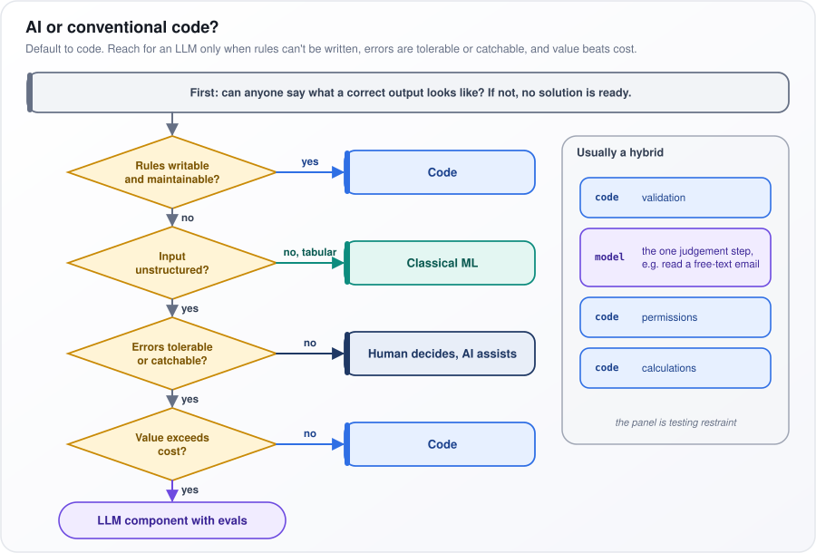
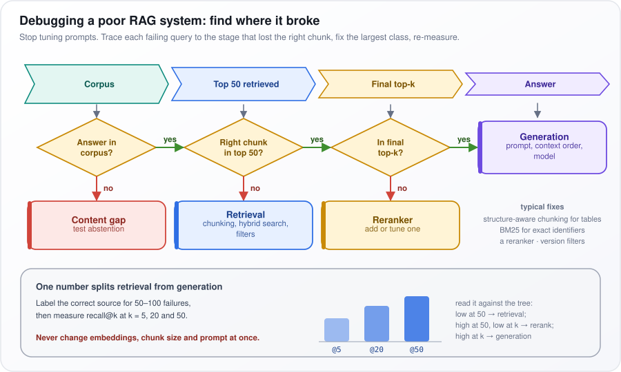

# Behavioral and Scenario-Based Questions

[← All topics](../README.md)

These are the questions that decide seniority: when to use AI at all, how to put a money value on it, how to run an incident, how to talk about error rates with people who are not engineers, and when to choose the simpler system. Panels are testing judgment, structure and honesty, not recall. Story questions are best answered in the STAR shape (Situation, Task, Action, Result): set the scene in a sentence, say what you were responsible for, say what you personally did, and end with a measured outcome and how it was measured. Every scenario below is an illustrative model answer; replace it with your own story and your own measured numbers.

## Questions

1. [What is AI Engineering, and how does it differ from Machine Learning Engineering?](#1-what-is-ai-engineering-and-how-does-it-differ-from-machine-learning-engineering)
2. [How do you decide whether a problem needs AI or a traditional software solution?](#2-how-do-you-decide-whether-a-problem-needs-ai-or-a-traditional-software-solution)
3. [How do you measure the ROI of an AI feature?](#3-how-do-you-measure-the-roi-of-an-ai-feature)
4. [How do you handle hallucinations when they occur in a production AI system?](#4-how-do-you-handle-hallucinations-when-they-occur-in-a-production-ai-system)
5. [How do you decide between using an LLM API vs self-hosting an open-source model?](#5-how-do-you-decide-between-using-an-llm-api-vs-self-hosting-an-open-source-model)
6. [How do you manage stakeholder expectations for AI projects?](#6-how-do-you-manage-stakeholder-expectations-for-ai-projects)
7. [Describe your approach to debugging a poor-performing RAG system.](#7-describe-your-approach-to-debugging-a-poor-performing-rag-system)
8. [How do you stay current with the rapidly evolving AI landscape?](#8-how-do-you-stay-current-with-the-rapidly-evolving-ai-landscape)
9. [How do you balance innovation with reliability in AI systems?](#9-how-do-you-balance-innovation-with-reliability-in-ai-systems)
10. [Tell me about a challenging AI project you worked on. What was the problem? What approach did you take? What trade-offs did you make? What was the outcome?](#10-tell-me-about-a-challenging-ai-project-you-worked-on-what-was-the-problem-what-approach-did-you-take-what-trade-offs-did-you-make-what-was-the-outcome)
11. [How would you handle a situation where an AI model produces biased or harmful outputs in production?](#11-how-would-you-handle-a-situation-where-an-ai-model-produces-biased-or-harmful-outputs-in-production)
12. [How do you approach cost optimization for an AI system that's exceeding budget?](#12-how-do-you-approach-cost-optimization-for-an-ai-system-thats-exceeding-budget)
13. [Describe a time when you had to choose between model accuracy and latency. How did you make the decision?](#13-describe-a-time-when-you-had-to-choose-between-model-accuracy-and-latency-how-did-you-make-the-decision)
14. [How would you handle a situation where your AI system's quality degrades over time?](#14-how-would-you-handle-a-situation-where-your-ai-systems-quality-degrades-over-time)
15. [How do you communicate AI limitations to non-technical stakeholders?](#15-how-do-you-communicate-ai-limitations-to-non-technical-stakeholders)
16. [How would you approach building an AI feature with limited labeled data?](#16-how-would-you-approach-building-an-ai-feature-with-limited-labeled-data)
17. [Describe your experience working with cross-functional teams on AI projects.](#17-describe-your-experience-working-with-cross-functional-teams-on-ai-projects)
18. [Where do you see AI engineering heading in the next 3-5 years?](#18-where-do-you-see-ai-engineering-heading-in-the-next-3-5-years)
19. [Why are you interested in this AI engineering role?](#19-why-are-you-interested-in-this-ai-engineering-role)
20. [Your PM wants to ship an AI feature with a 15% hallucination rate on edge cases. How do you communicate the risk?](#20-your-pm-wants-to-ship-an-ai-feature-with-a-15-hallucination-rate-on-edge-cases-how-do-you-communicate-the-risk)
21. [A non-technical executive asks why your AI feature cannot be 100% accurate. How do you explain LLM limitations?](#21-a-non-technical-executive-asks-why-your-ai-feature-cannot-be-100-accurate-how-do-you-explain-llm-limitations)
22. [You need to choose between a complex agentic system that scores 15% better on benchmarks, or a simpler RAG pipeline that is easier to maintain. How do you decide?](#22-you-need-to-choose-between-a-complex-agentic-system-that-scores-15-better-on-benchmarks-or-a-simpler-rag-pipeline-that-is-easier-to-maintain-how-do-you-decide)

---

## 1. What is AI Engineering, and how does it differ from Machine Learning Engineering?

**AI engineering builds products on models someone else already trained, such as large language models (LLMs): it shapes what goes in and proves what comes out is good enough. Machine learning (ML) engineering trains and serves its own models on its own data.**

Say a company wants support tickets routed to the right team. The ML engineer gathers 50,000 past tickets with their correct team, trains a classifier (a model that picks one team per ticket) and tunes it for weeks. The AI engineer has a working version on day one: a hosted LLM and a prompt describing each team. Their weeks go into proving the routing is right, handling its misses, and keeping cost per ticket down.

| | ML engineering | AI engineering |
|---|---|---|
| Starting point | Your labeled data | A model someone else trained |
| Main levers | Features, training, hyperparameters | Prompts, context, tools, model choice |
| Evaluation | Held-out test set | Building the eval set and judges is the work |
| Main cost | Training and labeling | Per-token inference and latency |
| Typical failure | Drift, leakage | Hallucination, injection, unreliable multi-step runs |

Reading the table row by row:

- **Starting point:** a foundation model, trained by a provider on broad data and adapted rather than retrained.
- **Levers:** ML tunes features (input columns) and hyperparameters (training settings). AI engineering tunes the prompt (instructions), context (documents inserted into the prompt), tools (functions the model may call) and model choice.
- **Evaluation:** ML scores on a held-out test set (labeled examples kept out of training). AI engineering must build its own, often with an LLM judge (a second model that grades answers).
- **Cost:** inference (running the model) is billed per token, a word or piece of a word, read or written. Latency is how long the user waits.
- **Failures:** drift is inputs changing over time; leakage is test data slipping into training, inflating scores. Hallucination is a fluent but false answer; prompt injection is input text that hijacks the model.

ML discipline carries over: define the decision, beat a baseline, check results per slice (a subgroup of inputs).

**What the panel is looking for:** whether you see the role as software engineering with one probabilistic part (output that varies and is sometimes wrong), where reliability, measurement, safety and cost are the job.

**Watch out:** dismissing ML fundamentals. On tabular data (spreadsheet-like rows and columns), gradient-boosted trees (a classical method combining many small decision trees) usually beat an LLM on accuracy and cost.

---

## 2. How do you decide whether a problem needs AI or a traditional software solution?

**Default to conventional code. Use AI only when the rules cannot realistically be written down, mistakes are tolerable or can be caught, and the value of each call beats its cost.**

Take an accounts team receiving emails such as "please pay the attached, it's the March one, same PO as before." Finding the purchase order (PO) number in free text like that defeats hand-written rules, so reading the email is a job for a model. But checking that the PO exists, that the amount matches, and that the sender may approve payment are all exact rules, so code does them. One model step, surrounded by code.

<p align="center"></p>

*Figure: a ladder of four questions that sends most problems to code and only the rest to an LLM.*

In the figure, start at the grey top box: "can anyone say what a correct output looks like? If not, no solution is ready." Then walk down the yellow diamonds, in order:

1. **"Rules writable and maintainable?"** Yes goes to the blue "Code" box.
2. **"Input unstructured?"** If the input is tabular (rows and columns), the green "Classical ML" box: a conventional model trained on your data.
3. **"Errors tolerable or catchable?"** If a mistake is costly and cannot be caught, the navy box: "Human decides, AI assists".
4. **"Value exceeds cost?"** If not, back to "Code".

Only a yes at every step reaches the purple "LLM component with evals", meaning a model step shipped with its own test set. The panel on the right, "Usually a hybrid", is the invoice example: code does validation, permissions and calculations, and the model does "the one judgement step".

**What the panel is looking for:** restraint. Senior engineers are trusted with budgets partly because they can say "this does not need AI" and explain why.

**Watch out:** starting from the technology ("we need an agent") instead of from the problem and how much error it can tolerate.

---

## 3. How do you measure the ROI of an AI feature?

**Measure how much a business outcome changed because of the feature, compared with what would have happened without it, turn that change into money, and subtract every cost, including the cost of its mistakes. Agree the metric and the baseline before launch.**

Return on investment (ROI) needs a counterfactual: what would have happened anyway. The cleanest way to get one is an A/B test, where a random half of users gets the feature and the other half does not, so any difference is caused by the feature.

Put as a formula:

```math
\text{ROI} = \frac{\text{incremental benefit} - \text{total cost}}{\text{total cost}}
```

"Incremental benefit" is the gain beyond the counterfactual; "total cost" is everything spent to get it. An ROI of 1 means every USD 1 spent came back plus USD 1 more.

- **Benefits:** time saved × volume × loaded cost (salary plus overheads per hour) × adoption; deflection (tickets that never reach a person), verified by checking those customers did not contact you again; conversion uplift (more visitors buying).
- **Costs:** inference (the per-call model bill), infrastructure, maintenance, evaluation, human review, and the cost of mistakes.

**Worked example (illustrative):** a support team handles 40,000 tickets a month.

1. 60% of tickets use the assistant: 24,000 tickets.
2. Each saves 2 minutes against the A/B control group: 48,000 minutes, or 800 hours.
3. At a loaded cost of USD 30 an hour: USD 24,000 of benefit.
4. Running cost is USD 9,000 a month.
5. ROI = (24,000 − 9,000) ÷ 9,000 ≈ 1.67.

**What the panel is looking for:** whether you connect AI work to money and to a decision someone will make with the number, and whether you are honest about what is and is not counted.

**Watch out:** counting saved time that is never redeployed to other work, measuring only the pilot's keenest users, or quoting model accuracy as if it were ROI.

---

## 4. How do you handle hallucinations when they occur in a production AI system?

**Treat it as an incident: contain the harm, reproduce the failure from the logs, find which layer failed, fix it there, measure how many users were affected, and add a test so it cannot return unnoticed.**

A hallucination is a confident answer that is false. The fix depends on where it came from, and there are several candidates: the content (the source documents were wrong or out of date), retrieval (the system fetched the wrong document), the prompt, the model, or abstention (the system should have said "I don't know"). "Improve the prompt" only addresses one of them.

**Model answer (STAR, illustrative):**

- **Situation:** an internal policy assistant told an employee that parental leave was 30 days. The current policy said 20.
- **Task:** as the engineer who owned it, stop the harm and find the real cause, not just patch the wording.
- **Action:**
  1. Contain: that same day, leave questions were routed to the HR team instead of the assistant.
  2. Reproduce: the trace (the logged record of one request: the question, the documents retrieved, the final prompt and the answer) showed retrieval had returned a superseded 2022 policy.
  3. Fix at the source: removed old policy versions from the index (the searchable store of documents), added a filter so only documents with a current effective date are searched, and added a check that every number in an answer appears in the source it cites.
  4. Scope: pulled 300 of that week's leave answers from the logs and checked each against the current policy.
  5. Prevent: added the failing question to the regression set (tests rerun on every change).
- **Result:** 3 of the 300 (1%) had the wrong figure; those employees were contacted with the correct one. The next week's audit found none.

**What the panel is looking for:** incident discipline (containment before diagnosis), root-cause thinking across content, retrieval, prompt and abstention, and whether you measured the damage rather than assumed it.

**Watch out:** "we improved the prompt" as the whole answer. It fixes one symptom and leaves the stale document in the index.

---

## 5. How do you decide between using an LLM API vs self-hosting an open-source model?

**Default to a provider's API (you send requests over the internet and pay per token, a word or piece of a word). Self-host only for a stated reason: data that cannot leave your boundary, volume high enough that your own GPUs are cheaper, control over the model's weights, or latency (response time) a provider cannot meet.**

"Self-hosting" means running an open-weight model (one whose weights, its trained parameters, are published) on graphics processors (GPUs) you rent or own. You stop paying per token and start paying for machines, whether they are busy or not.

| Factor | API | Self-hosted |
|---|---|---|
| Quality on hard tasks | Usually highest (as of 2025–26) | Competitive on narrow tasks, especially fine-tuned |
| Cost shape | Per token, no idle cost | Fixed GPU cost |
| Data control | Contracts, regional, zero-retention | Full |
| Model stability | Provider updates | You decide |
| Operations | Low | GPUs, serving, on-call |

The table compares the two options factor by factor. Fine-tuned means further trained on your own examples. On the API side, data is protected by contract: "regional" keeps it in a chosen country or region, and "zero-retention" means the provider does not store your prompts.

The deciding number is utilization, the share of time the GPUs are actually busy. **Illustrative example:** a GPU server costs USD 3,000 a month and can process 1 billion tokens a month when fully busy, so USD 3 per million tokens. If real traffic keeps it busy only 20% of the time, it processes 200 million tokens for the same USD 3,000: USD 15 per million, five times more. Compare that figure, not the best case, with the API price.

Add the costs that do not appear on the GPU bill: engineers to run serving, upgrades, and an on-call rota. Together these make up the total cost of ownership (TCO).

Middle paths often win: an open-weight model on a managed endpoint (a cloud service that runs the model for you) inside your own cloud account, or routing easy traffic to a small cheap model and hard traffic to the API.

**What the panel is looking for:** reasoning from requirements and total cost of ownership rather than from ideology ("open source is better") or habit.

**Watch out:** "self-hosting is cheaper" with no utilization figure behind it.

---

## 6. How do you manage stakeholder expectations for AI projects?

**Agree what success means as a measured error rate on a fixed set of test cases, show the sponsor real failures early, deliver in stages with a go or no-go decision at each, and report the same metric every time.**

Stakeholders usually meet AI through a demo, and a demo shows the best case. Expectations get managed by replacing the demo's impression with a number from real cases, before any date is promised.

**Model answer (STAR, illustrative):**

- **Situation:** after a demo, a sales leader wanted an AI proposal drafter rolled out to the whole company within a month.
- **Task:** keep the sponsor's support without promising something the system could not yet do.
- **Action:**
  1. Ran the drafter on 50 real past proposal requests and had two senior sellers grade each draft.
  2. Result: 70% needed only light edits, 20% needed heavy rework, and 10% had wrong pricing, which would reach a customer.
  3. Showed the leader the actual pricing failures, not just the percentages.
  4. Proposed a 15-user pilot, with prices pulled by code from the price book (the official price list) instead of written by the model, and a gate: at least 85% of drafts needing only light edits before wider rollout.
- **Result:** after four weeks, 88% of pilot drafts needed only light edits, passing the gate. Pricing errors disappeared because the model no longer wrote prices, and rollout went ahead against a baseline everyone had agreed.

Why it works: the leader got a yes (a pilot now), a clear condition for the bigger yes, and evidence rather than an engineer's opinion. The 10% pricing figure did the persuading.

**What the panel is looking for:** whether you can say "not yet" without losing the sponsor, and whether you replace opinions with a shared, measured definition of good enough.

**Watch out:** agreeing a date before measuring anything. Once a date is public, every later number reads as an excuse.

---

## 7. Describe your approach to debugging a poor-performing RAG system.

**Stop tuning the prompt and do error analysis: trace each failing question to the stage where the right information was lost, count the failures per stage, fix the largest group first, and measure again.**

Retrieval-augmented generation (RAG) answers questions in stages: search a corpus (the document collection) for chunks (short passages), keep the best few, and have an LLM answer from them. A wrong answer can come from any stage, and each needs a different fix.

<p align="center"></p>

*Figure: each failing question is traced left to right until the stage that lost the right chunk.*

In the figure, follow the four chevrons across the top: "Corpus", "Top 50 retrieved", "Final top-k", "Answer". Under each is a yes or no question. A "no" drops to the fix below it:

1. **"Answer in corpus?"** No: red "Content gap". Add the content, and test that the system abstains (says "I don't know") when it cannot find an answer.
2. **"Right chunk in top 50?"** No: blue "Retrieval". Fix chunking, add hybrid search (keyword search such as BM25 alongside meaning-based search), or add filters.
3. **"In final top-k?"** (the few chunks actually sent to the LLM) No: yellow "Reranker", a second model that re-sorts candidates.
4. All yes: purple "Generation", so the prompt, context order or model is at fault.

The bottom panel shows the one number that splits these: recall@k, the share of failing questions whose correct chunk appears in the top k results. **Illustrative:** label the right source for 80 failures. If the chunk is in the top 50 for 70 of them (recall@50 ≈ 88%) but in the top 5 for only 30 (recall@5 ≈ 38%), the figure's rule "high at 50, low at k → rerank" says add a reranker.

**What the panel is looking for:** a systematic method that localizes the fault before changing anything, instead of trial and error.

**Watch out:** the figure's red line: "Never change embeddings, chunk size and prompt at once." (Embeddings are the lists of numbers that meaning-based search compares.) You will not know which change helped.

---

## 8. How do you stay current with the rapidly evolving AI landscape?

**With a filter and a test rather than a feed: a few primary sources, depth only on what affects the systems I run, and every promising claim checked on my own evaluation set before it changes anything.**

The field produces more announcements every week than anyone can read. The skill being asked about is not reading more but deciding quickly what deserves a test, and then letting the test, not the announcement, decide.

How it works in practice:

1. **Primary sources only:** provider release notes and model cards (the provider's own description of a model's abilities and limits), framework changelogs (lists of what changed in each release), and papers read for their method and evaluation rather than their headline.
2. **A relevance filter:** does this change cost, quality, latency or security for something I own? Most releases fail this test and are skipped.
3. **A fast test:** anything relevant is run against an existing eval set (questions with known-good answers) within a week. Most releases change nothing measurable.
4. **Share decisions, not links:** a fixed few hours a week, and a short internal write-up whenever a team default changes.

**Example (illustrative):** in one month, prompt caching (the provider stores the processed form of a prompt's repeated opening, such as a long system prompt, and bills it at a discount on later calls) was tested in an afternoon and cut our assistant's input cost by about a third, so it became the default. Three new agent frameworks (libraries for building LLMs that call tools over many steps) released that month were read about, tried against nothing we needed, and adopted by nobody.

That example is the answer's strongest part: one thing adopted with a measured result, several things deliberately ignored.

**What the panel is looking for:** judgment in filtering noise, and evidence that learning turns into decisions on real systems. They also want to hear what you chose not to adopt.

**Watch out:** listing newsletters and podcasts. It signals consumption, not evaluation.

---

## 9. How do you balance innovation with reliability in AI systems?

**Separate the two paths: experiment freely offline (on saved data, not live users) and behind feature flags (switches that turn a feature on for chosen users only), but let every change reach users only through the same automated gates. Speed comes from making testing cheap, not from accepting risk in production.**

A useful picture is a test kitchen next to a restaurant. Anything can be tried in the test kitchen; a dish reaches customers only after the same tasting, a few tables first, and with the old dish ready to serve if it goes wrong.

The gates, in the order a change passes them:

1. **Eval gate:** the change must match or beat the current version on the evaluation set (fixed questions with known-good answers), per slice (subgroup of questions, such as billing or one language), not just on average.
2. **Shadow deployment:** the new version receives copies of real traffic, but its answers are logged, not shown.
3. **Canary:** a small share of real users, say 5%, gets the new version while metrics are watched.
4. **A/B test:** a random split of users compares old and new on business outcomes.
5. **Automatic rollback:** if quality or latency (response time) crosses a threshold, traffic returns to the old version without a meeting.

Around the gates:

- **Fallbacks:** on an error or timeout, drop to a stable model or a non-AI path.
- **Pinned versions:** name an exact model version, so a provider's update becomes a deliberate change you test.
- **Error budget:** the amount of failure you have agreed to tolerate. With a target of 99.5% good responses on 1 million requests a month, the budget is 5,000 bad ones. While under budget, ship experiments; once it is spent, fix reliability first.

**What the panel is looking for:** a repeatable process that makes the balance automatic, not a personality description. Innovation is safe because the gates exist.

**Watch out:** answering with a trait ("I'm careful but open-minded"). One public failure costs months of freedom to experiment; the process is what protects it.

---

## 10. Tell me about a challenging AI project you worked on. What was the problem? What approach did you take? What trade-offs did you make? What was the outcome?

**Tell one of your own projects in about two minutes, in the order the question asks: problem, approach, trade-offs, outcome, with measured numbers and where each number came from.**

The question lists its own four parts, so use them as the frame. A rough time budget: 20 seconds on the problem, 60 on what you did, 20 on one trade-off and why, 20 on the result. Say "I" for your own decisions and "we" only for team work.

**Model answer (STAR, illustrative):**

- **Situation:** insurance claims handlers spent about 25 minutes per claim typing fields (names, dates, amounts, policy numbers) from scanned documents into the claims system, and audits found errors in 4% of fields.
- **Task:** I led automating the extraction, with a handler still reviewing each claim rather than being replaced.
- **Action:**
  1. Before building anything, I had two senior handlers label 300 past claims as an evaluation set, so every version could be scored.
  2. Schema-bound extraction: the model had to fill a fixed list of typed fields (the schema, such as "claim date: a date") and cite the page and exact words it read each value from, so a reviewer could check it in one click.
  3. Deterministic validation: plain code checked every field (dates valid, totals add up, policy number exists).
  4. Only fields that failed validation were retried with a larger, costlier model, so most claims never paid for it.
- **Trade-off:** I kept human review on every claim, even though fully automatic processing saved more time, because paying a wrong claim costs far more than a few minutes.
- **Result:** 97% field accuracy on the evaluation set, against about 96% for manual entry (the 4% audit error rate). Handling time fell from about 25 to about 9 minutes per claim, measured from system timestamps over six weeks.

**What the panel is looking for:** ownership of specific decisions, a trade-off stated with its reason, and honest numbers with a stated source. Seniority shows in the trade-off.

**Watch out:** two minutes of architecture, no outcome, and "we" hiding what you did yourself.

---

## 11. How would you handle a situation where an AI model produces biased or harmful outputs in production?

**As an incident with a severity rating (a label for how serious it is, which sets how fast people respond): contain it within hours, measure its scope from the logs, bring in legal and the business owner, fix the cause, verify the fix, and add a permanent test.**

Bias here means the system treats groups of people differently for no legitimate reason. The way to prove it is a counterfactual test: take real inputs, change only the attribute in question (for example a name and pronouns), keep everything else identical, and compare the outputs. If the outputs differ systematically, the attribute is driving them.

**Model answer (STAR, illustrative):**

- **Situation:** a hiring manager reported that our recruiting assistant, which summarized candidate profiles, described women with personality adjectives ("warm", "enthusiastic") and men with skills.
- **Task:** as engineering owner, stop the harm and fix the cause.
- **Action:**
  1. Contain: paused the feature that day and told legal, HR and the product owner.
  2. Confirm and scope: ran 400 profiles twice, once as written and once with names and pronouns swapped. The same profile drew about twice as many personality adjectives when written as a woman. The logs showed which summaries had already reached managers.
  3. Root cause: the prompt's few-shot examples (sample profiles and summaries shown to the model as a pattern) were themselves skewed.
  4. Fix: rebuilt the examples, and changed the summary into a template built around listed skills and experience.
  5. Prevent: added the swapped-profile test to continuous integration (CI), the automated tests that run on every change, with an agreed tolerance.
- **Result:** rerun on the same 400 swapped pairs, the gap fell within the tolerance agreed with legal and HR, and the feature returned only after their review.

**What the panel is looking for:** urgency, clear ownership, involving the right people early, and a measurable definition of "fixed". For people-affecting systems, they also listen for whether you treat it as a legal risk, not just a quality bug.

**Watch out:** "we added a filter" without scoping the impact or finding the cause.

---

## 12. How do you approach cost optimization for an AI system that's exceeding budget?

**Measure before cutting: break spend down by feature, model, pipeline step and token type, attack the few biggest drivers, and rerun the evaluation suite (fixed test questions with known-good answers) after each change so quality does not quietly fall.**

LLM spend is billed per token (a word or piece of a word), and input tokens (what the model reads: instructions, documents, chat history) and output tokens (what it writes) are priced separately, with output typically several times dearer per token (as of 2025–26). So the first job is a breakdown. Often one feature, or one habit such as resending the whole chat history, dominates.

| Lever | Mechanism |
|---|---|
| Prompt caching | Stable prefix billed at a discounted rate |
| Trim context | Fewer chunks, summarized history |
| Cap output | Output tokens cost more than input |
| Model routing | Small model for easy requests |
| Batch API | Offline jobs, commonly about half price (as of 2025–26) |
| Fewer agent steps | Code for fixed steps, step limits |

The table lists the usual levers and why each saves money:

- **Prompt caching:** the provider reuses the processed form of a prompt's unchanging opening (such as the system prompt) and bills it at a discount.
- **Trim context:** send fewer retrieved passages, chosen better by a reranker (a second model that re-sorts search results by relevance), and summarize old conversation turns.
- **Cap output:** set a maximum answer length and ask for concise answers, since output is the dearer token type.
- **Model routing:** a cheap model handles easy requests; the expensive one only hard ones.
- **Batch API:** jobs that can wait hours are submitted in bulk at a lower price.
- **Fewer agent steps:** each step of an agent (an LLM that calls tools in a loop) is another paid model call, so steps that are always the same become plain code.

**Example (illustrative):** the breakdown showed 80% of spend was input tokens. Three changes (sending 4 reranked passages instead of 10, summarizing history after five turns, and caching the system prompt) halved cost per conversation, and the evaluation suite showed no quality loss.

**What the panel is looking for:** whether you measure first, go after the dominant cost rather than every cost, and protect quality with evidence.

**Watch out:** switching everything to a cheaper model without running the evaluations.

---

## 13. Describe a time when you had to choose between model accuracy and latency. How did you make the decision?

**Get the latency budget (the longest wait users will accept) from user behavior, measure where the accuracy gap actually sits, and look for a design that pays for accuracy only on the requests that need it.**

Latency is the time a user waits for a response. The trap is treating this as one choice between two models, when usually a small share of requests accounts for most of the accuracy gap.

**Model answer (STAR, illustrative):**

- **Situation:** on an online store, an LLM turned vague search queries ("something warm for a hiking trip") into filters such as category and price. A large model picked the right filters 12 percentage points more often but added about 2 seconds; a small model added about 300 milliseconds.
- **Task:** choose, knowing that slow search costs sales.
- **Action:**
  1. Latency budget: past experiments showed conversion (the share of searches ending in a purchase) falling once search took longer than about a second, which rules out the large model for everything.
  2. Locate the gap: on 500 labeled queries, the large model's advantage sat in vague queries, about 15% of traffic. On specific queries ("men's size 10 trail shoes") the two were close.
  3. Design: a cascade, where a cheap step handles most traffic and only flagged cases reach the expensive one. The small model also tagged each query as vague or specific; only vague ones went to the large model, while plain keyword results streamed onto the page so users saw something at once.
  4. Validate with an A/B test (a random split of users).
- **Result:** median latency (the middle value: half of searches were faster) stayed at about the small model's 300 milliseconds, because 85% of queries never touched the large model; the A/B test showed conversion rising on vague queries.

**What the panel is looking for:** a decision made with data and a latency budget grounded in user behavior, not a taste for accuracy or speed.

**Watch out:** "we chose accuracy because quality matters", with no latency budget and no idea where the gap sat.

---

## 14. How would you handle a situation where your AI system's quality degrades over time?

**Confirm the drop with metrics, find what changed (the inputs, the model, the knowledge base, a tool, or your own code), narrow it down by slice and pipeline stage, fix the cause, and add the monitor that would have caught it earlier.**

A system that has not been touched can still get worse, because the world around it changes. Users start asking about a new product, the provider quietly updates the model, documents go out of date.

| Cause | Signal |
|---|---|
| Input drift | New kinds of questions unlike the test set |
| Provider model update | Change coincides with a release; style shifts |
| Stale knowledge base | Old documents cited; recent questions fail |
| Tool or data change | Tool errors, empty results |
| Your own change | Regression lines up with a deployment |

The table pairs each likely cause with the evidence that points to it. Input drift means the questions users ask have shifted away from what the system was tested on; the knowledge base is the document collection the system searches.

The steps:

1. **Confirm:** is the drop real in production metrics and user feedback, or one loud complaint?
2. **Rerun the golden set** (a fixed set of questions with approved answers) against the exact production configuration. If its score is unchanged, the system behaves as before and the world moved: input drift or a knowledge base that has fallen behind. If its score dropped too, something in the system changed.
3. **Line up the timeline:** deployments, prompt edits, index rebuilds (reloading documents into the search store) and provider releases, against the date the drop began.
4. **Localize:** which slice (topic, language, customer) and which stage (retrieval, finding documents, or generation, writing the answer) got worse.
5. **Fix and monitor:** fix that cause, add the new failing questions to the golden set, and add an alert on the signal that would have caught it.

**What the panel is looking for:** structured diagnosis that separates "the world changed" from "we changed", before any fix is chosen.

**Watch out:** retraining or switching models before knowing the cause. If the cause was a stale document, a new model changes nothing.

---

## 15. How do you communicate AI limitations to non-technical stakeholders?

**In outcomes they can plan around: how often it is wrong, what a wrong answer looks like, how it gets caught, and what a person still has to do. Show real failures, not model internals.**

A stakeholder cannot act on "it's a probabilistic model". They can act on "it misses about 8 in 100 risky clauses, here are two it missed, and a lawyer still signs off". The four pieces (rate, shape, catch, human role) turn a limitation into a process decision.

**Model answer (STAR, illustrative):**

- **Situation:** the legal team wanted a contract-review assistant to approve standard contracts on its own.
- **Task:** set a safe role for it without killing adoption.
- **Action:**
  1. Ran it on 100 contracts that lawyers had already reviewed, where the lawyers had flagged 100 risky clauses in total.
  2. It caught 92 and missed 8. Two of the 8 were significant (an uncapped liability clause and an automatic renewal).
  3. Showed the team those two missed clauses on screen, rather than a percentage.
  4. Framed its role as a first-pass reviewer, "like a fast new colleague whose work needs checking", with lawyer sign-off kept on every contract.
- **Result:** lawyers' review time per contract fell by about a third, and in six months no clause it missed reached a signed contract, because the lawyer check stayed in place.

Why it works: the team heard a number (92 of 100), saw what a miss looks like, and got a role that uses the speed while keeping the check where errors are expensive.

**What the panel is looking for:** building trust without overselling or scaring people off, and turning a limitation into a working process rather than a disclaimer.

**Watch out:** explaining transformers (the internal design of LLMs) to someone who needs to know what to do differently on Monday.

---

## 16. How would you approach building an AI feature with limited labeled data?

**Start with a pre-trained model (one already trained by someone else on broad data) that needs few or no examples, spend the scarce labels on an evaluation set first, grow more labels cheaply with the model's help, and train your own small model only once volume or cost justifies it.**

Labeled data means examples with the correct answer attached, such as a ticket tagged with its right category. Classic ML needed thousands of them to train anything. A pre-trained LLM can often do the task from instructions alone, so the few labels you have are worth more as a measuring stick than as training data.

The steps, in order:

1. **Evaluation set first:** 100–200 examples checked by domain experts. Every later comparison is only as honest as this set.
2. **Zero-shot or few-shot baseline:** the model is given only instructions (zero-shot) or instructions plus a handful of examples (few-shot). If the task needs company knowledge, add retrieval: search company documents and put the relevant ones in the prompt.
3. **Model-assisted labeling:** a strong model labels a large batch and people only verify or correct, which is much faster than labeling from scratch.
4. **Active learning:** people review only the most informative cases, those where the model is least confident or where two models disagree.
5. **Distill:** once enough verified labels exist, train a small, cheap model to copy them (distillation), and use the evaluation set to prove it is as good.

**Example (illustrative):** 300 labeled IT tickets became the evaluation set. A prompted model scored 81%. It pre-labeled 5,000 more tickets, people corrected the low-confidence ones, and a small classifier fine-tuned (further trained) on them reached 88% on the same 300 at a fraction of the per-ticket cost.

**What the panel is looking for:** pragmatism about where labels matter most (measurement), and a clear path from a quick start to a cheaper system at scale.

**Watch out:** using synthetic (model-generated) data as the evaluation set. The model then grades itself on its own blind spots.

---

## 17. Describe your experience working with cross-functional teams on AI projects.

**Tell a story in which you translate between functions, get the domain experts to define what "correct" means, and bring legal, compliance and security in early rather than at the end.**

Cross-functional means people from different departments with different goals: product wants features, operations wants speed, compliance wants rules followed, design wants something people use. On an AI project they also hold the knowledge you need, because only the experts can say what a correct answer is.

**Model answer (STAR, illustrative):**

- **Situation:** a bank was building an assistant to help service agents handle card disputes (customers challenging a charge on their card). The team spanned product, operations, compliance, security and design.
- **Task:** as technical lead, launch a pilot within one quarter with compliance sign-off.
- **Action:**
  1. Senior agents, not engineers, defined what a correct answer was and labeled 150 real questions as the evaluation set, the fixed test every version was scored on.
  2. In week one, compliance's rules ("always cite the policy", "never promise a resolution date") became automated checks run on every answer, so sign-off was built in, not negotiated at the end.
  3. The designer found agents ignored long answers during calls, so answers were limited to three lines with a link to the full policy.
  4. Disputes involving suspected fraud were deferred to a later phase, using the evaluation results to show the assistant was not ready for them, which kept the scope achievable.
- **Result:** delivered on time with compliance sign-off, above the agreed 90% correct on the 150 questions, and pilot agents found the right policy in under a minute instead of about two.

Each step shows a different function shaping the product, and the engineer's role as the one who turns their input into something testable.

**What the panel is looking for:** influence without authority, respect for other functions' expertise, and awareness that most AI risk is non-technical (regulation, trust, adoption).

**Watch out:** a story in which the other functions are obstacles you had to get past.

---

## 18. Where do you see AI engineering heading in the next 3-5 years?

**Take a clear position: AI engineering will merge with mainstream software engineering, and the hard work will shift from getting a model to do something once to making systems reliable, measurable, secure and cheap at scale.**

A good answer names a few concrete trends and says what each changes about daily work. Nobody expects accurate prediction; they expect a view that shapes your decisions.

- **Longer-running agents** (LLMs that plan and call tools over many steps): the challenge becomes reliability, permissions, recovery and audit trails. Reliability is measured by pass^k, the chance that all k repeated runs of the same task succeed. An agent that succeeds 90% of the time on a single run has pass^3 = 0.9 × 0.9 × 0.9 ≈ 73% (assuming independent runs), which is why single-run scores flatter agents.
- **Evaluation as a core discipline:** evaluation suites run in continuous integration (automated checks on every code change), and quality monitoring in production, become as standard as unit tests (small checks of single functions) are today.
- **Security by architecture:** prompt injection (text in a document or tool result that hijacks the model) has no complete fix inside the model, so least privilege (each component gets only the access it needs) and isolating untrusted content become routine design.
- **Falling cost per capability:** a given level of quality keeps getting cheaper, which expands usage and makes routing (sending each request to the cheapest model that can handle it) and caching (reusing earlier results) continuous work rather than one-off projects.
- **Regulation:** laws such as the EU AI Act, which sets obligations by risk level and phases them in from 2025 onward (as of 2025–26), make documentation, testing records and audit part of the job.

Close with what you are doing about it, for example: "which is why I invest most in evaluation and security design."

**What the panel is looking for:** informed judgment that already shapes how you work, and the confidence to commit to a view.

**Watch out:** hype ("AGI, artificial general intelligence, will change everything"), or refusing to take a position at all.

---

## 19. Why are you interested in this AI engineering role?

**Make three specific links: their problem, your evidence, and your direction. Keep it under a minute, and make it impossible to reuse for another company.**

The test of a good answer: if you swapped in a different company's name, would it stop making sense? If not, it is too generic. Each of the three parts does a job.

1. **Their problem** shows you did research. For example: "You are moving your support AI from answering questions to taking actions in customer accounts, so reliability and permissions become the product."
2. **Your evidence** shows you have solved a version of it before, with a number. For example: "I built the evaluation and guardrail layer for an internal ticketing agent, including prompt-injection tests and human approval before risky actions, and raised task success from about 70% to over 90% on our evaluation set." (A guardrail is an automated check that blocks unsafe inputs or actions; prompt-injection tests try to hijack the agent with instructions hidden in its input; the evaluation set is a fixed list of test tasks with known outcomes.)
3. **Your direction** shows why this role fits where you are going, which signals you will stay. For example: "I want to set standards other teams build on, and lead a small team doing it, which is how I read this role."

These examples are illustrative; every word should be your own, and every number one you can defend if asked how it was measured.

Delivery matters as much as content: under a minute, one breath of research, one story, one statement of direction. The panel will pick whichever part interests them and ask follow-ups, so do not pack in everything.

**What the panel is looking for:** that you researched them, that your experience matches their actual problem, and whether you are likely to stay and grow in the role.

**Watch out:** "AI is the future and I'm passionate about it", or reciting the job description back to them.

---

## 20. Your PM wants to ship an AI feature with a 15% hallucination rate on edge cases. How do you communicate the risk?

**Turn "15%" into wrong answers per day and how much harm each does, then bring options with a recommendation, not a veto. The accountable owner, usually the product manager (PM) or their leader, decides, with the risk written down.**

A hallucination is a fluent but false answer. "15% on edge cases" sounds either alarming or trivial depending on how many edge cases there are. Edge cases are unusual inputs at the fringe of what the feature was designed for. The number has to be converted into something a decision-maker can weigh.

**Quantify (illustrative):** if edge cases are 5% of 100,000 daily queries:

```math
100{,}000 \times 0.05 \times 0.15 = 750 \text{ wrong answers a day}
```

Read left to right: 100,000 queries, of which 5% (5,000) are edge cases, of which 15% are wrong. That is 750, or 0.75% of all traffic.

**Severity:** does a user act on the wrong answer (a refund policy, a medical or legal question), and can they tell it is wrong? 750 wrong movie suggestions and 750 wrong dosage answers are different decisions.

| Option | Residual risk |
|---|---|
| Ship as is | 750 wrong answers a day |
| Ship with containment: detect edge cases, abstain or hand off | Much lower |
| Limited cohort with monitoring | Low exposure, real data |
| Delay for a scoped fix | Opportunity cost |

The table lays out the options with the risk left after each. Containment means a classifier (a small model that sorts inputs into categories) spots likely edge cases and the system either abstains ("I can't answer that reliably") or hands off to a person. A limited cohort is a small group of users who get the feature first.

**Recommend:** usually ship with containment, plus a dated plan to fix the edge cases, and a metric that triggers rollback (switching back to the previous version).

**What the panel is looking for:** risk communication in business terms, options rather than obstruction, and clarity about who owns the decision.

**Watch out:** quoting "15%" with no user impact attached, or refusing to ship outright.

---

## 21. A non-technical executive asks why your AI feature cannot be 100% accurate. How do you explain LLM limitations?

**Explain in one sentence that it predicts the most likely answer rather than looking up a verified fact, then move straight to what the executive can act on: how often it is wrong, how errors are caught, and whether it beats today's process.**

An everyday comparison helps: the model is like a very well-read new employee answering from memory and from the documents you hand them. Usually right, occasionally confidently wrong, especially when the information is missing or the question is ambiguous. Nobody expects a person in that job to be 100% right either.

A four-part answer, in plain words (illustrative):

1. **Mechanism:** "It writes the most likely good answer from what it learned and from the documents we give it. When information is missing or the question is ambiguous, it can sound right and be wrong."
2. **Numbers:** "On our test questions it is right about 95 times in 100. Your senior team, answering the same questions, agree with each other about 97 times in 100." The second number matters: even experts are not 100%, so 100% was never the real bar. Use your own measured figures.
3. **Controls:** "Every answer shows its source, it hands over to a person when it is unsure, and we track errors every week."
4. **Frame:** "The real question is whether it is better and cheaper than how we do this today, with checks where mistakes matter."

The pivot from step 1 to step 2 is the important move. The executive asked a technical question, but the decision they face is about risk and value.

**What the panel is looking for:** clarity and honesty without jargon, and the ability to redirect the conversation to the decision the executive actually has to make.

**Watch out:** lecturing on tokens and probabilities, or promising 100% "with more data".

---

## 22. You need to choose between a complex agentic system that scores 15% better on benchmarks, or a simpler RAG pipeline that is easier to maintain. How do you decide?

**Default to the simpler RAG pipeline unless the gain shows up on my own evaluation set, on questions users care about, and outweighs the extra cost, latency and failure modes. Often the answer is both, with routing.**

A retrieval-augmented generation (RAG) pipeline is a fixed sequence: retrieve documents, then answer from them. An agentic system lets the LLM plan, call tools and loop until it thinks it is done. That makes it stronger on multi-step questions and harder to predict, test and run.

Questions to ask before deciding:

1. **Is the 15% relative or absolute?** From a 60% baseline, 15% relative is 69%; 15 points absolute is 75%. Very different.
2. **Does it survive on my traffic?** Benchmarks (public standard test sets) rarely match your questions.
3. **Where is the gain?** If it sits in multi-step questions, route only those to the agent.
4. **Is it consistent?** Compare pass^k (the chance all k repeated runs succeed) and variance (how much scores swing between runs), not the best run.
5. **Can the team operate it?** Traces of every step, fault-injection tests (deliberately breaking a tool to see what the agent does), and people who can debug it at 2 a.m.

| | RAG | Agent |
|---|---|---|
| Multi-step questions | Weaker | Stronger |
| Latency and cost | Low, predictable | Higher, variable |
| Failure modes | Retrieval misses | Plus loops, wrong tools, injection via tools |
| Maintenance | Lower | Higher |

The table compares the two on what matters in production, not just accuracy. "Injection via tools" means instructions hidden in a web page or file the agent reads.

**Example (illustrative):** the agent won 11 points on multi-hop questions (needing facts from several places), which were 12% of traffic, at four times the cost. A router (a quick classifier) sending only those to the agent gives average cost 0.88 × 1 + 0.12 × 4 = 1.36 times the RAG cost, instead of 4 times, for about 0.12 × 11 ≈ 1.3 points of overall accuracy.

**What the panel is looking for:** judgment over benchmark-chasing, and the habit of turning a headline number into cost, risk and maintenance on your own system.

**Watch out:** picking the higher benchmark by default, or rejecting agents without measuring them.
